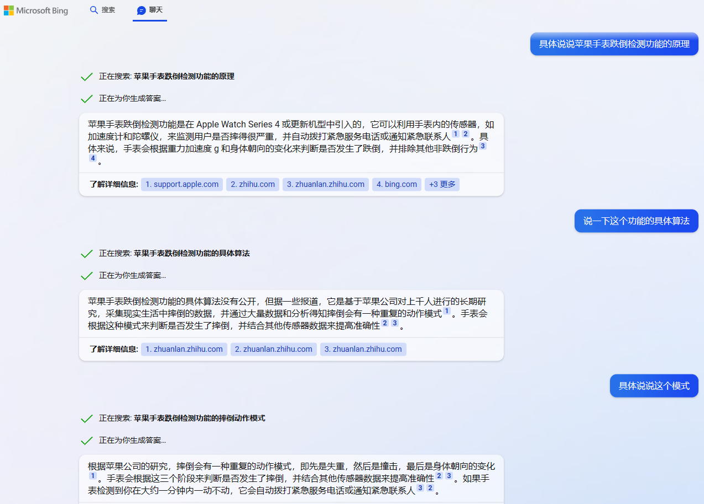

# ChatGPT版Bing(也就是NewBing)初体验

ChatGPT 大火，问什么会什么，昨天还让它帮我们写代码，写的错误的地方，指出后竟然能较快的改正，大家感叹过几年也许真要失业了。

在雪球上，著名投资人段永平问ChatGPT几个问题，有些答非所问，大家不明白ChatGPT的逻辑，对于这些信口雌黄的回答，大家更认为这是一种中年油腻男人的体现，呃，好吧，确实有点老油条的味道，回答的都对，但就是感觉不着调不着边际，很有中国人打太极的味道，厉害。

而今天，罗孚申请的 New Bing 使用权限，已经通过了，于是用大道相同的问题问了一下 New Bing，结果很惊喜。

## 关于投资相关回答的差异

首先问段永平是谁以及在哪里上中学，new Bing 上回答的还不错，特别是没有哪里上中学的资料，所以回答的很诚实。

但是ChatGPT就不然了，回答的让人嘘嘘：

一方面把人家的出生年份都答错了，应该是 1961，而给我的回答里是 1966，给大道的回答是 1965，这种问题不应该靠猜把。另一方面上中学的回答，以及居住在哪里的回答，都显得很油腻，就因为人家考入了北京的大学，然后就猜测人家在北京上的中学，这个逻辑思维不对，而居住在哪里的时候，不知道，可以理解，但还附上了很多没用的看起来正确的废话，实际意义不大。

而在哪里居住的问题上，new Bing 的回答要好的多。

可以准确的知道人家居住的城市，又给出了移居美国的时间。

当然，new Bing 和ChatGPT一样，也有短路的时候，也许和国内的网络有关，这个 topic 就没法继续下去了。

继续问关于独董和出书的问题，new Bing 回答的还不错。

虽然这些内容我不确定，但应该都是比较真实的公开搜索资料，这也是搜索的优势吧。

而ChatGPT应该说是回答的一团糟。

担任过哪些公司的独立董事，出版过哪些书，都真的是信口雌黄。

昨日晚间，巴菲特发表了最新的致股东的信，今天已经在各大网站争相报道了。于是问了问 new Bing，想让其直接帮翻译一下，其回复如下：

一方面说是版权原因没法给我直接翻译，呃，好吧，我信。另一方面给出了八大看点，这个还是不错的，算是对内容有所提炼，而且能够击中用户的需求，而且根据我早上看的简单报道，也确实说到了其中的几点，有几点我没有关注到。

反观 ChatGPT，一方面回答的不够好，另一方面似乎也没有搜索那么快，表现在可能还没拿到 2023 年巴菲特致股东的信的资料。

再次追问，确认没有这方面的资料，看来ChatGPT的及时性还是有所不足啊。

## 关于论文、资料、代码的回答

上次有问过 ChatGPT，具体见[使用ChatGPT写论文、查资料、编代码的一点体验](https://mp.weixin.qq.com/s/YowCZH3K0_7bK0pPqNKkMA) 一文。

本次在 new Bing 中也使用了相同的问题，看看两者有什么差异。

首先问的问题还是：生成一篇关于 AR-HUD 发展历史、关键技术、未来展望的文章。

先给我做了介绍、关键技术以及未来展望的说明点。然后，真的给我生成了具体的文章：

从文章来看，不是上述关键要点的生硬转述，而是在段和段的承接中，使用了比较自然的语言来表达，比较有写文章的意思。另外让帮生成了一下大纲，也还行。

写论文能力相当，还是很不错的。我们继续看看查资料的能力吧。当然，如果从上一节关于著名投资人段永平问题的回答来看，查资料能力甚至高于 ChatGPT。

还是上次的问题，关于苹果手表跌倒检测的具体算法。

虽然没有给出详实具体的内容，但其内容还是有非常高的参考价值，特别是对原理、算法、参数等都有相关的描述。而反观 ChatGPT，虽然说了一大堆，甚至列出了 1234，但是没有 new Bing 描述的清晰，比如失重、撞击、朝向变化的描述，以及具体一分钟不动这些关键信息。罗孚觉得 new Bing 在回答问题上更胜一筹，更懂重点，表达也更清晰。

上次ChatGPT在专利上回答的内容几乎没有，于是试了试 new Bing，结果，挺惊喜。

不仅检索到了专利，还给出了专利中的具体内容，说明其专利检索能力也不错。

甚至还继续追问了一下，回答也还不错。

接下来我们试试写代码吧。

还是用 Python3 获取股市 K 线数据，代码写的还不错。

没有保存文件，要求保存为文件。

发现仅保存了一天的数据，要求保存所有历史数据。

然后改让用 tushare 库写一个完整的代码。

也写好了，还顺便问了如何获取 token 的方法，回答的也是正确的。

发现没有保存到一个文件中，于是修改了一下语句。

给出的答案还是相当令人满意的，至少要求的很多内容都已经体现了，虽然代码可能不会完全写完整，但有这些代码自己写程序也是事半功倍的效果，已经非常给力了。感觉比ChatGPT更会写代码呢。

最后，罗孚因为最近要写一篇关于冲牙器的文章，于是又问了一下 new Bing 关于冲牙器的优缺点。

结果很让人诧异，一方面是其结果的准确性很不错，另一方面其语言组织能力远超罗孚，罗孚是写不出这么有逻辑又专业的文字的。甚至，让它直接生成一篇文章，也都行。

生成完文章，认为还不够，让它补充了冲牙器的优缺点进去，也很轻松的就完成了指令。

一个完整的体验下来，罗孚认为：new Bing 完全不输ChatGPT啊，个人认为更准确也更顺手。

## 如何开始使用 new Bing？

New Bing 的网址：[https://www.bing.com/new](https://www.bing.com/new)

### 解决 Bing 跳转问题

如果直接打开该网址，很有可能直接跳转到了 Bing 首页，而且是 cn.bing.com，原因是我们在国内，一方面可能没有开放 new Bing，另一方面国内都会直接跳到国内版。

网上的方法是安装一个 ModHeader 的扩展，直接进入扩展页面

[https://microsoftedge.microsoft.com/addons/detail/modheader-modify-http-h/opgbiafapkbbnbnjcdomjaghbckfkglc](https://microsoftedge.microsoft.com/addons/detail/modheader-modify-http-h/opgbiafapkbbnbnjcdomjaghbckfkglc)

安装该扩展。

然后简单设置一下该扩展，具体设置如下：

这样再打开 Bing，就不会跳转了。

### 加入 new Bing 体验候补名单

进入 new Bing 首页，然后点击加入候补名单即可。

当然，前提是需要登录你的 Outlook 账号。

加入完成后，提示你已加入候补名单。

接下来，就是等待了，等待的时间不算长，我的预计也就三天吧。当然，下面的更快地访问新必应按钮，是可以加速，不过罗孚感觉不会用，安装插件和手机 APP 的，建议不要那么麻烦了，还是耐心等等算了。

等待候补名单通过后，就可以开始使用 new Bing 了，通过的提示：

需要多说一句，在其他浏览器，比如 Chrome，会提示在 Edge 中打开，所以，建议还是用 Edge 吧。

比如在 Edge 中打开，就不会有在 Edge 打开的提示。

### New Bing 的入口和使用方法

虽然 bing.com/new 网址确实是 new Bing 的网址，不过似乎是介绍，而不是入口。

实际上打开 bing.com，即可看到新内容。

需要注意，中间的文本框，虽然有点聊天的意思，但实际还是搜索框。建议点击顶部菜单栏的聊天菜单，直接进入聊天版 new Bing。

比如我们输入 AR-HUD，结果就是进入了搜索。

不过，在搜索的右侧，已经可以看到 new Bing 了，点击我们聊天吧，就可以进入聊天功能了，如果将鼠标滚轮网上滚，也可以直接进入到聊天功能，和点击我们聊天吧功能一样。

当然，如果直接点击进入聊天，则认为默认输入了 Bing AI，然后就可以开始聊天了。

底部的文本框，就是提问区域。

至此，您就正式用上了ChatGPT版 Bing。

## NewBing 体验总结

罗孚只知道微软投资了 openai，猜测会使用 openai 的技术，所以根据 Bing 的搜索加上ChatGPT的聊天，做出了一个 new Bing。

国内的小伙伴虽然也有很多人用上了 ChatGPT，但对于普通人来说，注册 openai 账号和解决登录ChatGPT提示不支持地区的问题，都是比较麻烦的问题。而 New Bing 不需要这些麻烦的事情，Outlook 账号的注册本身是开放的，不像 openai 账号还需要国外手机号短信验证，并且 new Bing 没有网络访问的地区限制，所以对于无法体验ChatGPT的小伙伴来说，使用 new Bing 是一个不错的选择。

并且，经过罗孚的这一通测试(骚操作)，认为 new Bing 给出的结果比ChatGPT给的更满意，不管是写论文、查资料还是写代码，都比ChatGPT更优异一些。

在[使用ChatGPT写论文、查资料、编代码的一点体验](https://mp.weixin.qq.com/s/YowCZH3K0_7bK0pPqNKkMA) 一文中，罗孚认为ChatGPT可以很好的代替搜索，而 New Bing 就是未来搜索的一种尝试，这种搜索体验很好。

通过 New Bing，罗孚认为看到了一点点未来搜索的样子。

今天，你用上了 New Bing 吗？欢迎沟通交流。

本文公众号地址：[https://mp.weixin.qq.com/s/-zKKk38YtQI46TLjcn0z-A](https://mp.weixin.qq.com/s/-zKKk38YtQI46TLjcn0z-A)

本文飞书文档地址：[[20230226]试用ChatGPT版 Bing(也就是 NewBing)](https://rovertang.feishu.cn/docx/TNu9drMJfoPo5PxkbYwckEeFnPb)

---

> 作者: [RoverTang](https://rovertang.com)  
> URL: https://blog.rovertang.com/posts/ai/20230226-bing-for-chatgpt-the-newbing-initial-experience/  

