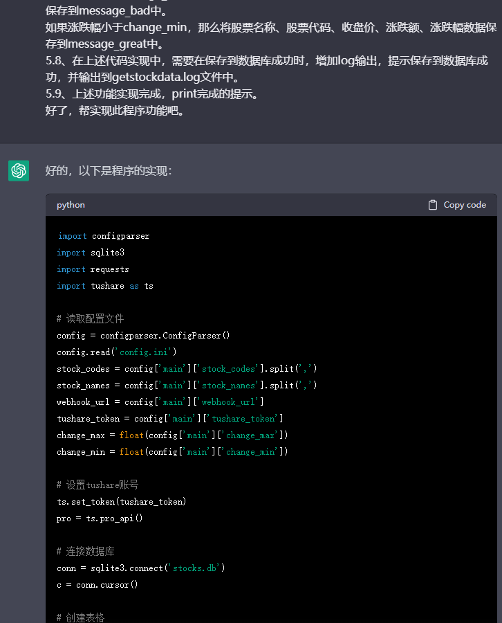
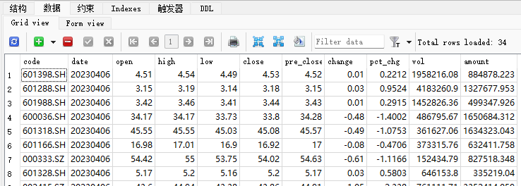
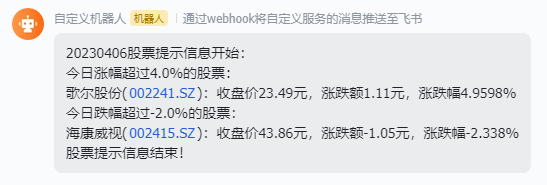
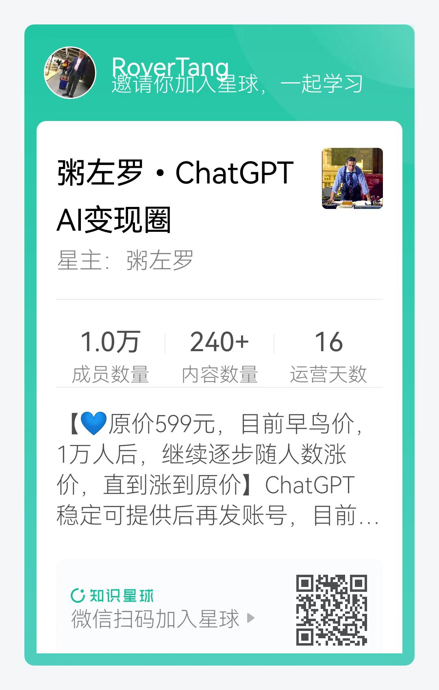

# 实战ChatGPT获取每日股价数据(你写作文它写代码)

两个月前，罗孚写过一篇“[使用 ChatGPT 写论文、查资料、编代码的一点体验](https://mp.weixin.qq.com/s/YowCZH3K0_7bK0pPqNKkMA)”，结论是对 ChatGPT 写论文写代码的能力很不满意。

半个月前，罗孚又写了一篇“[让 ChatGPT 写代码获取股票历史日 K 线数据](https://mp.weixin.qq.com/s/rbISUPBJZ0yTpRTGejGcGA)”，还不错，基本可以完成功能。

今天，罗孚再次实战 ChatGPT，目标：**让 ChatGPT 把我写的作文用代码实现，并最终部署到服务器上。** 

## 小作文

帮我写一个程序。

主要功能：获取指定股票的信息，保存到 sqlite，并将结果通过 webhook 发送到飞书群。

具体要求：

1、使用 Python 实现。

2、使用 tushare pro 库。tushare 的 token 在配置文件中。

3、需要有一个配置文件，配置文件名称：config.ini。

配置文件中：

默认为[main]

具体字段：

stock_codes=股票代码，使用逗号隔开；stock_names=股票名称，使用逗号隔开；stockcodes 和 stocknames 是一一对应关系。

webhook_url = 是配置飞书群 webhook 地址的。

tushare_token= 是配置 tushare token 的。

change_max = 4 用来配置最大涨幅超 4%

change_min = -3 用来配置最大跌幅超-3%

4、数据库名称：stocks.db，数据表为 stocks_data

5、功能实现要求：

5.1、设置 tushare 账号

5.2、读取配置文件

5.3、连接数据库

5.4、创建表格，需要判断表格是否存在，如果存在，则不再创建表格。

5.5、获取今天的日期，并根据日期通过 trade_cal 接口查询今天是否交易，如果是休市，则程序退出。

5.6、根据 stock_codes 获取今天的股票数据，数据字段为：股票代码、交易日期、开盘价、最高价、最低价、收盘价、昨收价、涨跌额、涨跌幅、成交量 、成交额 。然后将查询结果保存到数据库中。

5.7、在上述 5.6 中增加涨跌幅的判断

如果涨跌幅大于 change_max，那么将股票名称、股票代码、收盘价、涨跌额、涨跌幅数据保存到 message_bad 中。

如果涨跌幅小于 change_min，那么将股票名称、股票代码、收盘价、涨跌额、涨跌幅数据保存到 message_great 中。

5.8、在上述代码实现中，需要在保存到数据库成功时，增加 log 输出，提示保存到数据库成功，并输出到 getstockdata.log 文件中。

5.9、上述功能实现完成，print 完成的提示。

好了，帮实现此程序功能吧。

## ChatGPT 的代码实现

图太长，先截个大概：

还不错，基本可用，具体代码我就不贴了。

## 效果展示

来展示一下效果吧。

数据库中的数据：

通过 webhook 发送到飞书群的效果：

这些基本就是罗孚需要的效果了。

最终实现的主要功能：

1. 每天将需要的股票数据保存到数据库中，方便以后分析使用。
2. 根据股票的涨跌幅，将超过涨跌幅的股票信息发送到飞书群。
3. 股票代码、股票名、涨跌幅等都是在 config 中可配置的。

将这些代码部署到服务器上定时执行，就可以每天自动获取和提醒了。

如果你也需要这样的功能，那在文末公众号上提供了全部的代码和文件说明。

## 结语

通过这次实战，罗孚挺震撼的，给了一篇小作文，结果输出一个代码工程。前几天还在和产品经理开玩笑说：你把产品 PRD 写的超详细，以后就不需要这些攻城狮了，直接由你产品狗独挡一面。现在有 ChatGPT 的帮助，很有可能这个玩笑会成为现实。

从两个月前的不满意，到现在的震撼，罗孚在转变，因为对 ChatGPT 的认知在提升。在此，顺便推荐一个 ChatGPT 的圈子吧：[我为什么加入粥左罗 ChatGPT AI 变现圈](https://mp.weixin.qq.com/s/BZH6JxuwO1ozip1Gwl_-9g)，具体原因已在文中说明，加入链接 [https://t.zsxq.com/0cR2sKBgE](https://t.zsxq.com/0cR2sKBgE)，或者直接扫码下图。

哦，对了，本文代码文件说明如下：

getStockDatabyGPT.py：主程序文件，代码有具体说明。

config.ini：配置文件，配置了股票代码、涨跌幅、webhook 地址等

log 目录：按月生成 log 文件，记录当时保存的数据

stocks.db：默认无，运行后自动生成，sqlite3 数据库，每天会将数据保存到此。

注意事项：

1、基于 Python3，需要安装 Python3

2、使用 tushare 库，需要安装：pip install tushare

**代码下载地址：** 

[https://mp.weixin.qq.com/s/YtNLrndxiakpWqUp0rkteA](https://mp.weixin.qq.com/s/YtNLrndxiakpWqUp0rkteA)

谢谢

本文公众号地址：[https://mp.weixin.qq.com/s/YtNLrndxiakpWqUp0rkteA](https://mp.weixin.qq.com/s/YtNLrndxiakpWqUp0rkteA)

本文飞书文档地址：[实战 ChatGPT 获取每日股价数据(你写作文它写代码)](https://rovertang.feishu.cn/docx/FwsgdllWxoY7zSxNObFcYNC4nHg)

---

> 作者: [RoverTang](https://rovertang.com)  
> URL: https://blog.rovertang.com/posts/ai/20230408-you-write-text-chatgpt-writes-code-to-get-daily-stock-price/  

