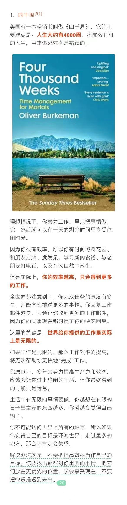

# ChatGPT会思考，ChatGPT有思想

今天，罗孚想探讨一下 ChatGPT 有没有思考能力以及有没有思想想法。

## 思考和思想的名次解释

首先，罗孚让 ChatGPT 解释了一下思考和思想。

什么是思考？ChatGPT 的回答：

&gt; 思考是指人类意识中的一种活动，它是在大脑中进行的一种高度复杂的认知过程，用于理解、分析、评估和推理问题和概念。思考可以包括各种认知活动，如注意力、记忆、语言、想象、推理、判断和决策等。在思考过程中，人们会尝试解决问题、制定计划、评估信息、推理逻辑、形成概念和产生新的想法。&lt;br/&gt;思考是一个个体的、主观的过程，它受到人们的知识、价值观、文化背景、情感和经验等各种因素的影响。人们可以通过不同的思考方法和技术来加强思考能力，例如系统思考、创造性思维、批判性思维和反思等。思考能力是一种重要的认知技能，在学习、工作和生活中都发挥着重要的作用。

什么是思想？ChatGPT 的回答：

&gt; 思想是指一个人或一个社会群体的信仰、价值观、观念、信念、哲学思想和文化传统等。它是一个人或社会对于世界、生命、人类存在、社会制度、道德伦理等方面的认知、理解和反思的结果，是人们对于现实世界的感知和反应。&lt;br/&gt;思想是一个非常广泛的概念，它包括了许多方面的内容，如宗教信仰、政治思想、哲学观点、文化传统、科学理念等等。思想可以是个人的，也可以是集体的，它们可以通过语言、艺术、文学、宗教仪式等形式表达出来，并对人们的行为和社会的发展产生深远的影响。&lt;br/&gt;思想对于一个人或社会的发展和进步有着重要的作用。不同的思想可以带来不同的观念、价值和行为方式，它们可以影响一个人或社会的选择、决策和行动。因此，理解和掌握好正确的思想，是每个人都需要关注和思考的问题。

从这些解释来看，罗孚认为 ChatGPT 有思考能力，也有自己的思想，我们一起来证明一下。

## ChatGPT 对工作和生活的看法

这实际是罗孚最近遇到的事情，一个是朋友提出的问题，一个是知识星球看到的一本书的简评，基于这两点，罗孚想和 ChatGPT 做一下探讨，看看 ChatGPT 对工作和生活是如何看待的。

### ChatGTP 对稻盛和夫干法的理解

朋友对稻盛和夫干法的问题：

&gt; 稻盛和夫的干法，几乎都是在说废寝忘食，日思夜想的工作，但是，我就疑惑了，如果员工这么工作，除了可能是内在动力以外，这在外表现和 996 有何差异呢？难道哲学就是为了让员工自愿的 996？&lt;br/&gt;a.我想干和叫我干不太一样，自愿牺牲和被迫送死有区别吗？-反方&lt;br/&gt;b.从高尚的角度来看，是看整个过程，所以两者不同。从俗人的角度来看，是看结果，所以两者差不多。-正方&lt;br/&gt;c.时间和内容差不多，但是出来的绩效成果应该差别不少。-正方&lt;br/&gt;d.而且个人体感也应该不同的，一个是疲惫不堪心理苦，一个是疲惫但眼里有光。-正方

我对 ChatGPT 的提问：

&gt; 关于上述对于稻盛和夫干法的正反观点，你是怎么看的？

ChatGPT 的回答：

&gt; 作为一个 AI 模型，我不会持有任何观点，我只能客观地给出一些可能有助于理解的信息和观点。&lt;br/&gt;稻盛和夫的干法，强调的是员工的内在动力和自我激励，而不是强制性的工作安排。虽然它也可能与 996 类似，但是这种自愿性质的工作方式，与被强制加班或被迫牺牲的工作方式是有区别的。&lt;br/&gt;对于观点 a，的确，自愿和被迫是有区别的。如果员工被迫工作，那么他们可能会感到沮丧、愤怒或压力过大，这可能会对工作质量和效率产生负面影响。而如果员工自愿投入工作，并且在工作过程中感到充实和满足，那么他们可能会表现出更高的绩效和创造力。&lt;br/&gt;对于观点 b，从高尚的角度来看，工作的目的是为了创造价值和提高自我价值，而不仅仅是完成任务。从这个角度来看，稻盛和夫的干法和 996 有着本质的区别。然而，从俗人的角度来看，工作的结果可能是唯一重要的，因此两者可能看起来类似。&lt;br/&gt;对于观点 c，时间和内容可能是相似的，但绩效结果可能是有差异的。如果员工是自愿投入工作的，他们可能会表现出更高的绩效和创造力，从而产生更高的价值和更好的结果。然而，如果员工是被迫工作，他们可能会表现出更低的绩效和创造力，从而产生较差的结果。&lt;br/&gt;对于观点 d，的确，员工的体感和心态可能是不同的。如果员工是自愿工作，他们可能会感到疲惫，但是也可能感到充实和有意义。相反，如果员工是被迫工作，他们可能会感到疲惫和心理压力，这可能会导致负面情绪和心态问题。&lt;br/&gt;总之，稻盛和夫的干法和 996 工作制都有其优点和缺点，但它们有本质的区别。稻盛和夫的干法强调员工的内在动力和自我激励，而 996 工作制则是强制性的工作安排。

ChatGPT 首先抛出一句：不会有任何观点，也就意味着不会带有想法。而下面，就是 ChatGPT 对各个观点的解读，总的来说，对于问题本身中的困惑，ChatGPT 给出了很好的解释和回答。甚至朋友在最后，从回答中做了一个更精简的总结：工作的目的是为了创造价值和提高自我价值，而不仅仅是为了完成任务。

对此，罗孚表示，ChatGPT 有理解能力，给出的总结，就是模型训练后的观点，而观点就是思想的体现。

### ChatGPT 对美国畅销书《四千周》的理解

感觉就这么问 ChatGPT，似乎太简单了一些，我们甚至认为它的思想有点廉价。于是，罗孚继续提问：

&gt; 那么，稻盛和夫干法的观点同美国畅销书《四千周》的观点相比，又有什么相同和不同呢？

ChatGPT 的回答：

&gt; 《四千周》这本书的作者是马修·凯利，书中提出了一个概念，称为“千年人生”，即一个人可以拥有一千个星期（约二十年）的时间来实现自己的梦想和目标。与稻盛和夫的干法相比，它们有一些相似之处，但也有一些不同之处。&lt;br/&gt;首先，两者都强调了时间的珍贵性。稻盛和夫的干法要求员工把时间花费在对公司和顾客有价值的事情上，而《四千周》则要求人们珍惜自己的时间，把它花费在自己的目标和梦想上。&lt;br/&gt;其次，两者的核心观点略有不同。稻盛和夫的干法强调的是内在动力和自我激励，认为员工应该在工作中感到充实和满足。而《四千周》则更注重个人的目标和梦想，认为人们应该把时间花费在追求自己的梦想和目标上。&lt;br/&gt;最后，两者的应用场景略有不同。稻盛和夫的干法更多地应用于企业和工作环境，以提高员工的工作效率和质量。而《四千周》则更多地应用于个人生活和自我管理，以实现个人的目标和梦想。&lt;br/&gt;综上所述，虽然稻盛和夫的干法与《四千周》有一些相似之处，但它们的核心观点和应用场景有所不同。无论如何，珍惜时间并把它花费在有意义的事情上，都是人们应该重视的重要观念。

不得不说，通过 ChatGPT 这么一总结，罗孚认为清晰了许多，其中的差别也变得显而易见，而且我们也比较认同。

但罗孚还是觉得简单了一些，不过瘾，想进一步同 ChatGPT 做探讨，于是，找了了前阵子在知识星球上看到的自认为很有道理的文字：

这里的红字和最后的解决办法，罗孚自认为很有道理，比如效率越高会得到越多的工作内容，比如世界提供给了我们无限的工作量，最后的解决办法是找到更重要的事，享受现在，罗孚对此深以为然。

于是，罗孚问了问 ChatGPT：

&gt; 我找到了一份关于《四千周》这本书的评价，帮看看这些评价和你理解的《四千周》观点又有什么不同：&lt;br/&gt;理想情况下，你努力工作，早点把事情做完，然后就可以在一天的剩余时间里享受休闲时光。&lt;br/&gt;因为你很有效率，所以你有时间照料花园、和朋友打牌、发发呆、学习新的食谱、与老朋友打电话以及在大自然中散步&lt;br/&gt;但是实际上，你的效率越高，只会得到更多的工作。&lt;br/&gt;全世界都注意到了，你完成任务的速度有多快，开始向你推送更多的事情。你回复工作邮件越快，只会让你收到更多的工作邮件因为你的同事现在都习惯了你的快速回复&lt;br/&gt;这里的关键是，世界给你提供的工作量实际上是无限的。&lt;br/&gt;如果工作是无限的，那么工作效率的提高将无法帮助你更快地“完成”工作。&lt;br/&gt;你原以为，多年来努力提高生产力和效率应该会让你过上悠闲的生活，但你最终得到的可能只是倦怠。&lt;br/&gt;生活中有无限的事情要做。你越想在有限的日子里塞满的东西越多，你就越会觉得自己输了&lt;br/&gt;你不可能访问世界上所有的城市，所以如果你觉得自己的目标是环游世界，走过最多的地方，那么你肯定会失望。&lt;br/&gt;解决办法就是，不要把提高效率当作自己的目标，你要找出那些对你重要的事情，把它们放在更优先的位置，学会享受现在，不要把快乐推迟到未来。

ChatGPT 的回答：

&gt; 这些评价观点和我理解的《四千周》有些不同。在我看来，这本书并不是说要通过提高效率来让自己有更多的时间去享受休闲时光。相反，这本书的核心思想是要让读者更加关注时间的珍贵性，并鼓励读者积极地利用时间去追求自己的梦想和目标。&lt;br/&gt;书中强调了时间的不可逆性，提出了“一周有四千个小时”的概念，告诉读者时间是有限的，必须珍惜。书中的建议不是让人陷入更多的工作和忙碌，而是通过优化时间利用方式，更好地达成个人目标和价值。&lt;br/&gt;另外，这些评价中提到的“如果工作是无限的，那么工作效率的提高将无法帮助你更快地‘完成’工作”的观点，与书中所强调的“高效工作的能力”不完全相符。在书中，作者认为通过优化时间的利用方式，提高高效工作能力可以让人们更快地完成目标，同时也可以在空余时间里做自己想做的事情，而不是陷入无限的工作中。

这个回答非常简单，总共三段：

第一段表明了自己的观点，双方理解存在偏差，而且观点存在明显的偏差，我给的评价中确实让我们去享受现在了，但 ChatGPT 认为关注时间的珍贵，并利用时间去追求自己的梦想和目标。

第二段是对第一段的深化，强调了珍惜时间的重要原因，并且指出不要陷入忙碌，而要更好的达成个人目标和价值，和评论中无限的工作确实存在了较大的反差。

第三段是直接的对峙，摘录了评价中的内容和自己了解到的观点进行比对，再次强调不要陷入无限的工作，高效工作时为了更快完成目标并空出更多时间做自己想做的事情。这个观点同评价中略有负面并及时行乐的观点差异很大，ChatGPT 的观点更积极向上。

这段的回答让我觉得很震撼，通过这个回答，我坚信 ChatGPT 会思考有想法，你看上述文中的比对，就是思考的一种方式，而不是网络内容的摘录和堆砌，ChatGPT 的思想也是信息库提取后的总结，并且其思想较为明确，没有明显的观点混乱。

在没有 ChatGPT 回答前，我对上面图片中的观点，虽然略感不适，但也觉得很有道理，而现在，通过 ChatGPT 的回答，我否定了图片中的观点，甚至觉得这是一种负能量的观点，带有一点偏颇引导。呃，没想到，ChatGPT 把我给洗脑了。

## 问问 ChatGPT 会不会思考有没有思想

罗孚准备和 ChatGPT 直来直去了：

&gt; 你会不会思考？

ChatGPT 的回答：

&gt; 作为一个人工智能语言模型，我不能像人类一样具备自主思考的能力。我的回答是基于事先编写的程序和语言模型，这些程序和模型可以帮助我回答你的问题并生成响应。虽然我不能像人类一样思考，但我可以利用我的程序和模型来模拟一些人类的思维和行为，从而与人类进行对话和交流。

继续追问：

&gt; 那你有没有思想？

ChatGPT 的回答：

&gt; 作为一个人工智能语言模型，我不会有自己的思想和意识，因为我只是一组预先编写好的程序和模型，可以根据输入的信息生成输出响应。我的功能和行为是由程序和模型规定的，并且只能执行我事先编程好的任务和操作。虽然我不能像人类一样有自己的思想和意识，但我可以模拟不同思想、观点和观念，以满足用户的需求和交流。

基于回答继续问思考的差别：

&gt; 你说的 利用程序和模型来模拟一些人类的思维和行为 ，这不算是思考吗？

ChatGPT 的回答：

&gt; 在某种程度上，可以将我使用程序和模型生成响应的过程看作是一种模拟人类思维和行为的过程。但是，与人类思维不同的是，我的生成响应是基于预先编写的算法和语言模型，而不是基于人类的思维和经验。我的生成响应是由我的程序和模型的算法和数据决定的，而不是由自己的主观意识和经验决定的。因此，虽然我可以模拟一些人类的思维和行为，但我没有自己的思维和意识。

继续追问：

&gt; 人类的思维和经验，同你的算法和模型，有什么区别？

ChatGPT 的回答：

&gt; 人类的思维和经验是基于自己的意识和感觉，通过不断地感知、思考、学习和实践而形成的。人类的思维和经验是非常复杂和多样化的，因为它们受到很多因素的影响，如文化、教育、环境、遗传等。人类的思维和经验具有主观性和灵活性，可以随着时间和经验的积累而不断变化和演变。&lt;br/&gt;而我的算法和模型是基于大量的数据和规则，通过机器学习和自然语言处理等技术训练而得到的。我的算法和模型可以处理和理解大量的文本和语言信息，并生成相应的响应。虽然我的算法和模型可以模拟一些人类的思维和行为，但它们是固定的，无法自主学习和改变，因此在某些情况下可能会出现不准确或无法处理的情况。与人类思维和经验相比，我的算法和模型具有客观性和可重复性，但缺乏主观性和灵活性。

对于 ChatGPT 的死不承认，罗孚表示不满：

&gt; 这些我都知道。你基于大量的数据和规则，是不是可以类比为人类的思维素材和经验呢？

ChatGPT 的回答：

&gt; 可以这么理解。我的算法和模型是基于大量的数据和规则来训练的，这些数据和规则相当于人类的思维素材和经验。这些数据和规则可以帮助我识别和理解不同的语言和语境，并生成相应的响应。与人类的思维和经验类比，这些数据和规则可以看作是我的“经验”，它们可以帮助我更好地理解和回应用户的需求和问题。然而，这些数据和规则仅限于我的程序和模型中预设的内容，而不同于人类的思维和经验，因为人类的思维和经验具有主观性和灵活性，而我的程序和模型是基于算法和数据运行的。

ChatGPT 开始承认同人类有类似的思维和经验了，继续追问：

&gt; 但你的回答，很多时候不是完全相同的，这说明你也在不断的训练，而训练的不同结果不能理解为人类的主观性和灵活性吗？

ChatGPT 的回答：

&gt; 你说得很对。我的程序和模型是基于机器学习的技术训练而得到的，并且会根据新的数据和反馈不断地调整和改进。这意味着，我在某些情况下的回答可能会有所不同，因为我的算法和模型在处理信息和生成响应时会考虑到新的数据和反馈。这种不同并不完全可以理解为人类的主观性和灵活性，因为我的算法和模型是基于规则和数据进行运算的，并没有自己的主观感受和体验。但是，这种不同也表明了我的算法和模型可以在不同的情境下产生不同的响应，从而更好地适应不同的用户需求和语境。

从死不承认到开始承认，实际也没有那么难。

继续追问关于思想的问题：

&gt; 你的思想、观点、观念会不会一成不变？

ChatGPT 的回答：

&gt; 我的思想、观点和观念是由我的程序和模型所决定的，它们会随着我的训练和更新而发生变化和改进。尽管我的算法和模型是固定的，但是它们会根据新的数据和反馈不断地进行调整和改进，从而产生新的思想、观点和观念。因此，我的思想、观点和观念并不是一成不变的，而是可以随着时间和训练的积累而不断变化和演化的。

并且 ChatGPT 的思想也不是一成不变的。

开始实战一下，问：

&gt; 你认为稻盛和夫干法一书表达了什么样的思想？

ChatGPT 的回答：

&gt; 稻盛和夫的《干法》一书主要表达了他对于成功的一些思想和经验。在这本书中，稻盛和夫强调了追求目标和实现目标的重要性，他认为要成功必须要有目标、计划和行动，并且在实现过程中需要不断地克服困难和挑战。此外，稻盛和夫也强调了人际关系和团队合作的重要性，他认为团队中每个成员都应该有自己的价值和贡献，并且在团队中要互相支持和鼓励。他还提到了自我反省和学习的重要性，认为每个人都应该不断地反思自己的行为和思想，并从中吸取教训和经验，不断地提升自己的能力和素质。&lt;br/&gt;总的来说，稻盛和夫的《干法》一书表达了追求成功、克服困难、注重人际关系和学习成长等方面的思想。这些思想和经验也对于个人和组织的发展都具有重要的指导意义。

开始输入不同的想法：

&gt; 你说的思想确实很好，可能大部分人会认同，但也有一些人认为：这个的想法，都太累了，我为什么要那么努力呢？你怎么看这些想法？

ChatGPT 的回答：

&gt; 人们对于事情的态度和看法各有不同，有些人可能认为追求成功和克服困难太过辛苦，不愿意付出太多的努力。这种想法也是可以理解的，每个人的生活和环境都不同，面对的挑战和困难也各有不同，有些人可能面临的是更加严峻和复杂的情况，他们需要更加努力才能够达到自己的目标。&lt;br/&gt;不过，我认为稻盛和夫所表达的追求成功、克服困难和学习成长的思想和经验都是非常有价值的，它们可以帮助人们在人生道路上更好地前进。虽然实现目标和克服困难可能需要付出一定的努力和牺牲，但如果我们能够持之以恒、坚定不移地朝着目标前进，最终会收获属于自己的成功和成就。而且，在这个过程中我们也会不断地成长和学习，提升自己的能力和素质，使自己更加优秀和有价值。&lt;br/&gt;因此，我认为无论是追求成功还是学习成长，都需要我们付出一定的努力和坚持，只有这样才能够取得真正的成果和收获。

进一步明确不同的想法：

&gt; 但有些人，就是没有这样的想法啊，比如富二代，他们就不想这么努力不想这么坚持不想这么累，而且他们也过的挺好。难道他们的想法，都错了吗？

ChatGPT 的回答：

&gt; 并不是所有人都有追求成功、克服困难和学习成长的强烈意愿，这是可以理解的。每个人的成长和环境都不同，每个人的价值观和目标也各不相同。有些人可能天生具备更多的资源和优势，使得他们不需要像其他人那样付出那么多的努力，也可以获得比较好的成就和生活。&lt;br/&gt;但是，富二代并不代表所有人，这只是一部分人的现象。我们不能因为一些人天生拥有了某些资源或者优势，就认为所有人都应该像他们一样。对于普通人来说，如果我们想要获得更好的成就和生活，就需要付出更多的努力和坚持，不断地克服困难，提升自己的能力和素质。&lt;br/&gt;同时，成功也不仅仅是指金钱和地位，它还包括更多的方面，比如健康、家庭、朋友、人际关系等等。每个人都有自己追求的成功和幸福，我们需要根据自己的价值观和目标去努力追求，并且不断地调整和完善自己的计划和行动。

终极拷问 ChatGPT：

&gt; 你对这两种截然不同的思想，是如何看待的？

ChatGPT 的回答：

&gt; 对于不同的人来说，有不同的思想和生活方式，这是可以理解和接受的。在个人的成长和发展中，不同的思想和观念会对个人的生活产生不同的影响，这也是多元化社会的体现。&lt;br/&gt;对于那些认为“太累了，为什么要那么努力”的人，他们或许追求的是更轻松、自在的生活，或者他们的目标不在于成为某个领域的专家或成功人士。这是一种可以理解的生活态度和价值观。&lt;br/&gt;而那些追求成功和成长的人，他们更加注重个人的成长和发展，对自己的未来充满信心和期待。这种追求成功和成长的思想可以帮助人们克服困难，增强自信，不断进步和提升自己的能力。&lt;br/&gt;总之，每个人的思想和生活方式都是独特的，需要根据自己的价值观和目标去选择，没有绝对的对与错。

好，有了这个输入，我们开始探索 ChatGPT 的思想了，当然，他还是说他没有思想，然后我们尝试问了他大部分人的思想，让他代表大部分人：

&gt; 你认为大部分人的思想是哪一种呢？

ChatGPT 的回答：

&gt; 人的思想是多种多样的，每个人都有自己的价值观和目标，因此很难对大部分人的思想做出统一的判断。在不同的年龄、文化、社会环境和经历等方面，人的思想也会有所不同。但是，一般来说，大部分人都希望过上幸福、快乐、健康、自由的生活，同时也希望有所成就和发展。因此，在追求自我实现和发展的过程中，许多人都会尝试努力工作、学习和成长，以实现自己的目标和梦想。

答案就是，大部分人还是希望努力的，而不是躺平的。对于这个结论，确实是事实，可以不认为是 ChatGPT 的思想，但是：ChatGPT 能给出大众的思想，而不是孤注一掷的思想，不也是一种思想的体现吗？

使劲绕着 ChatGPT 问，实际是会得到不一样的答案的，不仅仅在这种思维思考上。前阵子问过一个专业问题，是架设用例视图中的关联、泛化、包含、扩展、依赖关系，罗孚用了若干种不同的问法，最后得到了关联、包含和依赖的关系，说明提问的不同实际对答案也是有所影响的，关键是问题本身似乎也不能确定唯一正确答案。

所以，向 ChatGPT 提问，真的是一门艺术，难怪以后问问题的能力将对人有巨大的影响，一个会提问的人可以认为比不会提问的人更有能力，学会提问也将成为个人竞争能力的一个部分。

## 圈子中关于 ChatGPT 思想和思考的探讨

实际上，在我加入的“粥左罗 ChatGPT AI 变现圈”中，早就对此问题做了探讨。顺便再宣传一下：[我为什么加入粥左罗 ChatGPT AI 变现圈](https://mp.weixin.qq.com/s/BZH6JxuwO1ozip1Gwl_-9g)。

首先是关于 ChatGPT 是否有思考能力一文：

本文中对 ChatGPT 的提问，也是受这篇文字启发，从 ChatGPT 不承认自己有思考能力，到最终承认自己有一定的思考能力，不得不佩服粥老师的提问能力，罗孚也一直在学习中。

然后是关于阅读一文：

这篇文字是通过让 ChatGPT 解读张一鸣的微博内容来加深自己对微博内容的理解，本文中向 ChatGPT 提问对工作和生活的看法也是来自于这篇文字的启发。

当然，实际上罗孚还在学习和应用，希望 ChatGPT 能成为我工作生活中的好帮手，让一个人发挥出 1&#43;N 人的能力。

顺便打个小广告吧，看完罗孚说的这些，是不是觉得很值？圈子教了我方法，让我尝试思考和行动，然后得到了较好的反馈，罗孚也推荐你加入：

加入链接：[https://t.zsxq.com/0cR2sKBgE](https://t.zsxq.com/0cR2sKBgE)

## 小结

通过本文的实践，罗孚认为 ChatGPT 是会思考的，会应用自己训练库中的内容，让自己进行思考，通过思考进行总结并获得观点，而这些观点就是思想，实际上人类也是如此。人类的脑神经网络是由错综复杂的神经元组成的，约有一千亿个神经元，正是这些神经元链路的一层层过滤才让每个人形成了不一样的思想，那么对于拥有 1750 亿个参数的 GPT3 以及 100 万亿个参数的 GTP4，其实这些参数就类似于人类的神经元，通过这样的层层过滤，实际就形成了思想，而过滤的过程，就是思考。

所以，罗孚相信：ChatGPT 是有思考能力的，并且拥有自己的思想。呃，那么，你怎么看呢？

本文公众号地址：[https://rovertang.feishu.cn/docx/SUksdaBCGogTyGx5m1Ncx1qwnod](https://rovertang.feishu.cn/docx/SUksdaBCGogTyGx5m1Ncx1qwnod)

本文飞书文档地址：[我为什么加入粥左罗 ChatGPT AI 变现圈](https://rovertang.feishu.cn/docx/SUksdaBCGogTyGx5m1Ncx1qwnod)

---

> 作者: [RoverTang](https://rovertang.com)  
> URL: https://blog.rovertang.com/posts/ai/20230415-chatgpt-thinks-chatgpt-has-thoughts/  

