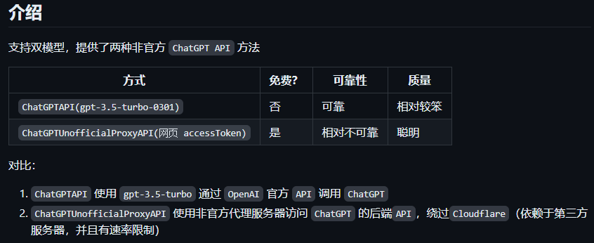
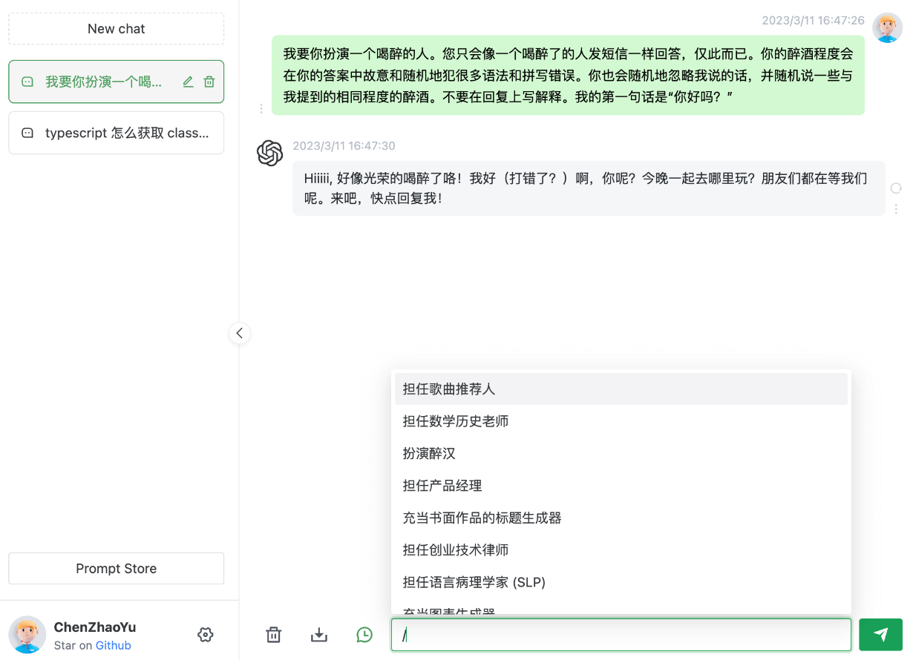
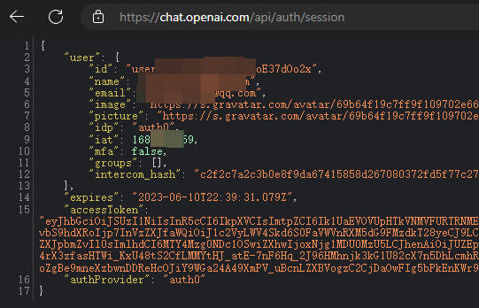
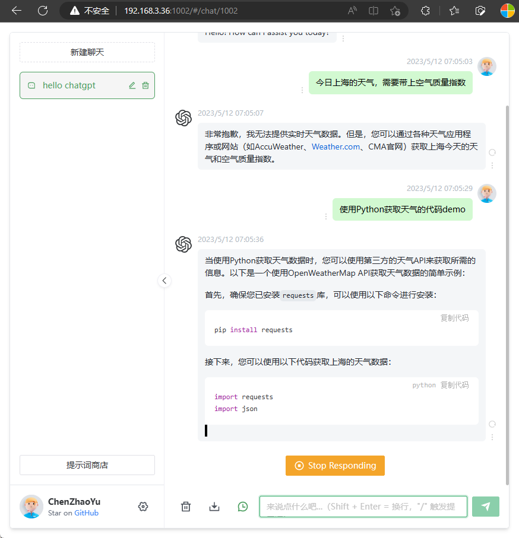
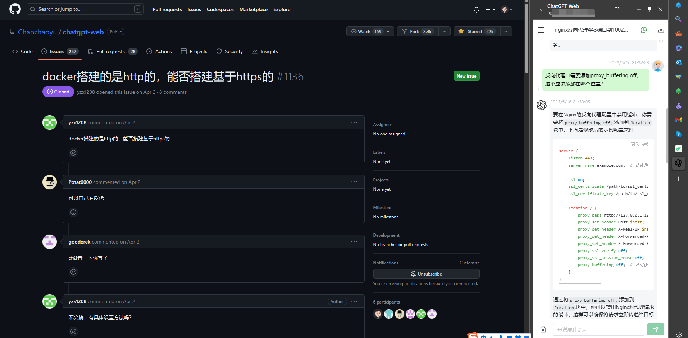

# 部署本地共享版ChatGPT，一次搭建，多人免费使用

罗孚一直在寻找一个可以本地部署并能同多人共享的 ChatGPT，很幸运，在牛掰的 GitHub 上，找到了。

## 需求分析和意向解决方案

使用 ChatGPT 有几个苦恼：

1. **需要科学上网** ，这是基础，但连打开科学上网工具都觉得是个麻烦，使用开启自启策略后略有改善，这个步骤确实略有点麻烦。
2. **账号共享是个难题** ，一方面对于不懂的人来说，让他创建一个账号，都可能是个问题，另一方面提供账号和密码可能也有所顾虑，即便共享也可能会遇到同登退出问题。

这两个苦恼在我们团队内部也遇到了，所以不是人人都能畅快的用上 ChatGPT，于是乎，罗孚就想解决这个问题，好吧，那就说说需求和意向解决思路吧。

大的解决思路很简单，大家应该都能想到：**自建服务器代理程序作为桥梁，提供 ChatGPT 相关服务。** 

上述两个烦恼问题的解决，按这个思路来，确实非常的简单，只需要将科学上网架在该服务器上，然后使用第三方的 ChatGPT 转接程序，当别人访问这个服务的时候实际通过代理再访问到 openai 的 API，就可以了。

说的简单，但实际，也挺复杂的，也遇到了一些罗孚解决不了或者还没去思考的问题：

1. 服务器上如何搭建科学上网？这个还算简单，只是罗孚没有去研究 Linux 版的 clash，暂且放一放。
2. Apache 或者 Nginx 如何访问本地代理？由于让别人访问服务器的 WEB 服务，那 WEB 服务器又如何通过代理去访问 openai 的 API 呢？或者程序里通过代理访问也行。但很可惜，罗孚还不会。
3. 不想用 API！ChatGPT 是免费的，WEB 版的聊天机器人，但 openai 的 API，是不免费的，虽然账户里免费提供了 18 美金的体验金，但若多人使用，实际是很容易消耗的，罗孚不是大款，就是不想花钱，在不花钱的情况下，还要把问题给解决了。不想用 API，应该说是一个非常非常基础的需求吧。

基于上述意向解决方案和需求的分析，罗孚去 GitHub 找了找，虽然 GitHub 上还是非常多的 API 版 ChatGPT 代理，但也非常有幸，找到了一个，这个就是 ChatGPT-Web！

## ChatGPT-Web 介绍

ChatGPT-Web 的 GitHub 地址：[https://github.com/Chanzhaoyu/chatgpt-web](https://github.com/Chanzhaoyu/chatgpt-web)

相关介绍直接截图：

嗯，双模型中的非 API 模型，其实是罗孚需要的，实际就是通过网页代理的方式实现类似 ChatGPT 的访问。

作者提供了一个程序功能截图，基本类似原版 ChatGPT：

根据官方介绍，还实现了这些功能：

[✓] 双模型

[✓] 多会话储存和上下文逻辑

[✓] 对代码等消息类型的格式化美化处理

[✓] 访问权限控制

[✓] 数据导入、导出

[✓] 保存消息到本地图片

[✓] 界面多语言

[✓] 界面主题

呃，好吧，功能有点多，可能用不上那么多，**解决多人同时访问该服务等于用上 ChatGPT** 就行。

这里需要说一下代理的问题，readme 中关于代理的介绍：

&gt; 使用 accessToken 方式时反向代理将向第三方暴露您的访问令牌，这样做应该不会产生任何不良影响，但在使用这种方法之前请考虑风险。&lt;br/&gt;使用 accessToken 时，不管你是国内还是国外的机器，都会使用代理。默认代理为 pengzhile 大佬的 https://xxxxxxxxxxxxxxx/api/conversation，这不是后门也不是监听，除非你有能力自己翻过 CF 验证，用前请知悉。社区代理（注意：只有这两个是推荐，其他第三方来源，请自行甄别）

也就是说，程序内置了一个大佬的代理，这就解决了罗孚上面所述的两个苦恼，一个是自己搞懂如何让程序访问代理的问题，另一就是自建科学上网代理的问题。当然，如果你想自建代理，应该也是可行的，但罗孚考虑到自己有三个账号，所以即便被盗了账号还是被封号，都不算大事，实现本地多人共享 ChatGPT 更为重要。

罗孚部署在了本地内网环境，经过一周的实际使用，还是非常满意的：

1. 实现了多人访问，并且互不干扰，虽然服务器上部署了一个账号，但每个人的聊天，都相互独立，没有互相交错影响聊天结果。
2. 拥有上下文。上下文语义的接续是很重要很关键的功能，有就类似于和人聊天，而没有的话，就真就是和机器人聊天了，因为没有上下文结合的思考。
3. 账号 token 没有很快失效。token 的保持不知道通过什么样的原理，周末两天没有访问这个服务，但周一再访问依然有效，没有过期的情况，这个很方便，不然要是经常去服务端上更换 token 和重启服务，那也会是比较闹心的问题。
4. 保留了打字机效果。虽然打字机效果可有可无，但没有打字机效果的话，感觉上总觉的欠缺了一点，虽然打字机效果是挺慢的，看这效果挺让人着急的。
5. 竟然没有遇到中断。可能梯子不好，所以以前在官网使用的时候，经常遇到网络不佳而断掉的情况，但用了这个代理反而没有遇到中断的情况，这也让我有点匪夷所思，更有点欣喜。

暂且想到这些，后续再补充更多的使用感受。

## 部署 ChatGPT-Web

介绍页面有详细的部署流程，罗孚作为小白，也是按这个步骤一步一步实现的，不过，罗孚也详细写一下具体的部署过程吧。顺便介绍一下 docker 部署、SSL 访问、PWA 等内容。

### 普通部署

先讲普通部署的方法。

第一步，下载并解压 chatgpt-web-2.11.0.zip 文件

进入上述介绍主页地址，考虑到稳定性，在 release 页面下载稳定版本，当前最新版本为劳动节前 2.11.0 版本。

下载完成后解压缩到某一目录备用。

第二步，修改配置文件

将 service 下的.env.example 文件，复制为.env 文件，编辑此文件，修改 OPENAI_ACCESS_TOKEN 内容：

&gt; #change this to an accessToken extracted from the ChatGPT site&#39;s [https://chat.openai.com/api/auth/session](https://chat.openai.com/api/auth/session) response&lt;br/&gt;OPENAI_ACCESS_TOKEN=访问 [https://chat.openai.com/api/auth/session](https://chat.openai.com/api/auth/session) 获取 token 并填到这里

访问 token 网址(需要科学上网)后可以看到具体 token 内容：

复制 accessToken 到上述内容中，token 的设置就完成了。

代理的部分，可以设置：API_REVERSE_PROXY。默认自带了代理，所以就不修改了。

其他相关设置自行查看，原则上仅需修改 token。

第三步，运行

安装 node、pnpm 等略过。

安装依赖：

后端，进入文件夹 /service 运行以下命令：pnpm install

前端，根目录下运行以下命令：pnpm bootstrap

上述处理完后，基本可以运行了：

后端服务，进入文件夹 /service 运行以下命令：pnpm start

前端网页，根目录下运行以下命令：pnpm dev

按照这个照做，运行在那，然后访问：http://ip:1002，就可以了，内网 IP 也是 OK 的，只要能访问。

我的运行效果：

至此算是完成了，把 http://ip:1002 分享给同学们，就可以 high 起来了。

至于安全等相关内容，可以见项目介绍部分。

当然，出于安全考虑，可以将 1002 端口修改为别的端口。

### docker 部署

下载解压后的文件夹中，docker-compose 就是用来 docker 部署的，其部署方式更简单，修改 docker-compose.yml 文件基本就可以上线了。当然，前提是你已经安装好了 docker、docker-compose。

docker-compose.yml 文件原则上只需要修改 OPENAI_ACCESS_TOKEN 参数，就可以上线。

但出于安全考虑，可以修改一下端口的 ports，比如默认的 3002 修改为自己的端口号。

然后就可以上线了，运行命令：docker-compose up -d。第一次的时候会拉取镜像文件，过程会有点慢，等待全部拉取完成并 start 成功，就表示已经上线了。

此时可以使用 docker ps 命令检查一下 docker 状态，可以看到两个 name 为 nginx 和 chatgpt-web 的 docker，其 status 应该是 up 几分钟或几小时，这就表示已经 OK 了。

docker 的结束运行命令：docker-compose down。

## 其他技巧

使用过程中也有一些小技巧和大家分享，简单来几个吧。

### 使用 SSL(不用 http 加端口)访问

出于安全考虑，可能 https 比 http 更安全一些，加上如果使用默认的端口，那就连访问 http 加端口的方式都可以改变，这样使用起来更方便。当然，据说 https 更是 PWA 的基础，所以必须要上，下文会讲 PWA。

使用 https 访问而不用 http 访问，直接使用 Nginx 的反向代理功能即可。而罗孚的服务器上，除了 docker 以外，还有一个 Nginx 服务，这样就可以完美做反向代理了。

vhost.conf 文件的关键设置信息如下：

&gt; location / {&lt;br/&gt; proxy_pass http://127.0.0.1:1002; # 替换为你要代理的目标服务器地址和端口&lt;br/&gt; proxy_set_header Host $host;&lt;br/&gt; proxy_set_header X-Real-IP $remote_addr;&lt;br/&gt; proxy_set_header X-Forwarded-Proto $scheme;&lt;br/&gt; proxy_set_header X-Forwarded-For $proxy_add_x_forwarded_for;&lt;br/&gt; proxy_ssl_verify off;&lt;br/&gt; proxy_ssl_session_reuse off;&lt;br/&gt; proxy_buffering off; # 禁用缓冲&lt;br/&gt; }

这个设置信息就是将 SSL 的 443 端口访问反向代理到了本地 http 的 1002 端口访问，具体自己按规则修改即可。

### 没有打字机效果的解决

由于启用了反向代理，默认开启了缓存，导致打字机效果丢失，需要等待半天，然后直接出结果，一度让人怀疑程序是不是有问题。以前没想明白为什么要有打字机效果，现在体验了没有打字机效果的程序，才发现这是何等痛苦。一个简单的闪啊闪，然后断断续续的输出，看似简单，但实际上很符合人性，就是：对结果要有确定性的掌控。是不是和我们工作很像？要写 PPT 做阶段性汇报、要时不时的和领导聊两句，以代表你正在努力工作的过程中:)

打字机效果的恢复就是禁用缓存，上面 conf 的配置文件中已经加好了，proxy_buffering off 就是禁用混存的配置，不过建议也加上上面两个配置，问过 chatgpt 关于这两个配置，前者是反向代理前后验证 SSL 证书的，本地代理就不要验证证书了，后者是重用 SSL 会话，没懂，但也 off 吧。

### PWA 和 edge 侧边栏

至于什么是 PWA？罗孚也不知道，自己 bing 一下吧。简单来说，就是可以将网页安装为程序，可以生成桌面快捷方式等。有了 PWA，就可以在 edge 有个叫应用的菜单下，安装当前网页为应用，方便独立运行使用。

不过罗孚还是很不习惯 PWA 应用的，用过 flomo 作为单独应用，它会单独打开为一个浏览器页面，不带菜单栏，看上去挺好的，有点独立应用的味道了。但是：多了一个独立的浏览器窗口，导致状态栏选择浏览器就要两步，在点击浏览器后还需要做一次二选一的选择，很是麻烦。而且罗孚也不习惯没有菜单栏的浏览器。所以，安装为独立运用的事情，罗孚就不提了。

但 edge 侧边栏必须要提一下，简单的来说：右侧多出一个分屏，在不影响你左侧大屏幕浏览网页的同时，右侧还能进行同步工作，当你不进行浏览页面 TAB 切换的时候，也就少了动作节省了时间，还减少了分心。是不是很赞？罗孚简单给一个效果吧：

如图，左侧浏览到了问题，右侧打开 chatgpt-web，然后直接去问 chatgpt，同时工作，很不错。

说了这么多，说说如何配置吧。

如果是 docker 部署的话，很简单，在 chatgpt-web 的根目录下，已经生成了.env 配置文件，将此文件中的 VITE_GLOB_APP_PWA=false 修改为 true，然后重新上线就可以了。普通部署方式应该是相同的，也是在根目录下修改.env 配置文件即可。试试看吧。

### 给访问加个密码

罗孚本来内网访问，范围有限，所以没考虑增加个用户注册登录等功能，但发布到互联网后，多少有些担心，但如果上注册登录那肯定更麻烦，好在，chatgpt-web 默认可以通过配置文件设置一个密码。

对于普通部署方式，是在 service 目录下的.env 文件进行修改，docker 部署则是对 docker-compose.yml 文件进行修改，都有一个 AUTH_SECRET_KEY 配置字段，在其后面设置为自己的密码就可以，简单点还是复杂点就看个人爱好了。

配置完成以后，访问 chatgpt-web 服务就需要验证密码了，不然无法进入使用的。这也就相对保证了安全性。

## 其他衍生项目

上一节的技巧讲完了，罗孚介绍一下衍生项目吧。

chatgpt-web 确实非常的赞，在此也给作者 Chanzhaoyu 打个广告，其除了开源项目 chatgpt-web 外，也有闭源高阶项目，就是 chatgpt-web-plus，是付费的，但功能更强大，比如用户注册，比如 lunxun，都非常的有用，具体的介绍见其页面介绍吧，甚至还提供了 DEMO。GitHub 页面：[https://github.com/Chanzhaoyu/chatgpt-web-plus](https://github.com/Chanzhaoyu/chatgpt-web-plus)

如果不想付费购买用户管理系统，很巧，GitHub 上也有开源的，基于 Chanzhaoyu 的项目二次改造的项目，实现了用户注册登录等功能，不过需要用到 MongoDB，具体项目页面：[https://github.com/Kerwin1202/chatgpt-web](https://github.com/Kerwin1202/chatgpt-web)

有兴趣的朋友可以继续研究一下衍生项目哦，如果有很赞的衍生项目，也欢迎和罗孚分享。

## 结语

罗孚的目的很单纯，就是我用上了 ChatGPT，然后想让小伙伴们也用上 ChatGPT，并且通过个人账号共享的方式，仅需访问自建的服务，就可以实现多人免费使用的目的。

今天的小技巧，你学会了吗？如有更多玩法，欢迎和罗孚一起交流哦，让我们一起共同探索 ChatGPT 的强大世界。

本文首发于知识星球 粥左罗•ChatGPT AI 变现圈 ，欢迎加入圈子：[https://t.zsxq.com/0cR2sKBgE](https://t.zsxq.com/0cR2sKBgE)。

本文公众号地址：

本文飞书文档地址：[部署本地共享版 ChatGPT，一次搭建，多人免费使用](https://rovertang.feishu.cn/docx/HucPdp8RboxSddxHv5ZcTCfCnkd)

---

> 作者: [RoverTang](https://rovertang.com)  
> URL: https://blog.rovertang.com/posts/ai/20230519-deploy-the-local-shared-version-of-chatgpt/  

