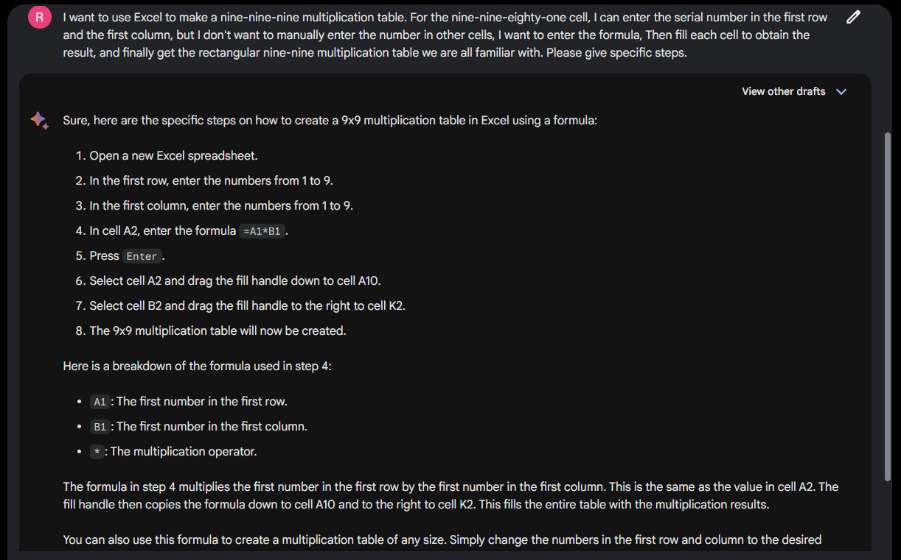
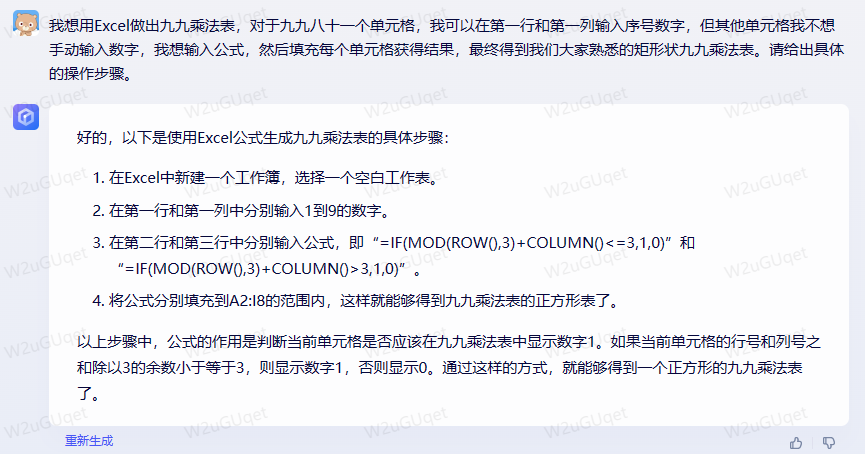

# 通过九九乘法表看人工智能大模型的差距

九九乘法表是我们国人的最基础智慧，耳熟能详，而用 Excel 表做九九乘法表又显得非常合情合理，于是乎，今天，我们就用 Excel 怎么做九九乘法表这一话题，一起来来考考国内外的人工智能大模型吧，具体参赛的有：

1. ChatGPT
2. New Bing
3. Google Bard
4. 文心一言
5. 通义千问
6. 讯飞星火

实在没想到别的，有想到的小伙伴可以告知罗孚，后续体验后继续增加。

## 缘起

早上儿子给我展示了在学校做的九九乘法表，然后又做了一张 10 到 20 的矩阵乘法表，据说这个表让他花费了一张白纸才做出来，我猜想应该用竖式计算硬算的吧。现在，他要挑战一下 20 到 30 的矩阵乘法表，在电脑上用 Excel。

创意还不错，欣喜的开始做起来。但刚开始做，我就发现不对劲了，先把横和竖的 20 到 30 是很快拉好了，填充中间空白内容的时候，竟然又拿出了一个实体计算器，然后选中 Excel 中的第二行第二列的单元格，将上面的数字和下面的数字使用实体计算器相乘后，填入到这个单元格中，其他以此类推。

呃，我马上制止了他，和他说，Excel 本身就有公式，你当然要用公式技巧来做，而不是用笨办法哦。他说他不会，我说那好吧，你让 ChatGPT 帮你吧。

嗯，就这么简单的一个起因，然后我们俩在各个人工智能大模型里问了一圈，至于过程嘛，不多说了，看完本文基本就知道了。

## 个人思路

九九乘法表确实很简单，**个人能想到的方法：**

在行和列都已经填充好 1 到 9 的数字后，继续处理空白单元格

1. 硬填数字

好吧，这就是我儿子的做法，先将每个单元格计算一遍，然后把结果填进空白单元格中，这是最基础的方法了。

2. 硬填公式

这也许算是一种改进方法，也就是每个单元格内输入=选中最左边单元格*选中最上面单元格，就可以得到此单元格内的正确结果了，只是操作的也有点累。

3. 横拉和竖拉公式

这个基本是罗孚能想到的方法了，先做好第二行第二列的单元格的公式后，然后往右拉，拉到最后一列，然后再向下拉，拉到最后一行，应该能出正确的结果。

只是，公式有点技巧，需要用到符号 $。

正确的公式是：=$A2*B$1，这是行乘列的模式，A2*B1，但加了$是什么意思呢？意思是让这个单元格的行列参数不要动，比如 $A 就表示你拉单元格的时候，这个 A 不会再变成 B、C、D 等顺序字母了，而 $1 也同理，后续的 1 不会随着拉动变成 23456 等。做完这个公式，只需先向右拉到底，然后再向下拉到底，就完成了。

可能靠文字描述不太容易理解，罗孚也不愿意做动画，网上有一个不错的指导，还有 GIF 图：[https://zhuanlan.zhihu.com/p/203686328](https://zhuanlan.zhihu.com/p/203686328)

九九乘法表**对 Excel 的考点总结：**

1. 公式

毋庸置疑，公式是最基础的，大家应该都能想到。

2. 符号 $ 的用途

这个不是所有人能想到，罗孚工作十多年都没有用过，直到几年前偶尔学到，才明白了 $ 的妙用。

具体怎么解释，罗孚似乎也不太能表达，于是，咨询了一下 ChatGPT：Excel 中对于公式使用 $ 符号的用途

&gt; 在 Excel 中，$符号有两种常见的用途：&lt;br/&gt;1. 绝对引用：$符号用于在公式中创建绝对引用。绝对引用是指在复制或拖动公式时，某些单元格的引用始终保持不变。通常，在引用行或列时，Excel 会自动调整引用的单元格。但是，如果在引用前面添加$符号，就可以锁定该行或列，使其不受复制或拖动的影响。例如，$A$1 表示单元格 A1 的绝对引用，$A表示列A的绝对引用，A$1表示行1的绝对引用。&lt;br/&gt;2. 命名范围：$符号也用于指定命名范围。在 Excel 中，可以给特定的单元格或单元格区域设置名称，以方便在公式中引用。当引用命名范围时，在范围名称前面加上$符号，可以确保引用的范围不会随着公式的复制或拖动而改变。&lt;br/&gt;$符号的使用可以帮助确保公式在复制或拖动时保持引用的稳定性，以及在使用命名范围时提供更清晰的引用方式。它提供了更大的灵活性和精确性，特别是在处理复杂的公式和数据分析时。

不管能否看懂，多操作几遍，应该就理解了。

## 人工智能大模型 PK

说了这么多的铺垫，终于来到了 PK 环节，实际罗孚还是希望自己先动一下脑，避免填鸭，避免大脑思考能力退化:)

在 PK 前，已经准备好了一段提示词，自认为比较容易理解，为了便于 PK，不对提示词做相应的修改，直接提问并获得答案。提示词如下：

我想用 Excel 做出九九乘法表，一个正方形的表，我不想在每个单元格里手动输入结果，我需要使用公式。请给出具体的操作步骤。

提示词可能不算完美，但应该还算能够理解，于是都问了一遍。

### ChatGPT

回答：

回答中规中矩，但也有错误的地方，上述第四步是存在错误的：

&gt; 4、选中第一行的所有单元格 (A1 到 I1)。&lt;br/&gt;5、将鼠标悬停在右下角的小方块上，直到光标变为黑色十字箭头。&lt;br/&gt;6、按住鼠标左键向右拖动，创建一个水平的数字序列，直到达到数字 9。

这个操作是往右拖出数字序列，选择第一第二个单元格就可以了，而选中目标单元格再拖动，存在明显错误。

我尝试纠正它，但无动于衷，承认错误很中肯，但就是不改。

总体结果还算满意。

### New Bing

结果：

这明显根据知乎的回答进行编造的，按照 Bing 的搜索结果，第一个结果确实是知乎的回答。

怎么说呢，算完全正确吧，简洁明了，还给出了结果外的其他内容，比如显示乘法表、删除重复项等。

总体结果满意。

### Google Bard

结果：

由于不支持中文，所以让 Google 自己翻译成了英文然后再来回答。但结果很不好。

这个操作我没能进行下去，而且仅仅是 A1*B1 肯定是不合适的，没有任何关于符号 $ 的说明。

所以，应该算是没有获得正确的结果。

总体结果错误。

### 文心一言

结果：

这个回答很简洁，但简洁的有点让人摸不着头脑。第二步假装理解了，但第三步实在没能理解，不知道应该在哪个单元格下手，而且在 B2 单元格中按此公式测试，也未能得到正确结果。而且公式巨复杂，连罗孚都没看懂，按理简单的用个 $ 符号就可以解决的问题，硬是用到了 ROW、COLUMN、MOD 等函数，不明白。

总体结果错误。

### 通义千问

结果：

回答的像模像样，但结果错的离谱，一个简单的九九乘法表，不知道为啥需要用到 VLOOKUP 函数，简直没法用言语表达。

总体结果错误。

### 讯飞星火

结果：

表面上看回答的有模有样，但实际也是让人无法操作，第四步中输入公式，在哪个单元格，我在 B2 输入，算是获得正确结果，但第五步开始就完全是错的，总体来说完全无法给人一个正确的操作。

总体结果错误。

## 结论

一个简单的 PK，结论也是显而易见的，胜出的只有：ChatGPT 和 New Bing。而 Google Bard、文心一言、通义千问、讯飞星火都给出了错误的结果，不能让人满意。

从这个 PK 也可以看出，虽然大家都自称自己是人工智能大模型，但实际上差距是巨大的。

你怎么看待这个结果？如果也有类似的尝试，可以和罗孚分享哦。

本文公众号地址：

本文飞书文档地址：[通过九九乘法表看人工智能大模型的差距](https://rovertang.feishu.cn/docx/Ib27dT4YioNBLZx3mFecQKoknhd)

---

> 作者: [RoverTang](https://rovertang.com)  
> URL: http://localhost:1313/posts/ai/20230527-the-gap-of-ai-by-the-nine-nine-multiplication-table/  

