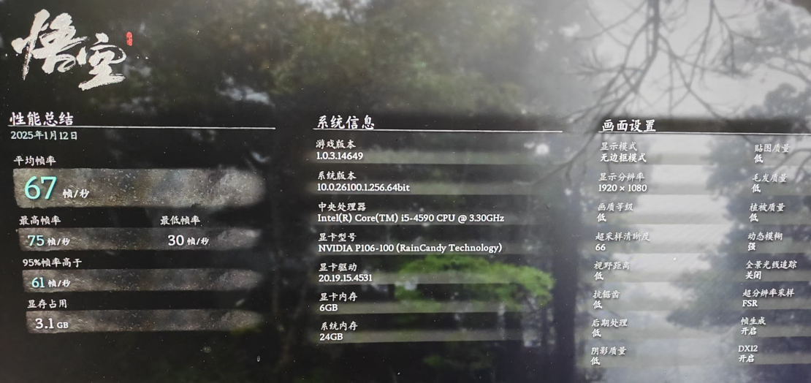

# 百元P106显卡跑7B大模型，矿渣变AI神器，真香！

每个 AI 爱好者心中都有一个&#34;炼丹&#34;的梦，这不，开源大模型DeepSeek再次点燃梦想，亲手部署一个 DeepSeek R1 到自己 PC 上，已经有点急不可耐了。

但我这组装于远古(2014 年)的破 PC，还能跑得动大模型吗？

我前年在这电子古董上尝试跑过 Stable Diffusion，i5-4590 CPU 加集显硬扛，大概要喝两杯咖啡(15 分钟)才能出一张图，再然后就没然后了，让破电脑继续吃灰了。

## 买块显卡解决跑大模型问题

哀莫大于心死，做人总不能那么容易死心，加了些许思考：AI 大模型靠的是算力，算力来自于显卡，嗯，买一块显卡应该就能解决问题，加块显卡让我这破 PC 死灰复燃吧。

于是把所有心动的显卡都加入了购物车：

&gt; 3060：12G 
&gt; 
&gt; 4060：8G 
&gt; 
&gt; 4060Ti：8G/16G 
&gt; 
&gt; 4070/super：12G 
&gt; 
&gt; 4070Ti：12G 
&gt; 
&gt; 4070Ti super：16G 
&gt; 
&gt; 4080：16G 
&gt; 
&gt; 4090：24GB 
&gt; 

但价格嘛，3060 差不多 2000 元起步，而 4090 可能要 1.5 万元左右了，至于当下最新发布的 5090 显卡，我还没法加入购物车，价格就不说了。十一年前的老古董也就剩余不到一千的残值，为一块显卡花上数千元，让我觉得自己在买椟还珠，再看了看自己瘪瘪的钱包，有点无奈了。

好在，上帝关上了一扇门还为给你开扇窗，机缘巧合之下，了解到了一款名叫 P106-100 的显卡，是 1060 的阉割版，是挖矿显卡，俗称矿渣显卡，而显存能有 6GB，价格嘛，只要区区百元，和别人吃顿饭的钱应该就能入手两块。

于是，罗孚入手了两块 **P106-100 矿渣显卡，129 元一个** 。罗孚当时甚至想买 4 块，自己组个 DELL R720 的洋垃圾服务器，把四块显卡塞进去，这不就成了 24GB 显存的 GPU 服务器了？预计总价也就一两千元以内，但考虑到服务器的折腾，而且我这想法不成熟，加上必要性不大，于是就算了，单显卡能跑起来玩玩就可以了。

所以，真的是买一块显卡就解决了跑大模型的问题，只是，你买的是 4090，还是像我一样买一块 P106 呢？极致性价比之下，还要什么自行车嘛:)

## 百元显卡性能超预期

主角就这么简单的讲完了，但总该跑一下分让人看看性能吧。行，我再升级一下硬盘先：这块高龄主板竟然通过刷 BIOS 能支持 NVME，而除了显卡插槽外还有一个 PCI Express x16 插槽，虽然是 PCI Express 2.0 的，但应该够用了，于是买了 PCIE 转 M.2 的卡以及 1T 的 SSD，合计 350 元搞定。

至于速度嘛，应该说有点惊喜：

而原有的 SSD，再怎么跑应该也超不过 500M，毕竟 SATA3 的接口嘛。1.3GB 以上的读写速度，已经非常满意了。

升级完成，我们现在请鲁大师跑个分：

**显卡单项得分近 19 万分** ，原来核显不足 3 万分，而此成绩甚至不输某些千元新卡吧。

**SSD 贡献了 9 万多分** ，增加了 5 万分，看上去比原来的 SATA SSD 强了一倍多。

最终综合得分 56 万分，同原来的 32 万多分相比，性能提升 70%，主要得益于显卡性能的提升。

既然测都测了，要不顺便测测黑神话悟空吧，下载“黑神话：悟空 性能测试工具”并跑完：

**平均 67 帧** ，这成绩也算亮眼了，毕竟百元显卡嘛。

顺便让 GPT 输出了一下 P106 和 4090 的参数比较：

虽然性能差距可能超过十倍，但价格也差百倍以上，仁者见仁了。

总得来说，P106 显卡性能不错，6GB 显存也不算小，自娱自乐个大模型问题不大，偶尔玩玩黑神话也完全可行。

## P106-100 矿卡使用注意事项

不得不诚实的说：P106-100 是一块名不经传的显卡，最关键的原因，它是一块矿渣显卡，好听的说法是 1060 显卡的阉割版，并且据说大部分都从发电厂周边阴暗湿冷的矿机柜里挖出来的，所以不要想着全新，能淘到成色不错的就已经很好了，更要庆幸自己没有翻车，所以购买前务必擦亮眼睛。如果能上 2000 块的 3060，还是尽量买正统显卡吧。

说完了这块显卡的悲伤过去，我们来说说注意事项吧：

1. **必须配合集显使用！**

由于这块显卡不带任何端口输出，没有 HDMI，没有 DVI，没有 DP，所以不要想着直接接显示器了。本身就是用来做解算的，不带输出没关系，显示依然用核显输出就好了。

2. **电源供电必须足！**

显卡顶部有电源接口，必须接，不接应该点不亮显卡，但是，更需要注意电脑整机的电源，少于 300 瓦的供电是比较危险的。我用到是航嘉 450B 电源，也就是 450 瓦，原本有点担心，但用下来确认没有问题。每个人都情况不同，具体看主板、CPU 等决定哈。

3. **不一定所有主板适用！**

这个勿用多言，实际还是跟着 CPU 走的，据说要酷睿 i3 以上、志强 E3V3 以上、锐龙 R5 以上等等，这些 CPU 虽然不算新，但大家的应该都比我的这个配置要好了吧？

4. **驱动安装略有麻烦。**

除了 BIOS 里设置以外，还需要先进安全模式 DDU 掉默认自带的驱动，再安装魔改驱动。这里推荐一下雨糖大佬的驱动：[http://raincandy.tech/nvcmpgpu/](http://raincandy.tech/nvcmpgpu/)

## 跑个 DeepSeek R1 大模型试试

这年头跑大模型已经没有任何技术含量了，ollama 直接是傻瓜式运行，下载安装即可：[https://ollama.com/download](https://ollama.com/download)

根据自己的系统选择下载，完成后一直下一步安装即可。

至于模型嘛，由于是 6GB 显存，所以 **6GB 以内的大模型应该都能跑，比如 deepseek R1-7B、Qwen2.5-7B、llama3.1-8B 等** 。我们这次就选最近大火的 deepseek R1 试试：

复制边上的命令，直接在 CMD 里回车，就开始拉取模型了，下载速度还挺快，有时能超过 100M/s。

等待完成，就可以输入内容进行对话了，此时 GPU 占用也上来了，差不多在 5GB 的位置：

通过 nvidia-smi 命令也可以看到具体的使用情况：

最后随便问个问题试试速度：

这个速度可以接受，不算慢，但肯定无法同 4090 相比，和 3060 也是没法比的，但如果作为工程师开发用测试设备，实际无妨，是不是算是拉低了开发的门槛呢？作为我们这样的 AI 爱好者也终于可以手搓个大模型玩玩了。

上面仅仅是搭建完成并运行大模型，还需要配合 WEBUI 等，在浏览器中访问菜能有点 ChatGPT 的感觉，这部分就后续再写了吧。

## 最后的话

区区一百元，装块矿渣显卡就能让老电脑焕然一新，能玩黑神话，能跑大模型，不得不说 P106 显卡真香！对于有研究精神的同学非常值得入手，有老电脑的同学可以试试，说这么多，你是否真的想行动了呢？欢迎告诉我你的想法。

彩蛋时间：罗孚的面包铺([https://mbd.pub/o/rovertang](https://mbd.pub/o/rovertang) )刚刚开业，所以特地准备了两个大礼包：P106-100 魔改驱动包 &#43;Ollama 部署详细指北，只需您投个币(在面包铺里购买)就可以带走，同时也是您对我莫大的支持和鼓励。非常感谢！

---

> 作者: [RoverTang](https://rovertang.com)  
> URL: https://blog.rovertang.com/posts/ai/20250201-a-hundred-yuan-p106-graphics-card-runs-a-7b-large-model/  

