# 手搓DeepSeek私服：家用PC&#43;宽带，低成本搞定大模型部署！

写在最前面：根据《生成式人工智能服务管理暂行办法》的要求，请勿对中国地区公众提供一切未经备案的生成式人工智能服务。所以：本文仅提供思路，不提供具体服务，仅供大家学习参考，也不建议大家实际部署。

前天写了“[百元 P106 显卡跑 7B 大模型，矿渣变 AI 神器，真香！](https://mp.weixin.qq.com/s/Y5JqGh_HCY2-LnyyZtvTBg)”一文，竟然有不少朋友喜欢，原来大家都是“极致性价比追求者”啊。大模型已经跑起来了，那搭建一个私人服务器应该也挺好玩的。于是，我决定利用家里的PC和千兆宽带，低成本打造一个DeepSeek服务。

## 手搓私服基本思路

**搭建私服有两个关键要点：服务器部署服务端程序，然后通过局域网或互联网对外提供服务。**

我们手搓 DeepSeek 私服的前半部分，已经在前天的[文章](https://mp.weixin.qq.com/s/Y5JqGh_HCY2-LnyyZtvTBg)中实现了：服务器是加了一块 P106 矿渣显卡的家用 PC，服务由 ollama 提供，模型是 DeepSeek-R1:8B。但目前只能在 CMD 里聊天，还没有可以在浏览器里打开的 WEB 客户端。

**支持 ollama 的 WEB 程序其实挺多的：官方提供了 OpenWebUI，现在流行的是 NextChat，还有超级简单的可以用 Chatbot UI。** 由于 OpenWebUI 部署过于复杂，基于 Python uv 的模式我没能跑通，而 docker 部署又太大，最终我放弃了。还是用流行的 NextChat 吧。

如果仅仅是想提供局域网服务，至此就可以结束了。但如果想提供互联网服务，似乎比买块显卡还难，我们没法把家用 PC 搬进电信机房，即便真能，那费用应该也不容易接受，去阿里云看看 GPU 服务器，没有低于 1500 元/月的，这意味着一年费用两万起步。但是，我家宽带也有千兆那，这多浪费啊。虽然家用宽带上行和下行速度完全不对等，但跑个通路总该没问题吧。

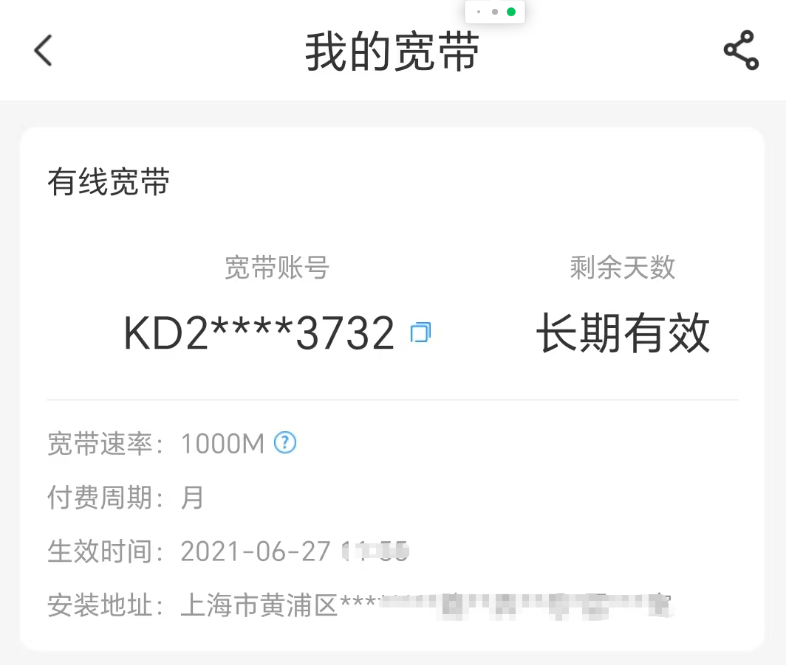

家用 PC&#43; 千兆宽带，把自家变身为“家用机房”，看上去解决了服务器和网络的问题，但且慢，你还没有对外服务的公网 IP 那。IPV4 资源现在如此紧张，上海电信甚至都不给你公网 IP，你实际仍然只是在更大的局域网里，而即便给你公网 IP，一方面地址是动态的，另一方面端口是受限的，自己还要做一通的 DDNS 和端口映射。这条路似乎不容易，好在还有 Ngrok 这样的服务，还有 Cloudflare 这样的“大善人”，甚至还有无法多言的其他种种，我们这里就用 Cloudflare 的 Tunnel 吧，外网访问家用 PC 的链路就可以通了。

最后，如果在外网有一个服务器，那部署方案会更美好一些，就可以实现下图的部署方案二，让 NextChat 部署在外网服务器，让 Tunnel 在中间，不然只能使用部署方案一，将 NextChat 部署到家用 PC，Tunnel 直接穿过网络到家用 PC。

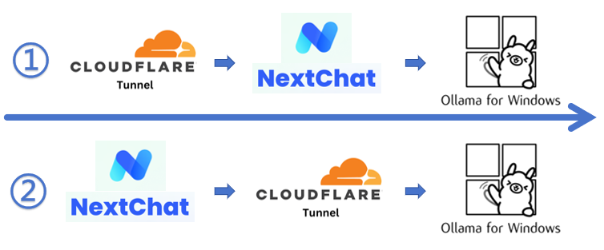

上述两者虽然有区别，但实际上自己找一个共享的 NextChat 服务，甚至可以省去 NextChat 的部署，只需要做内网穿透访问 ollama 即可。

好了，思路应该说的很清晰了，具体的实现其实非常简单，跟我一起实操起来吧。

## 搭建NextChat服务实现网页聊天

NextChat 地址： [https://github.com/ChatGPTNextWeb/NextChat](https://github.com/ChatGPTNextWeb/NextChat)

readme 里有搭建说明，可以直接在 Vercel 上部署，当然也可以自行用 docker 搭建，更简单一些。

我在家里的 Ubuntu 服务器上使用 docker 方式安装，非常简单：

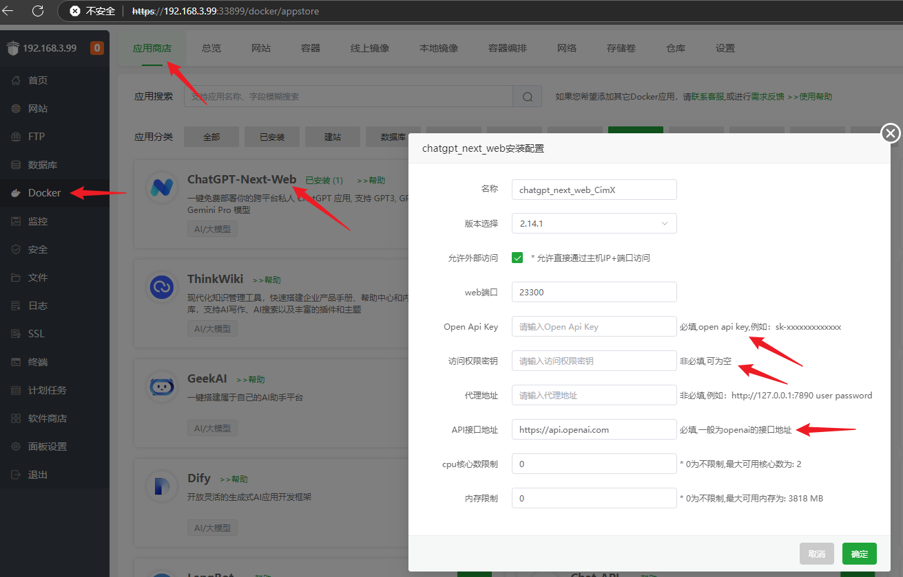

在 Docker 的应用商店里找到 ChatGPT-Next-Web(现在叫 NextChat 了)直接安装即可，其中 Open Api Key 可以填个假的，访问权限密钥就是访问密码，因为自己不会提供服务，所以可以不填，而 API 接口地址默认用 OpenAI 的就可以了，端口也默认，确定后等待完成就可以访问了。

搭建完成后使用 IP 加端口的形式访问，就可以看到 NextChat 的界面了，不过还不能直接使用，要使用自定义的 ollama API 服务。打开 NextChat 的设置：

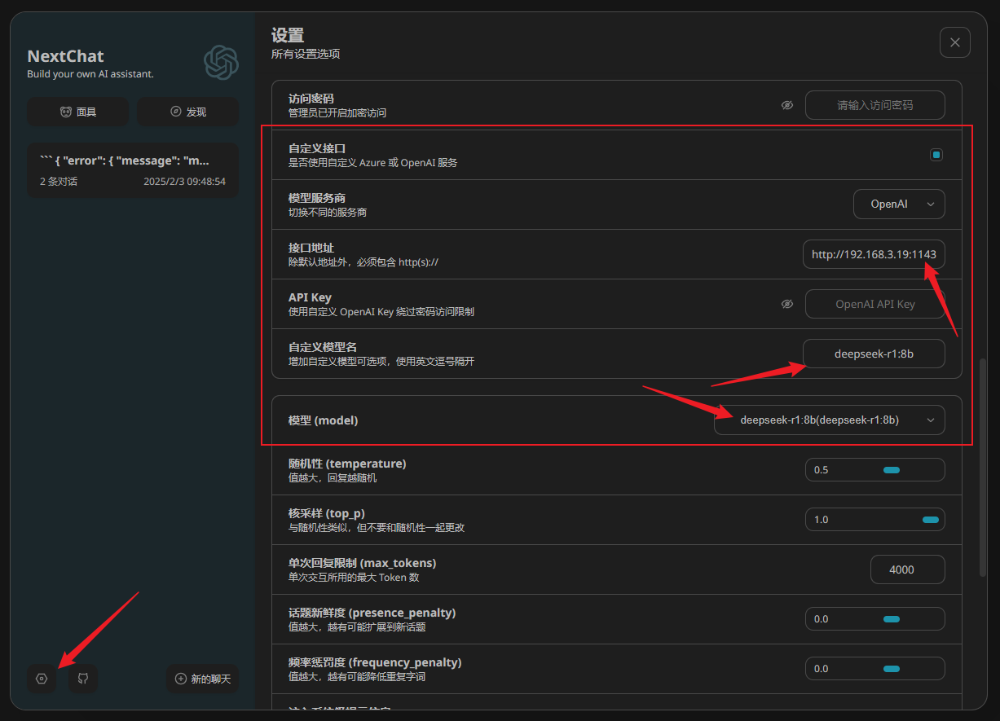

选择自定义接口，模型服务商默认 OpenAI 即可，兼容性 API，接口地址写自己的内网地址加默认 11434 端口，而 API Key 可以不填。自定义模型名需要注意，安装了哪些就可以填哪些，比如我安装的是 deepseek-r1:8b，填写也如此就好了。但需要注意，在下面**模型选项中，选择刚刚自定义的 deepseek-r1:8b 模型**，如果默认是 gpt3.5，那么开始对话就会返回错误了。

上述设置完毕，就可以开始对话了：

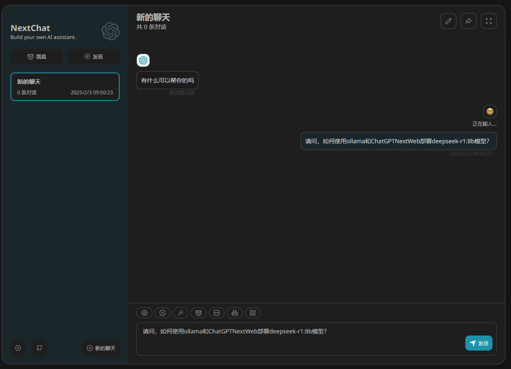

关于 ollama 的特殊说明：如果需要局域网 IP 访问的话，需要将电脑环境变量中的 OLLAMA_HOST 设置为 0.0.0.0，否则无法局域网访问。

通过 NextChat 可以聊天了，说明内网的服务已经通了，也就是局域网访问的部署已经完毕了。下一步如果使用 tunnel 直接访问 NextChat，实际就完成了外网的部署。

## 部署Tunnel服务访问内网ollama

Cloudflare 是众所周知的大善人，提供了各种各样的免费服务，罗孚甚至用 hugo 搭建的静态博客还托管了一份在他们的 pages 上。而此次用到的 Tunnel 服务，由于访问量极小，所以也是免费的。当然，Tunnel 不仅仅可以穿透网站访问，甚至还能 RDP 穿透访问，网上有较多的教程，大家可以自行摸索，罗孚仅提供几个关键步骤。

首先，Tunnel 入口比较深，在 Zero Trust 的网络中，点开后可以创建 cloudflared 类型的隧道。

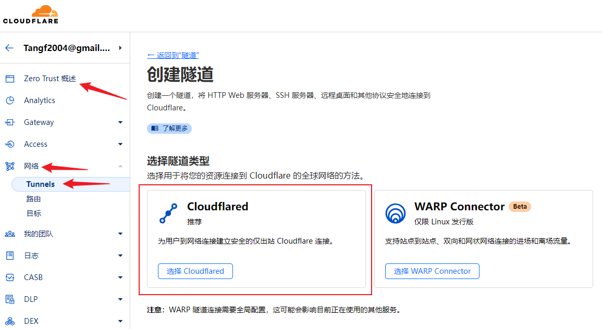

创建隧道后的配置就是安装客户端并启动服务。

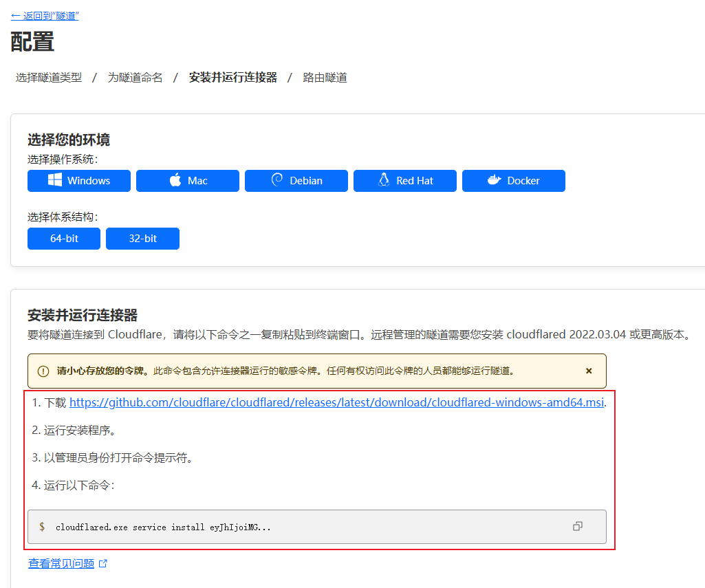

等待完成，在下面就可以看到自己的电脑了。

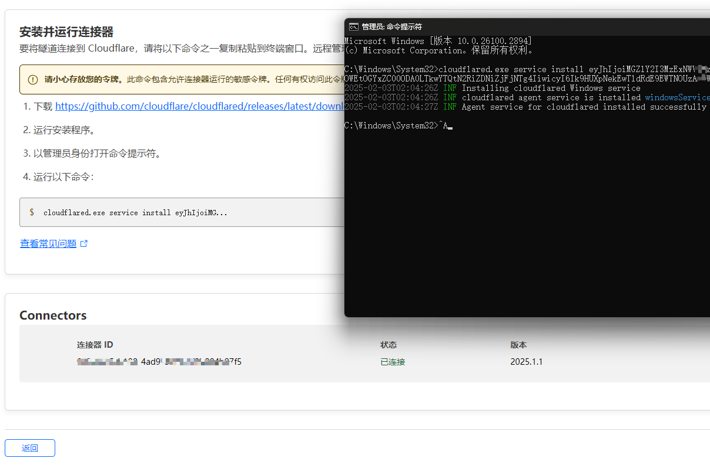

再添加一下你自己的子域名，就可以了。对了，域名是必须的，买一个，或者 NS 切为 cloudflare 应该也行。

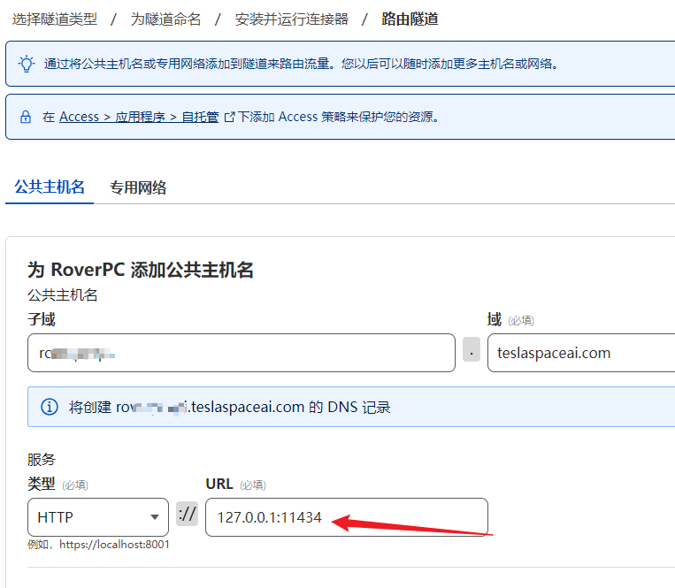

而内网的服务就是家用 PC 的 ollama 地址，使用本机的 localhost 或者 127.0.0.1 就可以，注意 11434 端口号。

搭建完毕后，使用域名访问一下 ollama 服务，可以看到已经正常访问了。

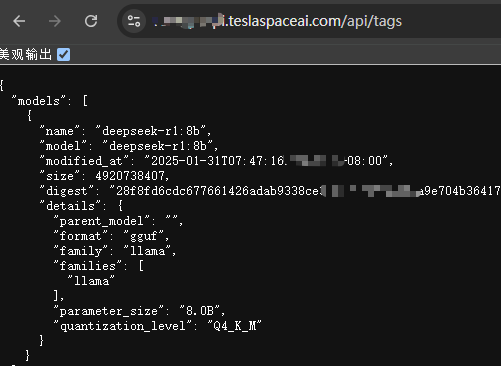

至此，隧道搭建完毕，一切完工，接下来测试看看吧。

## 测试DeepSeek大模型私服

为了测试这手搓的大模型私服，罗孚又在米国 VPS 上搭建了 NextChat，然后将自定义接口地址设置为上一步中的地址，就可以开始愉快的聊天了。

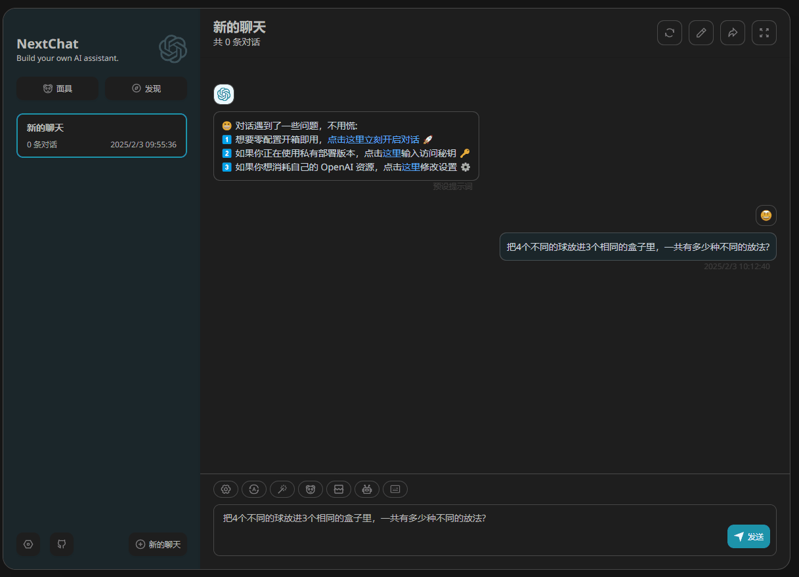

不过，速度确实不怎么样，而且 CPU 的负载也高的下不来。

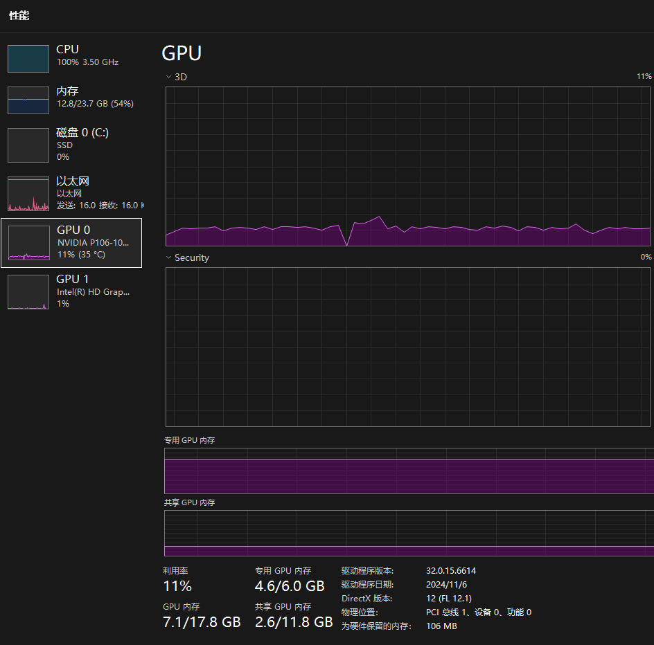

总的来说，也只能说：链路是通了。

## 最后的话

**使用家用 PC 和家庭宽带，低成本部署 DeepSeek 大模型并实现互联网访问，从技术方案上看完全可行。然而，距离真正达到完全可用的程度，还有很长的路要走。** 主要原因在于 **硬件配置的限制——4 代 i5 CPU 和 P106 显卡的性能难以支撑流畅的使用体验** 。此外， **7B 模型的“智力水平”大致相当于初高中生，与公开服务的大模型（通常为数百 B 参数）相比，差距依然显著** 。因此，对于个人 AI 爱好者来说，这种方案适合开发测试和娱乐尝鲜；如果考虑商用场景，还是建议直接接入官方提供的 API 服务，不仅价格实惠，还能省去诸多麻烦。大家对此有什么看法呢？欢迎留言分享你的想法！

附历史文章回顾：[百元 P106 显卡跑 7B 大模型，矿渣变 AI 神器，真香！](https://mp.weixin.qq.com/s/Y5JqGh_HCY2-LnyyZtvTBg)

---

> 作者: [RoverTang](https://rovertang.com)  
> URL: https://blog.rovertang.com/posts/ai/20250203-home-pc-broadband-low-cost-deployment-of-large-models/  

