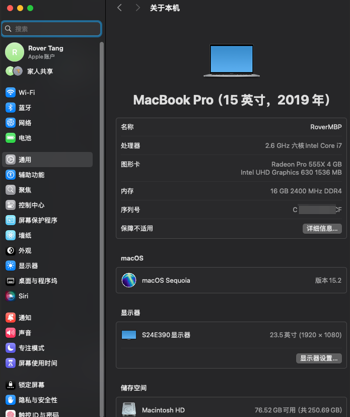
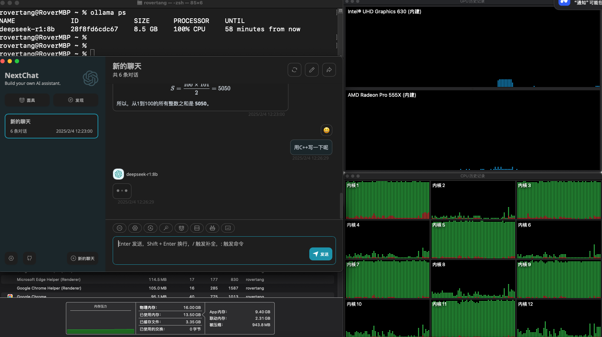
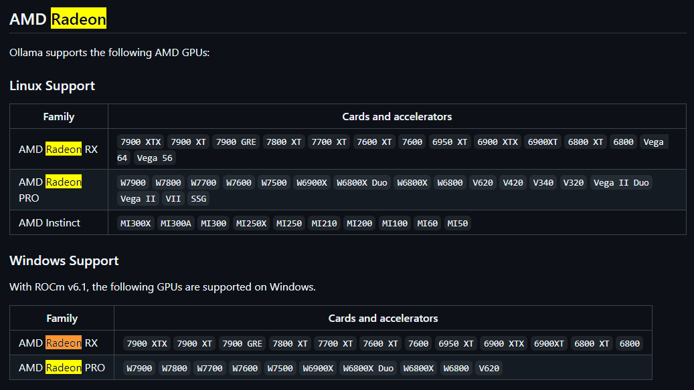
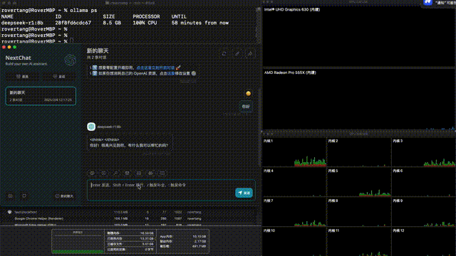
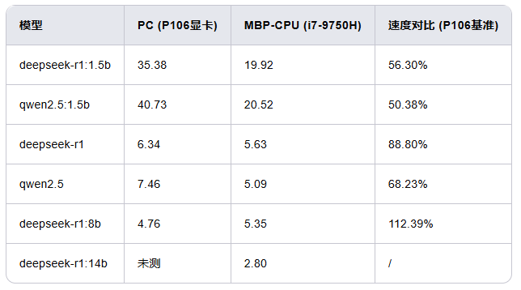
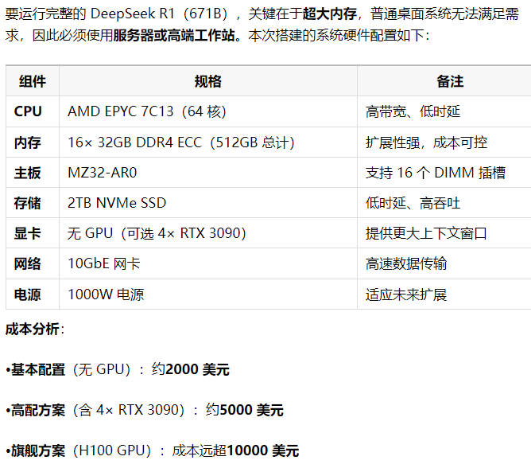

# Intel版MacBook用ollama跑大模型：显卡没用上，靠CPU硬扛。

自从用上了极致性价比的显卡([百元 P106 显卡跑 7B 大模型，矿渣变 AI 神器，真香！](https://mp.weixin.qq.com/s/Y5JqGh_HCY2-LnyyZtvTBg))跑大模型后，我就一直在想：MacBook 跑大模型是不是也可以呢？毕竟早年的 MacBook Pro 甚至配备了 4G 显存的显卡啊。于是，我翻出了家里吃灰的无头骑士(Intel 版 MacBook Pro)，尝试了一下大模型，个人的粗浅结论：**使用 ollama 跑大模型，只能靠 CPU 硬扛，自带的两块显卡都没有用上，至于速度，7B 及以下模型比百元 P106 显卡效果略差。**

## 2019 款 MacBook Pro 介绍

先介绍一下我从海鲜市场以 600 元价格淘来的 2019 款 MacBook Pro：

这是一次无意的购买，当时对无头骑士挺有兴趣，想买一台可以更换 NVME SSD 的无头骑士装 Windows 玩玩，结果阴差阳错入手了这台 2019 款 MBP，型号应该是 A1990，配置如下：

当时最大的顾虑是硬盘太小了，而且无法更换，内心有点不满意，有点不想买。但看到它搭载 **i7 的 CPU 以及 4G 显存的 AMD 显卡，以及 16GB 内存**，心想：算了，说不定以后可以用来跑跑大模型，于是就收了。

2019 款 MBP 自带两块显卡：独立显卡 Radeon Pro 555X 和集成显卡 Intel UHD Graphics 630，显存分别为 4GB 和 1.5GB，加起来能有 5.5GB，这和我那百元 P106 显卡的 6G 显存差不多啊，要是用来跑大模型，也许有得一拼吧。

## 跑大模型竟然没用上显卡

然而，我用 ollama 跑大模型时，惊讶地发现：**显卡竟然没用上，全靠 CPU 在跑。**

使用 ollama ps 命令可以看到，它 100% 使用 CPU，而从图形界面来看，i7 的 12 个内核有一半的内核在 100% 负载，而那两块显卡的使用情况，基本没有任何使用。

我心想：难道是我的使用方法不对？于是上网搜了一圈。

在 ollama 官方支持文档中，确实没有提到对 Radeon Pro 555X 显卡的支持：

具体的表格见：[https://github.com/ollama/ollama/blob/main/docs/gpu.md](https://github.com/ollama/ollama/blob/main/docs/gpu.md)，包含 nvidia 显卡的支持情况。

在 ollama 官方 github 中，也有人遇到了类似的问题：Support AMD GPUs on Intel Macs · Issue #1016 · ollama/ollama - [https://github.com/ollama/ollama/issues/1016](https://github.com/ollama/ollama/issues/1016)。似乎最终也没有解决。

国内也有类似的情况：【AIGC】Mac Intel 本地 LLM 部署经验汇总（CPU Only）_llm 部署 cpu 加载-CSDN 博客: [https://blog.csdn.net/kida_yuan/article/details/138819976](https://blog.csdn.net/kida_yuan/article/details/138819976)

最后，有人似乎解决了此问题：【AIGC】Mac Intel 本地 LLM 部署经验汇总（llama.cpp）: [https://blog.mvui.cn/detail/66770.html](https://blog.mvui.cn/detail/66770.html)。不过作者最终还是选择了纯 CPU 方案。

解决方案看上去使用的是 metal&#43;llama.cpp：MacOS Install with Metal GPU - llama-cpp-python: [https://llama-cpp-python.readthedocs.io/en/latest/install/macos/](https://llama-cpp-python.readthedocs.io/en/latest/install/macos/)

像我这样的菜鸟，估计没办法解决了，只能死心了：**Intel 版 MacBook 用 ollama 跑大模型，显卡没用上，只能靠 CPU 硬扛。**

## 对比测试输出 token 速度

虽然没用上 GPU 进行推理，但既然跑起来了，那就试试速度吧。

先简单肉眼看了一下输出：

看上去不算太慢。但为了严谨起见，我还是用数据来做对比吧。

测试方法很简单，通过 ollama 的 API 获取结果，从请求到输出完成，计算时间，同时获取 API 输出的 token 量，使用脚本来运行，获得类似如下信息：

&gt; 使用的模型: deepseek-r1
&gt; 
&gt; 输入的提示: 玄武门之变结束的当天，李世民在深夜写下一段独白，你觉得他会写什么？
&gt; 
&gt; 开始时间: 2025-02-10 21:56:55
&gt; 
&gt; 结束时间: 2025-02-10 21:58:49
&gt; 
&gt; 生成时间: 113.01 秒
&gt; 
&gt; 生成 token 数量: 636
&gt; 
&gt; 每秒生成 token 数量: 5.63

汇总后，**每秒生成 token 数量**对比结果如下：

从 1.5B 模型来看，P106 显卡快于 i7 CPU，在 7B 模型下差距缩小，8B 模型下，i7 CPU 输出反而更快。由于 14B 模型在 P106 显卡下未测试，所以无法给出进一步结论。

从表面上看，“参数更多的模型使用 CPU 推理输出 token 速度更快”似乎也不合理。所以，对于“使用大内存加使用 CPU 硬扛的方式跑 671B 大模型”的尝试，我有点犹豫了，虽然 2000 美金的配置看起来挺诱人的：

根据上面放按干，如果改用洋垃圾(Xeon E5&#43;R730 或 X99)来组装，应该可以省一半以上的钱，预计五六千就能搞定，不到一张 3090 显卡的钱就能跑满血 DeepSeek，想想就很激动啊。好吧，我得好好攒钱，争取早日组一台。

另外考虑到 Apple 的 M4 芯片算力更强，加上统一内存加持，我心想，是不是用 M4 的 CPU 方案来跑大模型也是一种方案？但一看 64GB 内存版本的 mac mini 得价格接近 2 万，这钱应该也能至少组一个甚至两个 3090 显卡的 PC 了。

## 最后的话

Intel版MacBook用ollama跑大模型，显卡没用上，只能靠CPU硬扛。如果改用llama.cpp等程序来跑大模型，应该可以将独立显卡利用起来。而通过输出token速度测试，侧面证明“使用CPU硬扛大模型”的方式也完全可行。

Intel版的mac测试到此为止，如果你有M芯片的Mac，也欢迎测试后和我同步数据。下次我分享一下测试脚本，下回见。

---

> 作者: [RoverTang](https://rovertang.com)  
> URL: https://blog.rovertang.com/posts/ai/20250212-intel-version-macbook-uses-ollama-to-run-large-models/  

