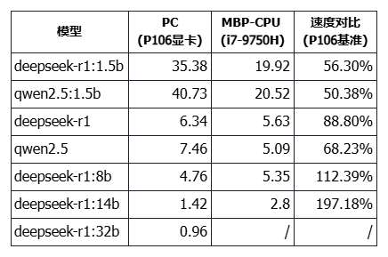
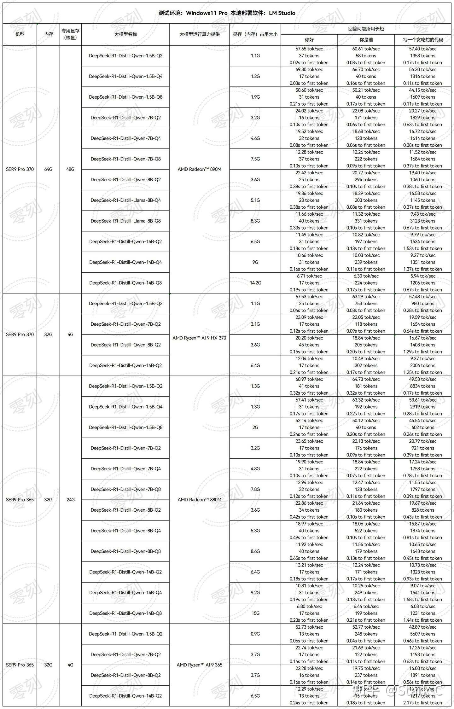

# 大模型token输出速度测试代码分享，来评估一下你的大模型性能吧！

本地部署大模型，最重要的体验就是输出速度，而输出速度仅仅用提问加计时的方式并不合适，因为不管问题相同或不相同，回答中的 token 数量会有差异，所以最终的计时虽然可以参考但并不准确并不直观。

实际上大模型的输出速度需要看**每秒输出 token 量，也就是所谓的 TPS(tokens per second)，或者写成 tokens/s** 。

## 大模型token输出速度测试代码和原理

如何获取具体的 token 输出速度，从单位看原理就比较简单，总 token 量和时间的比值，时间直接用开始时间和结束时间的差值，而一次请求返回的 token 量实际是可以通过 API 获得的。

ollama 的官方文档(API 参考 - Ollama 中文文档: [https://ollama.readthedocs.io/api/#generate-a-completion](https://ollama.readthedocs.io/api/#generate-a-completion))中就有相关的说明：**要计算响应生成的速度（以每秒令牌数为单位），请使用公式：eval_count / eval_duration * 10^9。**

好了，让 DeepSeek 帮代劳写一下 python 脚本吧。我稍微调整了一下，最终的输出：

```python
import requests
import time

# ollama 的 API 地址
OLLAMA_API_URL = &#34;http://localhost:11434/api/generate&#34;

# 请求参数
payload = {
    &#34;model&#34;: &#34;deepseek-r1:1.5b&#34;,  # 替换为你的模型名称
    &#34;prompt&#34;: &#34;玄武门之变结束的当天，李世民在深夜写下一段独白，你觉得他会写什么？&#34;,  # 替换为你的输入文本
    &#34;stream&#34;: False,  # 设置为 False，一次性返回完整结果
    &#34;max_tokens&#34;: 100  # 设置生成的最大 token 数量
}

# 打印 model 和 prompt 信息
print(f&#34;使用的模型: {payload[&#39;model&#39;]}&#34;)
print(f&#34;输入的提示: {payload[&#39;prompt&#39;]}&#34;)

# 记录开始时间
start_time = time.time()
print(f&#34;开始时间: {time.strftime(&#39;%Y-%m-%d %H:%M:%S&#39;, time.localtime(start_time))}&#34;)

# 发送请求
response = requests.post(OLLAMA_API_URL, json=payload)

# 记录结束时间
end_time = time.time()
print(f&#34;结束时间: {time.strftime(&#39;%Y-%m-%d %H:%M:%S&#39;, time.localtime(end_time))}&#34;)

# 解析响应
if response.status_code == 200:
    result = response.json()
    # print(result)
    generated_text = result.get(&#34;response&#34;, &#34;&#34;)
    generated_tokens = result.get(&#34;eval_count&#34;, 0)  # 获取生成的 token 数量
    elapsed_time = end_time - start_time

    # 计算每秒生成的 token 数量
    tokens_per_second = generated_tokens / elapsed_time

    print(f&#34;生成时间: {elapsed_time:.2f}秒&#34;)
    print(f&#34;生成 token 数量: {generated_tokens}&#34;)
    print(f&#34;每秒生成 token 数量: {tokens_per_second:.2f}&#34;)
else:
    print(f&#34;请求失败，状态码: {response.status_code}&#34;)
    print(f&#34;错误信息: {response.text}&#34;)
```

注意：主要修改上面的 model 和 prompt，也就是模型和问题。

建议：ollama run 后进行测试，而不要在没启动的情况下测试，尽量保证相同测试场景，包括问题也尽量一样。

当然，这段代码实际上很糙，没有区分请求、响应等，直接用了发起请求和结束请求的时间，如果需要细化分析，也可以根据参数改进。相关参数：

&gt; total_duration：生成响应所花费的时间 
&gt; 
&gt; load_duration：加载模型所花费的时间（纳秒） 
&gt; 
&gt; prompt_eval_count：提示中的令牌数 
&gt; 
&gt; prompt_eval_duration：评估提示所花费的时间（纳秒） 
&gt; 
&gt; eval_count：响应中的令牌数 
&gt; 
&gt; eval_duration：生成响应所花费的时间（纳秒） 
&gt; 
&gt; context：用于此响应的对话编码，可以在下一个请求中发送以保持对话记忆 
&gt; 
&gt; response：如果响应是流式的，则为空；如果不是流式的，将包含完整的响应 

如果能加上模型批量自动化当然就更好了，有兴趣的同学可以继续改进一下，记得分享一份给我。

## 大模型输出速度实测 

我也测试了我手上的设备，装有 P106 显卡的 PC 和 2019 款 Intel 版 MBP，具体配置可以看我前面的文章：

P106 显卡的 PC：[百元 P106 显卡跑 7B 大模型，矿渣变 AI 神器，真香！](https://mp.weixin.qq.com/s/Y5JqGh_HCY2-LnyyZtvTBg)

2019 款 Intel 版 MBP：[Intel 版 MacBook 用 ollama 跑大模型：显卡没用上，靠 CPU 硬扛。](https://mp.weixin.qq.com/s/YeaNF7mT1wTZtUJ1tUZSdA)

今日补了 14B 和 32B 模型的测试数据，汇总后信息如下：



其中 32B 在 16G 的 MBP 上无法运行，只好放弃。

表面上看模型越大，使用纯 CPU 的推理速度越快。但想想就觉得很扯，这种配置之下，应该没有太大的参考价值。

如果一定要有一个结论，就是：**普通电脑跑 7B 模型问题不大，不管用 CPU 还是 GPU，都不算太慢，想速度快就改用 1.5B 的，主要用来测试流程而不是效果。** 但 7B 的智商怎能和 70B 相比？更不用说满血的 671B 相比了。

顺便在 2012 款 Mac Mini 上跑了 1.5B 模型试试：

&gt; 使用的模型: deepseek-r1:1.5b 
&gt; 
&gt; 输入的提示: 玄武门之变结束的当天，李世民在深夜写下一段独白，你觉得他会写什么？ 
&gt; 
&gt; 开始时间: 2025-02-16 15:54:29 
&gt; 
&gt; 结束时间: 2025-02-16 15:54:47 
&gt; 
&gt; 生成时间: 18.96 秒 
&gt; 
&gt; 生成 token 数量: 84 
&gt; 
&gt; 每秒生成 token 数量: 4.43 

Intel Core i5-3210M 2.50GHz 的 CPU，这么差的 CPU 也是能跑通流程的哦，只是不忍直视。

最后来一张个人觉得做的非常好的输出速度测试图，数据完整，设备性能看上去也很不错：



_(来源：零刻 SER9 Pro HX370 与 AI 365 本地部署 deepseek-R1 大模型性能对比 __[https://zhuanlan.zhihu.com/p/23898680586](https://zhuanlan.zhihu.com/p/23898680586)__)_

不确定是不是官方做的图，但这图确实做的比较全面了。

最近在看纯 CPU 跑 70B 大模型的方案，如果有方案也能做出如此详细的表格来，大家也就比较容易选择了。大家有推荐的方案吗？下次可以就这个话题继续聊聊。

好了，大模型 token 输出速度测试代码已经分享完毕，我的渣渣设备也给你看了，要不屏幕前的你，用你的设备也来跑个分？期待啊！


---

> 作者: [RoverTang](https://rovertang.com)  
> URL: https://blog.rovertang.com/posts/ai/20250216-share-the-code-for-testing-the-output-speed-of-the-big-model-token/  

