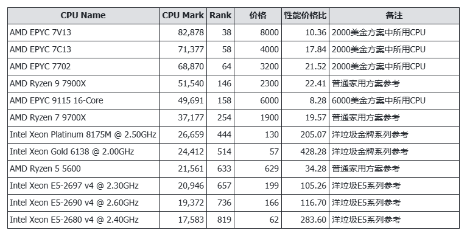
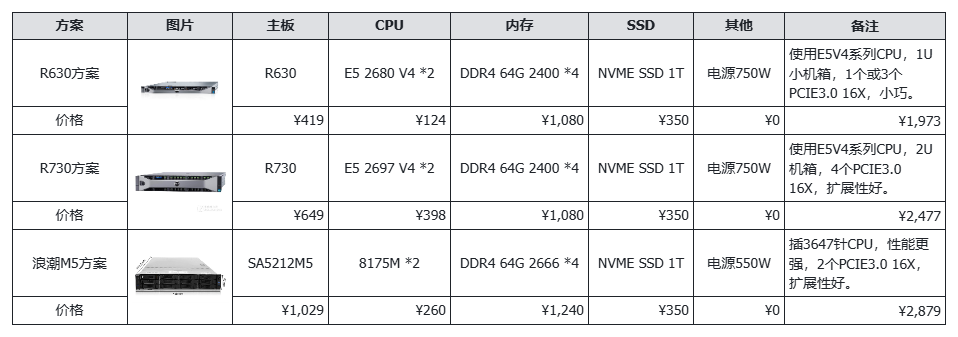
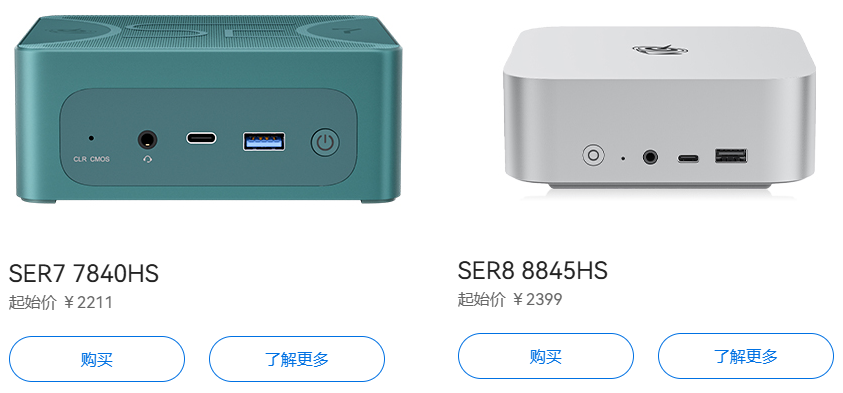
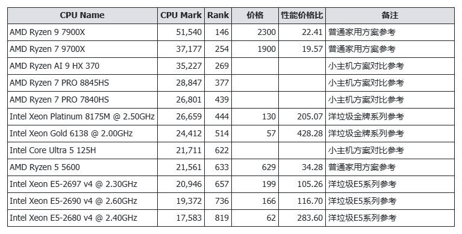
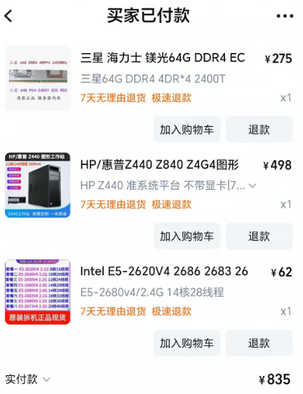
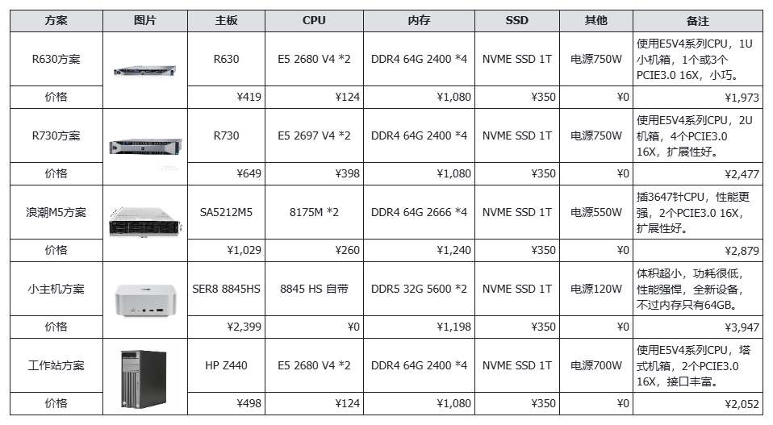

# 70B大模型本地部署的性价比探索：一两千组个纯CPU推理的服务器

大模型的昂贵部署成本一直是行业的痛点，尤其是高性能显卡的需求，让许多个人开发者望而却步。然而，随着像 DeepSeek-R1 这样的大模型的出现，纯 CPU 推理方案逐渐浮出水面，为低成本部署带来了新的希望。

如果采用纯 CPU 方案来运行大模型，成本有望大幅降低。毕竟，CPU 和内存的价格远低于大显存显卡。对于个人开发者而言，运行较小的 7B 模型可能轻而易举，但其性能和智力水平相对有限。而直接运行满血版的 671B 模型，似乎又有些“杀鸡用牛刀”，使用 API 调用显然更为简单、高效且经济。

因此，我提出了一个折中的方案：**花费一两千元搭建一台服务器，采用纯 CPU 推理方案运行 70B 大模型。这样的配置既能满足智力水平的需求，速度也不会太慢，性价比相当不错。**

## 纯 CPU 推理部署满血 617B 大模型方案参考

最早关于纯 CPU 运行满血版 DeepSeek 的方案，分别来自两篇报道：

2000 刀跑满血 DeepSeek，3.5~4.25TPS：How To Run Deepseek R1 671b Fully Locally On a $2000 EPYC Server [https://digitalspaceport.com/how-to-run-deepseek-r1-671b-fully-locally-on-2000-epyc-rig/](https://digitalspaceport.com/how-to-run-deepseek-r1-671b-fully-locally-on-2000-epyc-rig/)

6000 刀跑满血 DeepSeek，6~8TPS：Way to run DeepSeek&#39;s 671B AI model without expensive GPUs discovered [https://www.notebookcheck.net/Way-to-run-DeepSeek-s-671B-AI-model-without-expensive-GPUs-discovered.956421.0.html](https://www.notebookcheck.net/Way-to-run-DeepSeek-s-671B-AI-model-without-expensive-GPUs-discovered.956421.0.html)

2000 美元方案：AMD EPYC 7702 &#43; 512GB DDR4 2400。可选升级 7C13/7V13 &#43; 1TB DDR4 2400，建议使用 3200 频率内存。

6000 美元方案：2x AMD EPYC 9004/9005 &#43; 768GB DDR5。建议使用 9115 或 9015 型号 CPU。

这些方案虽然极具启发性，但高昂的 CPU 价格让我望而却步。例如，某些 CPU 价格高达八千元，显然超出了我的预算。不过，这些方案也激发了我寻找更经济实惠的替代方案。

后来在知乎上看到改良的国内版本：盘点本地部署满血 deepseek-r1 的各种硬件配置方案 #1 - 知乎: [https://zhuanlan.zhihu.com/p/23820116677](https://zhuanlan.zhihu.com/p/23820116677)，但最终三万左右的价格，还是让人退缩了。

我相信一定有更低成本的方案，毕竟如果仅考虑搞定 70B 大模型，那整体性能要求应该也可以适当降低一些。

## 部署纯 CPU 推理 70B 大模型方案的思考

理论上，只要 CPU 性能强劲且内存充足，运行 70B 大模型并非难事。70B 模型的文件大小通常在 40~50GB 之间，虽然理论上 64GB 内存即可满足需求，但根据网络经验，需要 256GB 内存才能稳定运行。

从内存角度来看，单条内存成本并不高，但总体积较大时，成本会显著上升。目前可选的内存类型包括 DDR5 和 DDR4。DDR5 64GB 内存价格约为 1300 元，256GB 总价需约 5 千元。相比之下，DDR4 64GB ECC 服务器内存价格不到 300 元，虽然频率低一些，但性价比极高。

在 CPU 选择方面，如果选择普通 PC，AMD Ryzen 9950X 价格高达 4 千元，而 9700 也要 2 千元，且无法支持服务器内存。因此，我考虑了二手的 E5 系列或金牌系列服务器 CPU，这些“洋垃圾”在性能和价格上更具优势。

为了更直观地比较，我从 PassMark 网站下载了 CPU Benchmark 数据，并根据性能价格比进行了筛选，部分结果如下：

如果抛开价格，选择家用 AMD 系列 CPU，性能出色，应该是不二之选。但如果细看价格，E5 和金牌系列的“洋垃圾”CPU 无疑是最佳选择。

基于上述 CPU 和内存分析，我们尝试组一个洋垃圾服务器方案吧。

## 纯 CPU 推理 70B 大模型服务器选型参考

我一直以为服务器价格高昂，但当我看到戴尔 R630 和 R730 的二手价格时，才发现服务器准系统仅需数百元，自带 750W 电源。如果自行购买主板、风扇、机箱和电源，成本可能接近千元。

基于此思路，我简单组了 3 个廉价服务器方案：

如果只用 64GB 内存，那这些方案均能符合“一两千元搭建服务器”的原则，即便是 256GB 内存也仅仅两三千元。

然而，我最终没有选择这些方案，原因主要有两点：

1. **噪音问题：** 服务器的高转速风扇会产生较大噪音，不适合在家中使用，除非家里有足够的空间可以单独放置。
2. **功耗问题：** 服务器的功耗较高，每天消耗约 6 度电，一年电费超过千元，这几乎可以再购买一台服务器了。

此外，1U 和 2U 机箱虽然可以靠墙放置，但体积仍然较大，摆放不便，这也是需要考虑的因素。

如果这些设备用于公司，且有机房可以防止，那么这方案将是一个不错的选择。

## 高性能小主机方案参考

由于服务器在噪音、功耗和体积方面不适合家用，我转向了更小巧、低功耗的小主机。

Mac mini 无疑是小主机的佼佼者，但将内存提升到 64GB 的成本过高，预计需花费两万元。

因此，我将目光投向了国内品牌零刻。其 SER7 和 SER8 型号不带硬盘和内存的价格 2000 元出头，加上 64GB 内存和 1TB SSD，总价预计在 4000 元以内。

特别说明，零刻小主机的 CPU 性能并不逊色，具体性能对比如下：

当然，这是在单路 CPU 比较的情况下。如果服务器采用双路 CPU，性能确实会远超小主机。

零刻小主机的性能更强，采用 DDR5 内存，带宽更高，功耗更低，且为全新设备，这些确实也是心动选择的理由，但其内存插槽和 M.2 硬盘接口数量有限，内存扩容受限，且使用 SATA 硬盘不太方便，似乎也有槽点。

于是，我考虑更换为具有一定扩展性的 HP 800 GX SFF 小主机。虽然体积比零刻稍大，但支持更多内存插槽，而且自带 M.2 和 SATA 接口，看上去不错，但这样的小主机也不便宜，CPU、内存等因素叠加，实际比服务器方案要贵不少，这种高不成低不就的方案，还是算了吧。

## 千元工作站方案参考

最终，我没有选择服务器，也没有选择小主机，而是选择了工作站，算是折中方案了。主要基于以下几点考虑：

1. **价格优势 ** 

工作站与服务器的硬件配置相似，价格也较为接近，相比小主机便宜很多。

1. **性能依然出色** 

工作站也有支持双路 CPU 的主板，但我综合价格之后选择了单路，虽然连小主机都比不过，但比我老 PC 的 4690 CPU 性能要高 3 倍以上，也足够出色了。

1. **可扩展性强**

支持两块显卡插槽，自带 SATA 接口，8 根内存插槽，还有 PCIe 8x 和 4x 接口，可以通过转接使用 NVMe 硬盘。

1. **功耗可以接受**

据网络数据，工作站功耗约为 40~50 瓦，我预估为 60 瓦，每天消耗约 1.5 度电，相比服务器节省不少电费，一年也就两三百，不够开一个月的踢脚线取暖器。

1. **噪音适中**

相比服务器的高转速风扇，工作站的风扇转速较低，噪音水平与普通 PC 相当，不会对家庭环境造成太大影响。

1. **体积合适**

工作站体积虽大，但比 1U 和 2U 服务器小很多，如果没有合适的位置放置，可以考虑当作小板凳使用嘛。

既然考虑已周全，那就果断下单一台吧：

家里本身有 PCIe 转接 NVMe 硬盘，剩下 300 多元 SSD 钱，内存先玩 64GB，后续考虑升级到 256GB。所以综合下来当前价格在 1200 元以内，即便我再给加一块 P106-100 显卡([百元 P106 显卡跑 7B 大模型，矿渣变 AI 神器，真香！](https://mp.weixin.qq.com/s/Y5JqGh_HCY2-LnyyZtvTBg))，也没超过 1500 元，感觉挺香的。

## 最后的话

汇总上述几种方案的对比：

**通过对比服务器、小主机和工作站的优缺点，我发现一两千元搭建一台使用纯 CPU 推理 70B 大模型的服务器是完全可行的，性能不差，内存充足，总体很强大。这种方案适用于个人做大模型研究，也适合作为家庭多开服务器。总的来说，这是一个性价比极高的方案。**

等我拿到设备后，我会测试 70B 大模型的运行速度，并与大家分享测试结果。

个人对服务器、CPU 等了解不多，本文仅仅觉得低成本服务器方案挺香，所以同大家分享，你是否有更好的方案推荐呢？欢迎留言告诉我。

---

> 作者: [RoverTang](https://rovertang.com)  
> URL: https://blog.rovertang.com/posts/ai/20250223-cost-effectiveness-exploration-of-local-deployment-of-70b-large-model/  

