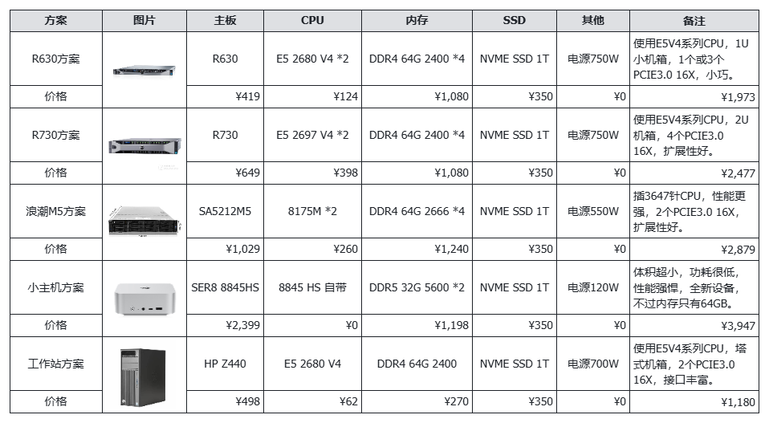
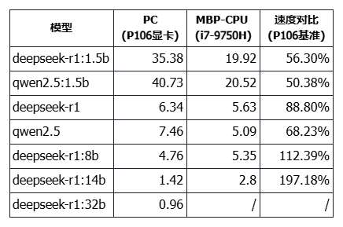
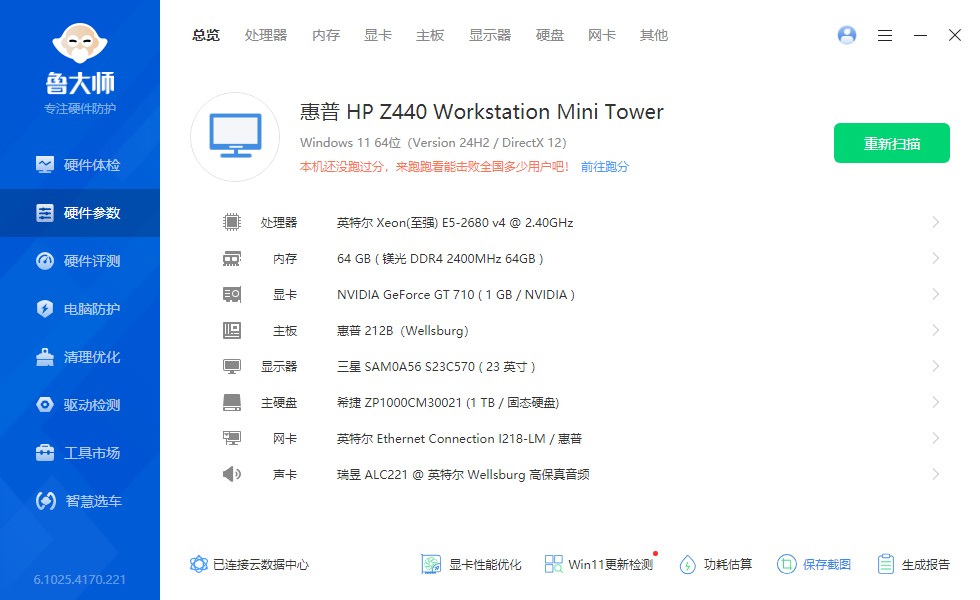
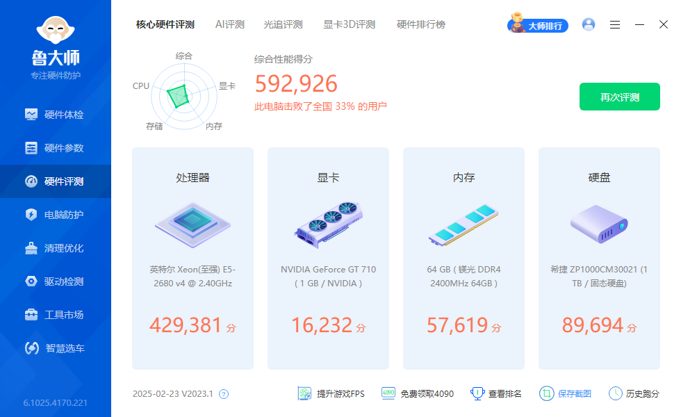
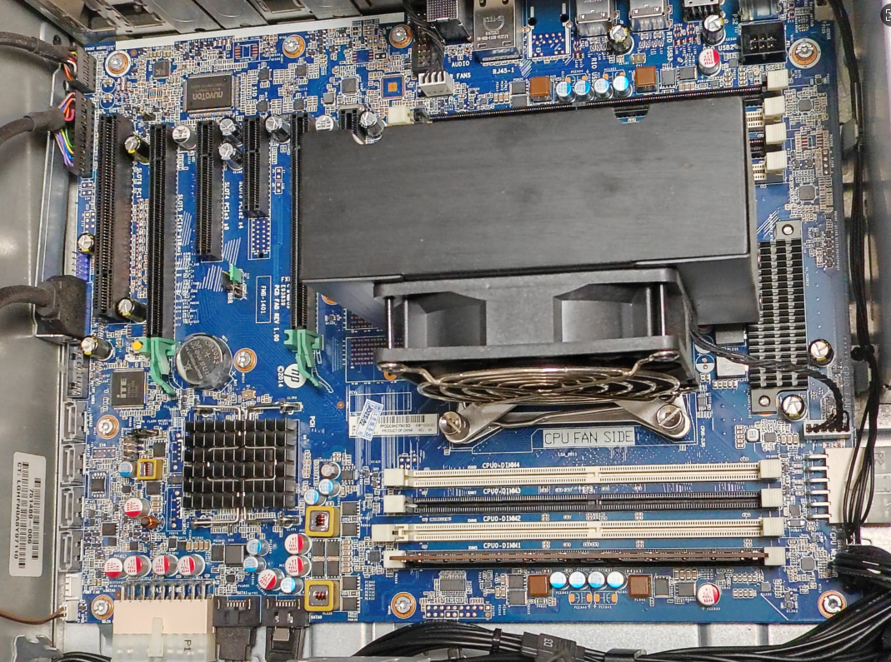
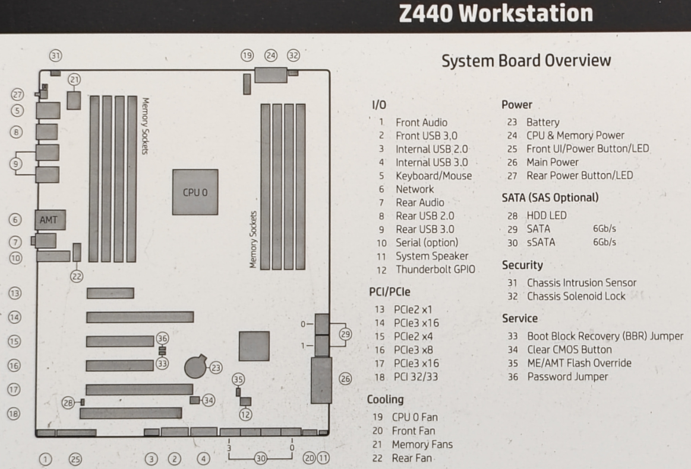
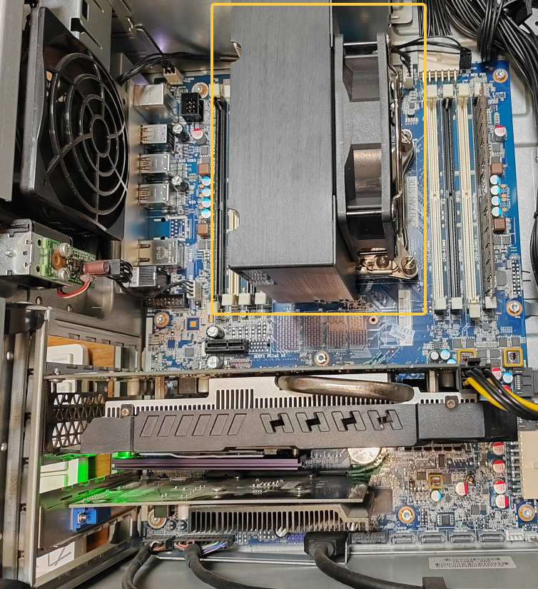
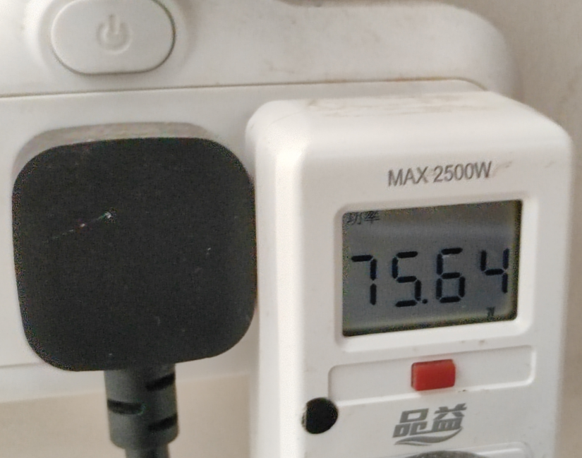

# 纯CPU推理大模型服务器翻车了

上一篇“[70B 大模型本地部署的性价比探索：一两千组个纯 CPU 推理的服务器](https://mp.weixin.qq.com/s/UyW9eoHorOr55hQJSBICYQ)”中，我满怀期待地分享了我的计划——用一两千块钱搭建一台纯 CPU 推理服务器，运行 70B 大模型。毕竟在没有显卡的情况下，这似乎是最低成本的选择。然而，很不幸，结果翻车了。

## 翻车现象

如果想了解具体的配置，可以参考原文，这里我重新贴一下配置图，顺便修复原文中图片的错误：

我尝试的是工作站方案（上图最底下），总价仅 1200 元：搭载一颗 E5 2680 V4 CPU、64GB DDR4 2400 内存和 1TB SSD。

我没有整理详细的数据，简单来说，这台工作站的性能和我在“[百元 P106 显卡跑 7B 大模型，矿渣变 AI 神器，真香！](https://mp.weixin.qq.com/s/Y5JqGh_HCY2-LnyyZtvTBg)”一文中所用的 PC 速度相差无几。那台 PC 的速度如下：

数据来源：[大模型 token 输出速度测试代码分享，来评估一下你的大模型性能吧！](https://mp.weixin.qq.com/s/9INIbrYNi4XOw4BM9oGsLA)

工作站的实测情况如下：32B 模型的推理速度为 0.82 tokens/s，14B 模型为 1.54 tokens/s。和上图中那台老古董 PC 加 P106 显卡相比几乎没有差别。如果给工作站加一块 P106 显卡，速度也差不多：32B 模型为 0.88 tokens/s，14B 模型为 1.90 tokens/s。

工作站的表现如下：大模型完全加载到内存中，64GB 内存足够装下，CPU 占用率大概在 80%~90%，电源功率也基本满载。在有 P106 显卡的情况下，跑大模型时功率可以达到 150 瓦，还是很高的。

**总的来说，推理速度远低于预期，甚至无法达到最基本的要求。我原本以为这台服务器是“性价比神器”，现在看来彻底翻车了。**

## 翻车原因

主要原因有二：CPU 指令集和内存带宽。

### CPU 指令集的局限性

我选择的 E5 2680 V4 CPU 虽然是一款性能强劲的服务器处理器，但确实太老了。它缺少一些现代大模型推理所需的高级指令集。AVX-512 这样的指令集在加速矩阵运算和深度学习任务中起着至关重要的作用，而 E5 2680 V4 仅支持 AVX2。这使得它在处理大模型推理任务时显得力不从心。尽管它拥有多个核心和线程，但缺乏对高级指令集的支持，导致计算效率大幅降低。

在本文开头的方案图中，第三个方案使用了 Intel Xeon Platinum 8175M @ 2.50GHz CPU，根据官方 CPU 规格描述，其指令集扩展为：Intel® SSE4.2, Intel® AVX, Intel® AVX2, Intel® AVX-512，说明是包含 AVX-512 指令集的。我本应该用这样的方案来测试，而不是选择最廉价的方案。等我把当前服务器处理掉后再考虑吧。

### DDR4 内存带宽的瓶颈

在大模型推理中，内存带宽直接影响数据的读取和写入速度。DDR4 内存的带宽不足，使得数据传输成为瓶颈，进而拖慢了整个推理过程。即使内存容量足够，但带宽的限制仍然无法满足大模型对数据传输效率的要求。

根据相关评测，DDR5 内存的带宽相比 DDR4 有显著提升。例如，DDR5-4800MHz 内存相比 DDR4-3200MHz 内存，在 AIDA64 内存拷贝测试中性能提升了接近 1.45 倍。此外，DDR5 内存的双通道设计和更低的工作电压（1.1V），也进一步提高了数据传输效率。

这次翻车让我深刻认识到，技术选型不能仅仅依赖于价格和理论性能，更要结合实际应用场景和任务需求。E5 2680 V4 虽然在传统服务器任务中表现出色，但在大模型推理这种对计算和内存带宽要求极高的任务中，它的局限性被充分暴露出来。即使看似强大的 CPU 和内存，也可能因为缺乏某些关键特性而无法胜任。这样的翻车就成了必然。

## Z440 工作站介绍

虽然翻车了，但不管怎么说，这也是一台服务器，性能也不算太差。我想了一些再次利用的办法。我先简单介绍一下这台工作站。

### 总体特点

1. HP 品牌机，原生 X99 主板，做工没话说。
2. 支持 E5 2600 V4 CPU：价格便宜啊，100 以内就可以搞定，100 以上的更好一些。
3. 8 根 DDR4 内存插槽，装服务器内存便宜。
4. 支持 PCI-E 转 M.2 的 SSD，有 6 个 SATA 口，足够用了，做 NAS 存储也够用了。
5. 5 个 PCI-E 插槽，其中 2 个 PCI-E 3.0 x16，后续可以加装显卡。
6. 700W 电源，不装大功率显卡基本足够用了。
7. 无尘机房下来的设备，外壳无磕碰，主板光亮，略有灰尘，新的以为没用过。
8. 价格便宜：不到 500 元。

上述特点可以找到一些**优点：性价比高、性能不错、内存可扩展、可以插两块显卡、大电源等等。**

详细配置信息：

鲁大师跑分：

几乎无尘的主板：

主板图：

### 非常静音

原本以为会和服务器一样吵，但实际情况并没有，非常静音，比我 PC 还静音。

风扇非常静音，所以几乎没有声音，和小主机都没差别。如果安装了显卡，就不一定了，显卡的声音比 CPU 的风扇要大。

静音非常重要，我原有一台工控机，有小 CPU 风扇在转，但晚上就是觉得声音大，最后就被我扔那吃灰了。

### 80W 功耗 OK

整机正常工作时，功耗在 80W，这是一个非常可以接受的功耗了。

我的 PC 大约 50W 功耗，工控机 30W 功耗，而 2019 款 MacBook Pro 竟然要 90W 功耗。相比之下，80W 就是一个非常可以接受的数字了。

毕竟工作站的性能上 PVE 后装 2 个 Windows&#43;2 个 Ubuntu 一点问题都没有，NAS 也随便装，一机多用的情况下，80W 功耗就一点也不高了。

如果直接装个 Windows 当成普通 PC 用，开启睡眠后，在睡眠状态下只要 2W 的功率，这是内存在耗电，这点电可以忽略不计，而滑动鼠标或敲击键盘就能立刻唤醒，常年不关机使用也是一种不错的选择。

总体来说，从性能、价格、功耗、静音等角度来看，这台工作站都非常令人满意，仅仅从服务器或 PC 的角度，非常具有性价比。

## 服务器的后路

后路无外乎两条：作为服务器，或者加装显卡。

### 家庭服务器

纯 CPU 推理大模型服务器翻车后，虽然不能给大模型用了，但作为家庭服务器应该是绰绰有余的。于是装上 PVE，然后虚拟了 2 个 Windows 和 2 个 Ubuntu，作为家里的普通家用以及文件服务器，挺好的。但最后显卡直通一直没成功，于是放弃了，安装 Windows 以后作为普通 PC 使用吧。

开启 Windows 的睡眠功能，10 分钟后自动进入 2W 功耗模式，需要使用时随时鼠标键盘唤醒，使用体验还不错，更节省了不少电费。

### GPU 推理服务器

既然 CPU 推理服务器翻车了，但由于主板配备了两个 PCIe x16 插槽，我完全可以购买两块 24G 显存的显卡，将其改造成 GPU 推理服务器。这不仅能够充分利用现有的硬件资源，还能为未来的大模型推理任务提供更强大的支持。即便只安装一块显卡，也是可以考虑的方案，用来作为打游戏的 PC 应该也是不错的选择。

## 写在最后

这次纯 CPU 推理大模型服务器的翻车经历，让我对硬件选型有了更深刻的理解。虽然 E5 2680 V4 和 DDR4 内存的组合在某些场景下仍然有其价值，但在大模型推理领域，它们显然不是最佳选择。未来，我会更加谨慎地选择硬件，确保它们能够满足任务的实际需求。

如果你也在探索大模型的本地部署，希望我的这次翻车经历能给你带来一些启示。在追求性价比的同时，千万不要忽视硬件的关键特性。毕竟，技术选型的最终目标是实现高效、可靠的运行，而不是单纯地追求低价。

希望我的故事能让你少走一些弯路，也期待你在探索的道路上取得更好的成果，如有高性价比的纯 CPU 推理方案也欢迎交流:)

---

> 作者: [RoverTang](https://rovertang.com)  
> URL: https://blog.rovertang.com/posts/ai/20250308-the-pure-cpu-inference-large-model-server-crashed/  

