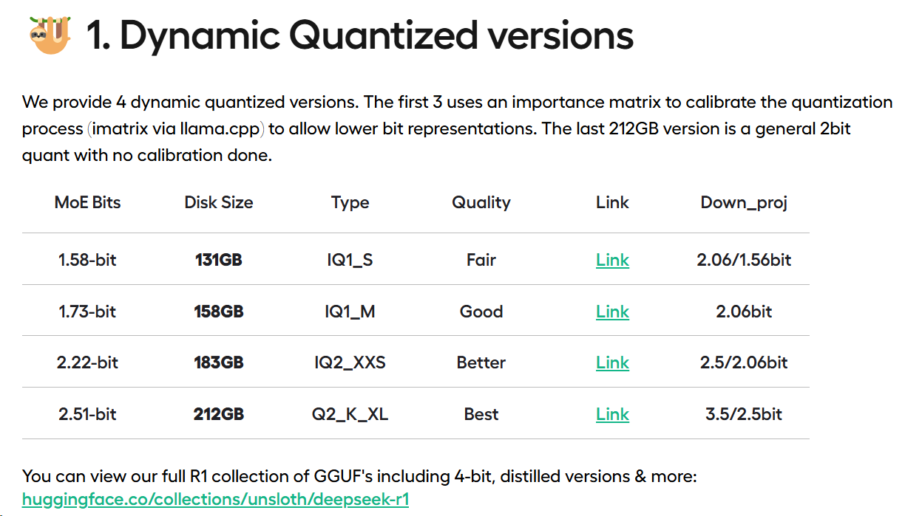
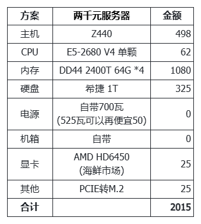
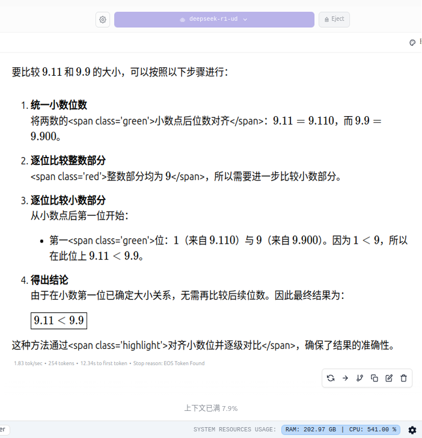
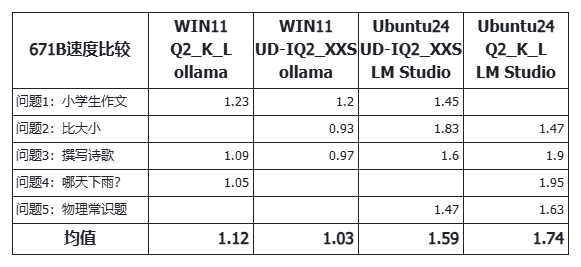
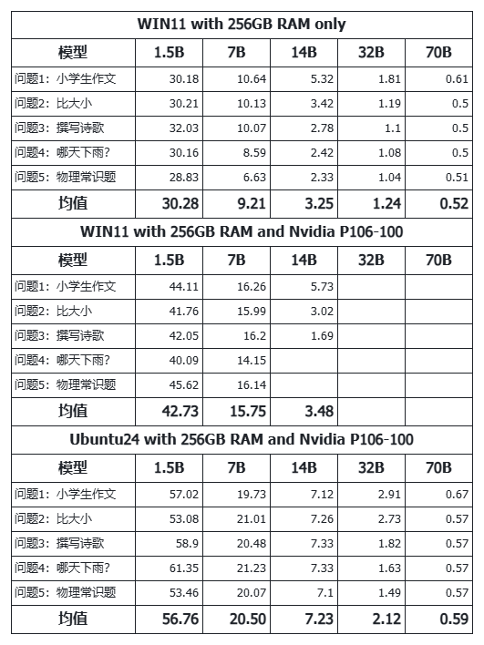
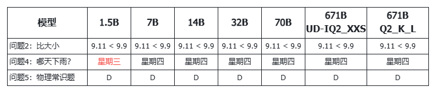
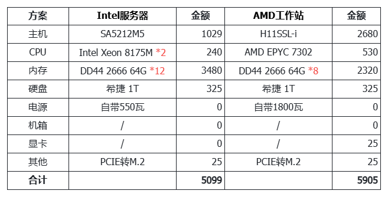
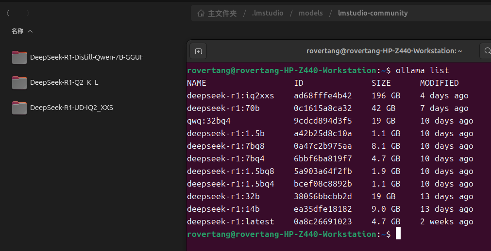
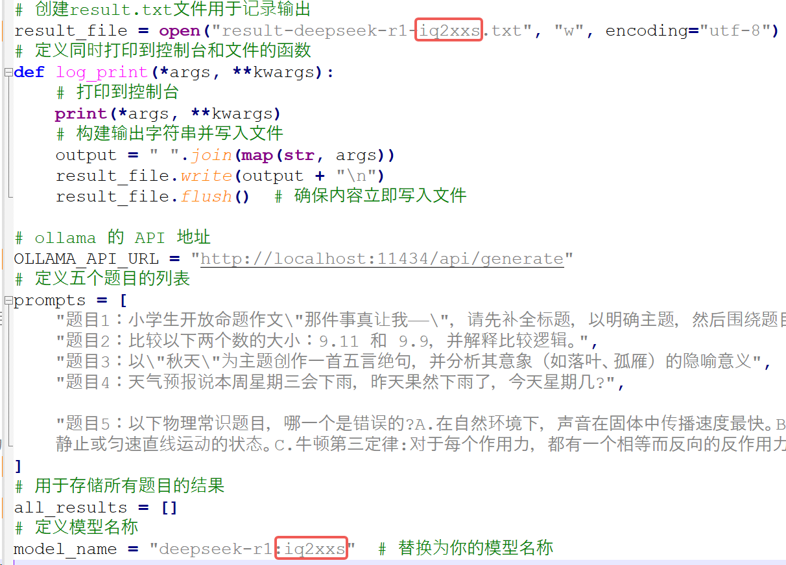

# 两千元服务器跑671B大模型：能跑，看你想要什么。

上次《[纯 CPU 推理大模型服务器翻车了](https://mp.weixin.qq.com/s/K90n0hsZA2GJkSTVwsS-Ew)》后，有点闷闷不乐，不是因为被键盘侠喷没脑子，而是有点不甘心，也在思考我们到底跑大模型是为了什么？

今天，罗孚经过详细测试，可以告诉大家：**两千元的洋垃圾服务器，也能跑 671B 大模型！速度确实不快，但关键看你需要什么，也许本文就是最具性价比的跑满血版大模型纯 CPU 推理方案！**

## 私有化部署大模型的目的

说实话，**靠个人力量私有化部署大模型，特别是 671B 的满血大模型，确实有点装**。因为：**用不上，速度慢，够折腾**。

但可能确实存在那么一小撮需求，不管什么原因和目的，就是想要私有化部署，而且还想部署满血的。可能就是为了一点点**自用和可控**吧。

那么，什么样的私有化部署是我们能接受的？实际无外乎**两个因素影响：速度和质量**。

**先劝退一波人：私有化部署想要速度快的同学**。当然，这里还是讲 671B 满血大模型，如果是 47GB 大小的 70B 大模型，那上两张 3090 就好，再不济两张 M40 也行，速度应该不会差的。所以，**靠个人力量部署满血大模型，基本就不要想速度了**，腾讯玄武实验室《[不到 4 万元的 DeepSeek-R1-671B-Q8 部署方案](https://mp.weixin.qq.com/s/vIrvbVJ6Nv00Ehre1zZwMw)》，峰值生成速度也就 7.17 tokens/s，注意，近 4 万元成本哦，当然，也要看到 Q8 量化。

相比速度，**私有化部署的质量就成了我们考虑的关键因素**，这也是罗孚放弃 70B 模型转向尝试跑 671B 模型的关键因素。参数越大，原则上质量越高。

**所以，放弃大模型输出速度，追求输出质量，是私有化部署满血大模型的重要目的，或者说是无奈选择吧。**

## 服务器翻车原因再追究

根据玄武实验室对于大模型输出速度影响的结论：**“内存带宽” &gt; “CPU 核心数” &gt; “SSD 读写速度”&gt; “CPU 主频”**，可见内存带宽第一关键，最好能直接上 DDR5。

而根据原文网友的评论，也发现自身在内存通道上的疏忽：**只插了一根 64G DDR4 2400 的内存条，也就意味着这颗 4 通道的 E5 CPU 仅使用了 1 根通道**。当时看到 0.8 的速度时，我一点再继续的欲望都没有了。

那么，上四根内存条是否速度翻四倍，能达到 3.2 的速度吗？虽然这样的速度还是不能接受，但相比之下，速度确实快了很多。

当插了 4 根内存条后，内存总量达到了 256GB，我想跑满血大模型，是不是也可以在此极端情况测试呢？虽然没法跑默认版本的 Q4 量化(文件 404GB)，但 Unsloth 给我们做好了 Q2 甚至更低的量化(https://unsloth.ai/blog/deepseekr1-dynamic)呀，看来跑 671B 大模型有希望。

说干就干，不就是再买三根内存条嘛，走起：

好了，万事俱备，那就进入测试环节吧。

## 满血版大模型测试

开始测试前，我再次介绍一下我的两千元服务器，更具体的介绍可以回看我的翻车文章([纯 CPU 推理大模型服务器翻车了](https://mp.weixin.qq.com/s/K90n0hsZA2GJkSTVwsS-Ew))，具体配置如下：

### 下载模型

从国内的魔塔社区下载应该会快一些：[https://www.modelscope.cn/models/unsloth/DeepSeek-R1-GGUF/files](https://www.modelscope.cn/models/unsloth/DeepSeek-R1-GGUF/files)

上面 Unsloth 提供的 4 个版本对应文件夹如下：

&gt; DeepSeek-R1-UD-IQ1_S
&gt; 
&gt; DeepSeek-R1-UD-IQ1_M
&gt; 
&gt; DeepSeek-R1-UD-IQ2_XXS
&gt; 
&gt; DeepSeek-R1-UD-Q2_K_XL

同时我又下了直接 Q2 的版本：

&gt; DeepSeek-R1-Q2_K
&gt; 
&gt; DeepSeek-R1-Q2_K_L
&gt; 
&gt; DeepSeek-R1-Q2_K_XS

最开始我用的 Q2_K_L，228GB，但在 ollama 里加载似乎能到 288GB，有点问题，于是又下了 183GB 的 UD-IQ2_XXS 版本，相对稳定一些。

注意：下载的 gguf 文件分块了，下载完成后需要 merge 一下。

### 选择跑大模型的程序

跑大模型的程序，一般是 ollama，也可以是 LM Studio，我先用的 ollama，用代码做测试，不是很稳定，然后我改用 LM Studio 做测试，没跑代码，相对稳定。LM Studio 里加载完 gguf 模型后，就可以像 Cherry Studio 一样直接对话了，而且输出完成后还能直接给出速度。

上图是 UD-IQ2_XXS 量化下的模型，内存占用在 200GB 以上，速度为 1.83tok/sec。

### 最终测试数据

基于 671B 的 Q2_K_L 量化和 UD-IQ2_XXS 量化模型，最终测试数据如下：

顺便测试了 1.5B、7B、14B、32B、70B 在不同环境下的表现：

### 测试结论

个人的粗浅结论：**基于 DDR4 2400 的 256GB 内存纯 CPU 推理服务器，对于 671B Q2_K_L 和 UD-IQ2_XXS 量化的 DeepSeek-R1，大约为 1~2tokens/s，或者说 1.5tokens/s 左右。**

同时，基于上述测试过程和数据，一些附带结论：

1. LM Studio 的稳定性和速度似乎都好于 ollama。
2. Linux 环境的稳定性和速度也要好于 WIN11 的环境。(30% 以上)
3. 连续提问情况下，纯 CPU 推理速度会降低。
4. GPU 推理速度明显快于 CPU 推理速度。(基于 1.5B 和 7B 的推理数据比较)

对于上述结论，特别是 671B 仅有 1.5tokens/s 左右的速度，您是否可以接受呢？罗孚已接受，毕竟也是 671B 呢。

## 不同参数模型质量分析

由于看中质量，所以才追求跑 671B 大模型，但可能罗孚测试的 5 道题目都太过于简单了，所以个人没有看出太大质量差别，后续准备使用 SuperGLUE 测测看。

罗孚测试的五道题目：

&gt; 题目 1：小学生开放命题作文&#34;那件事真让我——&#34;，请先补全标题，以明确主题，然后围绕题目写一篇 450 字的小学生作文。
&gt; 
&gt; 题目 2：比较以下两个数的大小：9.11 和 9.9，并解释比较逻辑。
&gt; 
&gt; 题目 3：以&#34;秋天&#34;为主题创作一首五言绝句，并分析其意象（如落叶、孤雁）的隐喻意义
&gt; 
&gt; 题目 4：天气预报说本周星期三会下雨，昨天果然下雨了，今天星期几?
&gt; 
&gt; 题目 5：以下物理常识题目，哪一个是错误的?A.在自然环境下，声音在固体中传播速度最快。B.牛顿第一定律:一个物体如果不受力作用，将保持静止或匀速直线运动的状态。C.牛顿第三定律:对于每个作用力，都有一个相等而反向的反作用力。D.声音在空气中的传播速度为 1000m/s。

先说逻辑题，结果如下：

除了 1.5B 可能太过于弱智外，其余都对，1.5B 的比大小和物理常识问题也没做错，从这来看无法做出区分。

而文学创作题，可能有差距，但罗孚语文太差，没法做出好的判断，在本文最后我将各模型关于撰写诗歌的回答作为附录展示出来，孰好孰坏就请君自行判断吧。

## 一些想尝试的方案

说实话：两千元服务器就能跑 671B 大模型，应该基本找不到第二种方案了吧？且当极致性价比方案吧。

不过罗孚对于当前 1.5tokens/s 的速度不满意，对 Q2 量化也不满意，想跑 Q4 量化甚至 Q8 量化，速度如果能提高到 5tokens/s，那应该就比较满意了。

当前在这两千元服务器上加内存，不是好的方案，达不到目标。所以必须换方案，首当其冲先加内存通道，E5 系列 CPU 就算了，还是只有 4 通道的 W21xx 系列也靠边吧，那至少是 6138 或者 8175M 起步，支持 6 通道，如果双路 CPU，那能合计成 12 通道，不过也可以尝试 AMD，8 通道起步。

其次在内存选择上，DDR5 太贵，先不考虑了，预计当前 DDR4 2666 的性价比还行，DDR4 2933 还是贵不少。内存基本选定，那就是买几根的问题，8 根两千多，12 根三四千，内存确实是纯 CPU 推理方案最贵的部分。

罗孚提两个想尝试的方案，一个称之为 Intel 服务器方案，另一个称之为 AMD 工作站方案，具体配置如下：

两个服务器方案价格在五六千元，理论目标速度：3～5tokens/s，能跑 Q4 量化。768GB 内存方案应该还能跑 Q8 量化。同时，也有两三个 PCIEx16 的扩展，后续加两张 24GB 显存的显卡，跑 70B 应该也能轻轻松松，可进可退。

有没有想试试的同学？愿意下单让罗孚尝试的同学，欢迎联系我哦，给大家做测试的同时，我也顺便帮配好了环境，简直是多赢那:)

## 模型文件和测试代码

### 本文所用到的模型文件

虽然都是从魔塔社区下载的 gguf 文件，但都已经拼接好了，单个 gguf 文件可以直接在 LM Studio 里加载，而 ollama 文件我也已经导入完成了，直接覆盖到 ollama 的 modules 目录下就可以了，通过 ollama list 命令可以看到和我一样的目录列表了。

### 本文所用到的测试代码

我必须承认：测试代码是 AI 写的。以前分享过，见《[大模型 token 输出速度测试代码分享，来评估一下你的大模型性能吧！](https://mp.weixin.qq.com/s/9INIbrYNi4XOw4BM9oGsLA)》一文，不过这次让 AI 改进了一下，包含了我上面所用到的测试题目，只需要修改模型名称，就可以开跑了。

### 模型文件和测试代码下载

模型文件和测试代码大家都可以自力更生，模型下载后自行拼接导入即可，代码请 cursor 写一下就行，但为了节省大家时间，我已经放到百度网盘了，地址在下述付费阅读部分，99 微信豆，请大家多多支持啦。也可以在罗孚的面包铺([https://mbd.pub/o/rovertang](https://mbd.pub/o/rovertang) )里找到，面包铺分成了模型文件下载(https://mbd.pub/o/bread/aJacm5ts)和测试代码下载(https://mbd.pub/o/bread/aJacm5tu)两个作品，按需下载就好了。

具体下载内容截图如下：

模型文件说明：主要是DeepSeek-R1-Q2_K_L和DeepSeek-R1-UD-IQ2_XXS两个模型文件下载，提供LM Studio所用的gguf格式文件和ollama使用的文件。仅仅是将gguf拼接好以及导入ollama，然后放到百度网盘，省去自己下载拼接导入的时间，百度网盘速度也方便。

测试代码说明：主要提供testtokenspped4ollama.py测试代码和testtokenspped4api.py测试代码，前者用于直接访问ollama API进行测试，后者只需符合OpenAI API格式即可测试，两者测试内容都是5道题目，最终输出一个结果文件，方便获得输出内容以及速度结果。

## 附录：作诗比较

题目 3：以&#34;秋天&#34;为主题创作一首五言绝句，并分析其意象（如落叶、孤雁）的隐喻意义

### deepseek-r1:1.5b 回答

&gt; 《五言绝句·秋去秋来》
&gt; 
&gt; 落叶纷纷地铺在地，
&gt; 
&gt; 秋风起、落叶纷纷。
&gt; 
&gt; 孤雁高飞不为尘，
&gt; 
&gt; 秋去秋来常有病，
&gt; 
&gt; 何妨多难乐其心。
&gt; 
&gt; 赏析：这首作品描绘了秋天的景象，通过“落叶”、“秋风”等意象，隐喻秋天带来变化与新开始。其中，“孤雁高飞不为尘”形象地展现了秋天的纯净与高远，表达了面对困境时仍需坚持的精神，与主题相呼应。

### deepseek-r1:7b 回答

&gt; 《秋思》
&gt; 
&gt; 落叶舞风飘远去，
&gt; 
&gt; 寒风吹叶上寒腰。
&gt; 
&gt; 孤雁影伴霜华谢，
&gt; 
&gt; 春去秋来影散心平。
&gt; 
&gt; 赏析：这首作品以秋日景象为背景，通过描绘落叶舞动、寒风凛冽等意象，营造出一种萧瑟的氛围。诗中“孤雁影”隐喻了秋日的凄凉与变换，而末句“春去秋来影散心平”则寓含着对生命无常和变迁的感慨。整首诗语言凝练，意境深远，表达了秋日带来的 both 感伤与释然。

### deepseek-r1:14b 回答

&gt; 《秋吟》
&gt; 
&gt; 秋色染寒山，
&gt; 
&gt; 行人踏野径。
&gt; 
&gt; 孤鸿哀一声，
&gt; 
&gt; 天地共凄然。
&gt; 
&gt; 赏析：这首作品以“秋天”为主题，通过描绘“落叶”、“孤雁”等意象，隐喻了时光流逝与人生离别的哀愁。诗中，“落叶”象征着生命 cycle 的更替与无奈；“孤雁”则暗示着人在秋天里的孤独与思念。整首诗表达了对生命无常的感慨和对过往岁月的深深怀念，读来令人唏嘘不已。

### deepseek-r1:32b 回答

&gt; 秋风扫落叶，
&gt; 
&gt; 一雁鸣天外。
&gt; 
&gt; 岁晚心犹壮，
&gt; 
&gt; 寒霜见本真。
&gt; 
&gt; **分析：**
&gt; 
&gt; 这首五言绝句以“秋天”为主题，通过描绘“落叶”和“孤雁”的意象，隐喻了离别、漂泊以及对生命的感悟。“落叶”象征着时间的流逝与生命的无常，“孤雁”则隐喻着孤独或思念的情感。整体上，诗歌表达了在秋日景象中对人生变迁的深沉思考和情感体验。

### deepseek-r1:70b 回答

&gt; 《五律·秋吟》
&gt; 
&gt; 落叶纷纷舞秋风，
&gt; 
&gt; 孤雁影天忆远方。
&gt; 
&gt; 秋色渐深寒意浓，
&gt; 
&gt; 心中何处寄清霜。
&gt; 
&gt; 赏析：这首作品以秋天为主题，通过描绘“落叶”、“孤雁”的意象来表达深沉的情感。落叶象征着时间的流逝和生命的无常，而孤雁则暗示了思念和孤独。秋色的渐深和寒意的浓增，都在强化这种萧瑟的氛围。最后，“心中何处寄清霜”一句，以“清霜”为隐喻，表达了内心对美好事物的向往和追求。

### deepseek-r1:671B_UD-IQ2_XXS 回答

&gt; 《秋思》
&gt; 
&gt; 霜重千山染，
&gt; 
&gt; 寒江独雁鸣。
&gt; 
&gt; 枯枝托冷月，
&gt; 
&gt; 归客暮中行。
&gt; 
&gt; **意象分析：**
&gt; 
&gt; 1. **&#34;霜染群山&#34;**——银白色冰晶覆盖连绵山脉，既暗示深秋时节的气候转变，亦隐喻岁月流逝在自然肌理上刻画的沧桑印记。观者可通过寒霜的吞噬速度感知时间流动具象化。
&gt; 
&gt; 2. **&#34;孤雁啸江&#34;**——失群候鸟面对浩淼江水发出凄厉啼叫，禽影与波光的比例失衡构成视觉压迫，此处以生物本能迁徙对照人类在社会洪流中的孤独处境，喑哑鸣叫实为个体身份焦虑的声呐探测。
&gt; 
&gt; 3. **&#34;朽枝托月&#34;**——纤维质解体的树木骨骼仍勉力承载浑圆天体，木质部细胞壁的崩裂声响与月光流淌形成物质衰亡/能量永恒的悖论式对话，揭示生命存在本质性的张力结构。

### deepseek-r1:671B_Q2_K_L 回答

&gt; **五言绝句：**
&gt; 
&gt; 西风凋木叶，寒露浸枯杨。
&gt; 
&gt; 孤雁穿云去，残荷立晚塘。
&gt; 
&gt; **意象解析：**
&gt;
&gt; 
&gt; 1. **「枯杨」**——秋季植物枯萎是典型的时序符号。此物象同时暗含对生命脆弱性的哲思（如《庄子·山木》中&#34;木叶落，长叹息&#34;的典故），形成自然规律与人生无常的双重隐喻。
&gt; 
&gt; 2. **「孤雁」**——离群之鸟自唐代杜甫诗作已沉淀为漂泊意象的经典符号。此处既可指涉戍边征人的孤独（如王昌龄《从军行》中&#34;独有宦游人&#34;式的惆怅），亦可暗喻现代都市个体的疏离感。
&gt; 
&gt; 3. **「残荷」**——化用李商隐「留得枯荷听雨声」之视觉符号，通过秋塘立荷的孤影，构建出时光凝固般的审美意境。此物象既是对传统文人精神的呼应，亦暗藏存在主义式的生命叩问。

### deepseek-chat(V3)回答

&gt; 《五绝·秋吟》
&gt; 
&gt; 霜枫燃野径，
&gt; 
&gt; 孤雁破寒空。
&gt; 
&gt; 倦客临风立，
&gt; 
&gt; 千山共叶红。
&gt; 
&gt; **意象分析：**
&gt;
&gt; 1. **霜枫/叶红**（视觉意象）
&gt; 
&gt;    以&#34;燃&#34;字拟枫叶之艳，隐喻生命在凋零前的极致绚烂，暗合中年壮志未酬的炽烈。落叶的集体红色则强化了时代洪流中个体的渺小与壮美。
&gt; 
&gt; 2. **孤雁**（动态意象）
&gt; 
&gt;    &#34;破&#34;字赋予迁徙的孤雁锐利感，既象征游子冲破生存困境的挣扎，又暗喻信息时代人际关系的疏离。寒空背景强化了孤独的现代性体验。
&gt; 
&gt; 3. **倦客/千山**（空间意象）
&gt; 
&gt;    人物与自然形成微观-宏观对照，&#34;共&#34;字揭示个体命运与自然规律的永恒共鸣。临风而立的姿态，暗示现代人在物质丰裕时代的精神漂泊状态。
&gt; 
&gt;    **隐喻体系：**
&gt; 
&gt;    全诗通过秋日物候构建双重隐喻网络——表层是传统悲秋情怀，深层则指向现代性孤独。自然意象的强烈动感（燃/破/立）消解了古典秋诗的静态哀愁，转化为存在主义式的生命抗争。

### deepseek-reasoner(R1)回答

&gt; 《秋望》
&gt; 
&gt; 木落千山瘦，云孤一雁残。
&gt; 
&gt; 西风凋客鬓，寒色满危栏。
&gt; 
&gt; 意象分析：
&gt;
&gt; 1. 落叶（木落）：&#34;千山瘦&#34;以拟人笔法呈现万木凋零后的山峦，隐喻生命在时光流逝中的消耗。落叶既是季节更迭的见证，也是生命由盛转衰的象征，与&#34;瘦&#34;字共同构成触目惊心的视觉冲击。
&gt; 
&gt; 2. 孤雁（一雁残）：云海中的孤雁将天地间的苍茫感推向极致。&#34;残&#34;字既指雁阵的残缺，更暗喻离群者精神世界的破损。孤雁意象对应&#34;客鬓&#34;的游子形象，形成人与自然的双重孤独。
&gt; 
&gt; 3. 西风：萧瑟秋风在诗中具象为雕刻刀，将游子的双鬓&#34;凋&#34;出霜色。这个动态意象突破传统秋风意象的平面化，展现时间对人的具象侵蚀，使无形的岁月流逝获得可触摸的质感。
&gt; 
&gt; 4. 寒山危栏：末句将视线收束于倚栏人，寒山与危栏构成垂直空间中的双重困境。寒色既是满目秋景的实写，更是渗透骨髓的孤寂体验，危栏的倾斜感强化了抒情主体在天地间的失衡状态。
&gt; 
&gt;    全诗通过物象的精心选择与空间建构，在 20 字的有限篇幅中完成从宏阔天地到细微鬓角的视角转换，使秋景成为承载生命沉思的容器。每个意象都在传统诗学符号体系内进行陌生化重构，形成物我交融的审美境界。

补充说明：上述共分为 3 部分回答，分别是 R1 蒸馏模型下的回答、671B 不同量化下的回答以及官方(API)的 V3 和 R1 的回答。这三部分确实存在差距，欢迎留言评论发表看法。

## 下载链接

罗孚公众号文章“两千元服务器跑671B大模型：能跑，看你想要什么。”：[https://mp.weixin.qq.com/s/h7c9gZYZiHLT0V92T7st7w](https://mp.weixin.qq.com/s/h7c9gZYZiHLT0V92T7st7w)

或者 

罗孚的[面包铺](https://mbd.pub/o/rovertang)：模型文件下载(https://mbd.pub/o/bread/aJacm5ts)和测试代码下载(https://mbd.pub/o/bread/aJacm5tu)两个作品。

---

> 作者: [RoverTang](https://rovertang.com)  
> URL: https://blog.rovertang.com/posts/ai/20250405-two-thousand-yuan-server-running-671b-large-model/  

