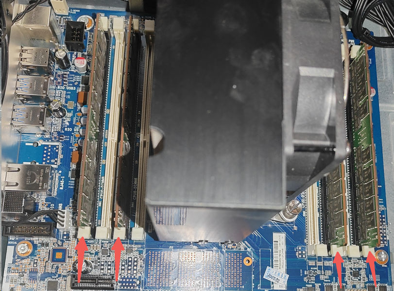
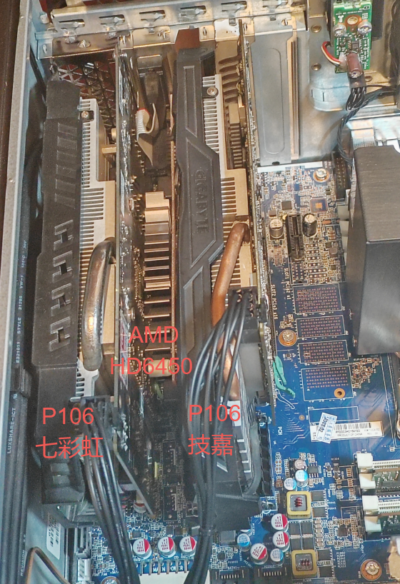
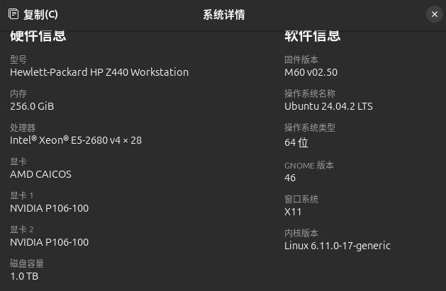
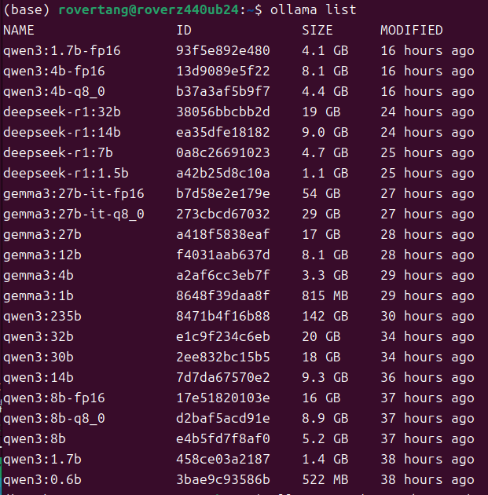
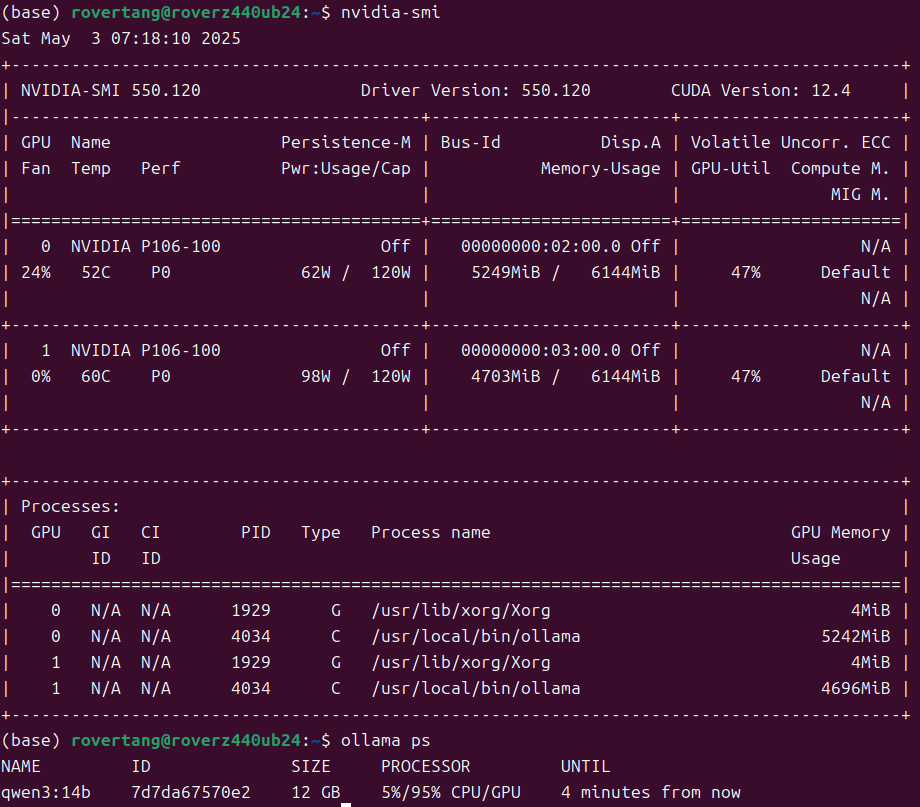
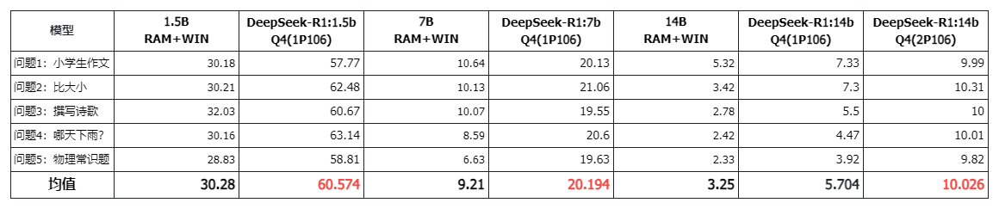
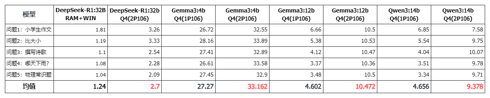
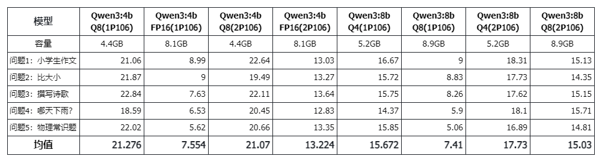
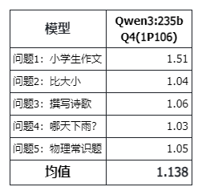
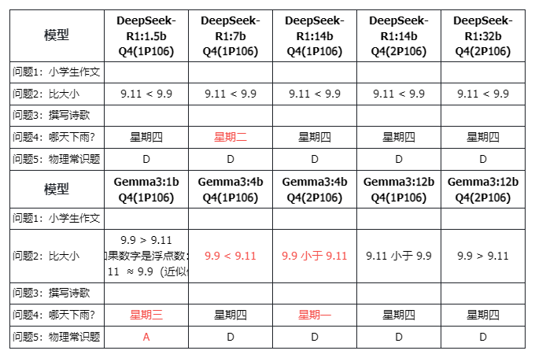

# 大模型显卡推理和纯CPU推理对比测试

[纯CPU推理大模型服务器翻车了](https://mp.weixin.qq.com/s/K90n0hsZA2GJkSTVwsS-Ew)以后，又尝试着256G内存[跑671B大模型：能跑，看你想要什么](https://mp.weixin.qq.com/s/h7c9gZYZiHLT0V92T7st7w)。最后还是弃坑了，工作站送进了小黄鱼，但还没有人抱走，看着家里闲置的 2 张 P106-100 显卡，想做点显存大小同模型文件大小关系的测试，主要是没有显卡(纯靠 CPU 和内存)、1 张 6GB 显存显卡以及 2 张 6GB 显存显卡共 3 种场景下的对比测试，于是有了本文。

## 对比测试主要问题

1. **显卡推理和纯 CPU 推理的速度对比**
2. **超过显存容量情况(混合)推理速度对比**
3. **Q4、Q8、FP16 不同精度推理速度对比**

这 3 个问题是我想要解开的谜题。

## 测试硬件和环境

个人工作站就不多介绍了，前面三篇的文字中已经详细介绍过了，简单的来说：X99 平台的 E5 2680 V4 CPU 结合 256GB DDR4 内存和两张 P106 显卡。

4 条 64G DDR4 2400 内存：

2 张 P106 显卡：

系统启动后，也能自动在系统中识别出这两块显卡：

系统是 Ubuntu 24.04，历史上用过 Windows 11，后续数据表格中会做标注。

ollama 是当前最新的 0.6.7 版本，模型也都是直接从 ollama pull 下来的。

主要下载了这些模型：

顺便说一下 driver 版本和 CUDA 版本：

好了，可以开始测试了。

## 测试数据和分析

### 显卡推理和纯 CPU 推理的速度对比

(上述 1P106 和 2P106 是指 P106 的数量，均在 Ubuntu 24.04 下，而 RAM&#43;WIN 是纯 256GB 内存的 Win11 系统，下同)

这里使用 DeepSeek-R1 的 1.5B、7B、14B 进行测试。

这个问题确实应该无悬念：**显卡推理速度明显优于纯 CPU 推理速度**。

速度上甚至有两倍以上的差距。洋垃圾对决矿渣，矿渣胜:)。

### 超过显存容量情况(混合)推理速度对比

这里使用了 3 个模型进行了测试：

- Gemma3:4B：3.3GB，小于 1 张 P106 的显存容量。
- Gemma3:12B/Qwen3:14B：8.1GB/9.3GB，超出 1 张 P106 的显存容量，但小于 2 张 P106 的显存容量。
- DeepSeek-R1:32B：19GB，完全超出了 2 张 P106 的显存容量。

(注意：相同模型，在 ollama list 显示的容量，实际存在比 ollama ps 显示的容量小的情况，所以 list 数据仅仅是参考)

对于 Gemma3:4B，1 张显卡显存容量够的情况下，2 张显卡的影响不会特别大，本次测试数据中速度有一定的提升，但也可能会降低，因为将数据分配到 2 张显卡的效率应该要低于 1 张显卡。

对于 Gemma3:12B，1 张显卡显存不够，2 张显卡显存才够的情况，效果明显，速度翻倍。这也侧面说明显卡推理速度优于混合推理速度。

对于 DeepSeek-R1:32B，显存完全不够的情况下，显存有一定的作用，混合推理也有一定的优势，相比纯 CPU 推理的情况。但此时显存的作用又似乎比较微小。

### Q4、Q8、FP16 不同精度推理速度对比

总的来说，随着精度提高，速度一定是越慢的，速度上 Q4&gt;Q8&gt;FP16。

那么，在智能上是否也有较大的差距呢？此次主要对比速度，所以这方面并没有展开，不过在下文会稍稍附带一下。

### 其他：235B 的 Qwen3 也是 1.x tokens/s

在“[两千元服务器跑 671B 大模型：能跑，看你想要什么。](https://mp.weixin.qq.com/s/h7c9gZYZiHLT0V92T7st7w)”一文中的结论：对于 671B Q2_K_L 和 UD-IQ2_XXS 量化的 DeepSeek-R1，大约为 1~2tokens/s，或者说 1.5tokens/s 左右。那么对于最新的 235B 的 Qwen3 也是 1.x tokens/s，速度差不多，只是这次 256GB 内存可以直接跑默认的 Q4 精度模型，而不需要跑 Q2 的模型了。

### 其他：智能上别用中文为难 Gemma3

对于测试的 4 个问题，Qwen3 全对，从 0.5B 到 235B，而 DeepSeek-R1 的 7B 模型不知道何缘由出错，对于 Gemma3 表现的不稳定，也只能说英文下的产品我们还是别用中文为难 Gemma3 了，不过确实错的有点没有规律，有点看不懂。

## 最后的话

**显卡推理完胜纯 CPU 推理以及混合推理**，这是毋庸置疑的结论，本文也证明了一个寂寞，但本文也给低成本显卡推理带来了一定的希望:)。

当前 DeepSeek-R1 和 Qwen3 的 32B 模型默认 20GB 大小，Gemma3 的 27B 模型为 17GB 大小，llama3.3 和 DeepSeek-R1 的 70B 模型为 43GB 大小，也就意味着 2 张 24GB 显存的显卡或者 3 张 16GB 显存的显卡就能组一个 48G 显存的电脑来跑这些模型了。2 张 4090 很贵，但 3 张 5070Ti 应该便宜不少了吧？而我准备上 3 张 P100 或者 V100，是不是省更多？一张 SXM2 版本的 V100 显卡已经在路上了，待我测试后再向大家汇报。

对于低成本多显卡推理，屏幕前的您，是怎么考虑的呢？欢迎留言。

---

> 作者: [RoverTang](https://rovertang.com)  
> URL: https://blog.rovertang.com/posts/ai/20250504-compare-reasoning-speed-with-gpu-and-cpu-by-testing/  

