# 千元小主机和千元服务器使用大模型对决

最开始使用[纯 CPU 推理大模型服务器翻车了](https://mp.weixin.qq.com/s/K90n0hsZA2GJkSTVwsS-Ew)，后来不信邪的又买了 3 根 64GB 内存条直接使用 256GB 内存跑 671B 满血大模型([两千元服务器跑 671B 大模型：能跑，看你想要什么。](https://mp.weixin.qq.com/s/h7c9gZYZiHLT0V92T7st7w))，结果就是 1.5tokens/s 的速度，然后五一假期期间跑了跑“[大模型显卡推理和纯 CPU 推理对比测试](https://mp.weixin.qq.com/s/y5OTDjxptHY72JA2bCKVqQ)”，可以确认：显卡推理完胜纯 CPU 推理以及混合推理。

上面说的是一两千服务器跑大模型的对比，这一次我要说说千元小主机和千元服务器使用大模型的对比，呃，好吧，取名确实有点标题党了，千元小主机预计也只能“使用”大模型了，而不是“跑”大模型。当然，要是三五千的小主机，甚至上万的 macmini M4 Pro，那确实也是可以 run 的，只是没在我的考虑范畴内，作为文末的展望吧。

## 小主机配置介绍

小主机大概配置如下：

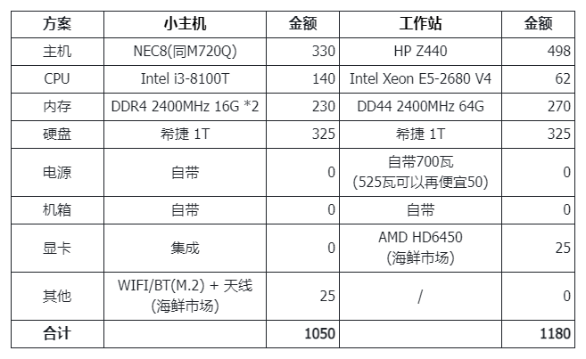

总价预计一千出头。我没买电源，用老的戴尔 90 瓦电源加了个转接头，内存也没加到 2 条，而 M.2 的硬盘也是挪过来用的，加上一个多月前还没涨价(难道和关税有关？)，所以最终五百出头搞定了。

详细的配置信息：

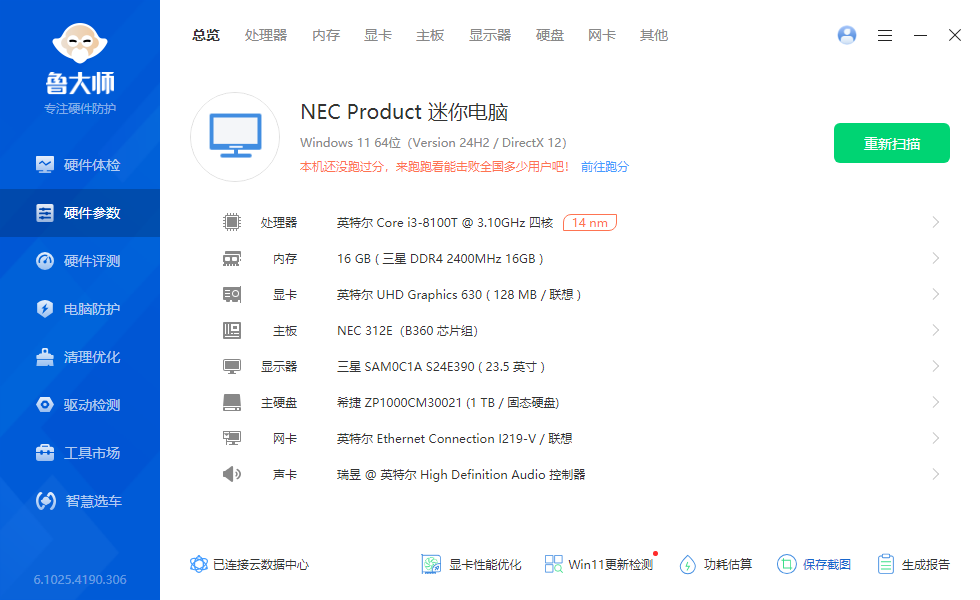

性能跑分：

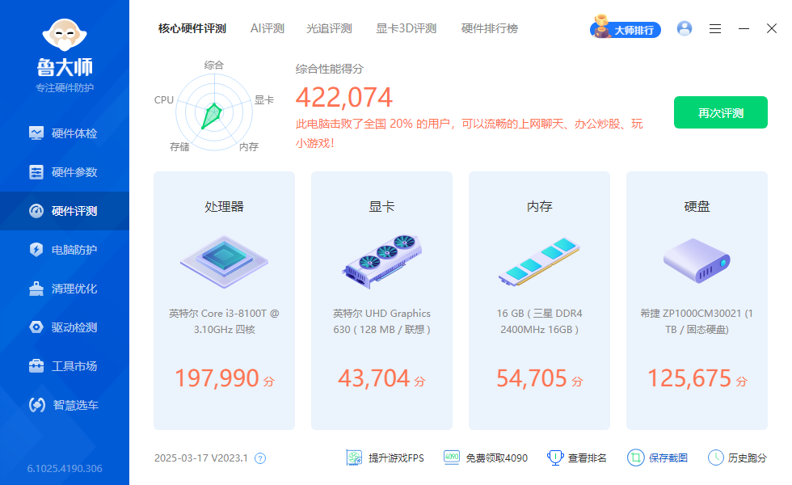

这性能嘛，和我十年前 i5-4590 的老 PC 差不多。如果老 PC 加了矿渣 P106-100 显卡，这小主机还打不过。

而和表格中的工作站相比，更是无法比了，再渣的 E5 CPU 也要比 i3 强好几倍，ECC 内存更是随随便便上 64GB，好吧，和工作站虽然价格可以相比，但性能真的没法比了。

## 使用大模型速度对比

测试方法：服务器就用我在“[两千元服务器跑 671B 大模型：能跑，看你想要什么。](https://mp.weixin.qq.com/s/h7c9gZYZiHLT0V92T7st7w)”一文中的方法，至于小主机嘛，只能使用 online 的 API 了，在 DeepSeek 官方后台充值了 10 元钱，就可以发起 API 请求了。测试使用的都是相同的 5 道题目。最终结果数据如下：

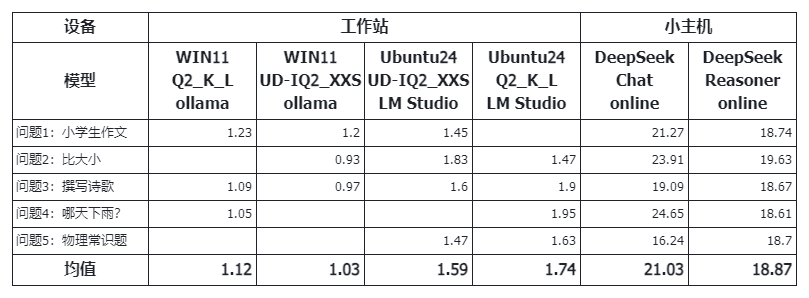

在使用大模型上，小主机完胜工作站，速度差 10 倍以上。好吧，云上的和本地的确实不应该比。

我也回看了“[大模型显卡推理和纯 CPU 推理对比测试](https://mp.weixin.qq.com/s/y5OTDjxptHY72JA2bCKVqQ)”中的数据，工作站也许跑 DeepSeek 7B 或者 Qwen3 8B 的速度才能和小主机相当，但大模型参数量可是和官方满血版差的不是一个数量级的问题哦，这种比较也似乎没有意义。

## 详细介绍一下小主机

前面几篇已经介绍过的千元服务器，现在已经涨价，本文的小主机还没介绍就已经涨价了，等我介绍完不知道会不会继续涨价一波。不过个人不是为了商家宣传，我也只是实实在在地说说我选择这小主机的原因。

### 低功耗

作为常年不关机的小主机，低功耗是必须的。

我原本有一个 Mac Mini 2012 款，也超低功耗，但性能不够用，而够用的十年前 i5-4590 的老 PC 又算不上低功耗，所以物色一个低功耗但性能又够用的 CPU，成为了必选题。

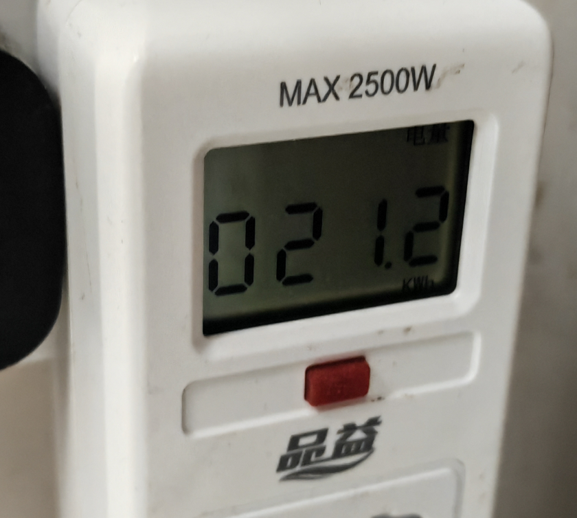

考虑到功耗，必须选带 T 的 CPU，而考虑到价钱，就只能选 8100T 了。这个功耗还是在较高场景下拍的，常规情况下在 20 以下，而平时不用的场景就更低了，预计最多 3 天 1 度电。

当然，如果不考虑功耗，就可以直接上 9 系带 K 的 CPU，性能足够强进。

### 性能够用

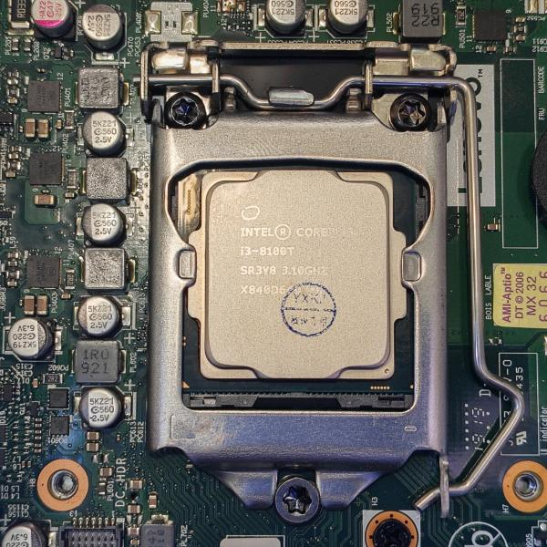

这颗 i3-8100T 的 CPU，性能和我老 PC 的 i5-4590 相当，由于仅仅常年开机用来办公，最多跑一下 python 代码，服务器的功能又由退役的 Mac mini 2012 来专职承担，所以对我来说是足够用的。实在不够，我不还有已经放在小黄鱼但还没被人抱走的 E5 CPU&#43;256GB 内存的工作站嘛。

### 体积够小

以前买 MacBook 无头骑士，也是图体积小，而工作站挂小黄鱼的另一个原因也是体积太大，现在越来越不喜欢大机箱了，放家里太碍事。

工作站和小主机的尺寸对比，实在是不忍直视：

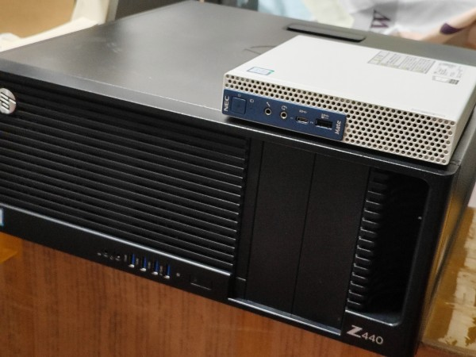

但和 Mac Mini 的尺寸相当：

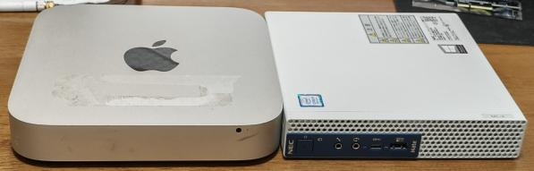

这样的尺寸还是比较让人喜欢的，我又可以把小主机藏起来了。

### M.2 是刚需

这里的 M.2 接口是用来接 NVME SSD 的，毕竟 NVME 协议的速度是 SATA 的两倍以上吧，这也是影响性能的重要因素之一。

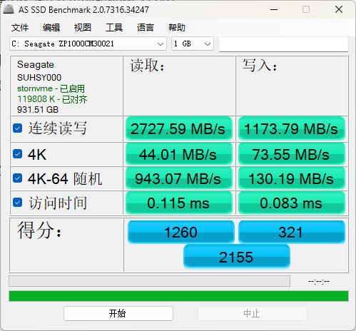

当然，还有一个 M.2 接口，是用来接 M.2 的 WIFI 小板的，这种小板还集成了 BT，所以蓝牙和 WIFI 就全都解决了，接上天线，信号好的很。注意：这种 WIFI 小板的天线口是 1.13 的 4 代 IPEX，不要买错了。

### 扩展还行

虽然是小主机，但扩展真的还行：

1. **自带 DP 和 HDMI**。(我没买前一代 NEC7，原因是没有 HDMI)

   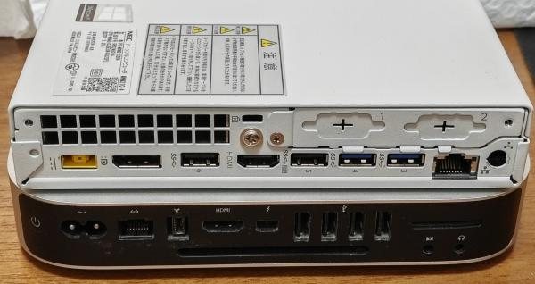

2. **内置 SATA 口并附带硬盘架**

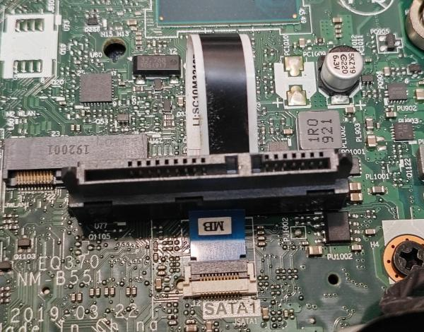

只是这不是标准的 SATA，如果没给你线材和硬盘架，那就比较麻烦了。而且这个接口特别小，拿硬盘的时候务必小心，容易一拉就坏掉了。

3. **竟然还有 PCIE 插槽**

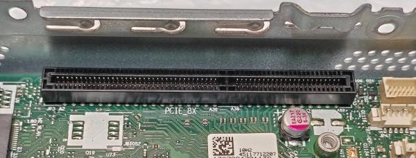

虽然不是标准的，但至少可以接出来，网上有人接了万兆 PCIE 网卡的，也有接个小显卡的。不过由于个人还需要用 SATA，所以暂时没考虑这个插槽了。

### 其他优点

上述这些基本就是这个小主机的全部优点了，一定要还要说，那也可以再说一些：

- **自带小喇叭**，总比没有强。(可以改接 MacBook 的喇叭，效果好 N 倍，我买了一个还在路上)
- **前置 typec 口**，有双 typec 线的特别有用。(我一般用 USB3 口就行，所以没太在意这个 typec)
- 背板阉割的**第二条 M.2 接口可以启用**，不过需要很强的动手能力。(我用不上就不考虑了)

如果你也在用这款，有我没说到的优点，也欢迎和我说说，后续再给补上。

## 对小主机的一些思考

### 改装成可以外接显卡的小主机

理论上可行，方案有二：

1. **将 M.2 接口转成 oculink 口**

M.2 接口不装硬盘，改装 M.2 转 oculink 的转接版，再买一个显卡坞，连上就算是外接显卡方案了，走的是 M.2 接口。

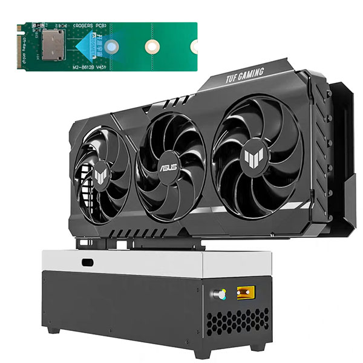

2. **PCIe 用 SFF8654 线外接**

还是走 PCIe，但通过 SFF8654 线外接显卡坞，甚至可以支持 SXM2 接口的显卡。

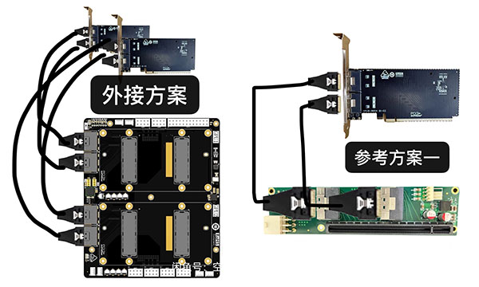

3. **PCIe 延长线直接接显卡**

和显卡坞略有不同，应该是外置电源 &#43; 显卡即可，因为 PCIe 已经延长到主机外面了，原来插主机 PCIe 的显卡现在插在了延长线上，电源还是用外置的，只是看起来可能还是要一个显卡支架，不然随便摆肯定不方便。暂时还没有看到这样的接法，属于个人开脑洞的想法，但理论上可行。

### 小主机的真实性价比不高

虽然作为垃圾佬常年捡洋垃圾，但实际算算，真实的性价比并不高。

全新的零刻或者铭凡小主机，32G 内存 &#43;1T 硬盘，对 CPU 要求不高，那么加上国补，应该在两三千可以搞定。

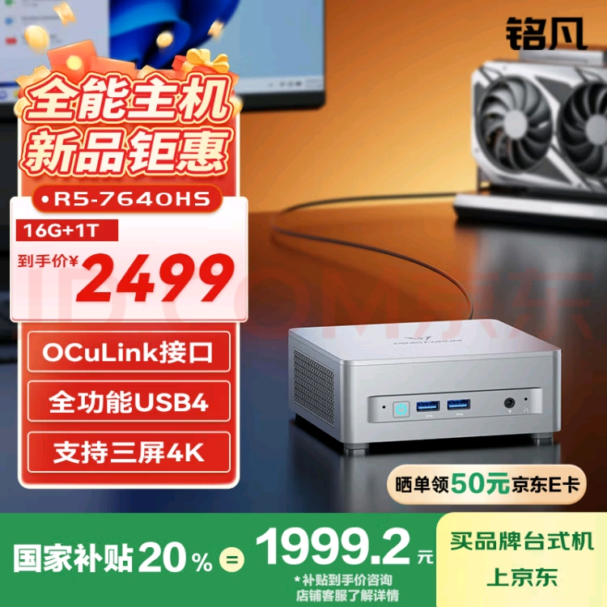

注意哦，全新，而且还直接支持 OCuLink 接口，可以直接外接显卡的，CPU 的性能更是二手的好几倍。综合来看，二手小主机性价比甚至不如全新小主机。

## 小主机使用大模型的可选姿势

本文有点跑题，最后还是拉回小主机使用(或跑)大模型。

如果真的从运行大模型角度来说，超出内存的大模型肯定没法跑起来，不管小主机还是服务器其实都是一样的，只是我把服务器内存加到了 256GB，而小主机预计最多支持 64GB 内存，所以小主机在不接外置显卡的情况下跑大模型更是渣渣。

而小主机使用大模型可能有几种方案：

1. 最省事方案，肯定是用网上 API，比如本文的测试数据就是基于 API 方案。
2. 小主机本地跑大模型，直接用外接显卡方案，速度应该起得来，只是要看你外接了多大的显卡了。
3. 小主机大内存(96GB)跑大模型，共享显存方案，也可行，但速度就不好说了，有说 3tokens/s 的也有说 22 的。

总的来说，小主机真不太适合跑大模型，使用在线大模型肯定没问题，而仅仅是办公用途，小主机真是一个不错的选择。你怎么看呢？

---

> 作者: [RoverTang](https://rovertang.com)  
> URL: https://blog.rovertang.com/posts/ai/20250505-compare-small-computer-and-server-in-the-price-of-thousands-yuan/  

