# SXM2版V100显卡很麻烦但很香：14B大模型速度超50！附折腾攻略

我的NVIDIA Tesla V100 SXM2 16 GB显卡跑Qwen3-14B大模型速度超过了50token/s，先上图为证：

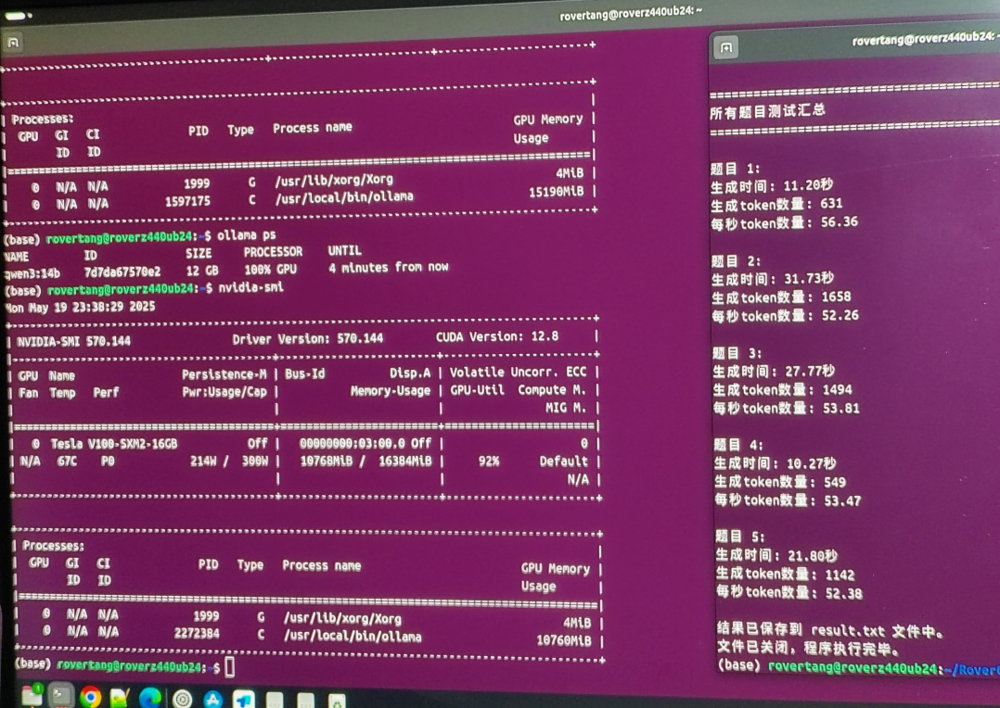

## V100同其他显卡推理速度对比

没有对比就没有伤害，SXM2版V100的香是对比后发现的，而不是尬吹的。

先测试了我在“[大模型显卡推理和纯CPU推理对比测试](https://mp.weixin.qq.com/s/y5OTDjxptHY72JA2bCKVqQ)”一文中的两张 P106 显卡，共12GB显存：

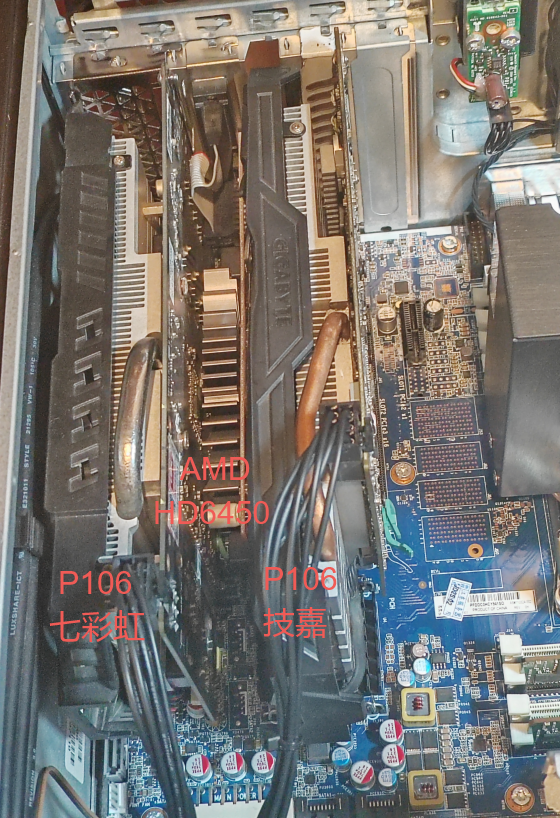

然后又借了一张1080 Ti和一张2080 super组成双卡，共19GB显存：

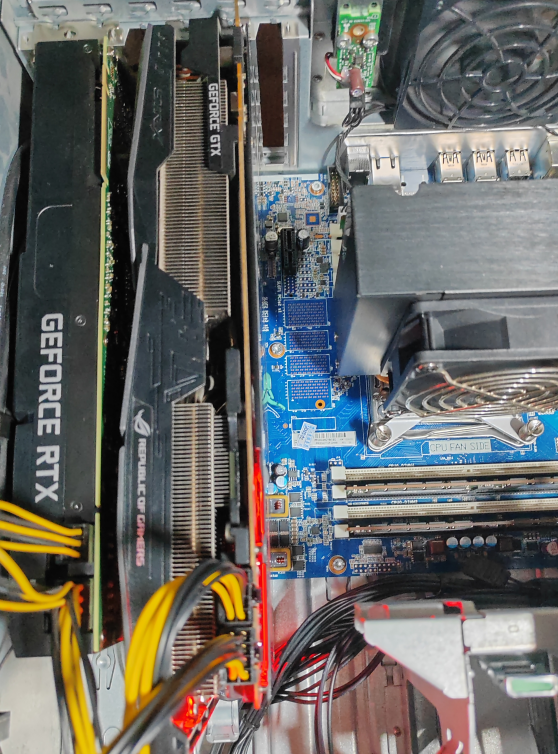

最后，上线我的单张SXM2版V100显卡，16GB显存：

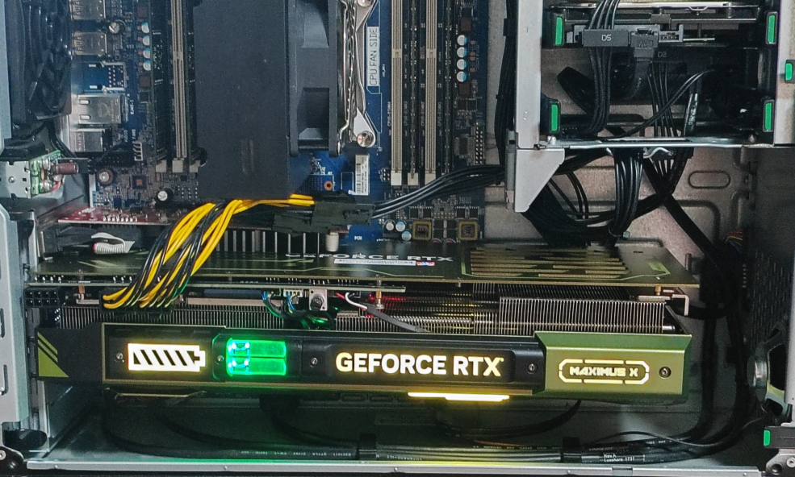

跑完了，数据整理好了：

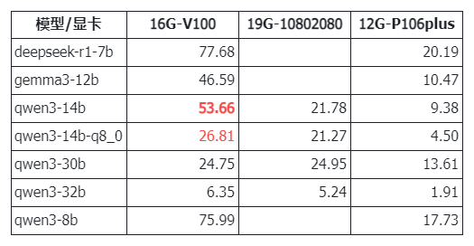

对于这块NVIDIA Tesla V100 SXM2 16 GB显卡，可见：

1. **14B模型速度超50，常规7B/8b模型速度超75，0.6B模型速度超 200。**速度很惊人(对于个人使用来说)。
2. **Moe的30B模型以及Q8精度的14B模型，也能在25左右。**速度处于正常使用水平(大家用的互联网版大模型也基本这速度)。
3. **32B模型速度仅为6&#43;**，速度欠佳，可能是显存不足的原因。(但比纯CPU推理要强太多：[两千元服务器跑671B大模型：能跑，看你想要什么。](https://mp.weixin.qq.com/s/h7c9gZYZiHLT0V92T7st7w))

我原本想买Mi50 32GB版本的，但看了网上的数据：

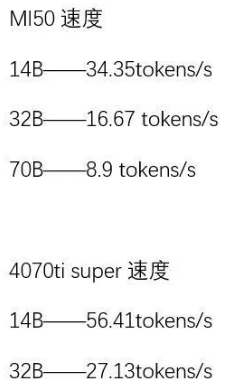

相比之下，我还是继续用V100 16GB吧。另外对比4070Ti super的速度，14B基本接近，32B速度差异较大，说明除了显存，实际也有显卡代际架构差异的原因，但价钱摆在那啊。

## V100 SXM2 16GB显卡介绍

这也是一张来自远古的显卡，首发于2017年，关键在于这不是一张普通的PCIe显卡：

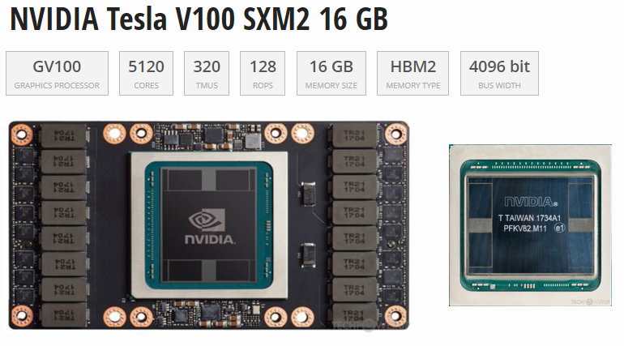

也就是 **SXM 接口，这接口没法直接装到PCIe上去**，需要转接。

不过算力可喜：**FP16：31.33 TFLOPS；FP32：15.67 TFLOPS；FP64：7.834 TFLOPS。算力远超 P40、P100、M40等显卡。**

而得益于HBM2显存，其**带宽速度也很惊人：897.0 GB/s**。

另外，**V100开始有Tensor Cores** 了。

按techpowerup的性能排名来看：

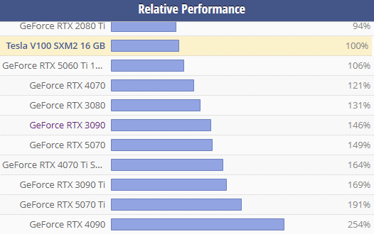

约为**3090的2/3、5070 Ti的一半、4090的四成，比2080 Ti略强**。

至于价格嘛，自然就成了真香的关键：

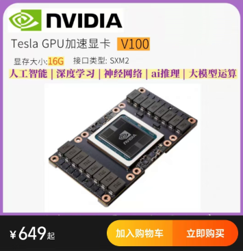

当前2025年5月**显卡本体价格：649**。(据说可能会因新显卡发布而V100将大幅降价)

当然，也没那么便宜，因为：需要SMX2转PCIe的转接卡，以及散热系统。

总体价格差不多翻倍。

基于价格，基于速度，V100 SXM2 16GB显卡还是很具性价比，你觉得呢？

## SXM2版V100显卡折腾攻略

特别特别强调：需要有较强的动手改装能力，而且电脑技能也不能太差，不然买回去真的很难用起来。

我个人虽然动手能力不算强，但也绝对不算差，而这一次的折腾，差点为了一块SXM2版V100显卡配了好几台电脑，典型的为了一盘醋包了一顿饺子。而等我折腾到好用，又放到海鲜市场出手掉了，开始了下一阶段的折腾。

### SXM2转PCIe

如前文所述，除非你直接买SXM2底板的服务器(比如戴尔C4130/C4140等)，不然肯定是转接卡。

当前 **SXM2转PCIe的转接卡**样式很多，基本都是自己打样小批量生产，也就意味着这玩意不是大厂家流水线生产的。当然，官方转接卡也有，但相对比较少，比较难淘到。

这样的转接卡，当前在某宝等平台不多，而在海鲜市场比较活跃，这也侧面说明基本都是小批量生产，更需要擦亮眼睛甄别。

转接板大概像这样：

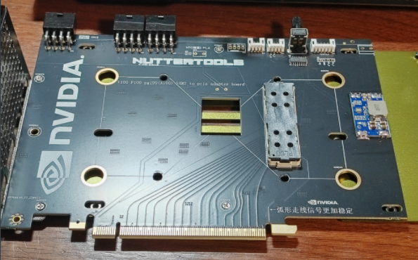

也有别样的。我为了省心，买的是某知名UP主的，甚至连散热器也一起买的。

注意：转接卡仅为图中黑色的板子，后面铁板是显卡散热背板，只是现在已经装一起了。

另外这块板子已经装好了调速器，后续对于风扇风力可以自行调节，这个功能挺重要的，风扇转速决定了噪声。当然，也别想着能静音，毕竟需要大量散热的嘛。

### 选择散热器

散热一般就是选择风冷还是水冷，我对水冷感冒，所以没有考虑，而风冷方案也有选择：

使用**其他显卡散热器改装**：

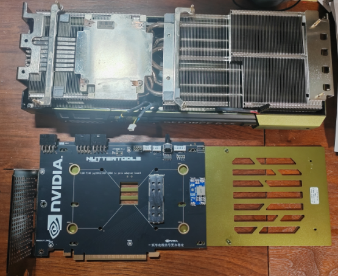

使用**原装大散热器**：

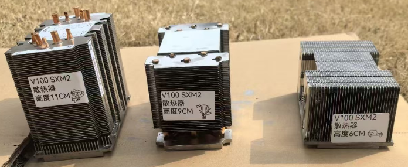

我选择的是前者，图的是简单方便。当然，这个简单方便实际是建立在卖家帮我改好的基础上。而后者的官方散热器，直接拧好螺丝就行，只是砖块似乎又大又沉，放机箱预计不好处理，再加风扇散热，相对就麻烦一些了。

### SXM2显卡安装

将SXM2显卡安装到PCIe转接板上，说是简单，实际也不容易，看了视频装的，但也有不少注意的地方。

**显卡外围需要拆掉**。一般买回来的显卡在主芯片的外围有一圈散热的架子，这些都需要拆掉，不然高度过高，显卡散热片盖上去后，螺丝柱就腾空了，自然无法拧上螺丝固定了。

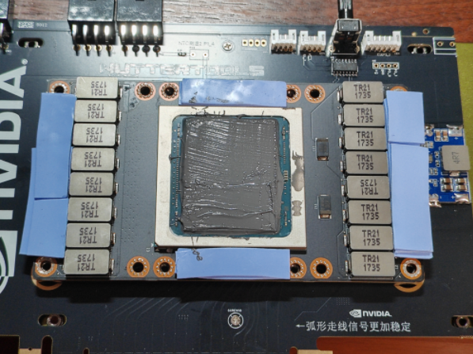

**显卡要扣上去而不是放上去**。我最开始也没明白如何固定，又没有螺丝，直接将显卡放在了转接板上，我就很纳闷，翻转以后不会掉吗？最后细看视频，说是要有吧嗒一声，哦，应该就是这个接口卡住了的声音，所以需要用力按压完全锁扣起来，而不是直接往板子上一放。当扣住了以后，翻过来也就不会掉了。

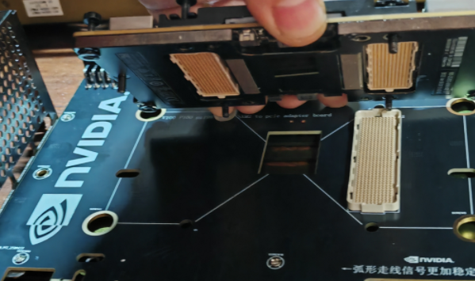

**孔位要对齐**。前面步骤OK的情况下，螺丝孔位基本能对齐的，如图中六个圈所示，拧螺丝相对比较容易。而检查是否对齐的关键，是看图中两个框的位置，实际是显卡没法去掉的两个柱子正好成了同背板的定位柱，在背板孔位中，显卡的柱子基本能同背板齐平，这样的安装比较到位。

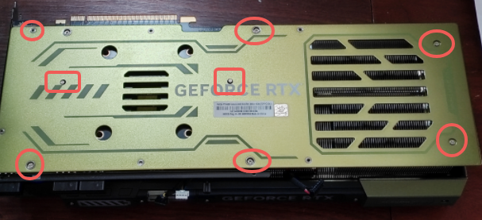

显卡安装会占用4个PCIe槽位，长度超过35厘米，高度超过13厘米，所以一般机箱还不容易装下。

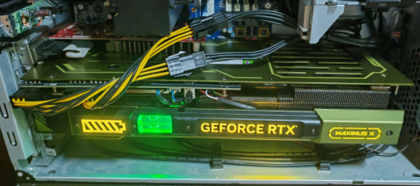

总体来说，安装还算方便，装完以后可以同4090相媲美了(仅外观哈)。

### 系统兼容性问题

由于不是一般的显卡，所以系统兼容性就成了大问题。一般来说，**建议X99平台的主板和CPU，而普通i5系列台式机并不建议。**(不绝对：也有人B250M&#43;i5六代成功的)

个人在B85M平台i5四代CPU下没有成功，找了个戴尔台式机(i5八代)也没能成功，前者表现在WIN下驱动一直是感叹号，而在Ubuntu下又nvidia-smi又没法连上显卡，后者直接表现为无法开机。

我在HP Z440上也无法开机，开机就提示928严重错误：

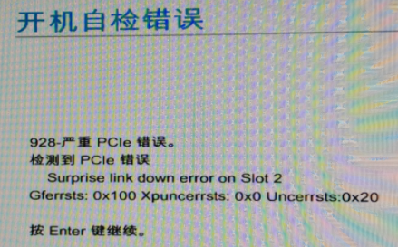

检查above 4G、关CSM、刷最新BIOS等都折腾一遍还是不行，绝望之下试了试拆分，将PCIe拆分成x8x8：

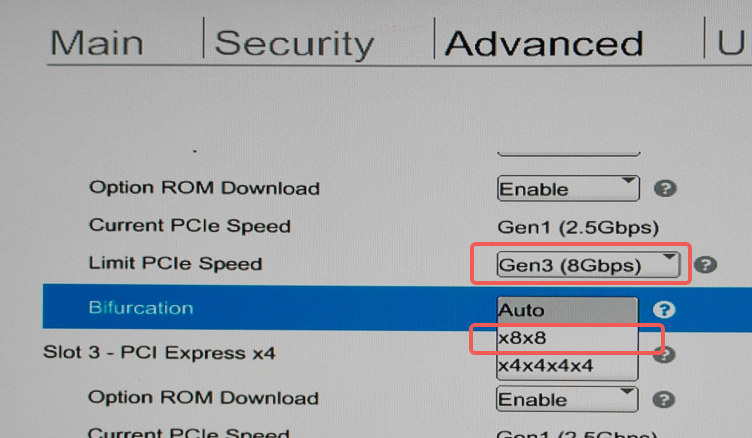

竟然成功了，可以正常开机进入了，不卡在BIOS界面了，神奇。

关于系统兼容性部分的折腾可以看这篇：老主板使用Tesla V100显卡的坎坷历程 [https://jakho.net/old-motherboard-with-tesla-v100-graphics-card?locale=zh](https://jakho.net/old-motherboard-with-tesla-v100-graphics-card?locale=zh)

### WIN下驱动以及掉驱动

据说Windows下掉驱动是比较正常的事情，我使用最新版本的驱动，除了刚安装完后查看显卡正常外，一旦重启显卡就又都显示感叹号，没法使用。

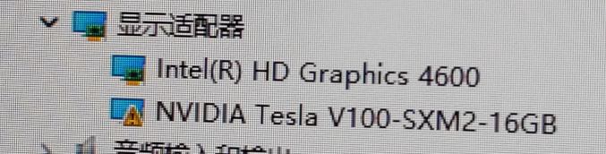

网上说在安装完成后打开NVIDIA控制面板软件关闭ECC校验就好，但我没有成功。

最后放弃最新的572版本驱动，改用较旧的475驱动，竟然不掉驱动了。

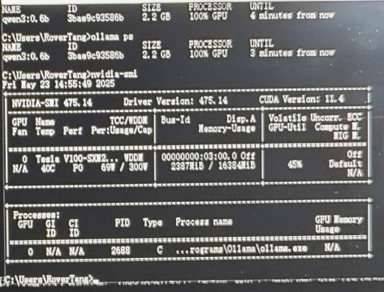

最后ollama可以正常使用显存了，但SD由于驱动太老而无法使用，其他游戏类似乎也没法调用这块显卡，虽然不是很完美，但至少大模型推理可以用起来了，后续再折腾吧。

当然，在Ubuntu下还算完美，直接使用570版本驱动即可。

### 还是不完美

SXM2版V100虽然性能不错，价格也美丽，但还是不完美。

1. **16G 显存不够用**

显存不够用，不满意，但我又不会买32G的SXM2版V100：

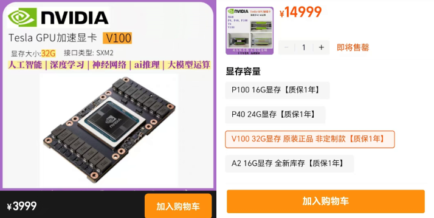

呃，好吧，承认，确实差钱差太多了一些。

看着这显存比金子还贵的价格，虽然因为穷而退缩了，但两颗小金子的钱要比一颗大金子的钱便宜很多啊，不上单卡32G，我上双卡32G是不是可以考虑呢？后文我们继续讨论。

2. **太大了**

**占用4个槽位**，太恐怖了，直接让其他槽位不可用啊。我的主机还必须插亮机卡，好在PCIe x16的前面还有一个 PCIe x1，我把AMD显卡插这x1的PCIe槽上，竟然也能用，这才让我能继续折腾，不然无法亮机就更别谈折腾了。

**长度35**，不是一般机箱放的下的。所以对于已有机箱的朋友务必考虑好，不要太盲目。

**电源设计在了顶上，所以高度远超13**，而一般机箱也就17的宽度吧，这样就无法盖上机箱侧板了。

3. **吵和啸叫**

首先由于风扇的原因，声音很吵是一定的，毕竟是4090的3个风扇嘛。当然，也正因为吵，所以散热效果一定是杠杠滴，甚至比涡轮和水冷还强。

其次是啸叫，当大模型跑起来的时候，就有啸叫声，虽然声音不算特别大特别刺耳，但大模型一直跑着就一直啸叫，感觉自己身在生产车间啊。这个啸叫应该来自转接板，具体原因未明，不确定是否所有转接板都有这问题。

## 三千买32G显存是否划算？

### 显存的重要性

跑大模型最为重要的一个点是什么？显存。是的，看看我走过的弯路：

[70B大模型本地部署的性价比探索：一两千组个纯CPU推理的服务器](https://mp.weixin.qq.com/s/UyW9eoHorOr55hQJSBICYQ)

[纯CPU推理大模型服务器翻车了](https://mp.weixin.qq.com/s/K90n0hsZA2GJkSTVwsS-Ew)

[两千元服务器跑671B大模型：能跑，看你想要什么。](https://mp.weixin.qq.com/s/h7c9gZYZiHLT0V92T7st7w)

[大模型显卡推理和纯CPU推理对比测试](https://mp.weixin.qq.com/s/y5OTDjxptHY72JA2bCKVqQ)

以前想着CPU&#43;大内存干翻GPU，虽然说着CPU也能跑671B大模型，但看到50&#43;的速度，谁还能淡定呢？不得不承认，速度也真的真的很重要，而对于速度，最为关键的，除了需要显卡，同样也需要足够的显存啊。

当前14B、14B-Q8以及Moe的30B速度看上去都在可接受的范围，但一旦到了32B，速度就上不去了，如果显存足够，速度应该还能上去。所以**大显存显得尤为重要。**

### 32G显存方案

上面对比过了，单张32G的SXM2版V100，要价4K，而PCIe版的32G V100直接要价15K，这不抢钱嘛，而我组的16G版SXM2 V100，全部组好都不超过1.5K，双卡组成32G也比单卡便宜，更是PCIe版的零头都不到。

所以，如果有钱，前面图中4K以及15K的32G可以选择，但我还是想便宜一点，所以只能妥协为16G&#43;16G=32G的方案，基本方案有二：

**方案一：买两张卡直接插主板的PCIe槽**

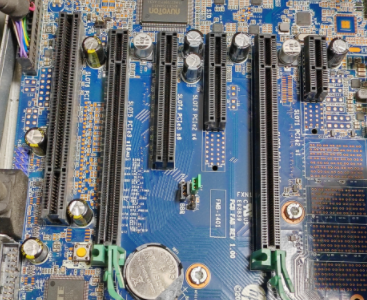

比如我的主板，确实有两根PCIe x16，也就是插两张转接板可行。

但是但是，这转接的显卡太大了，这才是不行的关键。四槽直接把第三根PCIe x16盖住了，即便不盖住，底部靠近机箱，也没有了插进去的空间了。

当然，我若改用水冷方案，也许可行，但水冷价也高，而且我也不喜欢。

**方案二：买双卡GPU底座然后通过8654线接回主板**

也就是将双显卡放在GPU专用主板上，通过8654线连回主板，算显卡外置方案，大概是这样的：

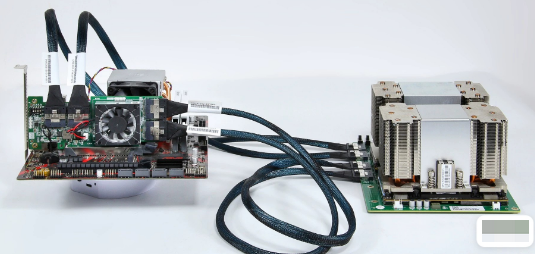

当然，也有衍生方案：

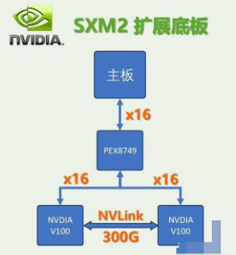

看你如何选择了。

总体来说，为了这32G显存，预计要花三千左右，直插方案省钱一些，外接方案外设更多，应该会超三千。

至于方案的好坏，根据DeepSeek的回答：外接方案更好。当然，也不能全信，我问它16G显存V100跑14B大模型大概是多少的速度？先回答我4~7，后来回答我14~18，最后我告诉了它答案，它说如果Q4&#43;稀疏量化是能达到50~60的，总体回答的也不算正确。不过它也承认，双V100方案对于AI开发和科研还是最优解，也承认了此方案的性价比。

### V100之外的选择

由于到了3K的价位，所以显卡的选择似乎更具争议，相信评论区也会吵开花，那么，是否有其他选择呢？

我个人不是很懂硬件，CPU、显卡等看的我眼花缭乱，我先随便说说我看到的。

**三张P100共48G显存**

三张也就三千，PCIe直插，只要主板有3个显卡插槽即可。

**两张P40共48G显存**

三千只能买一张半，要么少一千用单张24G，要么加一千直接变48G。

**2080 22G魔改版**

应该不到三千，显存略低，但通用性强，毕竟大家第一时间想到的就是这显卡了，也是公认的最具性价比显卡了。

**5060Ti 16G**

按买新不买旧的原则，加上文章开头中4070Ti super对于32B大模型能跑到27的速度，还是需要推一推50系列新平台。官宣三千出头，当然，这可能仅仅是官宣。

除了这些，当然也有一些其他平台的，比如AMD的Mi50 32G不到1K，而AMD的RX 7800XT价格三千出头，而非主流的Intel Arc A770，三千多能上两张，直接也32G显存了。由于没有CUDA，这些就先不考虑了吧。

屏幕前的你，有什么更好的推荐呢？

说句题外话：最近几篇CPU推理文章，评论区有不少留言，通过大家你一言我一语的推荐，最后我真觉得7945HX是当前最具性价比的CPU，感谢berrybai网友推荐。

另外，这年头显存贵，表示理解，结果连周边都变贵了，比如上文所述官方散热器(说的就是那大砖头)，要一两百一个了，要知道同样大小的CPU散热器也就十块钱一个，真是水涨船高的离谱。

## 最后的话

SXM2版V100显卡非常具有性价比，适合AI大模型，单卡16GB版本一千出头，就能有不错的推理速度体验。

但确实非常的折腾，转接卡、散热器、安装过程、系统兼容问题、驱动问题等都有不少的麻烦，坑有点多。

只是，为了极致性价比(其实是穷)，折腾并快乐着，这不，卖了16GB版本，继续开始折腾双卡32G版本了:)

你还有什么更具性价比的显卡方案推荐？欢迎评论区留言。

---

> 作者: [RoverTang](https://rovertang.com)  
> URL: https://blog.rovertang.com/posts/ai/20250525-smx2-v100-is-troublesome-but-also-cost-effective/  

