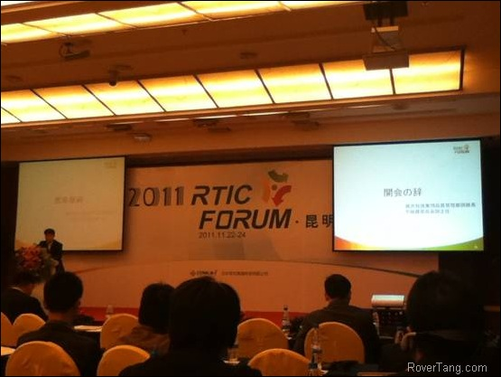
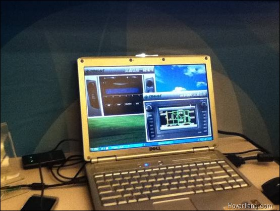
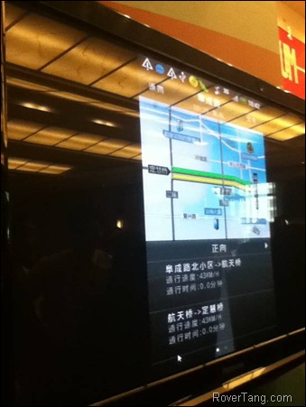
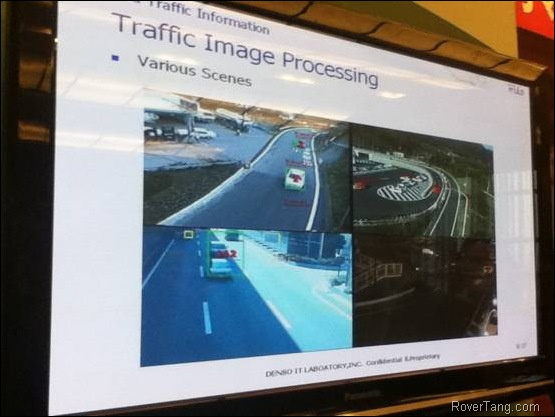
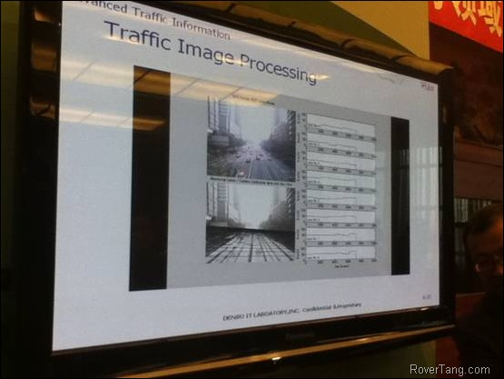
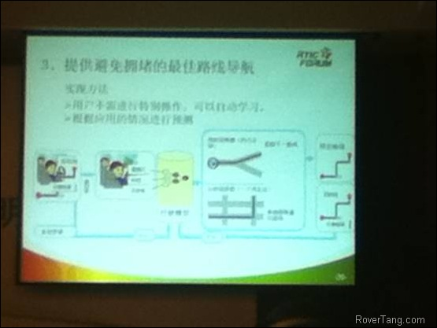

# 2011RTIC论坛回顾

本文完成于两个月前，由于种种原因现在才同大家分享，以下是原文：

一年一度的由世纪高通公司组织的RTIC论坛于11月23日在昆明世纪金源大酒店举行。RTIC论坛精神在于组织讨论和分享RTIC技术在国内以及国际上的应用，以拓展大家对RTIC的认识，切磋在使用过程中的问题和心得体会。论坛邀请到了车厂、互联网、导航软件等厂商，当然还有政府部门，其中车厂居多，主要包括了上海汽车、大众、丰田、本田、日产等，当然也包括了较多汽车零部件厂商，以日系为主，比如电装、先锋、阿尔派、三洋等，还有像歌乐、哈曼、伟世通、博世等。除了车厂以及汽车零件厂商外，也有导航软件厂商和互联网企业，比如美行科技、新科、搜狗地图、腾瑞万里(导航犬)、泰为、百度、Google、中国电信等企业。当然，还有部分企业和研究机构，如北京交通信息中心等。

论坛主要由几个简单演讲组成，一起来分享一下这几个演讲吧。

### 一、北京市智能交通系统发展

这个演讲由北京交通信息中心提供，算是政府部门对于数据的披露。

1、北京的智能交通系统整体建设已经基本完毕，公交卡系统已经覆盖全市范围，此部分也可以在以后为交通流量分析提供依据。

2、对东直门等大型交通枢纽已经使用视频等方式进行交通流量采样。

3、北京共21000多个公交车，已经形成了汇报从车队到分公司再到总公司的流程。现在，北京共13000量公交车已经安装了GPS，涉及到九个分公司，537条线路，3条BRT线路。

4、在电子收费方面，已经形成了公交、轨交、出租车一体的一卡通系统，现有4000万交通卡用户，其中活跃用户在1278万，日军使用在1400万次，其中轨交有221万次。

5、在高速公路方面，共有365条ETC车道，实现了100%的高速覆盖。共有超过40万辆车使用ETC系统。(注：个人搜索了一下北京的汽车量，09年大概在400万左右)

6、在出租车方面，共有6.67万辆车全部装上了GPS(北京的出租车总数就是6.67万)，共有5个GPS监控中心，2家出租车公司实现了电话调度，日均叫车(电招)量在1.2万次左右。

7、在省际客运方面，共11个客运站，70多个代售点，1000多辆车安装了GPS。

8、在货运方面，共有7175辆车撞有GPS，共两个监控平台。

9、在停车方面，已经建立了电子地图系统，部分区域建立了停车诱导系统，涉及7000多个停车位(注：7000多这个数字待确认。这里应该是少些了一个0，应该在7万，这个数据是根据最后一个演讲推断而出)。

10、 在公路管理方面，已经设立了监测设备，平均1.2公里就有一个监控设备。

11、 已经建立了运输枢纽信息服务平台，共安装了280多个视频采集点和30多个客流采集点。

12、 在信息资源整合方面，正在加强调度中心的建设。

13、 北京市智能交通发展成果：建立了掌上交通信息指南，其中通过12580系统使用该功能的就超过了呼叫量的60%(待验证)。在车载导航仪方面也有超过3万的用户。

14、 在公众服务模式上，提供了网站服务和服务商合作两种模式。

15、 最后就是加强TOCC的建设，以提供更准确的分析报告，和提供更好的运维管理。

### 二、2011年RTIC服务发展回顾与2012年服务计划

这部分的演讲是由世纪高通公司的技术部门提供的。

1、在发展过程中遇到的问题：一是希望国家加大对产业的推动，二是交通拥堵限行等不利于实时交通的发展。

2、现在RTIC开通的城市，sohu使用了16个城市、baidu使用了19个城市、诺基亚使用了13个城市、Google使用了22个城市。(注：实际上应该总共开通了22个城市，或者可能已经包含了测试中的城市，Google只是作为了先行者)

3、从实时交通使用调查结果来看，用户的感觉准确率情况是：长春75%；杭州85%；无锡83%。

4、现开通的四个交通事件有：交通管制、道路施工、交通事故、道路障碍(待验证)。关于交通事件的搜集方法，主要与第三方合作方式下的用户交互模式为主。

5、今年建设推出了简洁交通信息画面、交通流量(待验证)、交通事件、动态停车位(实验室阶段)等。

6、在技术方面，尝试用信号灯控制模式进行分析。现在，上海的浮动车采集分析可以达到20秒一次。上海交通路况信息数据源主要来自：3家出租车公司、货运物流公司和交通局。

7、在管理方面，加强了人、流程、技术、管理四个方面的建设。

8、2012年的目标共三个部分，首先是对现有服务的稳步提升，提高已发布城市的质量，增加发布的内容，其次是保持产品的扩张能力，以点带面式发展，最后是加强创新服务试点。

### 三、东南亚RTIC交通信息服务的发展

本演讲是由泰国的丰通株式会社提供的，其实是属于丰田的合资公司，演讲的是一个泰国人，用日语演讲的。

1、现状：到2015年，实现东南亚人口一体化，四个国家将形成统一的经济圈(应该是类似欧洲国家的欧盟)。

2、一些数据：

汽车总量：日本7560万辆；中国5190万辆。(注：这个数据好像有点老，日本的数据差不多，但中国的汽车量说是今年超过日本。)

导航总量：日本4500万个每年；中国2830万个每年。

手机数量：日本118百万台；中国648百万台。

人口数量：日本127百万；中国1333百万。

互联网数量：日本34百万；中国298百万。(这个互联网忘了是指什么了，可能是互联网接入)

3、到2014年，汽车总量将达到100万(注：数据似乎有点少)，手机普及率将达到75%。

4、为了在泰国建立RTIC系统，丰通公司将安装1万个GPS到出租车上，以解决浮动车少的问题，同时捕捉数据的频率将达到3秒(注：很高哦)一次。

5、Gbook将会引入Android系统(应该是Gbook同手机的结合)。

6、关于TTET公司的介绍：是一家车载嵌入式软件开发企业，共230人。

7、其他关于在泰国发展RTIC的信息，可以为他们国家提供的内容有：地图数据和Maching Table；作为硬件制造商介入(用于FM-RTIC的中国设备在东南亚市场上一样适用)；成为RTIC的服务伙伴。

### 四、车的信息与技术发展

这部分的演讲是由Denso IT laboratory提供的，电装是非常有名的日本汽车零部件厂商，提供的前装车载导航软件还是很厉害的，演讲中展示的一些技术，也是我所比较惊叹的，在本文最后我们会加几张图片予以说明。

1、现阶段汽车信息的方向：高度化的信息、提高环保、与智能手机的结合、智能生活。

2、日本的汽车量为7400万，每年的交通事故是390万件(待验证)，公路每年增加5000公里。

3、电装研究的技术方向：

(1) 提供实时交通流量的测定

(2) 动态拥堵的预测

(3) 提供避免拥堵的最佳路线。(自动学习以在没有目的地的情况下提供路径引导)

(4) 节能环保辅助系统。(比如提前预测踩刹车。根据测试，在15公里路径的燃油率提升上来看，普通的系统提升为9.8%，而此系统的提升为17.1%)

4、开发了与智能手机结合的系统：NaviCon。(可以在App Store上找到)

5、开发了高速图像匹配技术：CARD。(待验证)

### 五、基于浮动车的数据挖掘与应用

此部分的演讲是由北京航空航天大学提供的，主要是研究后的数据，基本都以图表的形式来表现，所以内容不多，记录了三个部分：

1、本数据的分析是基于12000量浮动车数据的分析

2、每天都OD总量和趋势都比较稳定(大概就是交通流量等吧)

3、七到八成的打车人员打车里程在10公里以内。

当然，图表包含了非常多的内容，比如每天都流量、每个礼拜的、高峰期的比较、甚至节假日的流量等，分析比较详尽，由于最终得到比较稳定这一结论，所以这一概况也没啥好说的。

### 六、交通信息服务扩展

此演讲是由实际高通公司提供的，主要的内容是对自有产品的一个分析。

1、现状：

(1) 共有29个签约客户(注：待验证，此处应该是指正式商用的厂商吧，这个量也不小了)

(2) OEM汽车用户为16万以上

(3) 终端用户在150万以上(注：个人认为这个这个终端用户很宽泛，除了类似我们公司带TMC功能的PND用户外，我也是他们的终端用户，因为我会在诺基亚S60的手机上使用Google地图查看当前城市的路况信息，甚至浏览网站的用户也算)

(4) 呼叫中心的使用在250万以上(根据第一个演讲中讲到有超过60%的12580呼入与交通信息有关，以此类推这个数据还算有理有据)

2、提供的服务：

(1) 一键式交通信息播报服务(注：此是FM收音机的一个模块，仅需要一个小小的硬件就可以完成，按一下这个硬件按钮，将会自动播报当前车辆位置附近的路况，再播报全市概要路况。此功能还算是很有用的，后来有客户上台作为嘉宾讲到的时候也有说他们在开发类似的功能。)

(2) 交通信息标准服务(注：标准的交通信息服务内容，RTIC标准或TMC标准的数据内容)

(3) 交通信息增值服务

(4) 交通信息高端服务

(注：服务的标准、增值、高端等，应该是内容的区分，比如标准的RTIC内容，比如城市路况概览图，比如动态停车场服务)

3、根据统计，广播用户有6.5亿，有一半以上的司机听广播，并且以听当地交通广播为主。

4、现阶段实时交通路况所遇到的问题：

(1) 没有赶上路况播报点。(注：即通过FM广播的方式播报路况，容易有漏听的可能)

(2) 拥有全市路况而无周边路况。(注：这也是通过收听当地交通台所遇到的一个常见问题，所以开发了一键FM播报路况的模块)

(3) 导航仪&#43;TMC后，成本和风险问题将加大。

### 七、洞悉市场，把握机遇——实时路况消费者研究

此演讲是由Frost&amp;Sullivan提供，是一家市场咨询公司，为世纪高通包括车厂等提供市场研究报告，当然，不仅仅包括汽车领域。

1、中国的第一辆汽车：1901年袁世凯赠送给慈禧的六十大寿贺礼，一辆第二代奔驰小轿车。

2、两个问题：一是在政策上需要更多政府的支持，另一是望车厂的推广力度要进一步加大。

3、通过北京、上海、广州、深圳、沈阳、武汉六个城市的调研，获得的信息如下：

(1) 认知度：62比38，即三分之一的人听说过。(注：个人认为认知度还是非常不高那)

(2) 重要性：三分之一的人认为重要

(3) 满意度：82比18(注：个人认为八成的满意度不容易那，应该没有那么高)

(4) 希望汽车提供的服务排名：防盗、追踪、救援、路况、导航、电话

(5) 是否愿意为实时路况付费？63比37，六成的人愿意付费，付费的区间在5～20元每月。

(6) 用户认为实时路况中的两个重要内容：停车场和道路事件

(停车位主要由三个部分组成，大楼配套的、公共停车场、路边停车，上海的停车位在5万多，北京在6万多)

(7) 北京在堵车的情况下：汽车速度为15公里每小时，而开车也只有22公里每小时。(由此可见，在北京开车要是遇上堵车还不如骑车)

4、总结：

(1) 实时交通路况的市场会进一步提速。

(2) 车载信息的使用以简便易用为主，导航需求较大。

(3) 虽然用户愿意为实时路况服务付费，但最好由厂商来承担这部分费用。

### 其他一些信息

演讲部分基本由以上几个部分组成，最后附上一些图片说明。

RTIC论坛现场

世纪高通提供的两个服务产品：一个是广播的一键播报路况，另一个是当前城市路况信息概览图。

世纪高通提供的在iPhone上的路况概览软件，除了城市简图和路段简图外，还提供了详细的堵车信息列表，还是比较实用的。

另外世纪高通公司还提供了一个网站的DEMO，用于查看他们的路况信息，以及一些新成果的演示，比如动态停车场信息。

在演示台上，还有泰为公司提供了基于iPhone的导航软件演示，带有实时路况功能。

而Denso IT lab弄了个独立的展台，展示他们对最新技术的研究，还是挺佩服电装公司使用新技术对实时交通路况的研究。

上图是通过摄像头取得视频数据，然后通过图像处理技术，识别出视频中的车辆，抓取出车辆轮廓，再根据摄像头的范围尺寸，差分计算出车辆的速度，以此来获得当前道路的路况信息。我想，若采用这一技术那是否可以适当的取代一些浮动车的技术呢。

根据刚才说到的视频分析，应用到实际场景中如上图所示，架设好摄像头，然后划分出车道，抓取每个车道上的汽车，并根据视频尺寸差分计算出行车平均速度，上图中左侧为视频右侧为实时分析出来的速度数据。真是有点叹为观止了。

最后提供一个关于避免拥堵的最佳路线的PPT吧。这里是讲针对用户的驾车习惯学习，一个月以后，用户在非导航的状态下，都可以语音告知用户左转右转等机动信息。我们在市面上能够看到的是，根据导航习惯，得到导航趋势，比如上下班的时候直接友情提示用户是否开始回家路线的导航，而电装已经做到了在没有导航路线的情况下，直接通过语音告知用户行车信息，这才是分析数据的极致那。

总结：通过此次RTIC论坛，比较深入的了解了世纪高通的产品信息，并了解到了一些使用他们产品的厂商，而能看到电装这样的技术前沿展示更是大开眼界，另外虽然没有同车厂用户沟通交流上但能认识一些同行朋友也是一个视野的开阔，总的来说，这是一次收获颇丰的会议。

本文飞书文档：[2011RTIC论坛回顾](https://rovertang.feishu.cn/docx/doxcnD0Y8qg8ZrX8iTyKoOIebgL)

---

> 作者: [RoverTang](https://rovertang.com)  
> URL: http://localhost:1313/posts/car/20120130-review-of-2011-rtic-forum/  

