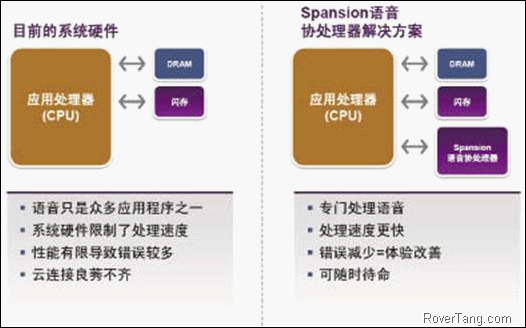
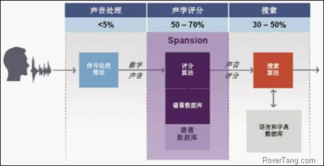

# 2012Nuance大会回顾

本以为今年没有大会了，但还是来了，今年也还是有幸的参加了。本次大会的主题是：更安全，更便捷，尽在汽车互联。

## 开场白

开场白依旧是老板的自我介绍。Nuance成立于1992年，2011年营收为14亿美金，全球共有7000多名员工。Nuance主要面向四个市场：医疗、移动电子消费、企业、图像处理。截至现阶段，共计有7000万汽车和50亿部手机在使用Nuance的技术。

Nuance技术在汽车上的应用主要有：集成手机应用、嵌入式和云端导航、Telematics、后座娱乐系统、网络搜索、CD/DVD/MP3、实时天气、收音机空调等汽车控制。

最新的案例为宝马汽车中的应用，主要提供了汽车控制、娱乐、通讯、导航的功能，解决了在汽车中邮件和短信的读写问题。

Nuance在中国的研发人员已经超过100人，其中70%为技术人员。

在2011年，主要取得的成绩有几个方面：

开发方向：1、中文车载解决方案，包括天气、股票等咨询信息；2、自然语言的理解；3、云端&#43;嵌入式混合POI搜索技术。

核心部分：完成了中文普通话和台湾语音以及广东话。

地图部分推出了VUI语音交互地图数据。

在专利方面，获得了中文人名拨号、中文POI语音搜索等专利。

## IMS research

开场白后是Nuance邀请的第三方调研公司做的报告，在欧美企业中，大部分都是比较看重第三方市场调研报告的，这次IMS research提供的报告也是相当不错的。

IMS research的报告题目是：中国市场远程信息处理及娱乐信息产业发展趋势。

在中国市场，轻型车的销量，预计2012年是1890万辆，在2019年将达到2996万辆，这样的环境之下，为汽车及相应市场提供了较大的空间。此次调研的产品主要是：Audio产品(即纯FM收音机类产品)、Video产品(即纯DVD等设备，无导航功能)和导航产品(包含了收音机、视频、导航等多种功能，现阶段市场上较多的即为此类产品)。三者在前装市场的趋势是：Audio产品保持一个稳定的趋势，而Video产品将走向死亡，将会消失，导航产品将是一个持续增长的趋势。相应的，前装市场的收入也同上述趋势，Audio产品将是7～9亿，导航产品将由7.5亿上升至36亿。

关于后装市场，Audio产品预计将会由62万台上升至85万台，改装Audio的目的主要可能有三个方面：1、没有Audio产品；2、自带的Audio产品坏了；3、为了追求更好音质的Audio。而Video产品，则将会消失。导航产品类，将会在近1～2年内达到巅峰，再往后可能是一个下降趋势，主要的原因有：1、前装量的提升；2、使用手机导航替代车机导航；3、车机加入了Telematics模块(此部分的统计将不再作为导航产品，而会作为T产品讨论)。

关于Telematics，现在处于一个成长期，并对此产品保持一种比较乐观的态度，因为T产品确实给大众带来了便利，主要表现在：1、给驾驶者提供路况信息，降低油耗等，节省开车成本；2、拥有紧急援助功能，以应不时之需；3、对整车很有价值，可以提高服务质量、分析用户使用习惯等；4、更加的自动化；5、保险公司可能会进入Telematcis市场。

基于此，Telematics所带来的影响：1、需要找到一个适合各方盈利的商业模式；2、对驾驶者有用的信息才会有价值；3、服务费用需要比较合理。

关于Telematics的定义：能帮助实现车辆同外部网络沟通的系统。

现阶段Telematics系统的分类：1、standalone，案例：安吉星；2、embedded，案例：G-book；3、connected，案例：ford-sync；

关于这三种telematics系统的装载趋势：standalone系统将有一定的增长趋势，但增势不大，embedded系统保持一种平稳的趋势，将不会有较大的增长，而connected系统将会呈现大幅增长，可能会达到740万台，占有率达到71%。但从销售收入来看，embedded将会成为大的赢家，销售收入预计占51%，connected系统虽然量大，但盈利模式是一个问题。

## Nuance对中国市场的最新方案及发展规划

这个方面略显平淡，因为去年Nuance的技术就足够强大，今年只是将技术做到了实际的应用中去，技术面更加宽广了一些。

谈谈语音识别在中国的难度：1、除少数民族外，中国总共有8个方言区；2、中文有408个音节、1280个带调音节；3、仅GB18030，就已超过27000个汉字；4、多音字的存在，就GB2312库中就超过了10%的汉字为多音字；5、词的分割是一个难点。

再谈谈在中国做自然语言理解的难度：1、研发费用高；2、别期望能够做任何的事情，现阶段仍以分词为主；3、无可比性。

关于自然语言的做法，共有三种方法，1、较旧的方法是穷举法，能够达到70%～80%的准确率；2、后来出现了统计型识别法，需要基于数据字典，准确率超过90%；3、现阶段的方法基本是以两者方法的结合，准确率有一定的提高；

今年Nuance推出了混合POI搜索解决方案，即通过本地POI检索和云端解析相结合的方法，将比较耗费资源的语音识别部分丢到云端，本地仅做检索相关工作，减轻了本地CPU的负荷。同时，同四维合作，推出语音识别地图，让地图的语音识别成为了一个标准库，给运用带来了更大的便利，降低了研发成本。

关于语音识别的技术趋势，将要解决这几个方面的问题：1、混合型识别问题；2、方言和口音问题；3、自然语言理解问题；4、应用和连接的问题。

同时Nuance也推出了Dragon Drive的解决方案，主要应用于汽车中。该产品在开场白的演示中得到了展现，他们的美女市场总监亲自上阵拍摄了这一段视频(当然是在欧美的演示场景，大陆地区没有拍摄该视频)，即在开车的过程中，读取邮件或短信，并予以回复，同去年的功能相比，此次增加了一个旋动按钮，可以回退去修改错误的文字，并且做了较多的改正方法，此部分应该算是今年不小的改进，也是向实际应用迈出了不小的一步。在他们的演示会场，也演示了此方面的工作，方面性有所提高，但依然有较大的改进空间，期望明年有更好的更高级的解决方案。

## 语音识别技术的新机遇

语音识别在车辆中有三个主要应用需求：1、eSearch；2、E-mail access；3、off-board navigation。

技术方面给这些应用带来了很大的机遇，原因在于：1、研发成本的降低；2、云端识别率的提高；3、ANC技术提高了识别成功率。

相关的案例：1、ford sync；2、Toyota enform；3、benz freedom of speech；4、GM CUE；5、Audi audi connect。

所带来的应用方向：1、操控娱乐系统；2、邮件、短信读写；3、导航系统；4、电话的接打；5、汽车相关设置；6、应用程序调用；7、speech to text；8、替代手势识别；9、与主动安全系统结合实现自动驾驶。

## 演示区

演示区主要演示了几个部分，包括了去年演示的内容，以及一个合作厂商的内容。

首先是上文提到的Dragon Drive部分的演示，此部分除了演示文字输入外，还演示了文字的修改，即上文所述的旋钮进行回调修改等操作，相比去年来说，方便不少。

其实是云端地图识别，使用的应该是百度地图做的演示，但语音识别是Nuance自身云端的识别技术，待识别完成后再进行网络地图搜索。此部分有点类似Siri，Nuance多少也是有自己的积累的，并且Siri也是基于Nuance底层技术来最终实现的。

语音地图产品，这是同四维合作的内容，原先的时候，需要各个厂商自己去分析地图中的关键字，并做成语音识别文件，现在是Nuance把这部分的工作直接做了，成为了标准的语音识别文件，各应用厂商也不再需要自己去处理，直接应用即可。

语音协处理器，此部分是合作厂商提供的演示，该厂商将大家遇到的耗费CPU的工作，转交给了独立处理器来处理，根据官方说法，在CPU负荷方面，将会降低51%，而效能方面，由8.7秒的识别时间缩短到3.4秒，减少了62%的识别时间，识别速度更快。当然，这是理想状态，基本上可以提高近50%的效能。

两种架构的区别，如下图所示：

相关的处理流程如下图：

应该来说，使用语音协处理来减轻CPU的负担，同时还包含了flash部分，应该是一个不错的解决方案，但价格和效果还有待验证和评估。

## 总结

Nuance大会为我们提供了很多新的见识和思路，也看到了Nuance在语音识别技术和应用方面的努力，同时也看到了语音识别技术的飞速发展，鉴于现阶段可用的技术，快速的应用到产品中，应该是一个不小的突破，比如用语音识别来操控设备，比如降低用户数据量，让用户消耗较少的流量即可实现语音识别，比如用第三方协处理器来减轻自有CPU的负担，这些都是不错的应用方向，期待在有更多的产品能够有如此的应用。

本文飞书文档：[2012Nuance大会回顾](https://rovertang.feishu.cn/docx/doxcnlyozir7Eet4rBczi0UOPXg)

---

> 作者: [RoverTang](https://rovertang.com)  
> URL: https://blog.rovertang.com/posts/car/20120912-review-of-2012-nuance-conference/  

