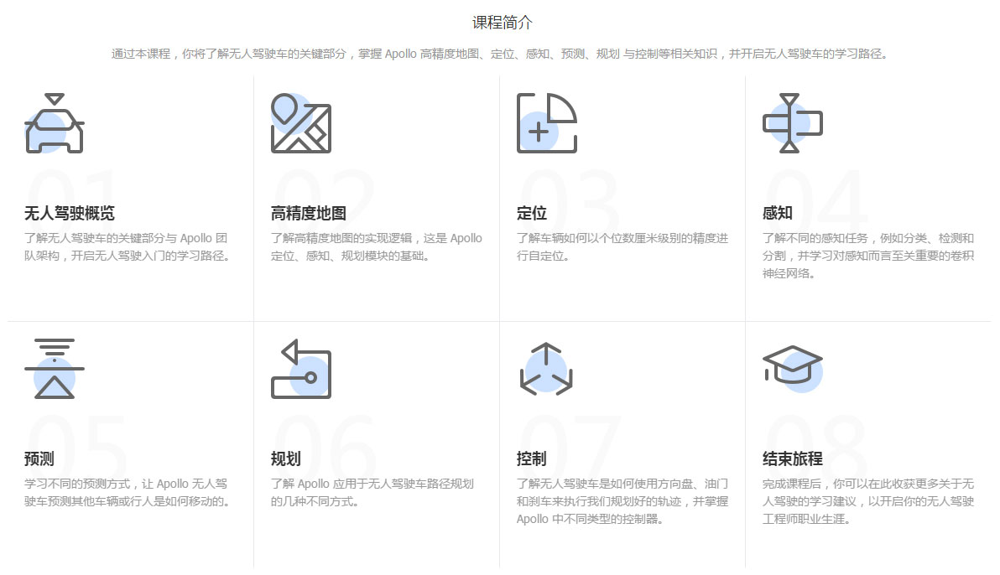
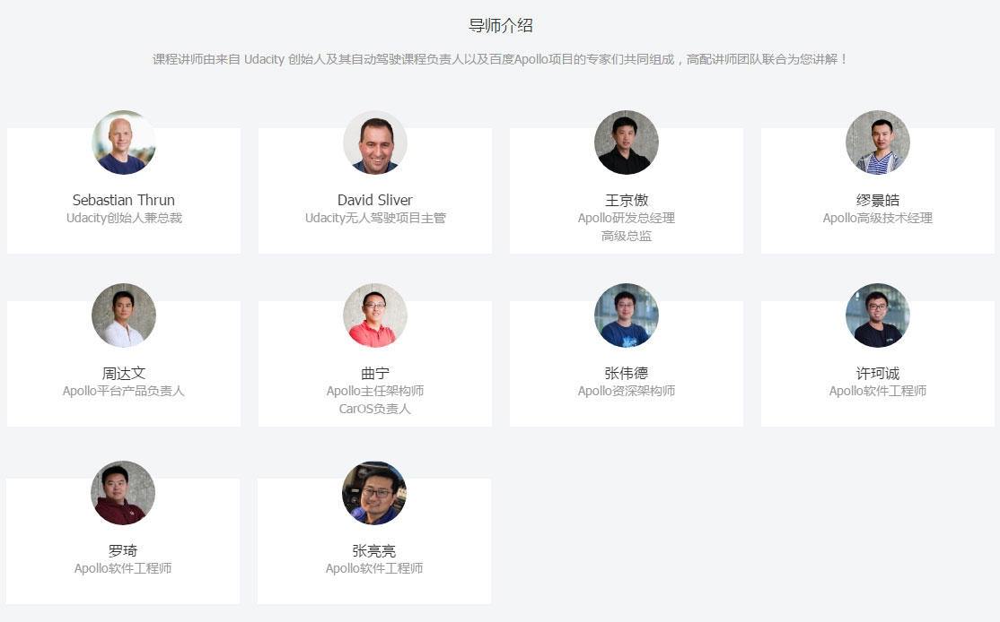

# 百度Apollo无人驾驶入门课程下载


## 本文提供

百度Apollo官网的无人驾驶入门课程下载，主要为视频文件。

视频数量：101个；文件格式：MP4；视频总时长：2小时40分钟；文件总大小：约1.13GB；

## 马上下载

关注公众号罗孚传说(RoverTang_com)，输入&#34;百度Apollo无人驾驶课程&#34;下载。

（不好意思啊，输入有点多，也有一定难度，考验一下大家）[捂脸]

## 为什么要下载？

我是因为不想浪费流量，不想卡顿，想随时打开手机看，想在地铁上也方便看。

如果你没有我的需求，请移步官网直接[在线观看](http://apollo.auto/devcenter/devcenter_cn.html)。

## 为什么推荐？

本视频作为无人驾驶的入门课程，超棒，可以让你系统性的了解无人驾驶，获得一个全面的知识体系认知。

课程中介绍了无人驾驶的高精度地图、定位、感知、预测、规划、控制这几个方面，视频虽然简短，每个两三分钟，但确实是现实的、不骗人的、让你少走弯路的课程。

总之，这是我（现阶段）见过的最佳无人驾驶入门课程，视频精美，制作优良，良心之作，值得推荐。

我感觉我无法用词语表达对此课程的推荐，鉴于本文推荐广告，请优达学院主动赠送我无人驾驶专业课程！（是不是有点不要脸？不好意思啊，我是认真的:）

## 你们有什么目的？

做任何事情确实一定有目的，就像百度Apollo和优达学院制作这门课程，免费让大家观看，目的比较多。

首先让大家入门无人驾驶，比较好听，其次提升百度Apollo这一开源项目知名度也对，再次优达学院多卖出几套无人驾驶专业课（分初级和中级两门专业课，每门六七千吧）也有可能。

我也有目的，就是我太爱分享了，获得分享后的快乐就是我的目的，顺便也为公众号吸一下粉[奸笑]

## 我做了什么？

1，在线视频文件下载到了本地，并分享给了大家。（你能做你也可以试试。内容通过JS动态加载，挺牛的）

2，整理了课程目录。(小事情不值得提啊)

3，观后感以及课程推荐！（观后感等我以后补充啊）

愿此课程带你入门无人驾驶:)





## 课程目录：

```
第一课：无人驾驶概览
课程简介： 了解无人驾驶车的关键部分与 Apollo 团队架构，开启无人驾驶入门的学习路径。
1.欢迎学习Apollo课程
2.你将学到什么？
3.什么是无人驾驶？
4.Sebastian欢迎辞
5.无人驾驶车的运作方式
6.Apollo团队与架构
7.参考车辆与硬件平台
8.开源软件架构
9.云服务
10.无人驾驶车纳米学位
11.开启专题学习之旅
第二课： 高精度地图
课程简介：了解高精度地图的实现逻辑，这是 Apollo 定位、感知、规划模块的基础。
1.地图简介
2.Sebastian介绍高精度地图
3.高精度地图vs传统地图
4.地图与定位、感知与规划的关系_a
5.地图与定位、感知与规划的关系_b
6.地图与定位、感知与规划的关系_c
7.Apollo高精度地图
8.Apollo高精度地图构建
9.课程综述
第三课：定位
课程简介： 了解车辆如何以个位数厘米级别的精度进行自定位。
1.定位简介
2.Sebastian介绍定位
3.GNSSRTK_a
4.GNSSRTK_b
5.惯性导航_a
6.惯性导航_b
7.激光雷达定位
8.视觉定位
9.Apollo定位
10.项目示例:被盯上的小车
11.课程综述
第四课：感知
课程简介： 了解不同的感知任务，例如分类、检测和分割，并学习对感知而言至关重要的卷积神经网络。
1.感知简介
2.Sebastian介绍感知
3.计算机视觉
4.摄像头图像
5.LiDAR图像
6.机器学习
7.神经网络
8.反向传播算法
9.卷积神经网络
10.检测与分类
11.跟踪
12.分割
13.Apollo感知
14.传感器数据比较
15.感知融合策略
16.项目示例：感知与融合
17.课程综述
第五课：预测
课程简介： 学习不同的预测方式，让 Apollo 无人驾驶车预测其他车辆或行人是如何移动的。
1.预测简介_a
2.预测简介_b
3.Sebastian介绍预测
4.不同的预测方式
5.基于车道的预测
6.障碍物状态
7.预测目标车道
8.递归神经网络
9.递归神经网络在目标车道预测的应用
10.轨迹生成
11.课程综述
第六课：规划
课程简介：了解 Apollo 应用于无人驾驶车路径规划的几种不同方式。
1.规划简介
2.Sebastian介绍规划
3.路由
4.世界到图
5.网格世界_a
6.网格世界_b
7.网格世界_c
8.A*
9.从路由到轨迹
10.3D轨迹
11.评估一条轨迹_a
12.评估一条轨迹_b
13.Frenet坐标
14.路径-速度解耦规划
15.路径生成与选择
16.ST图
17.速度规划
18.优化
19.路径-速度规划的轨迹生成
20.Lattice规划
21.ST轨迹的终止状态
22.SL轨迹的终止状态
23.Lattice规划的轨迹生成
24.项目示例:路径规划
25.课程综述
第七课：控制
课程简介：了解无人驾驶车是如何使用方向盘、油门和刹车来执行我们规划好的轨迹，并掌握 Apollo 中不同类型的控制器。
1.控制简介
2.Sebastian介绍控制
3.控制流程_a
4.控制流程_b
5.PID控制_a
6.PID控制_b
7.PID控制_c
8.PID优劣对比
9.线性二次调节器
10.模型预测控制
11.时间范围与车辆模型
12.MPC优化
13.MPC优劣对比
14.项目示例：控制
15.课程综述
第八课：结束旅程
课程简介：完成课程后，你可以在此收获更多关于无人驾驶的学习建议，以开启你的无人驾驶工程师职业生涯。
1.恭喜你完成课程学习
2.Sebastian祝贺辞
```

本文飞书文档：[百度Apollo无人驾驶入门课程下载](https://rovertang.feishu.cn/docx/doxcnyaH1cy8SRf6Uwmx7t8bAUg)


---

> 作者: [RoverTang](https://rovertang.com)  
> URL: https://blog.rovertang.com/posts/car/20180728-baidu-apollo-driverless-introductory-course-download/  

