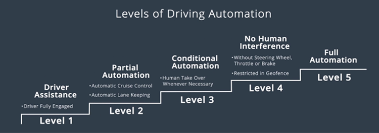
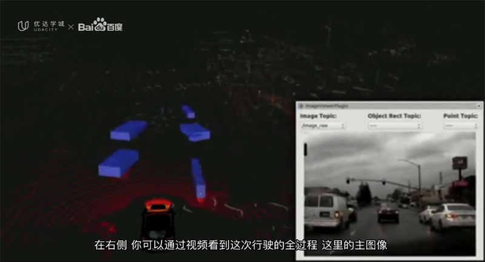
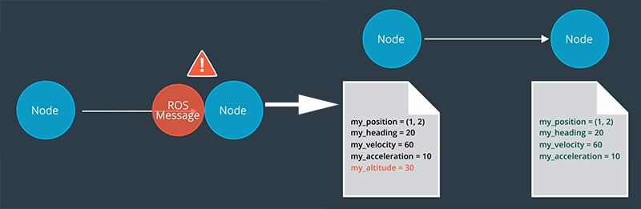

# 无人驾驶入门1：无人驾驶概览

最近给大家分享了《[百度Apollo无人驾驶入门课程下载](https://rovertang.com/baidu-apollo-unmanned-introductory-course-download/)》，我也学习了一些，把我做的笔记分享给大家。

第一课：无人驾驶概览

课程主要介绍了无人驾驶车的关键部分以及Apollo的架构，带大家入门无人驾驶技术。

1.欢迎学习Apollo课程

略

2.你将学到什么？

课程概述，略。

 

## 3.什么是无人驾驶？

**我们为什么需要无人驾驶？**

主要是三个方面：

**1、安全**：人们驾车时分心走神是车祸的主要原因，但自动驾驶车不会分心走神，不会疲倦。(今天儿子说无人驾驶车也会累，它累的时候就是充电，好吧，你比爸爸更懂无人驾驶车

**2、不再需要驾车培训和考试**：人们驾车需要经过驾校培训，所有人都需要从0开始学习，驾车经验无法传承，但无人驾驶车可以自学和复制，不仅仅在驾驶过程中不断得到学习，而且还可以将学习积累的成果复制给其他车辆。

**3、方便**：即便驾车有愉悦感，但找停车位很痛苦，相信大家都有这样的感触，而无人驾驶车，将会和坐出租或滴滴一样，在你需要到达的地方停车，你下车后它再自己去寻找停车位。在你需要用车时，只要召唤它，它就会来到你的身边，超级方便。(感觉像不像勇士在召唤神龙？下次介绍特斯拉的召唤功能。)

【无人驾驶同人类驾驶的优势对比)】

**自动驾驶的等级划分**

SAE标准将自动驾驶技术分为0~5共六个级别。

L0是完全由驾驶员控制，可能连ABS防抱死功能都没有，现在已经很少见L0级的车辆了。

L1是驾驶员辅助，车辆提供转向或加速等支持，如定速巡航功能。本级别需要驾驶员全神贯注开车。

L2是部分自动化，如ACC自适应巡航控制、LKAS车道保持辅助系统等。驾驶员需要实时监控并做好接管的准备。

L3是有条件的自动化，据说奥迪A8L就属于此级别。驾驶员此时可以基本不干预驾驶，但仍然需要随时接管车辆驾驶。

L4是高度自动化，是无人驾驶的真正开始，此时不需要人类介入，可以没有方向盘或油门、刹车等控制装置，原则上只要有地图的地方就能实现自动驾驶。百度Apollo已经开始量产此方案，在限定园区环境下的L4无人驾驶，阿波龙应该就是。

L5是完全自动化，车辆可以完全自动驾驶，只要人类能到的地方，无人驾驶车一样可以到达，甚至比人类更高效更安全。

【自动驾驶技术的6个级别】

关于自动驾驶的等级划分，后续我再专门写一篇文章。

4.Sebastian欢迎辞

略。

## 5.无人驾驶车的运作方式

这篇是David silver在TED的演讲，但看完这9分钟的视频，基本可以了解无人驾驶的运作方式，是最基础的入门课，强烈建议0基础人员学习。

**无人驾驶总共有五个重要的单元，分别是：计算机视觉、传感器融合、定位、路径规划、控制。**

【无人驾驶的5个重要单元】

计算机视觉用来寻找车道、车辆、行人、红绿灯等对象，并能有效的区分车道线、车辆数量、红绿灯信号等信息，计算机视觉类似于人类的眼睛，看懂周围的世界。

【计算机视觉分析】

传感器融合是用来加深对视觉的理解，获得车辆距离、其他物体的移动速度等信息，了解自身同周围世界的关系。

【传感器融合分析】

定位，不是简单的GPS定位，无人驾驶需要厘米级的定位，米级误差的GPS无法满足要求，所以还需要自定位技术，需要借助地标，使用粒子滤波、三角测量等方式进行定位。

【模拟定位】

路径规划也不是简单的导航软件中的航线计算，导航地图的路径规划是全局概要规划，指引无人车前往哪里，而自车本身还需要通过对周围车辆和事物的判断，形成自己位姿的路径规划，通过车辆位姿的调整，避免同其他车辆或事物的碰撞，同时也影响驾乘的舒适度(比如对刹车的影响)。

【路径规划】

控制是无人驾驶的最后一步，简单的来说就是控制方向盘、刹车、油门、车灯等设备，但通过控制获得的行车路径，和路径规划中的理想路径，如何完全吻合，也同样充满了考验，只是对于电脑来说相对简单，它们可以做到两者非常的接近，而人类操作实际上比较难(侧面说明现在车道宽度较宽:)。

【控制模拟】

个人的总结：摄像头让车辆看清周围的事物，雷达等传感器让车了解自身同周围物体的关系，通过地标(高精度地图中的特征)定位获得车辆厘米级定位，结合GPS定位(绝对定位)，可以获得车辆在高精度地图中的绝对位置。路径规划既需要turn by turn的道路级路径规划，也需要通过自车同周围事物的距离速度等信息判断，做出自车位姿的路径规划，前者是大方向，后者是细节操作，而控制就是为了实现同规划路径的吻合。至此，车辆就可以完成一次从起点到终点的完整行程。

6.Apollo团队与架构

略。

## 7.参考车辆与硬件平台

做无人驾驶开发，就需要一辆可以通过电子控制的车辆，原来驾驶员对方向盘、油门刹车等的物理控制，变成了电子信号控制，这样的车辆就叫做线控驾驶车辆。(欢迎浏览“[聊聊用机器人做无人驾驶](https://rovertang.com/talk-about-using-robots-for-driverless-driving/)”一文)

这样的车辆可以通过控制器区域网络(CAN总线)向车辆发送加速、制动和转向信号等信息，通过GPS可以获得绝对位置信息，通过惯性测量装置(IMU)可以获得车辆运动速度、加速度和位置等信息，通过激光雷达可以获得位置点云信息，通过摄像头捕获图像信息，通过雷达了解障碍物信息。当然，还有不可或缺的电脑，他是无人驾驶的大脑。

摄像头、GPS、IMU、激光雷达、雷达以及PC等，这些是无人驾驶所需要的硬件平台。

【无人驾驶硬件平台】

## 8.开源软件架构

开放软件架构共分为三层：实时操作系统、运行时的框架和应用程序模块层。

实时操作系统(RTOS)可以确保在给定时间内完成特定任务，实时指的是能够进行及时分析操作。Apollo RTOS是由Ubuntu Linux加Apollo内核组成。

【RTOS】

运行时的框架是Apollo的操作环境，它是ROS(机器人操作系统)的定制版，即Apollo将ROS作为在RTOS上运行的软件框架。

【ROS】

Apollo团队对ROS进行了改进，如：共享内存的功能和性能、去中心化、数据兼容性等。

共享内存：原来各模块之间同一内容的使用可能需要复制内存，共享内存支持“一次写入 多次读取”模式，支持多个模块的使用。

【共享内存】

去中心化解决了单点故障问题，原来ROS的各个模块都需要由ROS的主节点来控制，一旦主节点出现问题，那么整个系统也就无法运行了，Apollo改为将所有节点放在一个公共域中，域中每个节点都有关于其他节点的信息，公共域取代原有ROS的主节点，消除了单节点故障的风险。

【去中心化】

数据兼容性方面，原来ROS不同模块之间的通讯是通过名为ROS消息的接口语言进行相互通信的，一旦这个消息格式有所变化，则两个节点间的通讯就会失败， Apollo团队将ROS消息改成了名为protobuf的接口语言，protobuf是一种结构化数据序列化方法，通信过程中即便消息格式升级了，也能在解析过程中接受旧的消息格式，此举有效解决了兼容性问题。

【数据兼容性改进】

应用程序模块包括地图引擎、定位、感知、规划、控制、端到端的驾驶以及人机接口(HMI)等。

【应用程序模块】

## 9.云服务

Apollo提供了云端服务功能，只要你能联网并拥有许可账户，即可同云端进行通信，不仅仅可以完成数据的存取访问，也可以获得软件服务，包括高精度地图、仿真环境、数据平台、安全、空中升级软件以及DuerOS等。

【云服务内容】

仿真平台聚合了大量驾驶数据，可以是开发人员能够检测和验证无人驾驶软件系统，仿真平台不仅仅可以提供大量的数据模拟，更可以通过等碰撞检测、交通灯识别、速度限制、障碍物检测、路线逻辑等指标对实现结果进行评估。

数据平台为仿真平台提供了大量的数据，这部分数据可以是从真实驾驶环境记录获得，也可以是虚拟生成的数据，前者可以通过已获得的结果进行算法等验证，后者可以快速搭建验证某一算法的环境。在验证算法过程中，可能需要带有标签注释的数据，即已获得已知结果的数据，比如交通信号灯、带边界的障碍物、语义分割数据等。

【带有标签注释的数据】

10.无人驾驶车纳米学位

学完本次免费课程觉得不过瘾，可以付费去优达学院学习专业课程，不仅仅获得的技能更强，同时也可以作为履历的一部分。(此处应该由优达学院支付广告费

11.开启专题学习之旅

略。

好了，至此，你是否对无人驾驶有了更清晰的了解呢？欢迎大家关注我的公众号罗孚传说(RoverTang_com)，输入“百度Apollo无人驾驶课程”下载课程视频，也可以访问[原文](https://rovertang.com/baidu-apollo-unmanned-introductory-course-download/)了解更多信息。

本文飞书文档：[无人驾驶入门1：无人驾驶概览](https://rovertang.feishu.cn/docx/doxcnsqNhSu3zqHD7MrEE0q5M9e)

---

> 作者: [RoverTang](https://rovertang.com)  
> URL: https://blog.rovertang.com/posts/car/20180825-getting-started-with-driverless-1-driverless-overview/  

