# 无人驾驶入门2：高精度地图

# [20180908]无人驾驶入门2：高精度地图

自从上次发布了《无人驾驶入门1：无人驾驶概览》，就收到了不少的鼓励和鞭策，包括前领导的肯定。那我们赶紧来学习第二课关于高精度地图的课程吧。

第二课： 高精度地图

课程简介：了解高精度地图的实现逻辑，这是 Apollo 定位、感知、规划模块的基础。

1.地图简介

略

2.Sebastian介绍高精度地图

略

 

## 3.高精度地图vs传统地图

传统地图能够拥有导航路径规划、拥堵信息提示、多条路径规划的时间等信息，甚至可以获得路口是否有信号灯、道路上是否有测速照相等信息。

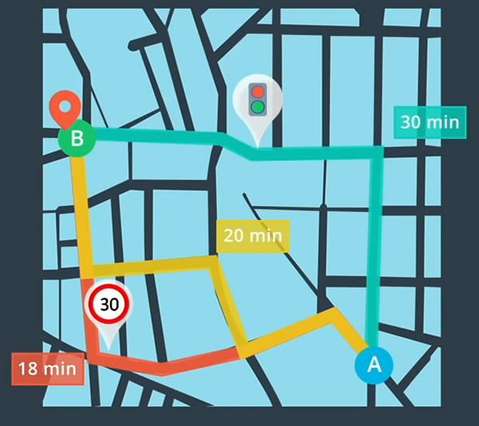

【传统地图示意】

高精度地图更包含了大量驾驶辅助信息，其中最重要的就是道路网的精确三维表征，比如交叉路口布局和路标位置等信息，高精度地图还包含了很多语义信息，包括信号灯颜色定义、道路限速信息、车辆转弯开始位置等。

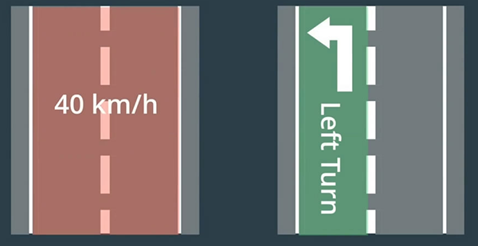

【高精度地图中的限速和转弯示意】

高精度地图区别于传统地图的一个重要特征就是精度，传统地图只能有米级的精度，对于车辆来说，米级的精度是完全不够的。高精度地图做到了厘米级的精度，这对于确保无人驾驶的安全性至关重要。

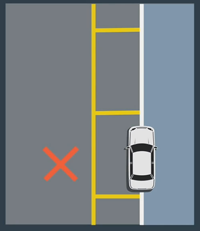

【传统地图的精度无法满足无人驾驶】

 

## 4.地图与定位、感知与规划的关系_a

高精度地图是无人驾驶的核心组成部分，很多模块都依赖高精度地图。

高精度地图的一个重要功能就是自定位，拿定位和拼图来打比方，当你拿到一小块拼图，你是否能在地图中找到这个拼图所在的位置呢？

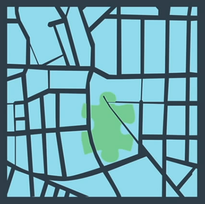

【车辆当前位置附近地图是高精度地图的一小块拼图】

无人驾驶需要知道自身所在地图的位置，首先车辆就需要寻找地标，车辆通过摄像头、雷达等传感器获得的信息同高精度地图上已知地标进行比较。

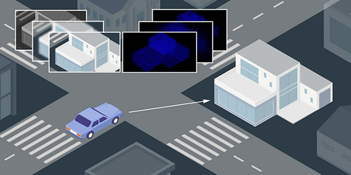

【车辆寻找标记进行定位】

这一匹配过程需要经过预处理、坐标转换、数据融合这几个复杂过程。预处理来消除不准确或质量差的数据，坐标转换将来自不同视角的数据转换为统一的坐标系，借助数据融合可以将来自各种车辆的传感器数据合并。

定位就是通过这几个复杂的过程完成的，通过高精度地图可以让车辆了解自身的位置。

 

## 5.地图与定位、感知与规划的关系_b

无人驾驶车可以使用高精度地图来帮助感知，车辆的传感器就像是人类的眼睛、耳朵，但同样会受到外界条件的影响，比如恶劣天气、夜间等，另外如果遇到障碍物，感知是无法了解障碍物背后的物体。

正因为如此，一方面地图可以帮助传感器提前预知事物位置，另一方面地图可以帮助传感器缩小检测范围，即让传感器仅检测感兴趣区域(ROI)。ROI可以提高传感器检测精确度和速度，可以节约计算资源。

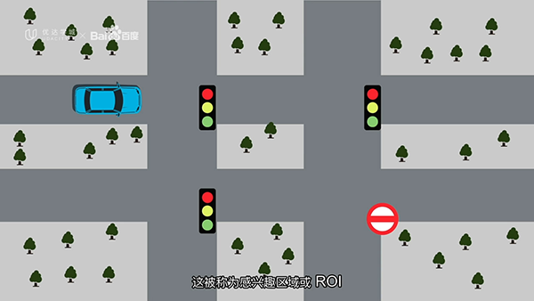

【感兴趣区域ROI】

 

## 6.地图与定位、感知与规划的关系_c

高精度地图可以帮助车辆寻找合适的行车路线，可以帮助确定不同路线的选择，还能确定道路上其他车辆将来的位置。

比如高精度地图已经精确到车道线，所以车辆尽可能沿着车道中心线行驶；比如在人行横道、减速带等区域，通过高精度地图可以提前预知，提前减速；比如前方遇到障碍物需要变道，高精度地图可以帮助其缩小选择范围，获得最佳变道方案。

 

## 7.Apollo高精度地图

高精度地图专为无人驾驶设计，提供了道路定义、交叉路口、交通信号、车道规则以及汽车导航的其他元素，可以为无人驾驶车提供多方面的帮助。

比如高精度地图记录了信号灯的精确位置和高度信息，从而降低了感知难度。

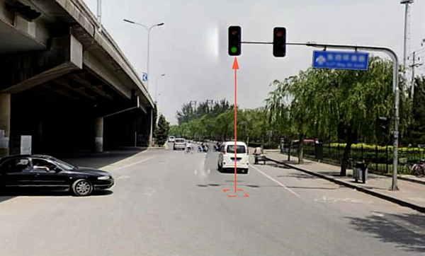

【交通信号灯位置和高度信息】

地图更新是高精度地图中的一项重要工程，需要很多的作业车辆，对高精度地图不断进行验证和更新，同时要达到厘米级的精度，这需要非常高的制图技术。

高精度地图有很多格式，不同的格式就会导致系统的不兼容，为了便于共享，Apollo采用了OpenDrive格式，这是行业制图标准格式。

百度Apollo还开发了一套完善的采图绘图系统，其中90%的地图绘制流程实现了自动化。

 

## 8.Apollo高精度地图构建

高精度地图的构建由五个过程组成：数据采集、数据处理、对象检测、手动验证和地图发布。

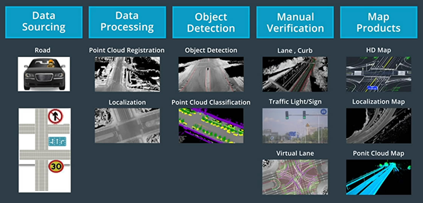

【高精度地图的五个构建过程】

数据采集是一个巨大的工程，百度Apollo拥有近300辆专业车辆用于数据源采集，当然，这些数据采集车不仅仅用于数据采集，对于地图的维护和更新也非常的重要，他可以及时的更新地图数据。

专业车辆具有角度的传感器，比如GPS、惯性测量单元(IMU)、激光雷达和摄像机，Apollo定义了一个硬件框架，将这些传感器集成到单个自主系统中，通过将这些数据的融合，最终生成高精度地图。

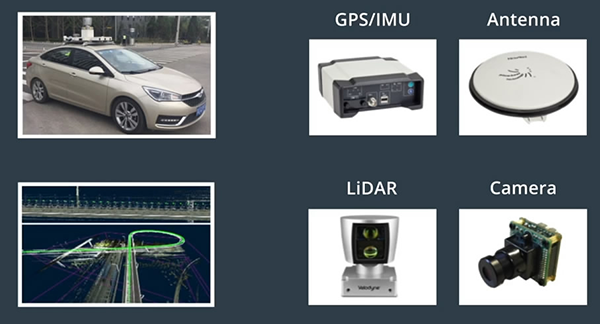

【配备了硬件设备的采集车】

数据处理是指对手机的数据进行整理、分类以及清洗的过程，以获得没有任何语义信息或注释的初始地图模板。

对于对象检测，Apollo团队使用人工智能来检测静态对象并对其进行分类，包括车道线、交通标志甚至电线杆。

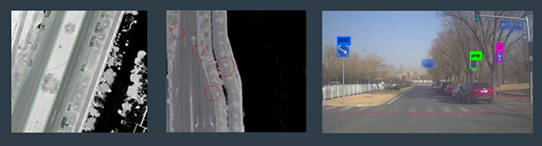

【对象检测】

手动验证可以确保自动地图创建过程正确并及时发现问题。

经过了上述过程的处理，地图可以进行发布，除了发布高精度地图，Apollo还发布了采用自上而下视图的相对定位地图以及三维点云地图。

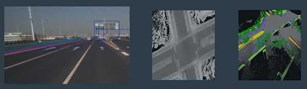

【相对定位地图和点云地图】

在构建和更新地图的过程中，Apollo使用了众包，任何人都可以通过百度发布的工具参与制作高精度地图的任务，Apollo高精度地图众包可以通过智能手机、智能信息娱乐系统甚至是其他无人驾驶车来实现。

9.课程综述

略

 

## 课后小结

虽然个人从事导航地图已有十年，但学习高精度地图课程还是有不少的启发。

### 首先，高精度地图可以自定位。

这一点打破了原有的认知，或者需要转换一个角度来思考。

对于传统地图，都是真实世界的绝对位置地图，我们假定数据公司采集的地图都是真实准确的。而在导航软件中，获得GPS定位信号，再同地图进行匹配，可以即时获得地图中的定位信息，也就是知道了你在世界的哪个角落。GPS是一种传感器，但已经非常成熟，包括硬件和算法的成熟以及系统的稳定。所以，我们会认为地图定位非常容易，借助外部GPS即可。

而高精度地图，除了传统地图功能外，还可以通过地图中的特征(本视频中的地标，或其他公司所谓的指纹)，进行自定位。既需要地图中的数据支持，也需要借助外部的传感器，这个传感器不是GPS，而是摄像机、雷达等，而其中的定位匹配算法并不像GPS定位算法这么简单，这也是无人驾驶技术中所需要克服的难题之一。

 

### 其次，高精度地图是三维的。

传统地图是二维的，以点线面为主，一方面本身不需要红绿灯、路灯等各种特征对象的高度信息，另一方面高程信息在导航中的应用并不多，显示建筑3D、高架立起或者山丘欺负，仅仅起到美观作用罢了。

而高精度地图，除了自定位的需要，同时还需要还原真实的世界，不仅仅需要认清可行驶的车道线，也需要识别马路牙子、隧道桥洞等信息。

 

### 再次，高精度地图的构建需要众包

传统地图的构建，基本都是地图数据公司作业车采集的成果，众人所能提供的信息，也仅仅是反馈。以前的离线地图更新，需要等待一个版本，一般至少要等一个季度，而即便现在的在线地图，从反馈、验证、修正到发布，也至少要数天的时间。我们仅仅是一个使用者，而无法成为创建者。

对于高精度地图来说，一个季度的更新实在太久，更新的频度是无法满足需求的。同时，高精度地图依然需要专业车辆的采集，作为专业数据输入源，但每一个自动驾驶车辆，又是数据贡献源，因为无人驾驶车的地图自定位同地图采集是想通的，甚至由于算法的一致性，数据验证也将变得简单。

基于此，更需要高精度地图众包，让众人参与到地图构建中，只为更精准的高精度地图数据。

既然opendrive format是开放的，那么谁会来主导一个类似openstreet map的众包项目呢？拭目以待。

本文飞书文档：[无人驾驶入门2：高精度地图](https://rovertang.feishu.cn/docx/doxcnQueOr1aJX9fRrZQvBWV7vd)

---

> 作者: [RoverTang](https://rovertang.com)  
> URL: https://blog.rovertang.com/posts/car/20180908-introduction-to-driverless-2-high-precision-map/  

