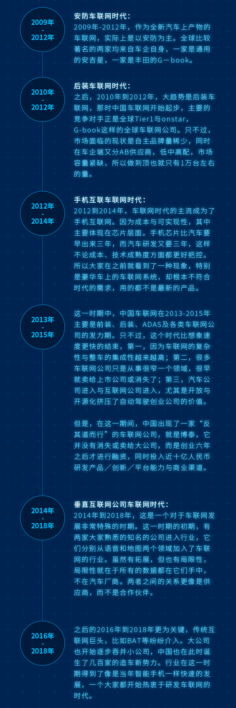

# 认识车联网

## 什么是车联网？

说了很多年的车联网，但大家对车联网的认识不尽相同。最浅显的认识，认为将平板电脑放到车内，就是车联网。最宽泛的认识，认为车联网是一个汽车生态，是基于车的移动互联网络。这些认识似乎都有一些片面。

中国汽车工程学会发起成立的“车联网产业技术创新战略联盟”对车联网的定义，是以车内网、车际网和车载移动互联网为基础，按照约定的通信协议和数据交互标准，在V-X（X：车、路、行人及互联网等）之间，进行无线通讯和信息交换的大系统网络，是能够实现智能化交通管理、智能动态信息服务和车辆智能化控制的一体化网络，是物联网技术在交通系统领域的典型应用。

## 车联网的组成

车联网既然由物联网引申而来，那么也离不开“端”、“管”、“云”三者。

### 端，指的是终端

是整个车辆，包括车辆传感器、通讯终端等设备，它们可以采集获取车辆信息、接收云端指令、实现车和内外连接等功能。所以端不是一个简单的平板电脑，也不是一个可以联网的T-box。

### 管，就是管道

既是连通云和端的管道，也是车内传感器的管道，前者是移动互联网络，包括4G、5G等，后者是总线，车内连接各设备并统一管理传输的控制系统。当然，普遍认为管是LTE-V的原因，是把整个车作为了端。

### 云，是云系统、云平台

不是简单的云端服务器，而是能够实现同终端交互的在线系统，可以连接车企、4S店、保险、救援、汽配、租赁以及内容提供商等各个渠道，云是围绕端的海量信息汇聚。

## 车联网为什么没有火？

虽然车联网概念提出已经有很多年，但一直没有火起来，究其原因，可能有这几个方面。

### 首先是网络瓶颈。

车联网需要带宽和速度，基于GPRS的交互是很难想象的。好在这些年的网络建设得到了大幅的发展，4G已经全面普及，基本能够满足车联网的需求(无人驾驶等更高网络带宽和速度需求的应用除外)，加上国家提速降费的政策牵引，应该说网络瓶颈得到了较好的解决，加上现在5G网络建设的推动，网络将不再是我们的瓶颈。网络高速公路已经铺好，才能促进整个车联网行业的发展。

### 其次是硬件和系统。

早些年的时候，导航等应用还基于WINCE，而WINCE系统是封闭的需要付费的，甚至连部分硬件的驱动都需要自己写的，而那时候内存又是稀缺的，还在争论使用64M还是128M内存，以便取得平衡。现在，Android大行其道，改变了硬件生态，也促进了软件繁荣，在统一的OS引领下，开发也变得容易并具备延展性。移动互联网的繁荣，带动了车联网的演进，现在即便低端的车型也能用上带触屏的车载中控系统啦。

### 再次就是没有真正分析用户的需求。

上述管和端的问题，基本得到了解决，但为什么仍然没有得到飞速的发展？那就是思维上的软肋。车企是严谨的，但也是封闭的，在新事物的接受上，是比较保守的，好在这些年互联网公司的进入和无人驾驶技术的推进，反向推动了车企的变革。我们的汽车终于开始迈向网络了，从这些年车载中控系统的演进也能看出这一点的变化。当然，远程点火、远程开空调、和呼叫中心美眉聊聊天等，是不能满足用户车联网需求的，应该还有更多的应用和需求出现。特斯拉、蔚来等新兴车企，为我们树立了较好的榜样。

## 车联网的未来

### 用户争夺战不可避免。

既然车是车联网的端，就像APP是移动互联网的入口一样，那么对用户的争夺不可避免。谁获得了用户，获得了用户的数据，获得了用户流量，谁才能成为车联网领域的霸主。车和手机的不同之处在于，车的更换频率没有那么高，车的开放性远没手机高(手机可以随便装APP)，正是这样的原因，现在全民造车热，目的就是想要抢夺用户，抢夺入口。

### V2X是很美好的事物。

V2X是V2V、V2R、V2I、V2P等概念的统称，是车和车、人、路的互联。试想你和朋友相约自驾，朋友的车半路告诉你的车，当前道路堵了，你绕道而行吧，这就是V2V的通信。当全面无人驾驶后，汽车会主动给您发消息说，主人您将在5分钟后下班，车辆空调已经为您开启。智能汽车在那个时代，不再只是工具，而是我们社会的一员，可以在车辆之间、车和人、车和道路之间互动的成员。

### 谁为客户考虑，谁能赢得未来。

曾看过一篇文章，说了家里奔驰车和特斯拉车的使用感受，奔驰车的导航地图已经两年没有更新了，但特斯拉的地图一直是免费更新的，奔驰车的ACC功能也没有更新，但特斯拉的自动驾驶已经由80公里时速提升到了150公里时速，奔驰车的检查是需要去4S店排队的，而特斯拉的检查是先远程检查再和你预约的，至于召唤进出停车位等功能，暂时也只在能特斯拉车上发现。从客户角度出发，才能赢得客户，才能赢得真正的未来。

车联网正在改变着车的世界，我们应该如何打造深受用户喜爱的车联网应用，这是一个值得深思的问题。

 

在完成本篇文章之时，Pateo公司发布了一篇《[极简车联网发展史](https://www.pateo.com.cn/zh/news_detail.html?id=570)》，虽然更多的是公司历史的介绍，但从中也窥探出中国车联网发展的真实历史。

未来的车联网一定是Pateo所言的“合作、开放、整合”的生态圈。

附Pateo文中发展史截图：

本文飞书文档：[认识车联网](https://rovertang.feishu.cn/docx/doxcnryvfptHtd5wAGREr1juHBe)

---

> 作者: [RoverTang](https://rovertang.com)  
> URL: https://blog.rovertang.com/posts/car/20180909-understanding-the-internet-of-vehicles/  

