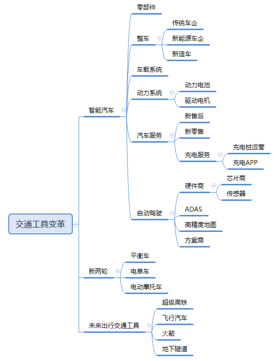
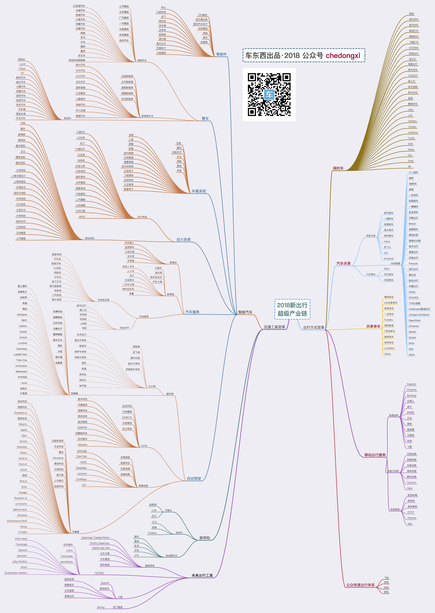

# 新出行超级产业链之交通工具变革(网址导航)

一直想做一个“车圈导航”，旨在收集同汽车相关的网址导航，幸运的是车东西已经整理了一份较完美的“新出行超级产业链”，我根据该文件搜寻了相关企业的网址，现将整理的网址分享给大家。希望这份网址导航能够帮助大家迅速找到相关技术公司，并通过他们的网站了解相关的技术，以及在不同公司之间做出对比，希望能给大家带来益处。

PS：阅读原文直达“车圈导航”网址页面，也可以直接下载原图。

## 关于交通工具变革的大纲如下：

## “新出行超级产业链”图如下：

## 网址列表如下：

### 整车之传统车企
|企业名称|网址|
|----|----|
|上汽集团|http://www.saicmotor.com/|
|北汽集团|http://www.baicgroup.com.cn/|
|广汽集团|http://www.gac.com.cn/|
|一汽集团|http://www.faw.com.cn/|
|长安集团|http://www.ccag.cn/|
|东风集团|http://www.dfmc.com.cn/|
|吉利汽车|http://www.geely.com/|
|比亚迪|http://www.bydauto.com.cn/|
|长城汽车|http://www.gwm.com.cn/|
|奇瑞汽车|https://www.chery.cn/|
|江淮汽车|http://www.jac.com.cn/|
|华晨汽车|http://www.brilliance-auto.com/|
|众泰汽车|http://www.zotye.com/|
|奔驰|https://www.mercedes-benz.com/|
|宝马|https://www.bmw.com|
|奥迪|https://www.audi.com|
|大众|http://www.vw.com/|
|福特|https://www.ford.com/|
|通用|https://www.gm.com/|
|沃尔沃|https://www.volvocars.com/|
|菲亚特克莱斯勒|https://www.fcagroup.com|
### 整车之新能源车企
|企业名称|网址|
|----|----|
|云度新能源|http://www.yudoauto.com/|
|北汽新能源|http://www.bjev.com.cn/|
|国能新能源|https://www.nevs.com|
|银隆新能源|http://www.zhyle.com/|
|知豆新能源|http://www.evcar.com/|
|容大汽车|http://www.cenntroauto.cn|
|中兴汽车|http://www.zxauto.com.cn/|
|长江汽车|http://www.changjiangev.com/|
|合众汽车|http://www.hozonauto.com/|
|国机智骏|http://www.zhijunauto.com/|
|敏安汽车|http://www.jsminan.com/|
|小康股份|http://www.yuanchina.com|
|电咖汽车|http://www.dearcc.cn/|
|华人运通|http://www.huarenyuntong.com/|
|零跑汽车|https://www.leapmotor.com/|
### 整车之新造车势力
|企业名称|网址|
|----|----|
|特斯拉|https://www.tesla.com/|
|蔚来汽车|https://www.nio.com/|
|Lucid|https://lucidmotors.com/|
|Fisker|https://www.fiskerinc.com/|
|FF(法拉第未来)|https://www.ff.com/|
|威马汽车|https://www.wm-motor.com/|
|小鹏汽车|https://www.xiaopeng.com/|
|BYTON(拜腾汽车)|https://www.byton.com/|
|游侠汽车|http://www.youxiamotors.com/|
|前途汽车|http://www.qiantumotor.com/|
|奇点汽车|https://www.singulato.com/|
|车和家|https://www.chehejia.com/|
|爱驰亿维|http://www.ai-ways.com/|
|开云汽车|http://www.kaiyunmotors.com/|
### 无人驾驶之方案商
|企业名称|网址|
|----|----|
|百度阿波罗(Apollo)|http://apollo.auto/|
|禾多科技|http://www.holomatic.com|
|腾讯|https://www.tencent.com/|
|Momenta|https://www.momenta.ai/|
|景驰科技|http://jingchi.ai/|
|主线科技|http://trunk.tech/|
|智行者|http://www.idriverplus.com|
|小马智行|https://www.pony.ai/|
|驭势科技|https://www.uisee.com/|
|DeepMotion(深动科技)|https://deepmotion.ai/|
|领骏科技|http://www.leadgentech.ai/|
|Roadstar.ai|http://roadstar.ai/|
|图森未来|http://www.tusimple.com/|
|Waymo|https://waymo.com/|
|Apple|https://www.apple.com|
|Uber|https://www.uber.com|
|AURORA|https://aurora.tech/|
|Mobileye|https://www.mobileye.com/|
|nauto|https://www.nauto.com/|
|Drive.ai|https://www.drive.ai/|
|Nuro|https://nuro.ai/|
|AutoX|https://www.autox.ai/|
|滴滴(DiDi)|http://www.didi-labs.com|
|PlusAI(智加)|http://plus.ai|
|Zoox|https://zoox.com/|
|Voyage|https://voyage.auto/|
|nuTonomy|https://www.nutonomy.com/|
|Renovo|https://renovo.auto/|
|AImotive|https://aimotive.com/|
|AutonomouStuff|https://autonomoustuff.com/|
|NAVYA|http://navya.tech/|
|Cyngn|https://cyngn.com/|
|Phantom AI|https://phantom.ai/|
### 无人驾驶之高精度地图商
|企业名称|网址|
|----|----|
|四维图新|http://www.navinfo.com/|
|高德|http://www.autonavi.com/|
|易图通|http://www.emapgo.com.cn/|
|Here|http://www.here.com|
|中海庭(武汉光庭)|http://www.kotei-info.com/|
|极奥科技|http://www.geoinfonet.com/|
|Ushr|http://www.ushrauto.com/|
|Civil Maps|http://civilmaps.com/|
|Mapper|http://mapper.ai/|
|DeepMap|http://www.deepmap.ai/|
|lvl5|http://lvl5.ai/|
|百度地图|http://lbsyun.baidu.com/|
|Carmera|https://www.carmera.com/|
|宽凳科技|http://www.kuandeng.com/|
|TOMTOM|https://www.tomtom.com/|
### 无人驾驶之ADAS
|企业名称|网址|
|----|----|
|纵目科技|http://www.zongmutech.com/|
|中科慧眼|http://www.smartereye.com/|
|MINIEYE|http://www.minieye.cc/|
|东软集团|https://www.neusoft.com|
|径卫视觉|http://www.roadefend.com/|
|苏州智华|http://www.invo.cn/|
|天瞳威视|http://www.calmcar.com/|
|清智科技|http://www.tsintel.net/|
|南京创来|http://chuanglaitech.cn/|
|极目智能|http://www.jmadas.com/|
|好好开车|http://www.nicigo.com/|
|双髻鲨科技|http://www.shuangjisha.com/|
|Maxieye(智驾科技)|http://www.maxieyetech.com/|
### 无人驾驶之硬件芯片商
|企业名称|网址|
|----|----|
|博世|https://www.bosch.com|
|恩智浦|https://www.nxp.com|
|英飞凌|https://www.infineon.com|
|德州仪器|http://www.ti.com/|
|美光科技|https://www.micron.com/|
|安森美半导体|http://www.onsemi.com|
|东芝电子|https://toshiba-semicon-storage.com|
|意法半导体|https://www.st.com|
|联发科|https://www.mediatek.com/|
|瑞萨电子|https://www.renesas.com|
|罗姆半导体|https://www.rohm.com/|
|高通|https://www.qualcomm.com/|
|英伟达|https://www.nvidia.com|
|英特尔|https://www.intel.com|
|地平线|http://horizon.ai/|
### 无人驾驶之传感器厂商
|企业名称|网址|
|----|----|
|电装|https://www.denso.com|
|博世|https://www.bosch.com|
|法雷奥|https://www.valeo.com/en/|
|采埃孚|https://www.zf.com|
|德尔福|https://www.delphi.com/|
|奥托立夫|https://www.autoliv.com/|
|先锋电子|http://www.pioneerchina.com/|
|大陆集团|https://www.continental-corporation.cn|
|禾赛科技|http://www.hesaitech.com/|
|速腾聚创|http://www.robosense.cn/|
|北科天绘|http://www.isurestar.com/|
|北醒光子|http://www.benewake.com/|
|镭神智能|http://www.leishen-lidar.com/|
|富士通天|https://www.denso-ten.com|
|海拉|https://www.hella.com|
|Velodyne|https://velodynelidar.com/|
|IBEO|https://www.ibeo-as.com/|
|Cepton|http://www.cepton.com/|
|Ouster|https://www.ouster.io/|
|Innoviz|https://innoviz.tech/|
|Luminar|https://skylum.com/|
|Quanergy|https://quanergy.com/|
|LeddarTech|https://leddartech.com/|
|TetraVue|https://www.tetravue.com/|
|Innovusion|https://www.innovusion.com/|
|Metawave|https://www.metawave.co/|
|木牛科技|http://www.muniutech.cn/|
|Oculii|http://www.oculii.com/|
|加特兰|http://www.calterah.com/|
|行易道|http://www.autoroad.cn/|
### 车载系统
|企业名称|网址|
|----|----|
|腾讯|https://www.tencent.com/|
|Apple|https://www.apple.com|
|百度|https://www.baidu.com/|
|阿里巴巴|https://www.alibabagroup.com|
|华为|https://www.huawei.com|
|博泰|https://www.pateo.com.cn|
|微软|https://www.microsoft.com/|
|谷歌|http://google.com/|
|三星|https://www.samsung.com|
|黑莓|https://www.blackberry.com|
|哈曼|https://www.harman.com/|
|斑马智行|https://www.hellobanma.com/|
|德赛西威|http://www.desaysv.com/|
|钛马车联网|http://www.timanetworks.com|
|天派电子|http://www.skypine.com|
|飞驰镁物|https://www.futuremove.cn/|
|远特科技|http://www.chinatsp.com/|
|九五智驾|http://www.yesway.cn/|
|航盛电子|http://www.hangsheng.com.cn/|
### 零部件
|企业名称|网址|
|----|----|
|东软集团|https://www.neusoft.com|
|万向集团|http://www.wanxiang.com.cn/|
|现代摩比斯|https://www.mobis.co.kr/|
|联合汽车电子|http://www.uaes.com|
|电装|https://www.denso.com|
|博世|https://www.bosch.com|
|法雷奥|https://www.valeo.com/en/|
|李尔|http://www.lear.com/|
|江森自控|http://www.johnsoncontrols.com/|
|松下|https://www.panasonic.com|
|佛吉亚|http://www.faurecia.com|
|伟世通|https://www.visteon.com/|
|采埃孚|https://www.zf.com|
|麦格纳|https://www.magna.com/|
|德尔福|https://www.delphi.com/|
|奥托立夫|https://www.autoliv.com/|
|先锋电子|http://www.pioneerchina.com/|
|大陆集团|https://www.continental-corporation.cn|
### 动力系统之动力电池
|企业名称|网址|
|----|----|
|比亚迪|http://www.bydauto.com.cn/|
|松下|https://www.panasonic.com|
|三星SDI|http://www.samsungsdi.com/|
|LG化学|http://www.lgchem.com/|
|宁德时代|http://www.catlbattery.com/|
|沃特玛|http://www.chinawtm.com/|
|天津力神|http://www.lishen.com.cn/|
|比克电池|http://www.bak.com.cn|
|国轩高科|http://www.hfgxgk.com/|
|光宇集团|http://www.cncoslight.com/|
|国能电池|http://www.nationalpower.com.cn/|
|中航锂电|http://www.calbjs.com/|
|上汽捷能|#|
|山东威能|http://www.winabattery.com/|
|万向亿能|#|
|AESC|http://www.eco-aesc-lb.com|
### 动力系统之驱动电机
|企业名称|网址|
|----|----|
|万向集团|http://www.wanxiang.com.cn/|
|博世|https://www.bosch.com|
|麦格纳|https://www.magna.com/|
|大陆集团|https://www.continental-corporation.cn|
|上汽捷能|#|
|佩特来|http://www.prestolite-bj.com/|
|雷米电机|http://www.remyinc.com/|
|日立|http://www.hitachi.com/|
|精进电动|http://www.jjecn.com/|
|富田电机|http://www.fukuta-motor.com.tw|
|大洋电机|http://www.broad-ocean.com|
|大郡控制|http://www.dajuntech.com/|
|上海电驱动|http://www.edriveerc.com|
|天津松正|http://www.santroll.com|
|深圳大地和|http://www.glelec.com/|
|东风电机|#|
|方正电机|http://www.fdm.com.cn/|
|天元电机|http://www.dltydj.cn/|
|大连电机|http://www.dlmotor.com.cn/|
|中车时代|http://www.timeselectric.cn/|
|江特电机|http://www.jiangte.com.cn/|
### 汽车服务之新售后
|企业名称|网址|
|----|----|
|汽车超人|http://www.qccr.com/|
|途虎养车|https://www.tuhu.cn/|
|大圣车服|http://www.ds.cn|
|乐车邦|http://www.lechebang.com/|
|车享家|http://www.chexiang.com/|
### 汽车服务之新零售
|企业名称|网址|
|----|----|
|大搜车|https://www.souche.com|
|易车网|http://www.bitauto.com/|
|神州买买车|https://www.maimaiche.com|
|汽车之家|https://www.autohome.com.cn|
|优信|https://www.xin.com|
|人人车|https://www.renrenche.com/|
|瓜子|https://www.guazi.com|
|毛豆|http://www.maodou.com/|
|二手车之家|https://www.che168.com/|
|易鑫|https://www.daikuan.com/|
### 汽车服务之充电桩运营
|企业名称|网址|
|----|----|
|特斯拉|https://www.tesla.com/|
|比亚迪|http://www.bydauto.com.cn/|
|国家电网|http://www.sgcc.com.cn|
|中石油|http://www.cnpc.com.cn|
|中石化|http://www.sinopec.com/|
|浙江万马|http://www.wanma-cable.cn/|
|普天新能源|http://www.ptne.cn/|
|特来电|https://www.teld.cn/|
|上汽安悦|http://www.anyocharging.com/|
|南方电网|http://www.csg.cn/|
### 汽车服务之充电APP
|企业名称|网址|
|----|----|
|哪儿充|http://www.nearcharge.com/|
|充电吧|http://www.bjev520.com|
|充电桩|http://www.evcharge.cc/|
|e冲网|https://www.evehicle.cn/|
|电桩|http://www.dz.tt/|
### 平衡车
|企业名称|网址|
|----|----|
|纳恩博|http://www.ninebot.cn/|
|乐行|https://www.imscv.com/|
|小米|https://www.mi.com/|
### 电单车
|企业名称|网址|
|----|----|
|云马|http://www.uma.com/|
|轻客|https://www.tsinova.com|
|700Bike|http://www.700bike.com/|
### 电动摩托车
|企业名称|网址|
|----|----|
|速珂|http://www.supersoco.com/|
|雅迪|http://www.yadea.com.cn/|
|虬龙|http://www.sur-ron.com/|
|爱玛|https://www.aimatech.com/|
|小牛|https://www.niu.com/|
### 超级高铁
|企业名称|网址|
|----|----|
|HyperloopTT|http://www.hyperloop.global/|
|Pacific Hyperloop|https://www.pacific-hyperloop.com/|
|Hyperloop One|https://hyperloop-one.com/|
|中车集团|http://www.crrcgc.cc/|
### 飞行汽车
|企业名称|网址|
|----|----|
|空中客车|https://www.airbus.com/|
|Lilium|https://lilium.com/|
|Volocopter|https://www.volocopter.com/|
|AeroMobil|https://www.aeromobil.com/|
|Kitty Hawk|https://kittyhawk.aero/|
|Terrafugia|http://terrafugia.com/|
|Xplorair|https://www.xplorair.com/|
|Joby Aviation|http://www.jobyaviation.com/|
|eVolo|http://www.evolo.us/|
|Sustainable Aviation|http://sustainableaviation.org/|
|Zee Aero|http://zee.aero/|
### 火箭
|企业名称|网址|
|----|----|
|SpaceX|https://www.spacex.com/|
|维珍航空|https://www.virginatlantic.com/|
|蓝色起源|https://www.blueorigin.com/|
|翎客航天|http://linkspace.com.cn/|
|蓝箭|http://www.landspace.com/|
|零壹空间|http://www.onespacechina.com/|
### 地下隧道
|企业名称|网址|
|----|----|
|Boring|https://www.boringcompany.com/|

本文飞书文档：[新出行超级产业链之交通工具变革网址导航](https://rovertang.feishu.cn/docx/doxcnSrWeIduUOik5uXfXPNNbkb)

---

> 作者: [RoverTang](https://rovertang.com)  
> URL: https://blog.rovertang.com/posts/car/20180916-new-travel-super-industrial-chain-transportation-reform-website-navigation/  

