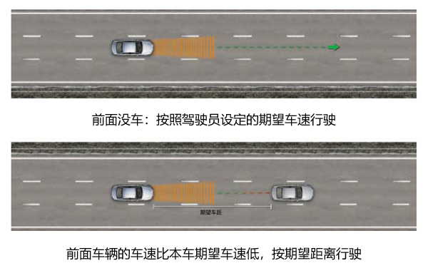
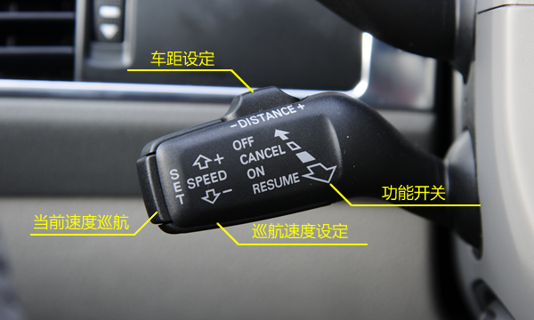
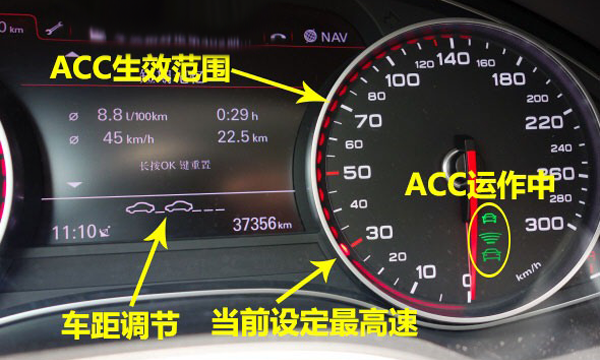
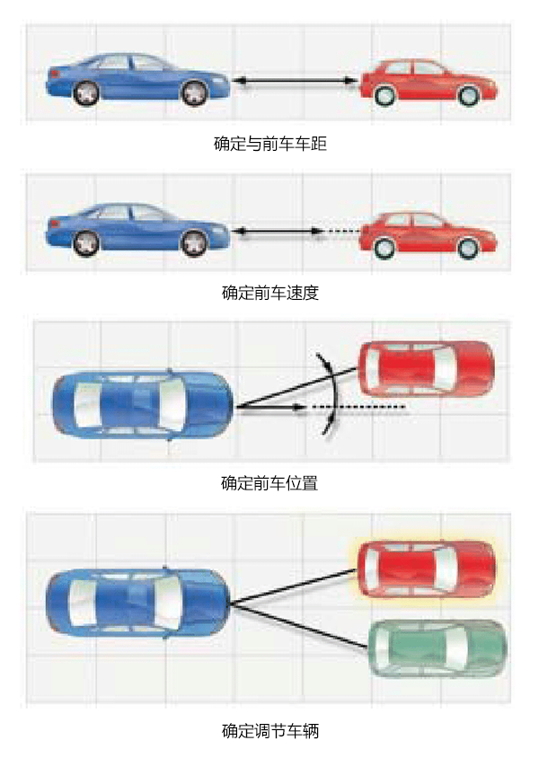
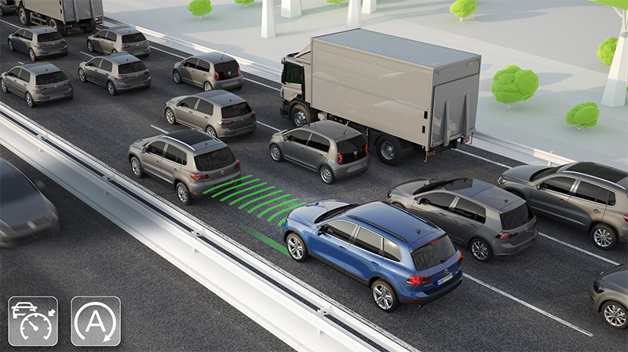
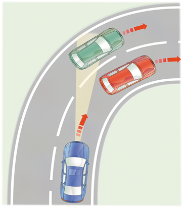

# ACC自适应巡航控制系统介绍

本文是关于ACC自适应巡航控制系统的介绍，罗孚从个人视角出发，描述对ACC系统的理解，以及在一些使用场景下的思考。

## 什么是ACC？

ACC系统是在定速巡航装置的基础上发展而来的，区别在于定速巡航只能限定速度，方向盘和刹车还需要驾驶员控制，而ACC能够较好的帮助驾驶员协调方向盘和刹车。定速巡航算是L1级别的自动驾驶，而ACC则可以算是L2级别的自动驾驶。

ACC主要有两个参数，车速和距离。如果“前面没车”，那么可以使用驾驶员设定的期望车速来行车，这与定速巡航功能相当，如果配合车道保持LKA系统，可以做到沿当前车道一直行驶。如果前车很慢而导致本车不可能用期望车速来行驶，那么ACC可以使得两车保持驾驶员设定的期望车距。在需要时，车辆会自动刹车和/或变速，以保持设置的车速或距离。在某些行驶状况下，还会要求驾驶员主动进行制动，这个警报信息会以声音和视觉方式显示出来。

视频：[Audi_Adaptive_Cruise_Control.mp4](assets/boxcnD2797jIFEY8edUWAQ9buoc_Audi_Adaptive_Cruise_Control.mp4)

## ACC的使用方法

在介绍ACC原理之前，我们先来熟悉一下操作方法。

### 首先，打开ACC功能

ACC的所有操作功能都集成在了下图的拨杆上，把拨杆向司机方向拉动，即可开启ACC功能，把拨杆推回去则可以关闭ACC功能。

### 其次，设定期望车速

向上或向下推动操纵杆，可以提高或降低期望车速，车速可设置的范围一般为30~200Km/h，默认30Km/h开始，每推动一次，可以增加或减少10Km/h(有些步长是5Km/h)，最后按下设置按键，即可保存车速，同时在仪表上也会显示设置的速度值。补充一下，对于全速ACC，则可以做到0Km/h起步，没有最低速度要求，这也是下文谈到的停停走走(Stop &amp; Go)功能的基础。

### 再次，设定期望车距

本车和前车的车距，可以设置为4个等级，拨动滑动开关即可，默认车距为3级。需要注意，此处的车距不是一个固定的长度距离，而是一个恒定的时间间隔，最终的车距取决于前面设置的车速。原因在于，1到4级分别代表了不一样的响应时间，分别是1.0s、1.3s、1.8s和2.3s，实际上撞车的风险也是在于你的响应时间，很多事故及早响应都是能够避免的。车距设置的建议，一般在畅通的高速上，等级设高，因为车速较快，安全第一，而在市区道路，等级设低，车速不快，同时保持良好的停停走走体验。

### 最后，可以开始ACC了

除了以上三项设置外，还有行驶程序设置，即设置你的驾驶模式，有舒适、自动、运动、高效和个性化几种模式可供选择。当然还能设置提示音量大小。

当你的车速超过30Km/h时，ACC就自动启动了(全速ACC可以直接启动)，他就会自动加速到你设定的车速(如果前方没有障碍物的话)，然后在车速和车距上进行保持。

是不是马上就能获得舒适的开车体验了？是的，你可以把脚离开油门，甚至离开刹车都没问题。当然，离开方向盘不行，离开超过30秒会自动报警，毕竟不是自动驾驶，还是需要你来控制方向的。

除了这一些，还需要注意仪表上的显示，正常情况下绿色显示，在某些情况下，比如减速不能保持设定的车距，这时车辆就会发出警告，仪表会显示红色警告信息，同时会发出声音报警。

## ACC原理

ACC功能主要利用了雷达技术，通过毫米波雷达，发射毫米波段的电磁波，利用障碍物反射波的时间差确定障碍物距离，利用反射波的频率偏移确定相对速度。毫米波雷达穿透雾、烟、灰尘的能力强，具有全天候（大雨天除外）全天时的优点。ACC一般使用的是77GHz的长距离雷达，距离可达100-200米。

ACC在技术实现上主要按以下四个步骤

### 第一步：距离测量

判断同前方车辆的距离，如果没有车辆(一般为毫米波雷达可探测的200米距离内)，那么车辆就开始按照设定的速度行驶。

### 第二步：确定前车速度

确定前车速度的目的在于获得相对速度，通过第一步中的距离，可以推算出抵达前车所需要的时间，这个时间就可以和ACC设定的期望车距进行比较了。(什么？时间和距离进行比较？没错，这里和上文的ACC设置期望车距相呼应，期望车距实际是响应时间)

### 第三步：确定前车位置

毫米波雷达的视场角虽然较小，但探测130米开外的物体，那探测宽度就可能超过三根车道，加上弯道等情况，雷达会判断到前方多辆不同位置的车。

### 第四步：确定针对哪辆车来进行调节

前一步是确定车辆和位置，这一步就需要确定跟随车辆，这是一个重要的判断决策，也是ACC安全保障的关键，需要协调车内其他控制单元一起来判断，比如车道识别单元。另外，本处的调节，不仅仅是油门刹车这么简单，有更多的传感器单元参与其中，比如转向角、车轮转速等传感器。

## ACC附加功能

ACC的附加功能比较多，如变道辅助、超车辅助、弯道辅助、停停走走等功能，这里只介绍一个非常有用的功能，就是停停走走，英文是Stop &amp; Go。当然，不是所有具有ACC功能的车都配备了停停走走功能，还是有不少品牌车辆是不具备该功能的。

如果ACC的跟车功能主要用于高速公路驾驶，那么ACC下的停停走走主要用于市区道路。简单的来说，停停走走功能依然是跟随前方车辆，但前方车辆停下的时候，ACC车辆也会停下，前方车辆再次前进，ACC车辆也会自动加速。停停走走可以非常好的解决了跟车堵车或等红绿灯的问题，缓解了市区复杂环境下开车疲劳问题，是女司机的福音

停停走走功能也是有弊端的，一方面在停住前的2-3米，车辆是以2Km/h的速度爬行过去的，另一方面停车的车距在3.5-4米之间。这些弊端可能是出于安全考虑，而且国外行车环境也许相对文明，放在加塞抢道严重的国内环境，恐怕不知道被抢道超车多少次了，这种情况下走走停停的感受应该会很差吧。除了距离因素，还有时间因素，自动启动是在3秒后生效，对于拥堵的情况，多停3秒，给旁边的车辆增加了加塞的机会，也加剧了碰撞的风险。

## ACC的优势和问题

ACC开发的初衷就是缓解疲劳，提高驾驶舒适度，这是毋庸置疑的优势。ACC也是自动驾驶前的初级功能，结合车道保持LKA、前向碰撞预警FCW、自动紧急制动AEB、变道辅助等系统，可以获得半自动驾驶的良好体验。ACC不仅仅用于高速环境，其走走停停功能更能用于市区拥堵环境，使用环境更广泛，辅助人类驾驶的作用更为突出。

虽然ACC功能非常强大，但也存在劣势。我们列举一些常见的问题。

### ACC能跟车转弯吗？

大部分情况应该是无法跟车转弯的，90度弯和急弯应该都是过不了的，一方面雷达探测自身的局限性，另一方面在路口没有车道线，其车道保持功能也无法起作用。对于缓拐(如下匝道岔路口)和弯道(如高速小弯)，ACC(实际上是车道保持系统)可以完成小幅度的拐弯，但对于稍大的弯，车辆就有可能判断错车辆而出现短暂急加速或急减速的情况。所以不要指望ACC能像车队自驾一样跟车，只要能完成高速跟车和市区堵车跟车就已经非常了不起了，对于拐弯的情况，还是自己多多把控吧。

### ACC能识别摩托或行人吗？

如果在市区停停走走时，遇到加塞，即便碰了，那也是车车事故，那如果遇到行人或摩托呢？好问题，罗孚至今也没有明白，据说这又属于行人识别和行人保护两个功能，行人识别是只识别不减速，行人保护是识别并刹车，这两个功能是在ACC功能之外的，仅仅ACC的话，是无法识别行人的。对于市区环境，行人乱穿马路、电动车骑到机动车道等情况时有发生，使用ACC时还是多注意刹车吧。

### ACC安全吗？

这是一个中立的问题，回答也是中立的，正是因为安全，所以车企才会将此功能开放给客户，但又是不安全的，不安全的因素也很多，如恶劣天气、加塞判断不够灵敏、刹车不够及时或力度、前方挂车异行物体判断错误等，同时更有驾驶员自身因素，使用ACC时没有保持警惕，甚至忽略了ACC的报警等。总的来说，建议在路况良好的情况下使用ACC，享受舒适的同时保持警惕，右脚依然不能离开刹车，该刹车时还是要自己主动刹车，这才是ACC正确的使用姿势

本文是罗孚根据网络资料进行的整理，没有ACC实车经验，疏漏错误之处在所难免，还请指正，希望本文能给大家带来较好的ACC自适应巡航系统科普。本文主要参考《奥迪ACC技术》一文，罗孚收集的更多关于ACC的有价值资料，可以关注“罗孚传说”公众号回复“ACC”获得。

本文飞书文档：[ACC自适应巡航控制系统介绍](https://rovertang.feishu.cn/docx/doxcn5ahn95VjVbBMDHgmBc2FDc)

---

> 作者: [RoverTang](https://rovertang.com)  
> URL: https://blog.rovertang.com/posts/car/20181118-introduction-to-acc-adaptive-cruise-control-system/  

