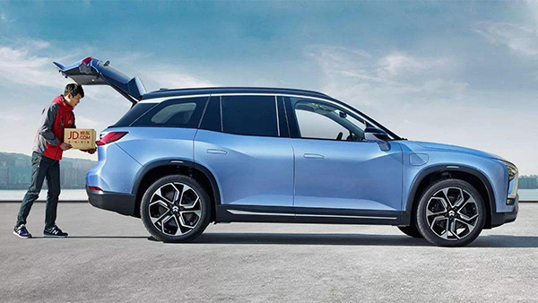
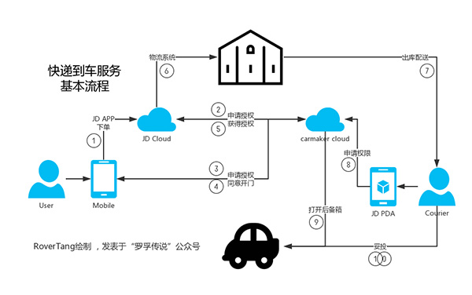
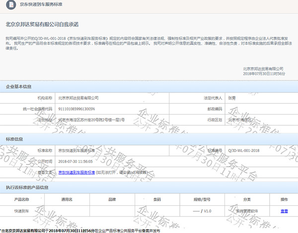

# 快递到车服务的实现思路和问题思考

本文罗孚原创，发表于公众号罗孚传说，本文是车联网行业中关于快递到车服务的思考。

## 什么是快递到车

顾名思义，就是将快递送到车上。听起来挺简单的？确实，只需要快递员将快递妥投到用户的汽车后备箱，整个服务就完成了。

车辆后备箱就是一个移动的快递柜，是不是觉得很新奇？其实在国外，几年前就有了这样的服务，只是今年(2018)被京东炒火了一点。

虽然快递到车在国外已有几年历史，但也未获得大规模的发展，至于国内是否火起来，并获得大规模商业化发展，也是一个未知问题。

罗孚认为，快递到车是一项比较适合公司白领的服务。比如：

* 晚上要去约会，下班再买花又来不及，那就让快递送到车上吧；
* 也许买了充气娃娃类隐私物品，在公司签收挺尴尬，那就让快递送到车上吧；
* 家里没人签收，自己在公司忙于工作还不想被打搅，那就让快递送到车上吧；

除了上班这一固定场景，也适合于移动场景，比如周末在外逛商场或办事，原本送到家没人签收，现在送到车上让车签收就行。

也许你会说，这是一个伪需求，有若干条理由反驳：

* 忙到都没一两分钟时间签收快递？
* 送到前台帮忙代签不是很简单？
* 或者送到小区快递柜啊？

你说的都没有错，但事实是：人们就是不想那么麻烦！在和客户开重要会议的经理，担心隐私外泄的小码农，不想穿着高跟鞋走去快递柜取件的lady，每个人都有他们自己的述求。

所以快递到车服务的重点：即便仅有1%的场景和用户，也需要做服务覆盖，既满足了高端用户的需求，也为物流、车企提供了亮点feature，甚至制造了一点点小壁垒。

[京东的快递到车服务上了央视](https://v.qq.com/x/page/g068773ibyk.html)

## 功能流程

罗孚简单绘制了一份快递到车服务的流程图。

在这流程中，会涉及一些问题，我们针对问题来具体分析。

## 几个关键问题

传统快递的基本特征：

* 送到哪里？(必要条件)
* 什么时间送？(非必要条件)

快递到车服务虽然是新鲜事物，但也逃离不了上述特征，甚至要求更加严格。

### 投递位置

汽车后备箱成了移动的快递柜，既然是移动的，按就不存在具体位置了？可以直接使用车辆的实时位置？

这不太现实，或者说不太科学。一方面，车辆驶入地下车库属于正常情况，地下车库是无法获得精准定位信息，而且在大型停车场找车不是容易事，另一方面，物流配送是一个流程，最终需要落地到具体配送站和配送人员，不可能让快递小哥全城找你车。

所以，在商城APP下单时，也同样需要指定一个位置，可以是一个大概的位置。

你不能确定你的位置？对的，在没有明确时间的前提下，确定位置实属不易。

对于传统快递来说，送达时间是非必要条件，但对快递到车服务来说，时间是必要条件，并且这个时间要求比较精准，粗糙一点可以要求半天(如4小时)内送达，详细一点则要求精确到0.5小时内。

在有明确时间的前提下，确定一个粗糙的投递位置，就不会是问题。比如上班时是某写字楼、约会时是某咖啡厅、见客户时是某商务楼、逛街时是某商场。

投递位置的作用，为物流体系确定终端配送站、为配送员确定找车的大概范围，这是非常有必要的。

注意，投递位置不是送达的车辆位置，移动快递柜的位置我们在下文快递员找车问题中再讲。

### 授权时机

快递到车服务中，一定会存在打开后备箱的动作，这个动作是需要授权的。何时授权？

快递到了车辆位置，才开始申请授权，等待用户确认？用户没注意授权申请，还需要给客户打个电话？快递送到家，一般也就是快递员敲门和打电话的过程，那快递到车服务和快递到家有什么区别？既没创新也没带来好的用户体验。

不打搅用户的体验，才是好的体验。我们能否做到不打搅客户？

在上述“投递位置”问题中，我们将位置和时间作为快递到车服务的必要条件，这些是预知的。那么，在快递送达的限定时间范围内，车主提供一次打开后备箱授权，即提前授权，就可以让快递员悄无声息的将快递妥投到车的后备箱中。

用信任授权代替即时确认授权，在限定送达时间范围内提供一次开门授权，是较为合理的授权方式，所以授权的时机实际在下单时，而不是在投递过程中。当然，如果还不放心，可以增加位置匹配、二次验证等条件。

### 找到车

有了前文提到的投递位置，快递小哥就能找到车了吗？答案是不能的。你收货地址是某某大厦，但车停哪里了呢？

文字描述永远是无力的，现在汽车基本都配备了GPS，给个停车的真实位置，确实是一个好的解决办法，但也有缺陷。

车辆在空旷环境下，基本能提供一个较准确的位置，但若停在高楼大厦旁，或者在地下车库，那提供的位置信息基本很难靠谱了。

对于大型停车场，或者地下多层车库，快递小哥要在这陌生的场地，面对数百甚至数千量车，找到需要投递的那一辆，内心应该是崩溃的。

当然，上文京东快递到车服务视频中，让车发出声光报警，确实是一个好的方式。也可以结合360环视系统等车上设备，为快递员提供当前车辆以及周围更详细的照片、视频等信息。

如何让快递员简单、方便、快速的找到目标车辆，是车企应该深入考虑的问题，毕竟服务是双向的，为车主提供服务，也要为服务人员提供方便。

### 开后备箱

当快递员找到车后，怎么打开车辆后备箱？有钥匙？有感应卡？其实都不是，对于智能汽车来说，远程开后备箱，应该是最基本的标配功能了。

当然，对于不够智能的车辆，或者为了发展后装市场，可以考虑车辆安装一个设备，在国外也确实有这样的解决方案，但如此低频的服务，非车企也应该不愿意为此解决方案研发和生产吧。

开后备箱最简单的方式，应该是在快递员的PDA上，点击请求打开后备箱按钮，由于车主已经提供了信任授权，那么对于车企的云端，仅需检查时间、地点、申请次数等是否一致，然后就可以发出远程开启指令了。

开后备箱带来的另一个问题，就是关后备箱，一般要求快递员帮忙关闭后备箱，但若快递员忘了呢，是否设置一个后备箱打开最长时限，超时情况下后备箱自动关闭，这也取决于车辆硬件。

### 隐私和安全

隐私和安全，虽然不属于技术问题，但也是一个必须面对的问题，算是社会问题吧。车内物品，是否存在隐私，这取决于车主，但车内物品被盗预防，是车企应尽的责任，需要通过尽可能多的技术手段来保护车主的个人财产。

从安全来看，开后备箱不开车门，这是最基本要求，然后需要增加后备箱打开超时功能，比如三分钟后后备箱未被关闭，则发出声光报警，一分钟后未响应则直接关闭后备箱，同时，如果拥有车内视频录像监控功能，则需自动开启。

总的来说，安全防范需要有更多的规则和策略，使用快递到车服务确实存在物品和车辆被盗的风险，如果个人对此特别在意，则建议不要使用此功能。同样的，对隐私特别看重的人，比如把车当成自己小老婆的人，也同样不适合使用快递到车服务

## 京东的快递到车服务

快递到车服务，便民的同时可以提升用户逼格，增加快递企业的曝光和影响力，一定有较多的快递企业来尝试此服务，但为什么偏偏京东做的最起劲？

### 入口的优势

快递的最普遍使用场景是什么？当然是购物后快递。而国内，也就阿里、京东是数一数二的电商平台，拥有千亿级订单体量，服务于数亿消费者，基于此量级，加之购物的频度，以及较为高端的消费群体，才有可能产生快递到车服务的订单量，有量才能盘活业务。如果没有京东购物的入口，那么快递到车服务可能就是一个小众服务，小众服务是不值得也无法持续投入的，这也是国外没有大范围落地的重要原因。再说，京东也想把持入口优势，反向推动购物平台的持续繁荣啊。

### 快递的实力

京东快递作为快递行业后起之秀，是唯一能与国内顶尖物流顺丰所匹敌的公司，而能够将快递送达时间限定在0.5小时的，我暂时只看到了京东物流，当然这个前提是基于京东自营商城和自有仓储物流体系。送达时间是否精准，我们消费者能亲身体验到，而其背后的高效物流流程系统、自动分拣流水线、规范化物流车队、高素质快递人员等，不是我所能触及的软实力。

### 其他壁垒

对于小众物流公司，运营模式、研发能力、利润空间等因素，都决定了他们不可能实现快递到车服务。除了入口优势和快递实力，企业的信用背书、技术研发的投入等壁垒也是其他企业无法企及的。企业壁垒可以成就快递到车服务，但也为企业建立了壁垒，同竞争者拉开了鸿沟。

最后，罗孚也要吐槽一下，关于京东所谓的快递到车服务企业标准。当我看到京东发布服务标准的新闻，我觉得京东是NB的，但当我下载到京东服务标准的文件时，我是崩溃的。一份所谓的企业标准文档，洋洋洒洒一千字，还没我此篇日志字数多，而服务要求这一重点部分，对于沟通、投递前、投递中、投递后、例外情况、查询这六个部分，基本都用一句话描述结束，把一份在新闻宣传稿中描述的NB哄哄的企业标准文档，完完全全的写成了流水叙事文，本希望能给尔等小辈提供专业指导，最后只能呵呵结束了。

如需膜拜《JD-WL-001-2018京东快递到车服务标准》文档，欢迎关注“罗孚传说”公众号，回复“快递到车”即可获得。

随着汽车网联化时代的到来，快递到车服务也将日益成熟，最终可能会成为智能网联汽车的标准功能，现在看上去可能是不太实用的博眼球功能，但若干年后，快递到车服务也许就和现在兴起的小区快递柜服务一样，终将成为我们生活的一部分。

限于篇幅，仍有较多细节未能深入思考，但愿本文能给相关从业者带来启发，也欢迎深入探讨。

[JD-WL-001-2018京东快递到车服务标准最新.pdf](assets/boxcnd0VKvbTUugOJFdxXxQ0uCb_JD-WL-001-2018京东快递到车服务标准最新.pdf)

本文飞书文档：[快递到车服务的实现思路和问题思考](https://rovertang.feishu.cn/docx/doxcnpXV1KiyYmXkJhLmB4v76Jh)

---

> 作者: [RoverTang](https://rovertang.com)  
> URL: https://blog.rovertang.com/posts/car/20181130-thoughts-on-the-realization-and-problems-of-express-arrival-service/  

