# 随身车联网——车联网生态新物种(附发布会视频)

差不多一年前，我写过一篇[《认识车联网》](/posts/smartcar/20180909-understanding-the-internet-of-vehicles/)，当时觉得自己对车联网有比较清晰的认识。

时隔一年，6月21日，博泰在南京发布擎mobile——随身车联网，一下子颠覆了我的认知，感觉车联网生态中产生了一个新物种。

说随身车联网是新物种，一点也不为过，它的基石是车联网，但又颠覆了车联网，融入了更多移动互联网、新出行等内容。

PATEO博泰发布擎mobile随身车联网_腾讯视频：[v.qq.com/x/page/a3077cy4lrn.html](https://v.qq.com/x/page/a3077cy4lrn.html)

全程听完随身车联网的发布会，我想和大家分享一些我对随身车联网的认识。

## Part1、随身车联网，不是手机车联网

如果你把博泰发布的随身车联网，理解为手机车联网，那么你的认知就已经发生了偏差。它不是简单的手机车联网，“随身”二字，是对它最精准的描述。

### 随身车联网不是传统的手机互联。

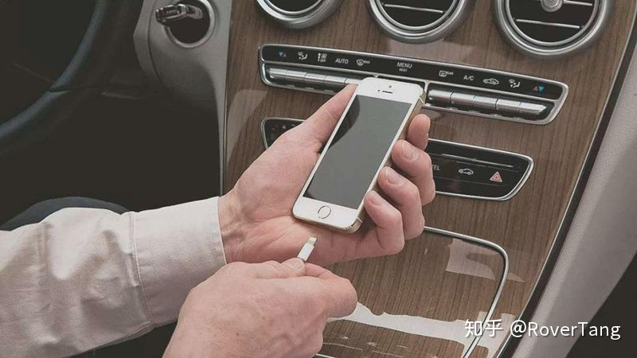

传统的手机车联网，我们可以追溯到十年前，那个时候，能用手机远程开车门、开空调，就已经是非常了不起的功能。

那个时候移动互联网并不发达，能将两个终端(一个手机终端、一个车辆终端)形成互动，确实很新颖。

那个时候，拥有手机app的车，能用手机同车辆交互的车，就是具备手机车联网功能的汽车，代表了智能汽车。

当然，十年前，博泰就研发了第一代inkaNet，在荣威350上率先上市，让荣威成为第一辆具有里程碑意义的车联网汽车，也给人们烙上了荣威就是智能汽车的印。

### 随身车联网不是简单的手机映射。

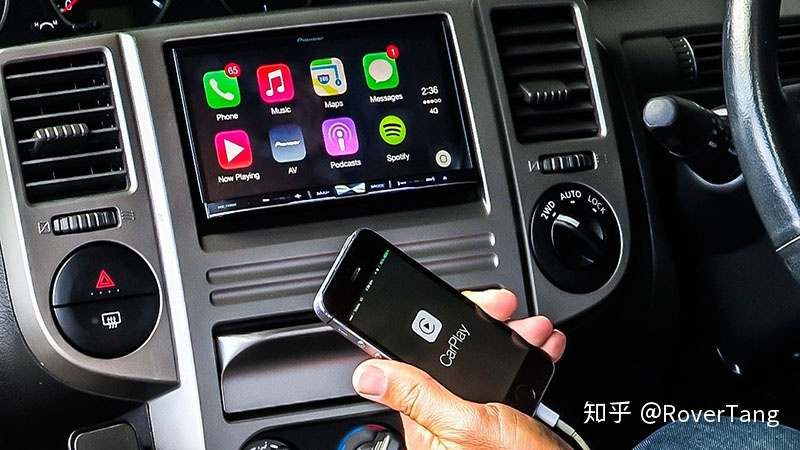

差不多五年前，移动互联网迅速发展，智能手机日益普及，当时车机和手机的差距，比现在还大，当时Android系统开始在手机上普及，但还没有进入车机，WINCE和电阻屏是那个时代的主流。

正因为车联网世界的落后，所以移动互联网界的大佬们准备进来抢食，Apple发布了carplay，Google发布了Android auto，而国内的百度则发布了carlife。

对了，还有MirrorLink，是由手机厂商和汽车厂商联合发起的一种所谓的“车联网标准”，旨在规范手机和车机的连接，并让用户获得良好的体验。

然而时至今日，他们并不成功，绝大部分的消费者甚至没有听说过MirrorLink，Google这两年才推出了全新的automotive来代替auto，而carplay在今年虽然发布了重大更新，甚至标榜已经有90%的车辆支持carplay，但你身边有多少人把iPhone用USB线连着汽车车机的呢？百度的carlife也在市场上被百般诟病。

博泰随身车联网虽然也算是手机映射方案，但它并没有基于现有的第三方方案，而是自研了一套协议，除了协议，还有屏幕这一硬件的支持，同时对热门的手机APP进行了适配，最终形成了人、手机、车、APP之间的闭环，而其体验要远高于carplay，就APP支持的数量而言也完胜carplay。

我认为应该这么总结：用手机赋能车，将车装进手机，随身携带，这就是随身车联网，未来每个人都能拥有的车联网。

## Part2、主要特色

上述的总结太过于精简，我想从四个方面介绍随身车联网的主要特色。

### 1、手机就是车机，车辆不再有车机，每人一台车机

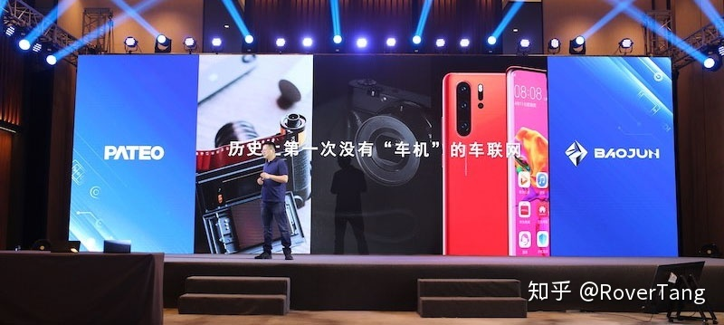

随身车联网，将你的手机变成了车机，车辆已经不再需要车机了。而正是基于手机，所以每个人手上就都有了一台车机。

这是随身车联网颠覆传统车联网的重要特色，是一种非常激进的创新，但这背后更隐藏了对汽车未来生态以及商业逻辑的思考。

从消费者的交互体验来说，在汽车上的体验只有两个，一个是油门刹车类的操控快感，另一个就是内饰舒适和信息娱乐系统的享受。现在将车机装进口袋，信息娱乐从每天2小时的车上接触，可以延伸到24小时的手机接触，虽然这24小时你不是时时刻刻和车机交互，但你随时可以拿出随身车机(就是手机)同车交互，给你带来随时的可连续的体验。

### 2、屏幕不同，但APP相同，难得一致的体验

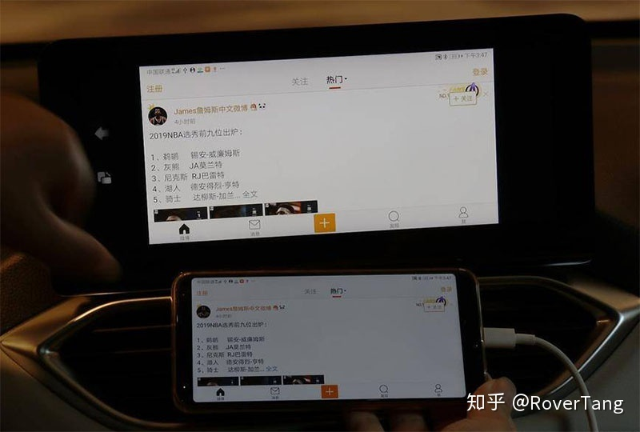

随身车联网中的手机，在你未上车时，就是你口袋中的普通手机，当你上车连接后，就是一部高性能车机。 车内的屏幕，在未搭载手机车机时，只有车控等APP可操作，当连接手机后，导航等相关功能自动激活，并且可以支持添加更多的APP，比如微信、美团等。

你也许会认为，这好像没什么，现在的智能车机也有不少的APP。没错，但随身车联网的APP是无限的，是随着你手机中的APP增加而增加的。

而正是因为使用了虚拟点击技术，你不需要区分车机账号和手机账号，你在手机上的状态就是你在车机上的状态，上车前没听完的歌可以继续听，没聊完的微信可以继续聊，甚至没付完款的订单可以继续完成付款。

车内的屏幕比手机大很多，为用户提供了舒适的车上操作体验，而那些映射在屏幕上的APP，还是你手机中的APP，屏幕虽然不同，但APP相同，你能获得完全一致的体验。

### 3、速度超快

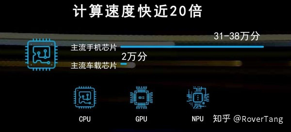

由于车辆的研发周期较长，以及车企对成本控制的压力，所以现阶段市面上的车机，其核心芯片一般要落后手机两年，甚至还因成本压力而选用性能更低一些的芯片。

而随身车联网，其手机就是车机，将手机的算力赋能给车，所以整车的速度超快。

在发布会上，对超快的速度有非常详细的描述，包括计算速度、研发速度、生命周期、启动速度、连接速度等。 速度是衡量是否革命性产品的标准，没错，在手机界也是如此，大家都会炫耀自家手机搭载最新CPU情况下的跑分。

当手机就是车机时，这种超快的速度是可以持续的，也就是说，两年后你的手机落伍了，算力跟不上了，那就赶紧买一部最新的手机，你的车一下子从夏利速度变回了玛莎拉蒂的速度。

### 4、语音超顺

随身车联网现场演示视频

语音一直是博泰的看家本领，从第一代ivoka发布，博泰就一直是车联网语音交互领域的引领者。

在这次发布会上，我不知道大家有没有注意到，除了语音识别的快速和准确外，还有一个重要体验，就是顺。 怎么顺法？顺到你可以在车内直接说“发微信给XXX”、“我要听XXX”、“导航到XXX”、“打电话给XXX”等。有没有发现，好像没有免唤醒，直接的自然语言交互呢。

现阶段大部分车企的车载语音能力，依然停留在唤醒后的语音交互，甚至连应用内的免唤醒都几乎没有涉及，而博泰直接上线了“泛化免唤醒”能力，这是在人车语音交互领域的一个重大突破。

讲了这么多特色，我想举一个实例来印证一下这些特色，就拿听歌来举例吧。

最早的车机，听歌是需要购买CD的，后来也可以拷贝歌曲到U盘，插在车机上听，这是最古老的方式。

后来，用蓝牙播放手机中的音乐，是一个不错的选择，但你需要一个手机支架，而手机仅仅是车辆的外设。

再后来，进入智能车机时代，可以直接在车机上听酷我音乐等网络音乐了，甚至车机上的账号还能和你手机上账号互通，但你能用的只能是车企绑定好的音乐，假设你拥有QQ音乐黄钻VIP，而买的车没有集成QQ音乐APP，你将会有什么样的感想？

现在，随身车联网没有这么多的限制，你在手机上喜欢用QQ音乐APP听音乐，那在车上就能用QQ音乐听。有些人安装了多个音乐APP，可以切换，上车后你也能切换。你可以选择你喜欢的，连账号都是你自己的。

还有，现在听音乐特别的快，因为是手机的性能和网络，所以你听歌根本慢不下来。对了，你还能直接说“我想听XXX”，随身车联网为你提供了超顺溜的语音操控方式。

我们必须承认，随身车联网的听歌方式，是现阶段车上听音乐的最佳方式。

## Part3、对传统车企的价值

通过上面的讲述，作为普通消费者的我们，已经了解了随身车联网，并熟知了它的特色。那么随身车联网又将给传统车企带来哪些利益或价值呢？

### 1、降低可见成本

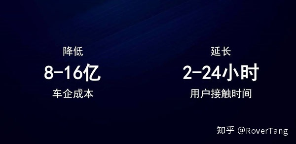

我想“降本”二字，对车市寒冬中的车企来说，是最喜闻乐见的字眼。并且既然是降低“可见”成本，那这样的降本就不是虚幻的，而是真真切切为车企省下的。

会降低哪些费用？能降低多少费用？

#### 1）硬件成本

由于不再需要车机，将车机的硬件成本转嫁到了用户的手机上，车企无需为手机买单，一下子省了近一台车机的成本。

#### 2）流量成本

虽然现阶段普通大众的手机流量基本普及到4GB以上，但时至今日的车企，大部分的车企采购部还在顾虑到底采购1GB流量还是2GB流量，是免费2年还是免费5年，唯有部分新造车势力略显慷慨。

现在，车企不再需要为用户的流量成本付费，用户所有听歌、导航等行为产生的流量，均为自己的手机流量。

车企不用再考虑车机的流量，费用本身也不在车企。这部分的费用表面上看起来不高，按月计算确实如此，但长年累月以及大量客户积累下来，应该也是一笔不小的数字。

#### 3）授权费用

在移动互联网领域，相同类型的APP泛滥，每一个APP都希望能够获得更多的客户，所以都会免费提供给用户使用，甚至愿意付费给手机厂商让其出厂预装他们的APP。

但车联网生态远落后于移动互联网生态，能够将APP功能整合上车，就是汽车的不小亮点，所以已经在移动互联网领域获得大量客户的APP，对于APP上车一事，他们需要收取一定的授权费。

不管是一次性收取，还是按数量收取，不管多少，都是出去的成本。而随身车联网直接绕过了这个问题，真正的0授权费，为车企省钱。

#### 4）开发费

不同车厂拥有不同的产品设计想法，所以需要定制开发，就会涉及价格不菲的开发费。

对于随身车联网来说，手机APP的适配，一次适配可以长时间多项目使用，唯独可能需要定制部分车辆屏幕上的界面，也就是说仅有少部分的定制开发，大部分共通的开发则不再需要支付大量的定制开发费用。

### 2、补硬件的短板，延长车辆的生命力

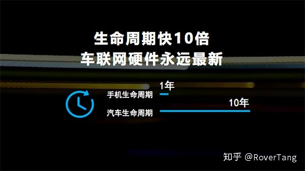

现在的车机，其迭代速度远超以前，后续的迭代速度也会超越现在，同手机的迭代周期类似。

那么，今年上市的车，其主机也许能算上领先的设备，但两年后还能保持领先吗？当然不会。

而车机的天然缺陷，就是无法随心所欲的更换车机，车企也没有动力去为已成为用户的客户更换车机。

而随身车联网依托手机为载体，即便两年后手机被淘汰了，那再买一个新手机，重新下载APP并登陆账号，就又能成为你爱车的新车机，迅速补上原本凸显的短板，能够延长车辆使用的生命周期。

如果说爱车如老婆，那么手机如衣裳，这句话用在随身车联网上再恰当不过。

选车就像选老婆，每个人都会选心爱的老婆。但人会变老，车也会落伍，你是否会持续爱着你落伍的爱车吗？ 随身车联网，只需更换手机，就能让车重新恢复活力，再次获得畅快的体验，为车延长了寿命。

所以，爱车如老婆，手机如衣裳，爱你的老婆，就给你的老婆勤换衣裳，让你老婆保持年轻活力和激情动力:)

### 3、缩短开发和迭代周期

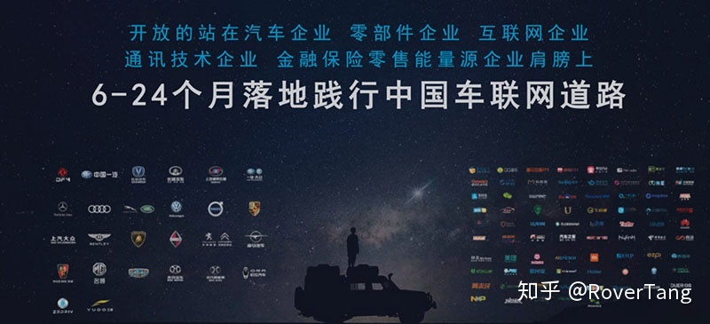

开发周期是车企的生命力，开发周期短、迭代次数多的车型一定是生命力旺盛的车型。

在以往的开发中，整个车型的开发预估3到4年，而其中车机的开发也差不多需要1到2年，开发周期慢不下来，原因很简单，除了硬件设计复杂、测试验证流程多等问题外，软件的开发周期也很长，搞定驱动、OS，还要完成同车企、CPSP等对接，总的来说，开发周期无法缩短。

博泰随身车联网，由于不需要研发功能强大的车机硬件，也没有了车机硬件中OS、APP的开发，大部分的开发都在手机上，而手机上又不需要研发各种CPSP对接的APP，加上手机的速度，整个研发过程非常快，据发布会介绍，仅需9个月就能完成开发。

这意味着什么？车企拥有更短的开发周期和更快的迭代频次，除了生命力，就是抢占先机，一些功能亮点的发布和上市可以早于其他车企。

### 4、快速打造功能丰富的车联网

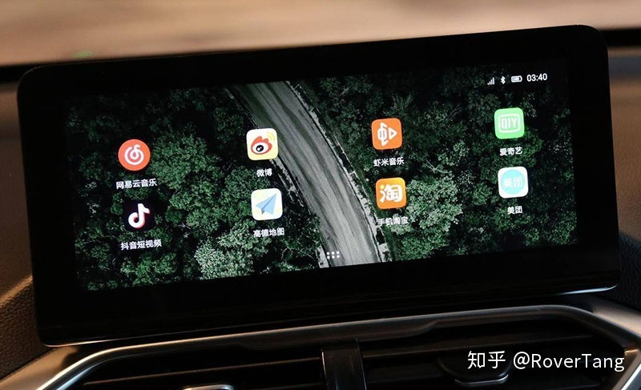

现在的车联网很热，其中一个大热门就是把原本手机上的移动APP搬到车上，疯狂接入各种各样的CPSP，通过API将原本手机上的APP打造成车机上的APP。

而借助手机移动互联网的博泰随身车联网，不用对接第三方API，直接将手机APP变身车机APP。

也就是说，原先需要商务谈判、研发对接、费用核算的车联网APP没有了，既缩短了研发周期、降低了研发费用，又给车企带来了更丰富的车联网功能，谁不爱？

## Part4、给车企带来的新思路

博泰随身车联网给传统车企带来了巨大的价值，似乎这些价值就足以让车企满意，但这些应该只是博泰的基础追求。

不知道大家有没有注意到，博泰随身车联网承载着更大的野心，它应该可以为车企做的更多，为车企增加新的思路，一些在造车之外的思路。

### 1、运营用户，提升用户粘性，增加利润机会

在电商领域，若干年前，一直讲究的是“拉新”，有新的顾客才能有更多的成交。但近年来，反而流行“留存”，经营好老客户一样能获得更多成交。

现在对于车企也是一样，原来的时候，车辆从生产基地送到4S店，意味着厂商工作的结束，而且由于4S店这一层经销商的关系，直接断送了车企同客户直接沟通交流的机会。车企听不到客户的声音，无法做出对车辆正确的改进，日积月累就越发的脱离客户，最终被客户所抛弃。

而现在，客户买完车才是车企同客户关系的开始。原来的时候，4S霸占着用户关系，现在，车厂直接和客户对话。其中的连线，就是手机中的APP。

以前的APP，基本都是远程车控，而远程车控对用户来说，需求又不是那么强烈。后来，新车企的APP，在车控之上，又增加了社区，希望通过运营社区增加用户互动和粘性。

而随身车联网APP，是自带用户粘性的APP，因为手机就是车机啊，必须要用啊。

对于车控，随身车联网本身具备这能力，比如手机就是车钥匙，这是最基本的车控。而用户社区，只要车企有想法，就能为车企加上。

除了这些，随身车联网将客户和车企拉的更近，让用户原本只能使用2小时的车联网，延伸到24小时，车主随时在线，将人和车的沟通，从上车沟通变成车上车下都能沟通。

举例来说，你原本需要发送到车机的优惠券或调查问卷，不再受时间（什么时候发动引擎）、网络（在地库没信号）、形式（主要在车机内）的限制，直接向用户的手机推送，用户随时查看并响应，直接、有效、快速。

### 2、为车企布局新出行服务

车市遇冷，只是一个信号，4S店会垮塌，是早晚的事。这像极了手机，Top10以外的手机品牌基本没有销量，而手机的门店渠道也在被京东、天猫以及自营线上渠道替代。

究其根源，不仅仅是因为车不好卖了，而是时代和观念变了。打折机票和全国高铁的普及，让长途出行更方便更舒适。市区的交通拥堵、停车难题将日益加剧，公共交通之外，打车和快车也是一种不错的选择，而租车也将越来越流行。

就在这个月，因搬家的原因，我卖掉了我的车，掐指一算，购车折损、保养和保险、加油和停车费，按公里折算，竟然也要2.8～3元每公里，和打车没有区别，一下子震惊到了我。买车，是否有必要，这问题应该有更多的人会思考。

新出行，是一个大局，而博泰的随身车联网产品可以帮助车企布这个大局。

一个只会造好车的公司，永远成为不了一家好的出行公司。因为这样的企业，即便涉足出行领域，但也只会利用他积累的优势去进攻，他不会在新的方向上发力，也不懂得借力。要想完成新出行愿景的转型，博泰的随身车联网是一个不错的跳板。

我在想，我以后的出行方式，会是什么样的呢？

我的出行，也许都在一部手机上，我不一定拥有一辆车，但我却拥有一个品牌的所有车辆。

平时我可能很慵懒，只想打个车，打开随身车联网，就能为我呼叫车辆，前来的是这一品牌的出行服务车辆。 当我出差在另一个城市，在自助提车点上车，将手机连上车，这辆车就变成了我熟悉的车辆。而我还车时，甚至不需要前往还车点，直接在手机上点两下，出行服务司机就能通过定位找到车辆，帮我归还车辆。

我想，这样的出行方式，两三年内应该就会出现，车企只需造好车，博泰为车企搭建出行服务平台，形成造车、运营车辆、经营用户的闭环。车企借助博泰车联网，打破造车卖车的传统，快速并扎实的进入新出行赛道。

## Part5、核心能力

食材自己是不会变成美食的，技术和创意本身也不会变成优雅的产品。

博泰随身车联网给人眼前一亮的创新，并能带来优雅的车联网体验，离不开他的核心能力。

### 1、创新能力及创新落地能力

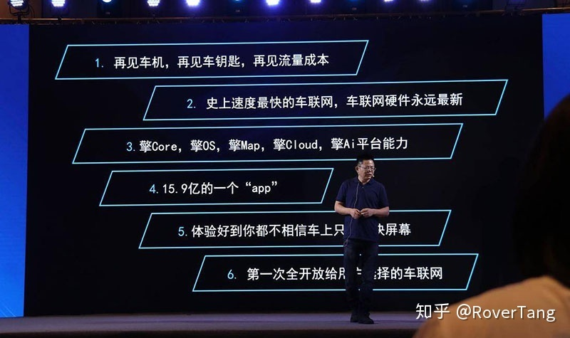

博泰不是在创新就是在创新的路上。

如果仅仅是创新，那是不够的，就像现在的CES，讲了很多概念，还没等到落地，也许这个新造车企业或者这个车型就已经死了。

博泰在车联网行业摸爬滚打十年，如果仅仅拥有创新能力，而没有创新的落地能力，那么创新也会枯竭，而企业也无法撑过十年。

十年前的inkanet，是全球首款3G网络上车和Android系统上车的产品，而ivoka则将语音搬进车内，也正是因为这样的创新落地，才让荣威品牌戴上了智能汽车的光环。

五年前，toC的I.P.D.A，将车机硬件规格提升到手机级别，将android os调教到非常适合车内使用，最终，产品虽然没有大卖，但获得了较多车厂的信任，也正是这一产品，博泰更坚定了落地极致体验产品的信念。

去年，东风windlink3.0上市，强势搭载百度dueros，既为车企带来了强大的语音能力，同时也让百度智能语音AI读懂了车。

今年，搭载博泰随身车联网的新宝骏即将上市，从五菱总经理沈总的一句车联网为什么不能服务车主24小时，到思考、创新以及创新落地，总共花了不到一年的时间。

如果创新是博泰的血液，那么将创新落地就是博泰的澎湃动力。

### 2、虚拟点击之上，软硬件整合能力

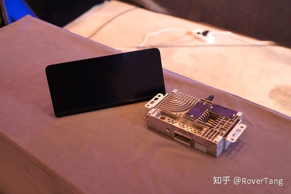

也许有人会说，你所谓的手机就是车机，车上只有屏幕没有车机，你所用的技术，不就是虚拟点击技术吗？

此话不假，并且虚拟点击技术已经有多年的发展历史，但为什么MirrorLink死了、carplay没有火起来？

深层次的原因，他们没有形成闭环，或者说他们想要的闭环依赖于第三方帮助他们实现。

但博泰的随身车联网不同，除了安装手机APP之外，还需要连接博泰研发的屏幕和Tbox。博泰自身形成了闭环，而不是简单的协议或技术点。

这样的软硬件整合能力，结合自身Tier1的业务能力，就很容易在车企落地。而博泰随身车联网在新宝骏车型上的落地，也表明了方案的成熟性，将会有更多的车企搭载博泰随身车联网。

### 3、其他能力

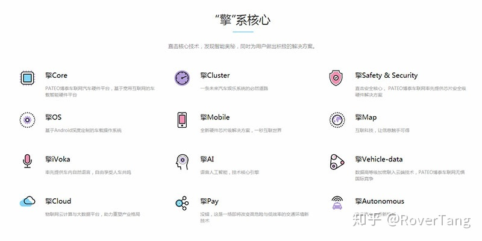

本想再写一下博泰的语音能力，毕竟是博泰若干年来的看家本领。

但一想到手机摇一摇就能锁车和解锁车，就觉得博泰的云端TSP能力也很强。

而看到博泰导航结合语音后，能够快速响应并开始引导，就觉得擎Map能力也不错。

想要给博泰介绍的能力还有很多，慢慢写来也许还能写出好几个章节，还是待下次再叙吧。

## Part6、对博泰的建议

博泰随身车联网确实是一个创新型的产品，在业内也掀起了热烈的反响，除了新宝骏，还有更多的车企在对接博泰随身车联网。

不过，我也有几个方面的建议，希望能对随身车联网也有所启发。

### 1、更开放，为了更大的扩张。

传统的车联网企业，盈利主要来自两个方面，一方面是研发费，一方面是单台硬件的利润&#43;license费。

但这条路很累，并且一不小心，可能反而亏了，为什么呢？

车企压价属于商务谈判范畴，可以先不说，研发投入的成本本身就很高，而供应链本身也很复杂，控制好各个环节的BOM成本本身不容易，如果中途还发生一些变更，那基本就不可能盈利。

等到车型上市，翘盼车型热卖，结果迎来每月几百的销量，作为Tier1，就要哭晕在厕所里。如果此时还碰上一个老赖，那无疑将Tier1打入冰窟窿，欲哭无泪。

博泰随身车联网不应该走这条老路，我们纵然在手机APP和车载硬件上形成了一定的壁垒，但若将此壁垒作为自身的护城河，那这条路又将越走越窄。

纵观国际大厂，特别是赚钱的大厂，都有两个显著的特色：标准化和授权。

**标准化**

标准化是建立在自身产品质量过硬的基础之上，没有质量过硬的产品，是不敢标准化的。

而标准化，就是能够将产品复制，减少定制化的投入，降低单个产品的价格，提升产品的整体销量，最终不仅盈利，更可能会形成垄断。

当然，标准化的产品，不一定是一个硬件或一个软件，实际上无形的协议，也是可以标准化的产品，比如随身车联网中的虚拟点击协议。

**授权**

授权就像是一扇门，建立了内外的连接，但又不是任何人都能进出这扇门，必须要获得内部的认可。

除了获得认可才能进出外，对这扇门进行监测，还能发现进出形态以及流量的变化，通过监测，可以改进我们的连接。

开放，必须是对标准和授权的开放，如果仅仅做一个ODM商的开放，实际上并没有摆脱Tier1的命运。

而标准和授权的开放，又将是一个痛苦的过程，一方面需要投入更多的研发资源，需要制定标准，提升产品质量，对现有形态的产品进行取舍和提炼，另一方面标准能否被车企或同行以及跨行的认可和接受，还需要较长时间的验证，无法快速通过产品利润盈利。

只是，这是一条必须走的路，开放标准和授权，才能获得不可回退的扩张。

### 2、应用生态布局

当虚拟点击、设备互联互动成为一个标准化的可授权的协议，拥有更多的企业接入这套协议，那么对应用生态的布局就显得势在必行。

现阶段因为没有合作伙伴，甚至合作伙伴不够开放，所以自身在研发过程中做的很苦逼，脏活累活我们都自己干了。

当标准进行开放，拥有更多的合作伙伴进入，那么我们自身作为运动员的角色需要弱化，而作为裁判的角色需要强化。

此时，我们会有更多的运动员进入我们的生态场地，一些不知名的APP自身愿意按照博泰标准开发APP，并接受裁判的裁定，同时为了避免生态的恶化，我们需要对APP建立准入机制，准入机制是生态良性循环的重要内容。

简单的来说，就是类似于Apple的App Store、微信的小程序，建立了一套框架机制，能否进入随身车联网生态，是需要经受这套机制考验的。

所有的手机APP均能在车机上使用，出发点固然是好，但若没有机制筛选，没有运营推荐，没有合作共赢，那一定会被玩坏，所以，需要尽快布局随身车联网之上的应用生态。

### 3、融合

整个发布会上，我们秀了很多肌肉，干掉了车机，手机就是车钥匙，语音操控特流畅，软件运行速度特快，既有耳目一新的创新，又有技术壁垒。

但我感觉我们展示的有点碎，或者说仅仅展示了部分车控、车载娱乐方面的内容，从车联网本身来说，已经足够好，比所有的车机体验都要好，只是少了一些生态、运营等内容的融合。

我们推崇和追求的六新：新制造、新零售、新金融、新服务、新会员、新出行，现阶段的随身车联网仅仅推动了新制造，有新出行的影子，但离出行平台甚远，而新会员和新服务涉及较少，甚至不够明确，对于新零售和新金融还没有沾边。

随身车联网才刚刚起步，后续会做更多的融合，融合让我们去实现六新。

如果有一天，随身车联网实现六新，那么它将不再是车联网生态的新物种，可能将会成为新兴的独立生态，又一个庞大的生态，而且是由博泰主导的强大生态。让我们拭目以待。

你好，随身车联网，请开启我的随身车联生活:)

罗孚备注：以上全文8000多字，完稿于2019年7月，于2020年3月增加图片和视频素材后，公开发布于“罗孚传说”公众号。

本文飞书文档：[随身车联网——车联网生态新物种附发布会视频](https://rovertang.feishu.cn/docx/doxcnuioXGPkY0jEvWNBRyikbJI)

---

> 作者: [RoverTang](https://rovertang.com)  
> URL: https://blog.rovertang.com/posts/car/20200307-portable-internet-of-vehicles-new-ecological-species-of-internet-of-vehicles/  

