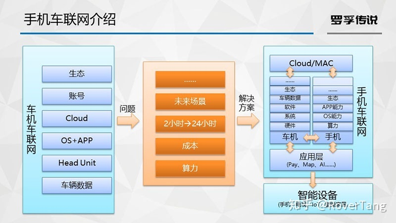

# 商业模式变革造就未来车联网——《车联网技术解构与商业模式分析》笔记

本文是罗孚听完[《应宜伦：车联网技术解构与商业模式分析》](https://www.pateo.com.cn/zh/news_detail.html?id=1093)课程后的笔记，并基于个人理解制作了简要PPT(非官方讲稿)。课程完整视频如下：

应宜伦：车联网技术解构与商业模式分析_腾讯视频：[v.qq.com/x/page/t0933cz9yyq.html](https://v.qq.com/x/page/t0933cz9yyq.html)

罗孚今天又要写一篇关于博泰的文章了，上次发表了[《随身车联网——车联网生态新物种(附发布会视频)》](/posts/smartcar/20200307-portable-internet-of-vehicles-new-ecological-species-of-internet-of-vehicles/)一文后，就有人在后台问我博泰给了我多少钱？呃，非常诚实的说：0元。那我为什么要写？我不想为稿费写，也不想为了赞美而写，我只想从我内心写点东西，一些值得我们认同、点赞的东西，愿个人的分享能影响更多的人。

全程听完该课程，罗孚认为可以用酣畅淋漓来形容。为什么？因为眼光和思考不同。去年，晚点团队发表了[《对话陆奇：做一件长期有价值的事，不被人理解是必然的》](https://mp.weixin.qq.com/s/GEJjJVSv6fAxtfyJE0GIeQ)一文，就有人评价说，这是近几年少有的深度对话，特别是一些观点，让人耳目一新，比如“车未必是人类最有效的交通工具，像蛇一样的新的物，也许才是新一代的运物工具。”。

那么，对于车联网技术解构与商业模式分析这一课程，可以认为是车联网领域少有的深度课程，至少从眼光高度、思考深度，近些年未有人分享过。佩服博泰开放的心态，也许正是“开放永生、封闭必死”理念的践行吧。

整个课程分为两大部分，就是标题中的技术解构和商业模式分析，在技术解构环节，讲了车联网分层、车联网的发展、车联网的分类等，然后介绍了博泰的手机车联网，再后面商业模式分析环节讲了一些思考和想法。下面是罗孚的整理，不细说展开，因为课程的讲解比我作的图要精彩很多。

车联网的分层

车联网发展史

车联网的分类和技术架构

手机车联网介绍

上图关于手机车联网的介绍，更具系统性和前瞻性，但若想要详细了解手机车联网(博泰官网称之为擎mobile随身车联网)，建议参看罗孚的[《随身车联网——车联网生态新物种(附发布会视频)》](/posts/smartcar/20200307-portable-internet-of-vehicles-new-ecological-species-of-internet-of-vehicles/)一文。

车联网的商业变革

上图虽然画的很简单，但道理非常的深远，所以课程的后半段基本就是围绕上图来讲的。简单的来说，就是要车企自身或车联网公司帮助车企打通上述链路，从开发优秀产品，到创建有竞争力的平台，再部署健壮的中台，最终介入到商业变更中。谁先做，谁能做成，谁就赢了。

商业模式分析部分未能有详细的要点罗列，罗孚仅汇总一下个人理解的部分观点：

1、车联网很大，不是一家公司所能做完做全，更不可能谁把谁干掉，车联网行业更需要的是合作，开放的合作，不同业态公司互相找到战略合作点，才能合作共赢。

2、关于车联网和新出行的关系：车企从汽车制造转向出行服务，不一定要成立出行公司，更应该借助车联网，基于车联网越来越丰富和强大的能力，逐步进入到新出行市场。

3、关于新零售的思考：汽车自身是否可以成为销售工具？车主是否可以比销售人员更专业卖车？如何通过车联网去抢存量市场？

4、将汽车理解为移动的商业地产，那么商业模式将会彻底改变：1)城市的商业空间无限放大；2)服务成本急剧降低；3)多方获益，包括车企、零部件公司、街道居委会、社区物业等；

5、具有3P(极致的Product、自主的Platform、便宜的Price)属性的产品，非常重要。

6、要用跨界思维重新思考商业模式和盈利模式，当移动的汽车和城市的智能结合，在不动基建、不动概念、不动投资的情况下，做到各方都能受益，那么商业模式就发生了改变，所以商业模式的机会在城市里，一个不用很大投资就能一步一步实现的城市里。

好了，上述就是罗孚个人思考后的笔记，如有错误的地方，欢迎指正。最后，一点小福利：在“罗孚传说”公众号后台回复“未来车联网”，即可下载本文完整PPT和国家的《智能汽车创新发展战略》文件。

本文飞书文档：[商业模式变革造就未来车联网——《车联网技术解构与商业模式分析》笔记](https://rovertang.feishu.cn/docx/doxcntqPkJM5Ypu2NPT58pVexwc)

---

> 作者: [RoverTang](https://rovertang.com)  
> URL: http://localhost:1313/posts/car/20200315-business-model-transformation-creates-the-future-internet-of-vehicles/  

