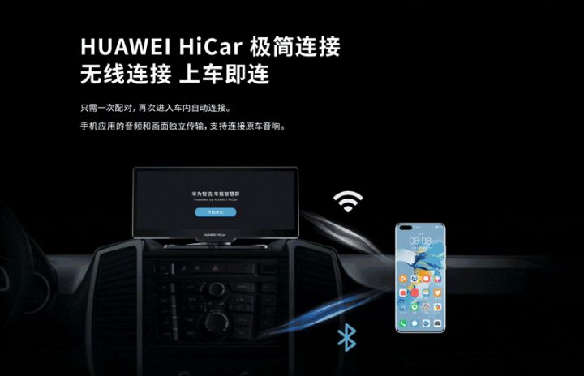
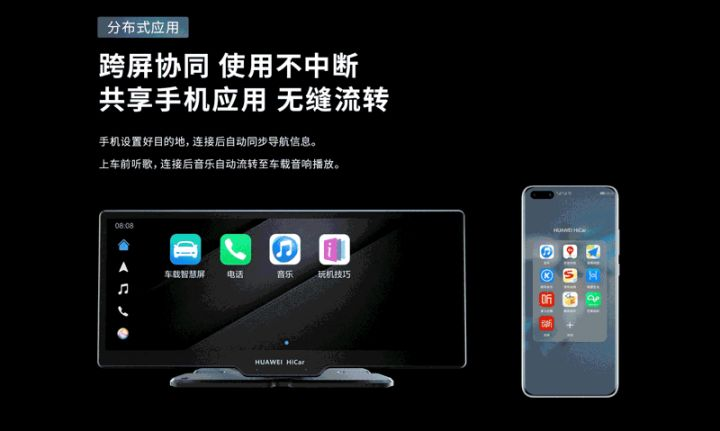
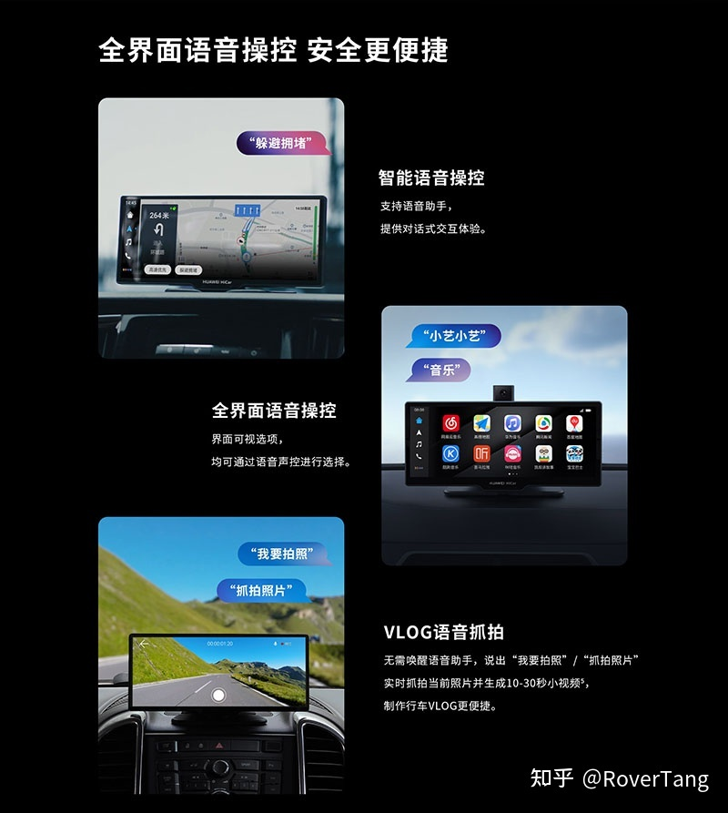
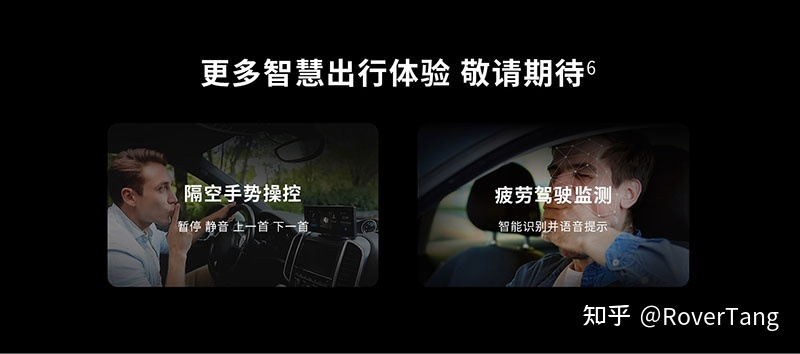
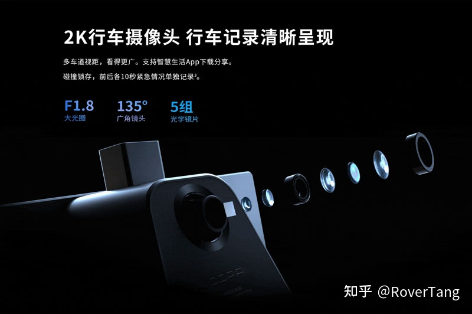
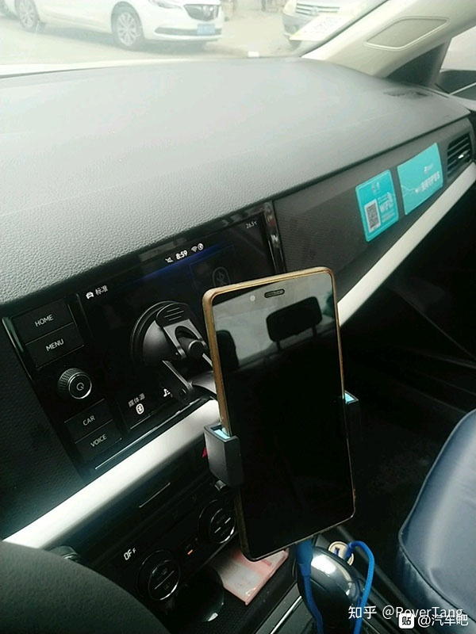
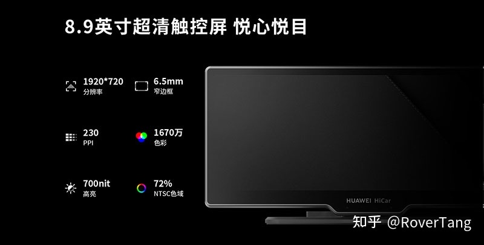
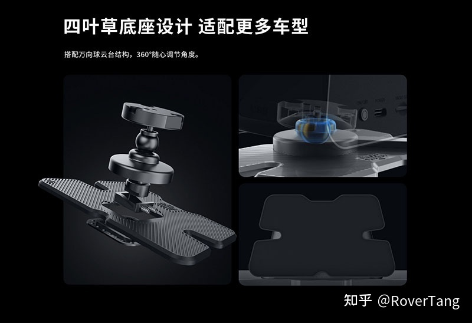

# 华为车载智慧屏打开车载新世界

最近华为发布了车载智慧屏，很是惊艳。我们先来看一个官方视频，护送323任务的视频。

[华为车载智慧屏官方宣传视频](https://v.qq.com/x/page/r3214rnogn6.html)

通过视频，有一些比较令人惊艳的功能，罗孚发表一下自身的想法。

## 软件

如果没有优秀的软件，那和手机挂支架上有什么区别？正是因为软件，所以让华为车载智慧屏更加出彩。

### 无感连接和无缝切换

当进入车内后，手机自动投屏到车载智慧屏，此过程是无感的。

这里的无感来自于两个方面，一是连接是无线的，不需要通过USB数据线来连接，另一是此过程静默连接，无需任何操作。

同时，应用也是无缝切换的，在听的音乐可以平滑切换到车载智慧屏，而导航则可以自动衔接，甚至自动打开。

### 智慧AI语音交互

视频中给我们展示了一些智慧语音AI的交互，比如接听电话可以直接说接听，比如发现拥堵可以直接说避开拥堵以选择更优路线，这些功能虽小，但很实用。

除了直接说的语音命令外，当然还支持唤醒后的语音交互，可以查天气、打开音乐等，应该和现在的智能AI音箱类似。

### 一些炫技的功能

华为车载智慧屏搭载了一颗可升降式摄像头，此摄像头可以通过DMS系统进行疲劳驾驶提醒，当发现驾驶员疲劳分神时可以发出语音提醒，此摄像头也可以直接语音视频电话，直接在车内召开视频电话会议，当然，如果双方都是华为手机，应该还能直接使用畅连通话。

除了疲劳监测、视频通话外，通过此摄像头，还支持手势识别，比如手一挥，该画面翻篇了，就切换到新的场景画面中了。这个技能很炫酷很科幻，实用度没有疲劳检测和视频通话高。

## 硬件

除了软件功能外，硬件功能也不赖，甚至有很多功能很贴心。

### 功能齐全的硬件

前面说了升降式摄像头主要用于车内视频，那么在其背部，还有一个摄像头，据说是盯盯拍提供的行车记录仪摄像头，此摄像头可以在底座固定后再通过万向轴旋转调节摄像头的角度，以获得一个最佳的行车记录仪视频画面角度。行车记录仪对车主来说，刚需程度较高，但车辆默认标配的较少，所以有了这个后置摄像头，车主不再需要额外购置行车记录仪，更不需要额外的走线，便利度较高。据说行车记录仪是2K画面，所以vlog的实现也离不开一个更清晰的摄像头。

### 屏幕细腻

一块屏幕的好坏决定了用户使用粘性，就如同你买华为P40、iPhone 12等，从屏幕上就让你用的很舒服，就愿意多看它一眼，而假如你用的是一块劣质的屏幕，就如同数百或千元的手机，那触摸的跟手感觉完全不同，此时你使用设备时是不舒服的，这种不爽的感觉很难让你持续用下去。这也可以解释我们还能经常看到支架直接吸在了中控主机屏上的现象。

车载智慧屏配备了8.9英寸IPS屏，屏幕分辨率1920*720，算是一个标准的大屏设备，而230PPI下能够提供细腻的画质表现，另外屏幕亮度较高，也不用担心反光，屏幕确实是非常吸引人的一大亮点。

### 安装方便

作为一个后装设备，安装会是一个重大的问题，我们为什么不愿意在车里安装使用支架的设备，就是因为不好安装，可能可以归结为几个方面：

1、丑：作为整车，设计感十足，来一个突兀的设备，并且使用支架的方式安装的，那确实是丑爆了，特别是差的设备，支架也特别的差，给人一种很low的心理落差。

2、容易反复掉：既然是后装，那也避免不了会掉的风险，因为我们不可能在中控台上打眼来固定后装设备。一旦掉落，特别是掉落几次以后，再安装上去的心情都没有了。

3、影响安全：这也是车主最大的顾虑，上述2的容易掉落是影响安全的一个因素，另外影响视线、影响车内电路系统、产生干扰等都是影响安全的因素，我就遇到过一次因为安装了车载蓝牙发射设备导致车钥匙无法锁车的情况，教训就是花钱并且还瞎折腾，极其不爽。

那华为设备的安装方式是什么样的呢？由于机身带一宽屏幕又加行车记录仪，所以设备本身比较大，支架式安装是不可能的，所以采用了底座式安装，有一个大大的底座。

这个底座做的很大，但底座又是软的，应该是类似于防滑垫这样的材质，底座自带粘胶，撕掉纸就可以直接粘贴到中控台上去了，这粘性和这么大面积，设备安装应该是无比牢固，不用担心急刹会让设备掉下来的情况。

## 价格

谈完软件和硬件之后，我们来谈谈价格。可能有很多的朋友说，1699的价格，谁会买呢？言外之意就是太贵了。确实，有点小贵，但也不是车载后视镜、行车记录仪所能相比的，因为华为车载智慧屏是一个整体。

价格是由价值决定的，而不是简单的硬件功能叠加决定。我想了一些价值差异的场景：

1、因为屏幕大小和分辨率以及触控感，你不愿意用自己买的设备；

2、因为设备算力不足导致系统卡顿，使用过程让你捶胸顿足；

3、因为连接方式复杂，如手机WIFI连接查看DVR视频、carplay需要连个USB，导致你不愿意多操作设备或功能；

4、设备声音可能无法同车载音响系统打通，导致你不愿意用它的带有声音的功能，如音乐、电台、电话等；

实际场景有很多很多，与其体验如此糟糕、将设备沦为闲置，那为什么多花点钱买一个体验好的自己会长期使用的设备呢？

只看价格不看价值，对一个设备来说，似乎有点不公平。

## 一些问题

华为车载智慧屏一定不是一个最完美的设备，以后装形式存在的设备一定存在一些问题，只是这些问题不一定能完全避免。

比如遮挡视线的问题，虽然大部分车辆放置在车载中控台上，应该不会有问题，但对部分车型肯定会挡住右前方的情况，如果挡住了引擎盖上方的视线，那就存在一定的危险，确实是需要考虑的因素，不过据说大部分情况还好。

比如线路安装问题，既然使用点烟器的设备，明装线路一定比较难看，而走隐蔽线路则其自带的线又不一定够长，此为后装的通病，确实无法解决。

## 一些思考

### 硬件的壳，HiCar的核

实际上，华为车载智慧屏这一硬件，是由盯盯拍代工生产的，只是在显示屏下方的logo显示的是HUAWEI HICAR，是不是有点小失望？不过能够进入华为生态内的产品，品质不会太差，这点毋庸置疑。所以，硬件只是一个壳，而实际的核心是HiCar。

HiCar正大面积进入车厂体系，车厂对产品质量和体验的要求非常高，而HiCar仅仅是作为车载娱乐系统中的一个功能，在汽车上的分析改进可能有限，若有一后装产品，又能以HiCar为主导，软硬件的设计都能符合自己的要求，那对产品的改进会更大，这种自主可控的分析改进也会同步OTA升级车载HiCar，毕竟HiCar的目标是前装几亿台车呢。

### 硬件生态、软件生态

华为车载智慧屏不是华为生产的，那以后除了盯盯拍生产外，其他有能力的公司也能生产，只是时间问题。华为的核心不在于生产硬件，而在于认证的硬件生态，可以吸引更多的硬件厂商加入进来。

除了硬件，软件实际更是生态，现在虽然只有30&#43;APP，这些APP一定是适配过HiCar的，如果HiCar拥有足够多的汽车自带，那是不是会有更多的APP愿意适配HiCar，如此一来也就有更多的APP纳入软件生态，以后在华为应用市场里拥有一个HiCar专区应该是迟早的事。

### 自家产品生态和IOT试水

在车内通过畅连通话和家里的智慧屏电视直接视频通话，无需微信视频，车辆即将到家，为您打开家里净化器或空调，这些IOT联动的场景已经可以实现，而车载智慧屏正好拓展了移动场景。

如果这些场景下的体验足够好，你是否也会心动购买华为车载智慧屏以外的产品呢？这是很有可能的。华为车载智慧屏作为智慧屏产品线的一员，让自家产品生态更为丰富。

### 用户数据和产品迭代

如果华为车载智慧屏的销量足够好，用户足够多，那么用户行为数据将会是宝贵的资产，透过用户行为数据分析，可以清楚的了解用户对APP的喜好、用户上下班场景的动作等，那对产品的提升是毋庸置疑的。这些提升也就是HiCar的提升，而HiCar更是车厂前装车机合作的基础产品，是一个更大的市场。

最后再感叹一下，大象很快。不仅仅推出华为车载智慧屏的速度，更是HiCar在车厂的推进速度，不得不说华为速度确实很快。

如果你车的娱乐系统不够智能，你是否愿意尝试华为车载智慧屏呢？

本文飞书文档：[华为车载智慧屏打开车载新世界](https://rovertang.feishu.cn/docx/doxcnI4PuunI1ngzhWHGaYHGvUe)

---

> 作者: [RoverTang](https://rovertang.com)  
> URL: http://localhost:1313/posts/car/20210123-huaweis-on-board-smart-screen-opens-a-new-world-on-board/  

