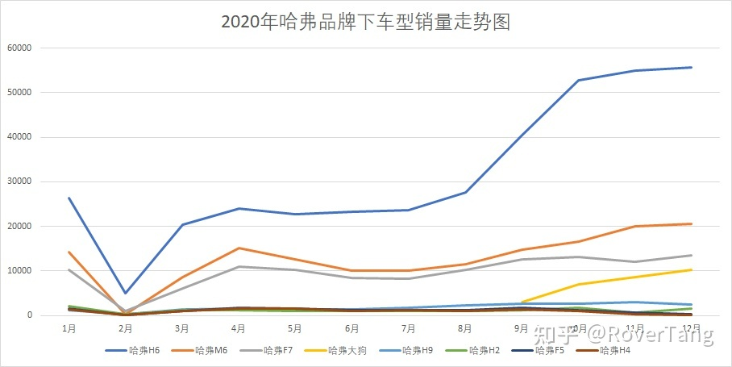

# 2020年汽车销量数据及分析

2020已过，2021已来，2020年车市如何？正巧，罗孚这里有一份2020年全国汽车销量数据，我们一起来看看各汽车品牌以及车型的数据吧。以下数据分析仅为罗孚的个人思考，不代表任何其他观点。

基于数据的分析，建约车评的[2020年中国乘用车车市盘点](https://mp.weixin.qq.com/s/U8aoyjJqZX25IVyVXfKTKw)已分析的非常透彻，对各车厂做了全面的点评，但由于数据维度有所差异，所以罗孚的数据未能按车厂进行分析，更多的是基于品牌和车型。

## 数据来源和差异说明

本文数据来自于懂车帝，基于懂车帝的每月销量排名数据进行整理，感谢懂车帝！

懂车帝的数据相对比较真实可靠，虽然确实有一定的差异，但作为参考已经完全足够。

### 同新造车销量数据的差异

| 品牌   | 全年销量 | 官方数据 | 备注                          |
| -------- | -------- | -------- | ------------------------------- |
| 蔚来   | 43728    | 43728    | 同官方完全一致，包括每月数据。 |
| 理想汽车 | 31444    | 32624    | 少1180台，仅同官方差1月份数据。 |
| 小鹏汽车 | 26814    | 27041    | 少227台，部分月份有差异。 |
| 威马汽车 | 22413    | 22495    | 少82台，部分月份有差异。 |

对比了新造车的官方销量数据，从对比结果来看，略有差异。

### 同建约车评数据的差异

|          | 罗孚数据 | 建约数据 | 数据差 | 差异比例 | 备注             |
| -------- | -------- | -------- | ------ | -------- | ------------------ |
| 总销量 | 19240714 | 1928.8万 | -47286 | -0.2%    |                    |
| 吉利汽车 | 1308615  | 1247526  | 61089  | 4.9%     | 吉利&#43;领克&#43;几何 |
| 长安汽车 | 930995   | 942100   | -11105 | -1.2%    | 长安&#43;欧尚&#43;凯程 |
| 长城汽车 | 881880   | 836366   | 45514  | 5.4%     | 哈弗&#43;WEY&#43;欧拉&#43;长城 |
| 比亚迪 | 408029   | 417192   | -9163  | -2.2%    |                    |
| 长安福特 | 243998   | 248204   | -4206  | -1.7%    |                    |
整体数据对比差异0.2%，总量在4.7万辆。

对比几个主要车企，数据差异最大在5%左右，大部分在1%~2%。

## 品牌数据分析

本次数据共统计到114个品牌，销量最高为大众品牌，全年销量超过260.4万辆，销量最低为新特汽车，全年销量共60辆，差异超过4.3万倍。

114个品牌的销量均值为168778辆，超过此销量共有25个品牌，品牌列表：大众、本田、丰田、日产、吉利汽车、别克、长安、哈弗、奥迪、奔驰、宝马、现代、奇瑞、比亚迪、荣威、广汽传祺、雪佛兰、名爵、宝骏、起亚、福特、凯迪拉克、马自达、红旗、领克。

上述25个品牌的总销量，占所有品牌总销量的85.6%，而销量前20名的品牌，总销量的占比为80.2%，似乎符合二八定律，并且后续应该会强者恒强弱者更弱的态势。

如果以5万销量为一个汽车品牌的生死线，那仅45个品牌达标。当然，国内新造车势力刚刚起步，年销量远不足5万辆，加上不超过10个的造车新势力，拥有存在感的品牌还是不足总品牌数量的一半。全年不足1万销量的品牌为43个。

附上销量TOP45的品牌截图：

## 车型数据分析

本次数据共统计到663个车型，按114个品牌平均则每个品牌约发布6款车型。

663个车型的销量均值为29021，超过此均值的车型数为165个，销量合计约为总销量的83.4%。

全年销量超过5万辆的车型为106个，全国销量占比71.7%。全年销量超过10万的车型为55个，全国销量占比52.8%。而全国销量前20的车型，全国总销量占比为27.2%。

附上销量TOP100的车型截图：

## Q4环比数据分析

鉴于2020年新冠疫情影响，Q1数据应该惨不忍睹，Q2也有较大影响，而Q3和Q4数据应该可以较为真实的反应疫情过后各车企真实销量情况，所以我们对Q4数据做了环比统计，可以略窥2020年的销量态势，又能展望一下2021年的预测。

### 基于品牌的Q4环比数据

上述数据仅为销量在10万以上的品牌，同时标红了100万以上销量的品牌，根据Q4环比数据进行降序排序。

首先最亮眼的是新能源车，五菱以超过500%的环比登顶，而特斯拉Q4环比超过68%，其受欢迎程度可见一斑。当然国内新势力也不差，虽然没在列表，但环比数据也一样亮眼，小鹏和理想的Q4环比超过67%，蔚来和威马的Q4环比也在40%左右，哪吒汽车的Q4环比为69.5%。

其次是BBA的Q4增长在意料之外，三家均为负数，也是超过10万销量汽车品牌中仅有的负增长品牌，相比新能源汽车的涨势，确实可以见到传统豪华车的颓势。

唯一超过200万销量的大众品牌，Q4能有12.4%的增长，是非常了不起的成绩。自主品牌吉利汽车，能有28%的Q4增长也不容易。日系品牌中，日产113万的销量和17.6%的Q4增长，有点出乎意外，而本田和丰田虽然销量相差不大，但本田已领跑丰田，丰田在Q4几乎无增长，而本田在Q4能有13.8%的增长已非常亮眼，并且2020年的销量本田已超过丰田，排名第二。

另外，自主品牌哈弗值得称赞，全年近75万销量，Q4增长66.8%，而奇瑞、宝骏、领克、宝骏、红旗、长安等自主品牌也值得点赞。

### 基于车型的Q4环比数据

上述数据仅为销量在10万以上的车型，同时标红了30万以上销量的车型，根据Q4环比数据进行降序排序。

前面说的新能源车，在基于车型的Q4环比数据中，五菱宏光MINI EV和特斯拉Model 3依然亮眼。

BBA车型中，宝马X3、奔驰C级、宝马5系、宝马3系的跌幅均超过10%。

大众品牌的上榜车型较多，增长也较中规中矩。

吉利汽车的博越、缤越Q4增长喜人，而帝豪的Q4跌幅也让人大跌眼镜。

哈弗汽车的H6在Q4获得了迅猛的增长，而其M6和F7也增长不错。

荣威的RX5因10月断崖式下跌影响，Q4跌幅较大，i5车型持平，但因有其他新车型支撑，所以Q4整体增长尚可，并且RX5已重新开始冲量。

关于车型的更多数据见下述品牌数据部分。

## 一些品牌数据

### 大众

大众销量第一，旗下共30余款车型，其中朗逸、宝来、速腾三款车型，每款销量差不多都超过30万量，销量合计超过100万量，不愧为超热销车型。而途观L、桑塔纳、探岳、迈腾、途岳、帕萨特、T-ROC探歌这七款车型，每款销量超过10万辆，销量合计也超过100万辆。前十车型销量总和超过200万辆，占大众品牌总销量的81%。

### 本田

没想到本田在2020年销量超过丰田，晋升为销量第二，其中本田CR-V功不可没，持续的增长态势，而思域、雅阁、本田XR-V、皓影、缤智、凌派这些车型销量也比较平稳。

### 丰田

丰田整体销量平稳，卡罗拉依然领跑，雷凌、凯美瑞、RAV4荣放、亚洲龙车型也是超过10万销量。但也正是因为销量平稳，所以全年销量没有明显增长，以前应该是稳坐销量第二的位置吧。

### 日产

日产品牌最让人看不懂，轩逸车型一直是销量冠军，全年销量超过50万，是唯一销量超过50万的车型，其销量占整个日产品牌销量的47.5%，正是轩逸的突出表现，所以日产才能销量突破100万辆，排名第四。

### 吉利汽车

吉利品牌也是车型较多，共有超过20款车型，前三车型是博越、帝豪、缤越，累计销量超过50万辆。博越和帝豪两者走势完全不同，博越增长迅速，而帝豪存在持续的下跌，不确定是大家更喜欢SUV了，还是不喜欢廉价轿车了。

值得一提的是，星瑞发布仅两个月，销量近两万，来势凶猛，而星越全年也才近两万五的销量。

吉利旗下领克品牌增长较为明显，领克03销量领涨，而领克01和05也都有较平稳的增长，新车型领克06也表现不俗。

至于几何汽车，总销量2万多，就不再贴图分析了。

### 长安汽车

长安CS75 Plus算是长安的2020年明星车型，媒体一度将其同哈弗H6相比较，只是销量差距明显，超过10万量的差距。超过10万销量的车型还有逸动和CS55，三款车形成了三个销量梯队。另外，长安多款车型销量在12月出现明显下滑，不是是何原因。

长安欧尚总体销量超过15万辆，而X7车型销量占比超过一半。X5车型12月销量过万，值得关注。

### 长城汽车

长城汽车旗下主要有主打SUV的哈弗、主打高端的WEY以及主打电动的欧拉共三大品牌。值得注意的是：三大品牌的下半年销量均有非常迅猛的增长，其新战略发布对其产生了积极的影响。

哈弗H6一直是销量第一的SUV车型，全年销量超37万辆，占比整个哈弗品牌销量的一半。

哈弗大狗车型9月发布，12月销量过万，四个月累计销量近3万，新战略下发布的新车型表现不俗。

走高端路线的WEY品牌共三款车型，其VV6车型销量增长明显。

欧拉黑猫原名R1，上半年销量平平，下半年新战略发布后，呈现较迅猛增长，12月突破万辆。

### BBA

传统高端品牌奔驰、宝马、奥迪，三家全年销量均在60到65万左右。

奥迪销量前三车型为奥迪A6L、奥迪Q5L、奥迪A4L，销量均超过10万。

奔驰销量前三车型为奔驰GLC、奔驰C级、奔驰E级，销量均超过10万。

宝马销量前三车型为宝马3系、宝马X3、宝马5系，销量均超过10万。

### 比亚迪

比亚迪也是以品牌众多为专长，共有超过20款车型，但每款车型销量均未能超过10万。

宋是其主力车型，而汉EV下半年发布后销量也呈现较迅速增长。

### 荣威

RX5和i5是荣威的主打车型，全年销量均超过10万，两者销量占品牌销量的73%。

我印象中的高端车型荣威Marvel X，其全年销量仅百余辆，足以证明此车型的失败，也许其400公里左右的续航是其硬伤，而此价格又能买毛豆3，所以没有性价比的车，即便再智能再高端，也还是不能被市场认可的。

### 红旗

民族品牌红旗，2020年表现优异，全年销量近20万，HS5车型销量占比约一半，而新发布的高端车型H9也有较平稳的增长，全年总量过万。

### 特斯拉

明星品牌特斯拉，在国内仅发布了一款车型Model 3，但其表现可以称之为骄人，特别是在Q4将价格降到25万以下，呈现陡坡式增长。

### 五菱汽车

被称之为国民代步神车的五菱宏光MINIEV，自9月发布以来，一直呈增长态势，12月销量超过3万辆，特斯拉的月销量都一度被其超越，全年销量超过10万辆。

### 造车新势力

造车新势力蔚来、理想、小鹏、威马，虽然全年销量均未超过5万辆，但其销量增长迅猛，所以在资本市场表现不俗，不管是股价还是融资。贴上官方销量走势图，不再赘述。

### 2020年蔚来品牌下车型销量走势图

### 2020年理想品牌下车型销量走势图

### 2020年小鹏品牌下车型销量走势图

### 2020年威马品牌下车型销量走势图

## 结语

本文仅为罗孚的个人浅见，分析的维度和深度也还望拍砖指导，本文参考数据及处理过程中的图表(Excel)已上传至[知识星球](https://t.zsxq.com/3NNjEEA)，欢迎沟通交流。本文首发于“罗孚传说”公众号。

2020年是中国乘用车市场的一次大考，考试结果有两条。一是品牌的优胜劣汰在加剧，销量两极化进一步加大，一些弱势品牌可能会在近两年内消失，好产品依然是立足市场的基石。另一是新能源汽车销量爆发，燃油车也许是销量拐点的开始，以后新能源车的销售份额也一定会进一步蚕食燃油车的份额。

2020年受新冠疫情影响，中国乘用车市场全年销量重回2000万辆以下，但得益于国家控制住了疫情，Q4销量近25%的环比增长，足以见得中国乘用车市场的良好复苏，此现象必将会延续到2021年。

牛年已来，让我们拭目以待2021年的中国乘用车市场表现。

本文飞书文档：[2020年汽车销量数据及分析](https://rovertang.feishu.cn/docx/doxcnk2Mbn1mRaT5mcQAzYNZexh)

---

> 作者: [RoverTang](https://rovertang.com)  
> URL: https://blog.rovertang.com/posts/car/20210206-data-and-analysis-of-car-sales-in-2020/  

