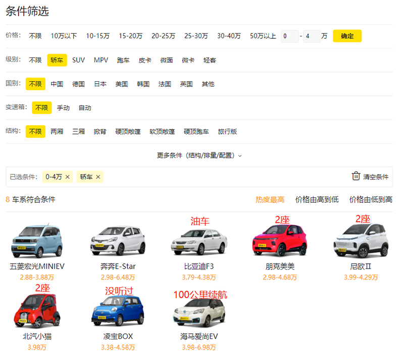
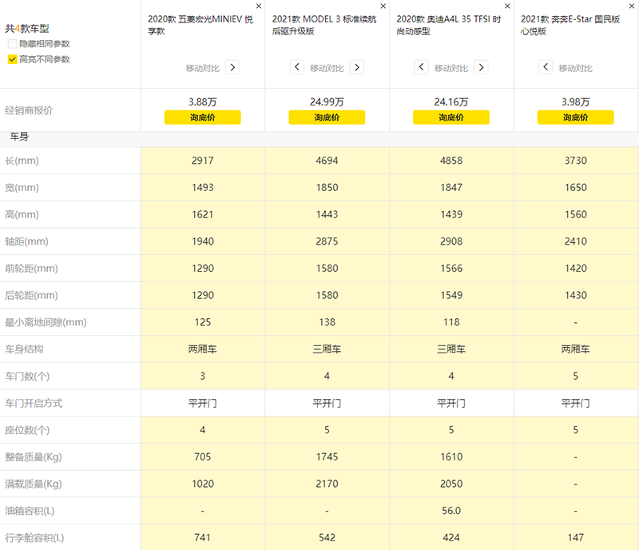
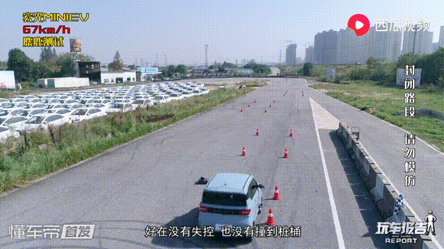
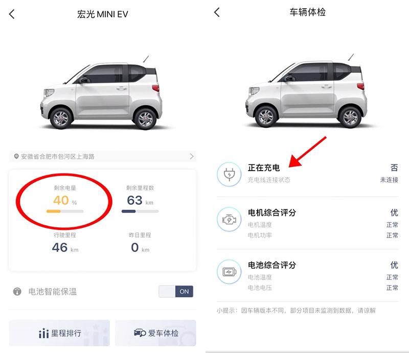
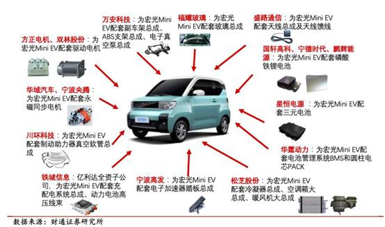

# 论五菱MINI EV的产品力

如果想知道五菱为什么是神车？看这篇就够了：[五菱为什么是中国第一神车？](https://mp.weixin.qq.com/s/SFVD3JpYq6Sp0Wt4iPuqCQ)

如果想分析五菱MINI EV热销的原因，看这篇就够了：[五菱宏光MINI EV热销分析](https://mp.weixin.qq.com/s/tO-56Dvtf5lxSCtjPKtskw)

在热销分析文章中，特有感触的一段话：

**“以往，从卖车的角度做产品设计，就是堆功能、拼指标。但是，现在，我们必须从消费者使用汽车的角度做产品设计，需要想明白用户究竟为什么要买带有这个功能的汽车产品。”**

好吧，罗孚想从消费者用车角度描述一下五菱MINI EV的产品力。

## 是一辆车，四座的

首先我们**买的是一辆车**，不是两轮电瓶车，不是老头乐。

可能有人会说，两轮电瓶车挺好的，想停哪就停哪，还不收停车费。是的，但两轮电瓶车能**坐四人**吗？能**挡雨**吗？

可能有人会说，老头乐也挺好的，没有罚单违章，也没法收停车费。是的，但有**安全性**可言吗？能**有脸**开出去吗？会不会让人认为是残疾人车？

所以，我们买的是**一辆中规中矩的汽车，还是电动的**。

其次是**一辆四座的车**。

smart虽然早早地掀起了两座车的风潮，但销量惨不忍睹现已绝迹，而smartforfour虽然四座，但价格让人咋舌。在实际的生活中，两座是尴尬的，即便没娃那也有带爸妈或朋友的时候，而四座即便后排不坐人也可以放东西，**四座是必须的**。

## 低价格

多少价格算低价格？10万算低？5万算低？好吧，**直接跌破大家的心理低价，一辆汽车只要2.88万到3.88万，总价不超过4万元。**

4万元的车？开玩笑吧？是真的。4万元以下的轿车，共搜索到如下几款：

总共8辆车，3辆两座车，1辆油车，1辆没听过的车，1辆海马车竟然只有100公里续航(请把产品经理拉出去毙了)，剩下能打的，也就长安奔奔E-star了。

这个价位，网上说两台iPhone的价钱就能买，有点夸张了，但确实是**跌破了大众认知心理底线的价格**，有一种无法抗拒的感觉。也正因为如此**超有诚意的低价**，开创了五菱神车的新赛道，引领了低价微型车，占领了用户的心智。

## 车小

汽车这么小，还能叫汽车吗？嘿，您还别说，车小还真是巨大的优势。

先附上同特斯拉、奥迪的尺寸对比图：

**车长不到3米，不到特斯拉、奥迪的2/3，一个车位停两辆车不是瞎说的**(一个标准车位长约6米)。

再说**车宽，不到1米5，同特斯拉、奥迪相比少了35厘米左右**，约为1个女人的肩宽，这个宽度差异，在窄停车位停车、加塞车流里超车，游刃有余的感觉让人很爽。

除了停车、超车的爽快外，微型车的“微”感觉也是完全不同的。长安奔奔、长城欧拉黑猫白猫这种类似价位的微型车，其长度至少比五菱MINIEV长50厘米，宽度宽15厘米，这差距从外观看虽小，但心理差异巨大。**很多用户买五菱MINIEV，有玩的感觉，我买的是“玩具”车，而汽车稍大，就成“小”汽车了，“小”汽车让人感觉小器了。**不信？你品品。

## 续航

说实在的，对于大部分人工作而言，其工作半径范围是多少呢？二三十公里应该是非常长的距离了，超过50公里的是极少数了，换算过来，**一次上下班一般在50公里以下，来回超过100公里的极少。**

基于上述的考量， **续航120公里和170公里的设计，是非常合理的，不管是从实用性，还是从车辆价格考虑。** 那些说电动车必须上300公里续航的，我只想问一句：加一万元给你上300公里，你是否愿意？我想，又有很多缩头乌龟了。当然，相同价格能上300公里一定是更具性价比，比如长安奔奔E-star有意向主打此点。

120公里的续航，可以从上海开到苏州或南通，而170公里的续航，可以从上海松江开到杭州，一次能够跨城，那对于城市内通行就不会有任何问题。大部分的人实际是停在自家小院，去市区上个班，来回二三十公里。如果只在市区活动，一般也不超过10公里的出行半径。真正可以做到**一次充电能用一星期。**

 **至于快充，没有又何妨呢？因为这车不是卖给快生活的人，也没指望能长途出行。** 对于停自家小院的人，直接插220V家用插座就解决了充电问题，已经非常的方便。而能装充电桩的人，充一晚上的情形应该是常态，不计较一小时充满还是九小时充满，可能反而会和你计较快充的价格贵、晚上电费便宜等。 **把快充的钱省下来是非常明智的做法。**

补充一点，五菱170公里续航，不虚标，具体看懂车帝的实车测评“[极限测评宏光MINIEV，170公里续航，究竟有没有水分？](https://www.dongchedi.com/article/6902674807888806414)”

## 安全性

五菱MINIEV被喷的最多的是：没有安全气囊(马卡龙已解决，后述)。好吧，必须承认，安全气囊听上去确实非常的重要，比如我会因为侧安全气囊的有无而买高配车。安全气囊确实有保命的作用，我们也不能因为安全气囊一次也没有弹出来过就说安全气囊无用。但对于五菱MINIEV，没有安全气囊，我表示理解。一辆最高时速100的车，最主要的用途是代步，城市内代步，一般速度在60左右就不错了，而速度到80算是非常快了，平时堵车开开停停可能都到不了40，这样的速度之下，即便碰了，安全气囊都不一定会弹出来。别喷我，我真的认为：**低速场景下的车辆没有安全气囊，我可以接受。**

当然，五菱MINIEV本身的安全性是比较OK的，一方面，本身是**钢制车身**，不是那种塑料壳的汽车哦，同时也**还有防撞梁**，虽然防撞梁低了一些，另一方面，从实际事故的角度来看，五菱MINIEV的表现都还不错，没有想象的那么肉。

由于车辆确实太Q了，让我们担心这车的稳定性，是不是容易飘，这样就容易导致翻车事故，事实上，这车还真没那么飘，能以67的速度穿越，具体看懂车帝视频。

补充几点小细节：一是这车有**胎压报警系统**，呃，虽然说是因为2020年开始国家要求强制安装的，但以前老款车型都还不带这功能，以前是后装或是高端车才带的功能那。另一是配了**儿童座椅ISOFIX接口**，你可以说是由于营销需要，扩展家有小宝宝的受众群体，但有就是加分哦。同时，**防抱死ABS、制动力分配EBD、上坡辅助HAC、安全带未系提醒**等都有，这些安全配置也是加分项。

## 空间

车虽然已经是最小的微型车了，但空间也是大部分消费者在意的重点，毕竟空间若小到让人憋屈那确实不太愿意买了。

实际上，五菱MINIEV的空间还不错，对于这辆四座车，**前排空间还算宽敞，后排也能坐一个胖子**，虽然不算太舒适，但仅仅是短距离出行，还是可以接受的。

五菱MINIEV的行**李舱容积达到了惊人的741L**。怎么做到的？因为后排可以完全放倒。若后排座椅没放倒，那能放行李的地方就一个缝隙，确实放不了多少东西，但放倒以后几乎可以超越绝大部分三厢车的容积，这装货能力也是挺惊人的。似乎又给五菱MINIEV找到了一个群体：有一定的运货需求的群体，比如乡下小卖部的店老板:)

再来聊聊细节的储物空间吧。首先车门就是最重要的储物空间，放手机、放水都不是问题，前后座也做了分区。在中控台的右侧，有一个杯座，可以放一个水杯，这个位置正好挨着空调出风口，喝水应该可以冬暖夏凉。在中控台的中间，还有两个带网兜的储物空间，放手机以及小杂物是没有问题的。另外大部分没有注意到的地方，在方向盘的左侧，也还有小小的储物空间，可以放卡片等，上高速后放通行卡或票据非常方便，这设计很贴心哦。总体而言，虽然没有手套箱，没有中间的储物空间(车宽限制，主驾副驾中间只能放换挡和手刹了)，但**整体储物方式较多，设计也比较贴心。**

补充说一点：主驾副驾中间没有凸起部分，是一个平面，所以主驾可以轻松换座到副驾，这个体验有点不一样，当然也有好处，主驾不好开门时可以轻松从副驾开门下车。

## 其他增值项

### 有手机APP支持

车辆支持手机APP查看，虽然无法查看车辆位置信息，但车辆的电量、剩余里程、总里程、充电状态、电池电机评分等都能看，功能简单但超预期，随时了解电量信息，很贴心。

### 多媒体主机用处多

默认自带收音机，同时还支持USB音乐，如果USB口不插U盘，那还能给手机充电。车主的听广播、听音乐、给手机充电得到了满足，基础娱乐的支持还是很到位的。

### 遥控车钥匙还带有一键寻车功能

车钥匙是中规中矩的普通遥控车钥匙，锁车、解锁、开后备箱三个按键，但若快速按两下锁车键，车辆可以鸣笛闪灯，方便在大型停车场找车。

### 车灯高度可调节

车灯高度调节功能是调整灯光的照射角度，不是简单的远光灯近光灯切换，这个调整可以提高夜间行车的安全性。一般车上似乎都不带，不知道五菱MINIEV为什么要带，可能是车身整体高度较高，对不同的人而言视野也有较大不同，这一设计也值得加分。

### 全彩液晶行车电脑

高配车型配备了全彩液晶行车电脑，可以清晰的看到车辆的车速、档位、剩余里程、驾驶模式等信息，加上车辆车道示意图，整体设计清晰明了、美观时尚，增加了一定的科技感。

## 关于马卡龙

可能很多人说，五菱MINI EV原本定位的是老头乐，结果误打误撞得到了年轻用户群体的喜爱，但不管怎么说，马卡龙给大家带来了非常多的惊喜。

### 年轻时尚的颜色

五菱MINI EV马卡龙版三月推出，三款全新配色车型，分别是**牛油果绿、柠檬黄、白桃粉**。老头乐讲究实用，而年轻人讲究时尚，跳跃的颜色就是第一冲击力，官方直接原装出厂，无需改装，据说是和PANTONE合作的**专属潘通色**呢。另外，同时配套**套色车顶**，呃，不懂，但据说更时尚更靓丽。

对了，还**请了任敏和马伯骞来代言**哦。

### 配置惊喜升级

被大家诟病已久的**安全气囊回归，默认标配安全气囊**，以后别再BB安全啦。

新增自动落锁、解锁功能，行车时自动落锁，碰撞时自动解锁(安全逃生)，很实用。

**新增蓝牙功能**，虽然现在可能只能蓝牙音乐、蓝牙电话等，但可玩性增加，也许后续还能升级更多功能。其可以选配的智能语音收音机，猜测可能是同蓝牙相关的一个软件功能，因为带有免唤醒功能。

升级扬声器数量到2个，升级USB接口到两个(新增的在后视镜上，为行车记录仪预留的)，升级大灯为回字形LED大灯，升级后备箱开关状态可在仪表查看，升级后排座椅五五放倒，坐人载物更方便灵活。对了，对年轻人来说很重要的化妆镜，也回来了。

**新增倒车雷达倒车影像**，有点惊喜哦，非常实用的功能，特别是对年轻人来说。(猜测倒车影像应该是显示在仪表上的，一方面没有第二块屏，另一方面倒车画面可以显示在屏幕最上层，一般厂家不敢或没想到如此设计吧。)

低速行人警示系统不确定是不是新增，可能用处不大，但给安全加分。而电池的加热及智能保温技术也不确定是否新上线的。

总的来说，配置升级真的很惊喜，达到了一辆中规中矩车的配置，低成本之下还能有如此改进，不枉罗孚写本文(论五菱MINIEV的产品力)啊。

### 为什么符合年轻人的口味？

汽车确实给生活带来了非常多的便利，年轻人更希望享受便利，而BBA、特斯拉的价格可能需要做伸手党，也可能和自身的身份不匹配。但五菱MINI EV就不同了，买的是一个大玩具，不需要身份，反而体现自己的个性。而且价钱可能仅仅是主管的一个包包钱，但是自己花了半年一年的积蓄买的，没给爸妈添负担，说起来都有底气呢。再说，作为新手的自己，买那么贵的车干嘛？刮了蹭了不心疼？还不如买个小车练练手，代步个两三年先。

**实惠、实用、时尚，能够真实提升生活品质，应该就是年轻人的口味。很巧，五菱MINI EV，特别是马卡龙版，可以满足年轻人的口味。也许，这就是所谓的“年轻人的第一辆车”吧。**

## 满满的诚意

据说，这车仅有2%-3%的利润，也就是说厂家仅赚576-1164元，这听起来有点可笑，有些成年人都不屑赚取这么一点，这又让4S店如何生存。

上图是某文章的五菱MINI EV成本分析图，上述利润率也出于该文，不管文章内容是真是假，我们所能看到的零部件都是真实的，看到车身是钢制而不是塑料这也是真实的，而极低的价格也是真实的，不得不说，五菱MINI EV还是带来了满满的诚意。

## 关于缺点

### 手动操作的后视镜

后视镜的视角调整是手动的。试想，一个人刚拿到车，然后调整后视镜，左侧还好调一些，右侧呢？需要下车调整，下车了就无法看到效果了呀，所以可能需要上下车几次来调右侧后视镜。

虽然说不太能接受手动调整后视镜，但反过来说，如果驾驶员不变，那后视镜调整一次后就不需要再次调整了，可能出于成本和结构设计考虑，没有上线后视镜电动调整的功能。

### 电门踏板位置

电门踏板位置应该也是被诟病最多的部分，因为太靠右了，甚至离副驾都比较近，加上前排中间无高起部分，被副驾踩到的可能性也是有的。而且踏板太靠右，不管是角度还是长度都会让脚有点不舒服，不过也有说法说这样更安全，因为脚伸的长即便把油门当刹车也使不上大力啦[哈哈]。本人没有试过这车，对此仅能猜测还无法真实表述个人感受，对购车者来说，可以上实车或试驾试试。

### 后座上车不方便

两门四座车一定存在后座上车不方便的情况，比如必须要掰倒前排座椅才能上车，这实属无奈之举，谁让看中的小呢。当然，五菱MINI EV上车已经算是方便的了，据说小孩能直接上车，不用掰倒前排座椅。另外，前排舒适了，后排上车不方便一些，那又何妨呢，上车就那么一下下嘛:)

## 用车场景

说完车辆本身，最后说说用车场景，哪些场景适合买这辆车。**占牌和代步**，就不说了，这是两大不同的强需求，那哪些实际使用需求适合五菱MINI EV来解决呢？

以前住的地方离地铁站两三公里，一个不尴不尬的距离，小区里坐辆黑的也要五元，两个人上班就要十元。如果有辆五菱MINI EV，地铁站停车也就十元左右，但方便了很多。

以前住的地方只能地面停车，但小区车多，多到惨不忍睹，晚上11点进入小区，很难找到一个较近的可停车的路边空隙。找到以后停车还需要技巧，侧方停车还挺不容易。找空隙和停车，一折腾就五分钟以上了，大晚上的困意十足结果还搞的一肚子窝火。如果有辆五菱MINI EV，你看到有差不多的缝隙，就可以停进去，或者直接倒车在路边也无妨，小车优势尽显。

如果是乡下老家，基本都是自建小楼，停在小院的话，直接220V插座充电，很是方便。至于车库，直接打开家里大门，就可以把1.5米宽的五菱MINI EV停进家里，都不需要专用停车库，是不是也很方便。

周末在家，用车主要是出门买个菜、溜下娃、去附近商场喝咖啡血拼看电影等等，周末生活周边的短距离用车场景，五菱MINI EV能够很好的覆盖。

关于用车成本，据说非常的低，这里指的是每公里电耗极低，一年只需一千多的电费就够了。当然，保险等还是不能少的，而停车费主要看自己的停车情况。另外维修保养成本也是极低，比如轮胎，据说补一个轮胎的钱都差不多接近一个新轮胎的钱了。

虽然用车成本很低，但也有不方便用车的场景，比如市区停车十元一小时，封顶也要好几十，比如市区停车位一千五一个月，比如市区找停车位非常困难，比如不能安装充电桩，这些确实是不便利的地方，但这不是无法下手买五菱MINI EV的因素，而是不能买车或电车的因素了，不要颠倒概念在五菱MINI EV上哦。

## 结语

**五菱MINI EV不是第一辆4座迷你车，但其恰到好处地满足了“实惠、实用、时尚”三大需求，填补了市场空白，开辟了新赛道，虽然一定不及特斯拉，但比买两轮小牛强，在迷你4座小车上占领了用户的心智，并且受到了年轻人的青睐，是名副其实的“年轻人的第一辆车”。好产品仍然是第一竞争力，不玩虚的，拿出诚意，自然赢得民心。为“用好产品改变世界”的民族智造企业，点个赞。**

本文飞书文档：[论五菱MINIEV的产品力](https://rovertang.feishu.cn/docx/doxcnNXGavIzAxMGQb3Els9m1CV)

---

> 作者: [RoverTang](https://rovertang.com)  
> URL: http://localhost:1313/posts/car/20210328-on-the-product-power-of-wuling-mini-ev/  

