# 2021年汽车销量数据及分析

又到了一年一度展示汽车销量数据环节，很有幸，我还是收集全了2021年的全年数据，包括各月数据。

去年数据原文：[2020年汽车销量数据及分析](https://mp.weixin.qq.com/s/bQSPe1_86F-RtGJlFtSDFA)

今年数据，着急的话，可以直接拉到文末阅读原文下载即可。

## 关于数据的说明

### 数据来源

本文数据来自于懂车帝，原始数据链接：[https://www.dongchedi.com/sales/sale-x-1000-x-x-x-x](https://www.dongchedi.com/sales/sale-x-1000-x-x-x-x)

所取的数据是2021年的零售量。

### 数据差异

新闻中乘联会的数据：零售销量达到2014.6万辆，同比增长4.4%。

本文汇总的数据：20064742

差异：8.1万辆

数据差异0.4%，在可接受范围内。

另外同《[2021年汽车企业及车型销量排行榜](https://mp.weixin.qq.com/s/Baz9Eka-lEvcFZ3wTLdSCg)》一文也存在差距，特别是厂商数据的差异。可能统计方法不同，如吉利会包含几何，而本文中的数据是分开的。

### 同2020年数据对比

2021销量：20064742

2020销量：19240714

增幅：4.3%

上述2020年销量数据也同样来自于懂车帝，于去年统计。

同乘联会的增长4.4%基本一致。

## 品牌销量数据

### 所有品牌销量数据

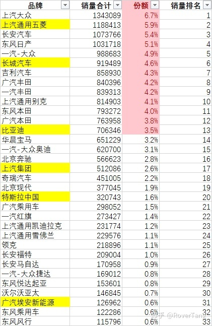

只摘录了年销量10万以上品牌，共34个，合计份额90.3%。

其中，年销50万以上品牌，共17个，合计份额72.3%。

而100万辆以上品牌共4家，分别为：上汽大众、上汽通用五菱、长安汽车、东风日产，合计份额23.1%。

另外，对于新能源汽车，也使用黄底色做了标识，看上去新能源品牌有点少，而且新势力基本没上榜。有点小失望？别啊，比较了一下去年的数据，原来排名前三的品牌，除了丰田外，大众和本田的销量都有所下降，另外代表了高端的BBA，除了宝马外，奥迪和奔驰也有所下降，所以，2021还只是新能源的开始，电动化之路，势不可挡。

### 新能源品牌销量数据

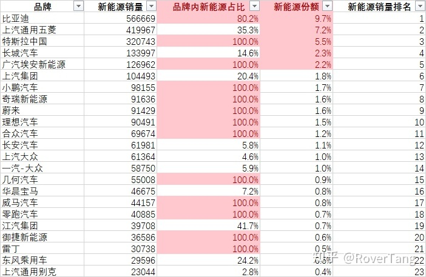

单独摘录了一份新能源品牌数据，以年销量2万为界，合计23个品牌，合计份额90.2%。

(注意：这里仅统计了新能源汽车的销量，共计2930920辆，约占汽车总销量的14.6%。)

如果按年销售量5万辆以上统计，共15个品牌，其份额占新能源汽车销售总量的80.2%。

如果按年销售量10万辆以上统计，共6个品牌，分别是：比亚迪、上汽通用五菱、特斯拉中国、长城汽车、广汽埃安新能源、上汽集团，其份额占新能源汽车销售总量的57.1%。

新造车势力小蔚理，虽然未能跨过10万辆销量，但已经突破9万辆，齐头并进，销量很猛。

没有在上述榜单的，自认为也值得一看的品牌有：金康赛力斯、岚图汽车、北汽新能源、极氪、创维等，后起之秀，充满了想象。

由于部分品牌不是只卖新能源的，所以也做了一份自身品牌内的新能源销量占比，可见还是有不少纯新能源汽车的品牌，而传统汽车品牌内的新能源销量占比也在进一步提升，后面我们可以根据各品牌数据看具体车型细分，以了解每个品牌内更为细化的数据。

## 车型销量数据

### 所有车型销量数据

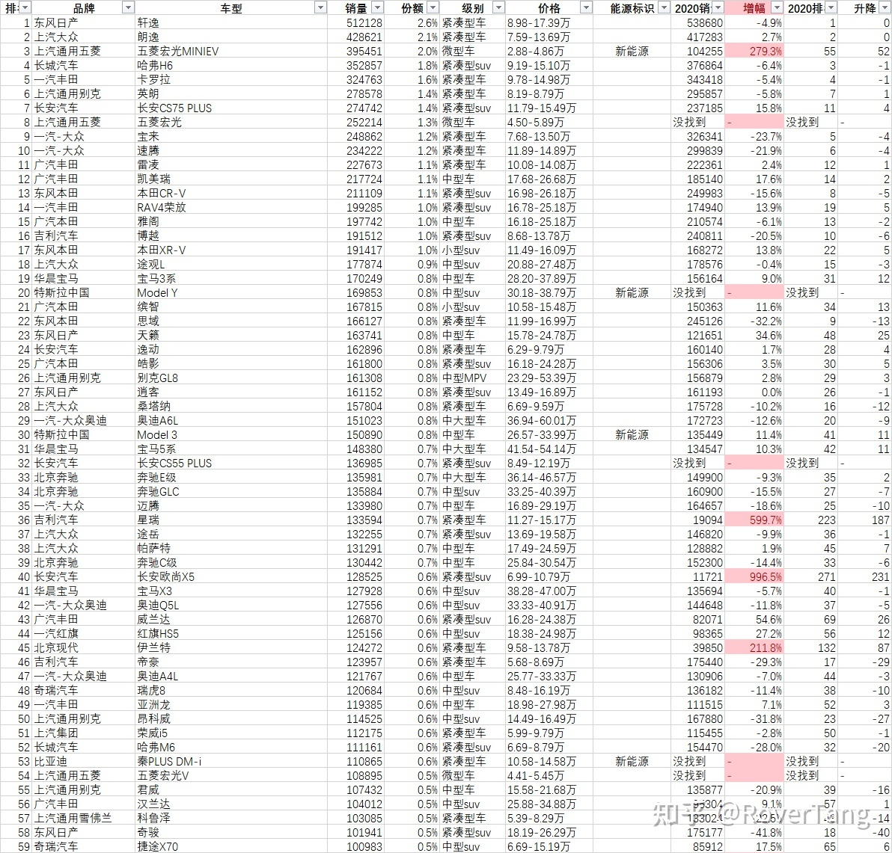

先上一张总表，仅列出10万销量以上车型，共计59款车，合计份额51.8%。

而年销20万辆以上车型为13款，合计份额19.7%。

### 新能源车型销量数据

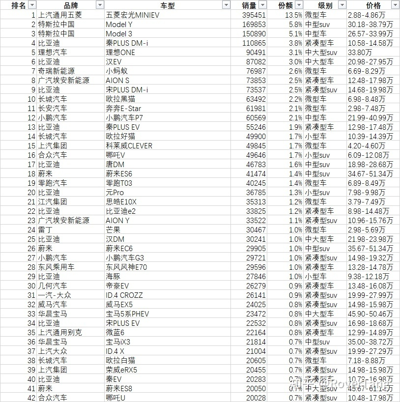

仅列出了年销2万辆以上车型，共42款，合计份额80.3%，如果按1万辆以上算的话，合计份额近90%。

而年销5万辆以上车型，共13款，合计份额50.2%。

年销10万辆以上车型，在上一个表格中已经统计到了，共4款，分别是：五菱宏光MINIEV、Model Y、Model 3、秦PLUS DM-i，合计份额28.2%。

## 各品牌下具体车型销量数据

由于数据较多，就不在此罗列，但能非常直观的看到各个品牌下各车型销量占比，对于公关哪些品牌下的哪些车型应该有所启发。以上汽大众为例，展示一下数据的样式：

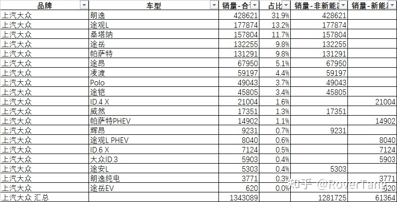

## 关于月度数据

月度数据可以看出车型的销量趋势，由于数据较多，不再单独列表，仅需下载Excel，然后选择感兴趣的数据直接出柱状图即可。方法如下：

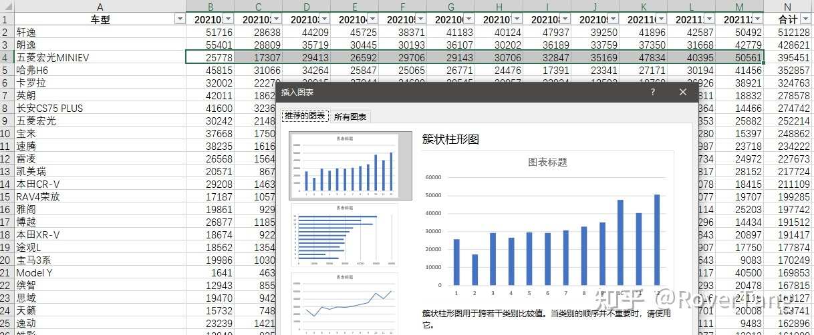

## 新造车数据

新造车数据主要取自于官方公众号，同本文数据相匹配，在此也罗列一下：

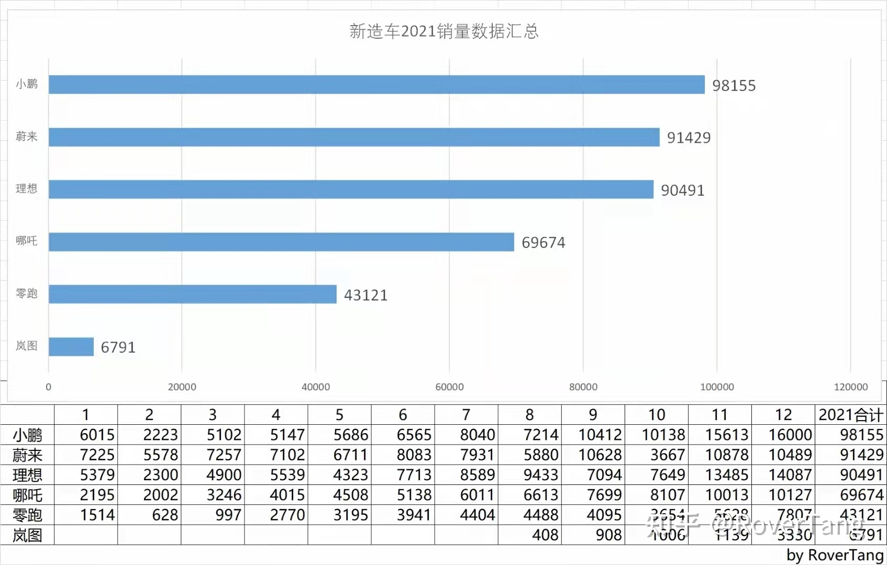

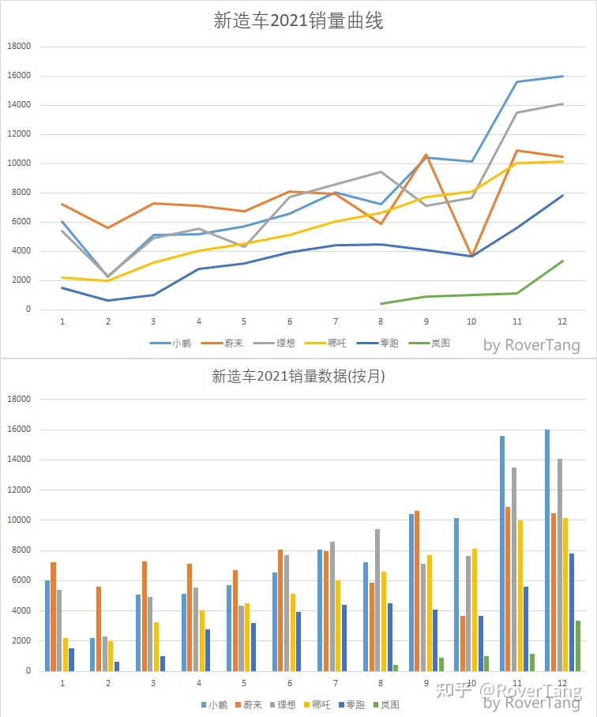

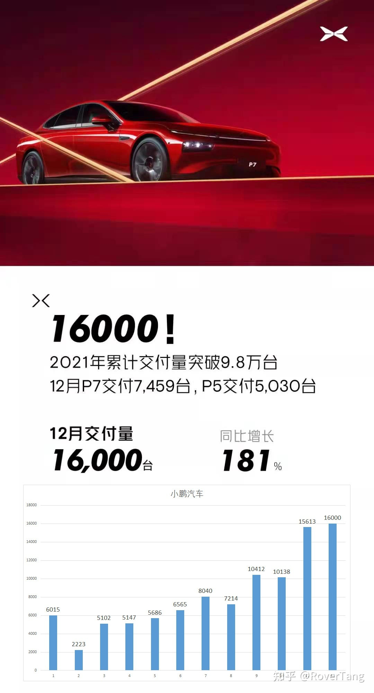

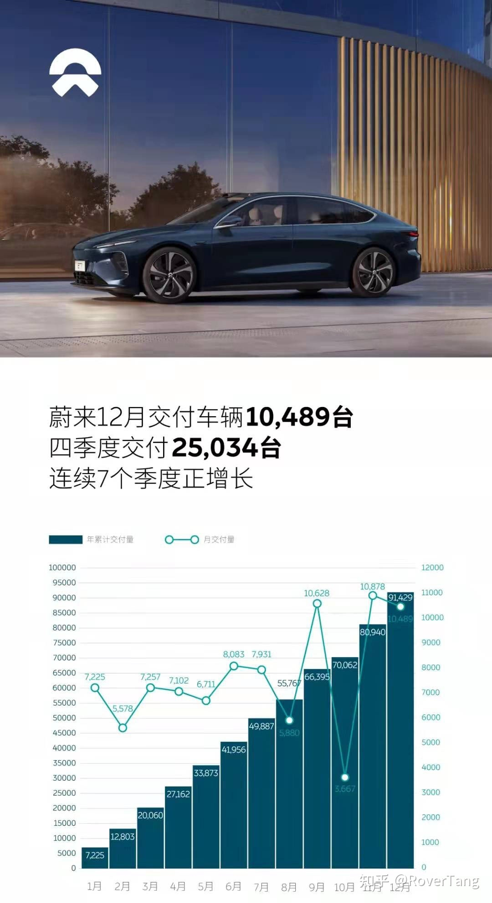

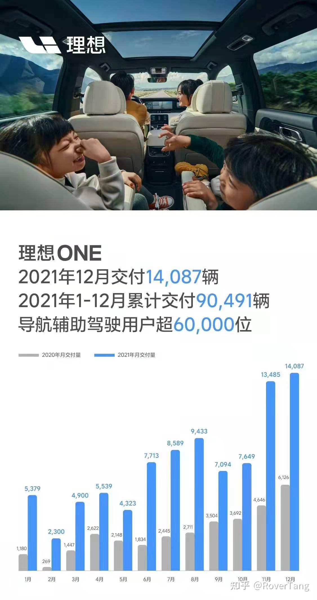

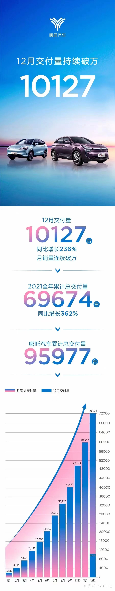

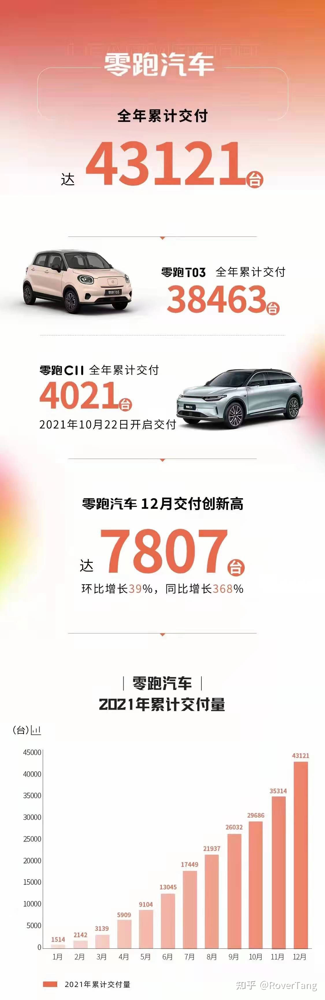

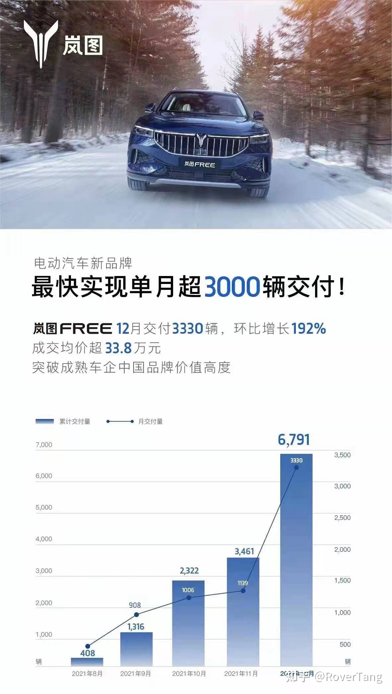

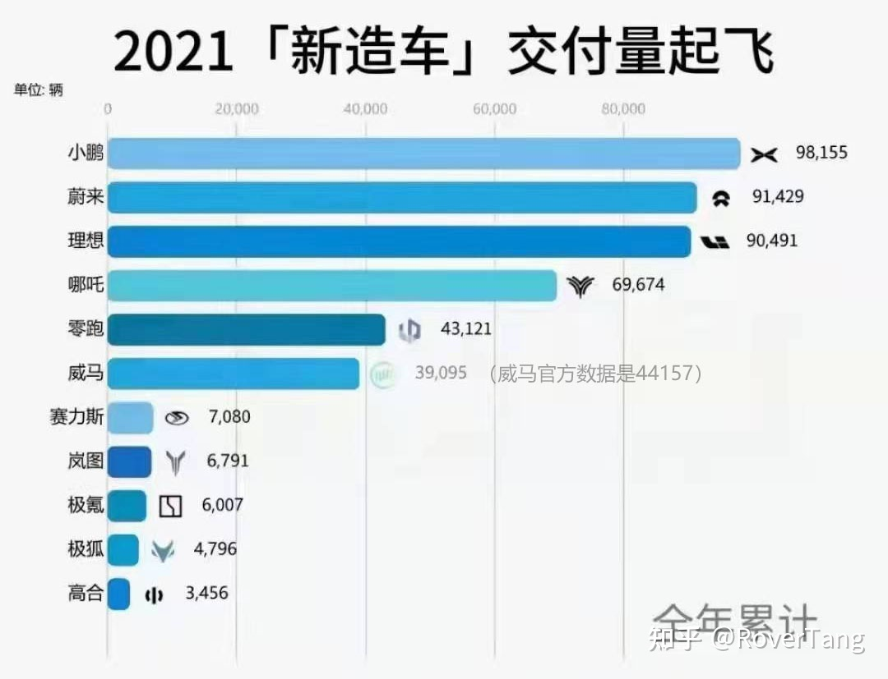

最后，Excel数据下载：[https://docs.qq.com/document/DQkxldVRWT2hYV25F](https://docs.qq.com/document/DQkxldVRWT2hYV25F)

本文飞书文档：[2021年汽车销量数据及分析](https://rovertang.feishu.cn/docx/doxcnUOTEpwR1HUZeyaGlsthr9K)

---

> 作者: [RoverTang](https://rovertang.com)  
> URL: https://blog.rovertang.com/posts/car/20220204-data-and-analysis-of-car-sales-in-2021/  

