# 2022 年汽车销量数据及分析

又到了一年一度的汽车销量数据分析时间，罗孚已为大家整理好了数据。

先附上前两年的数据：

[2021 年汽车销量数据及分析](https://blog.rovertang.com/posts/smartcar/20220204-data-and-analysis-of-car-sales-in-2021/)

[2020 年汽车销量数据及分析](https://blog.rovertang.com/posts/smartcar/20210206-data-and-analysis-of-car-sales-in-2020/)

## 数据来源和差异说明

### 数据来源

同往年一样，罗孚没有乘联会的直接数据，数据依然来自于懂车帝，只是这次不是复制，而是抓取(因为罗孚学会了 curl 和 convert json to csv)，所以数据质量会更好，标准程度也会更高，后续应该会按此方法整理。

附上懂车帝的销量排行榜网址：[https://www.dongchedi.com/sales](https://www.dongchedi.com/sales)，以表示对懂车帝的感谢。

同时，同事提供了一份汽车上牌量数据，这份表格带品牌和月度以及总计，但详细程度不足，所以就且当参考了吧，罗孚也会摘取出来做一定的比较。

### 差异检查

罗孚对比了上险量数据和新闻数据，如下：

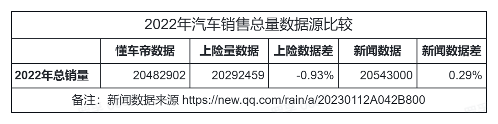

根据新闻(来源：[https://new.qq.com/rain/a/20230112A042B800](https://new.qq.com/rain/a/20230112A042B800))，了解到“2022 年全年国内狭义乘用车市场零售销量达到 2054.3 万辆，同比小幅增长 1.9%”，2054.3 万辆数据比懂车帝数据略多，高出 0.29%，此差异已经非常小了，去年的数据差异是 0.4%，此误差可以忽略，确认此数据真实有效。

同时同上险量数据对比，差异也不到 1%，目测匹配度比较高。不过，罗孚在做上险量前 20 名品牌对比时，发现不分品牌的数据差异较大，差异在两成甚至两成以上，这就有点夸张了，只是我们不细究了，还是以懂车帝的数据为准吧。

具体的上险量数据同乘联会销量数据的差异见下表：

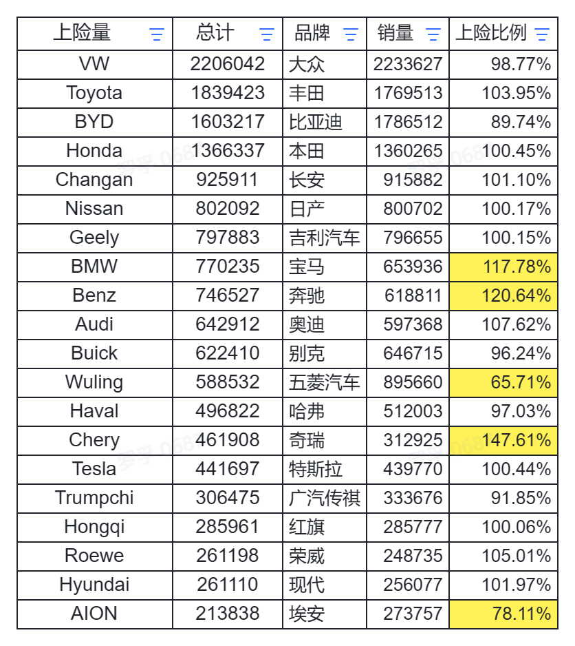

个人对上险量数据的差异，部分品牌大的有点匪夷所思，个人确实搞不懂了，好在没用上险量数据分析，仅供参考吧。

## 2022 年总体销量情况

### 总体销量情况分析

近 3 年的销量数据如下：

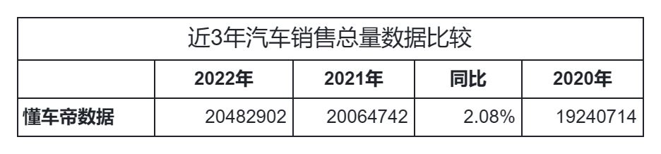

2022 年销量同比增长 2.08%，同新闻中的 1.9% 差异不大。

新能源车的销量如下：

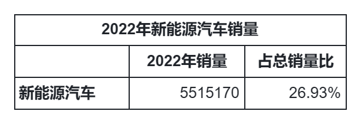

550 万辆多，同总销量占比 26.93%，这是一个非常厉害的比例，因为 2020 年的时候，人民网还在说[工信部解读 2025 年新能源汽车销售占比达到 20%](http://scitech.people.com.cn/n1/2020/1104/c1007-31917930.html)，实际上 20% 的比例在 2021 年就已经达到了，只是有所争议。本文 26.93% 这个数据也存在一定的问题，因为除了纯电，还包含了混动和增程。

目测 2023 年新能源车渗透率突破 30% 基本是不用争论的事实，但具体突破多少不好说，看特斯拉急吼拉吼降价，以及小鹏跟随等，足以见得 2023 年新能源车市场腥风血雨，但应该会利于民。

月度销量图如下：

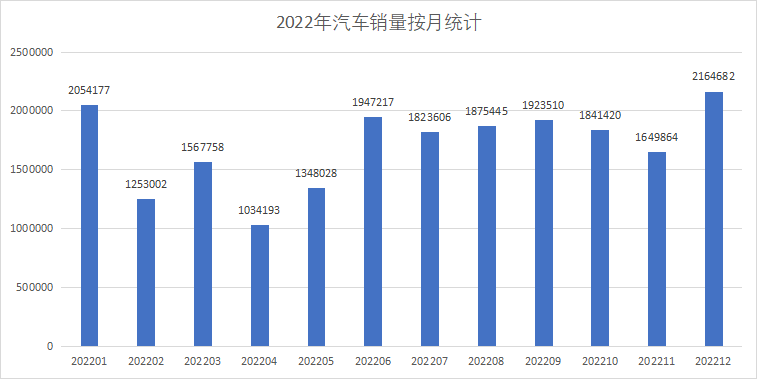

其中 4、5 月的数据明显偏低，其原因大家也是知道的。而 12 月的销量明显上升，除了年前因素外，放开应该也是一个不小的因素，预见阳康后的 2023 年应该会有进一步的销量提升。

### 按车辆类型分析总体销量

先普及一下“狭义乘用车”的概念，简单的来说：就是去掉了面包车的乘用车，就是狭义乘用车。至于什么是面包车？主要像五菱之光、东风小康等这种一般用来拉货的车，这些车严格来说，确实不应该归类到家用车。

车辆类型共分为三类：轿车、SUV、MPV。再细分基本就是按大、中、小以及微型等进行细分了。

总体比例如下：

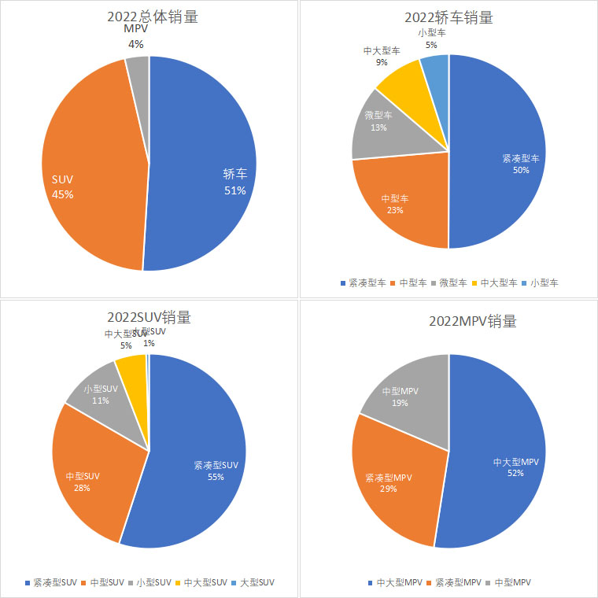

轿车最多，占比超过一半，SUV 也差不多占了一半，而 MPV 基本是商务车范畴了，占比 4% 是可以理解的。

在轿车和 SUV 销量中，紧凑型超过了一半，而轿车中的微型车占比也不小，应该是五菱 MINIEV 贡献了不小的力量，而 MPV 基本以中大型为主，毕竟商务接待的话，大才能体面嘛。

具体数据表格如下：

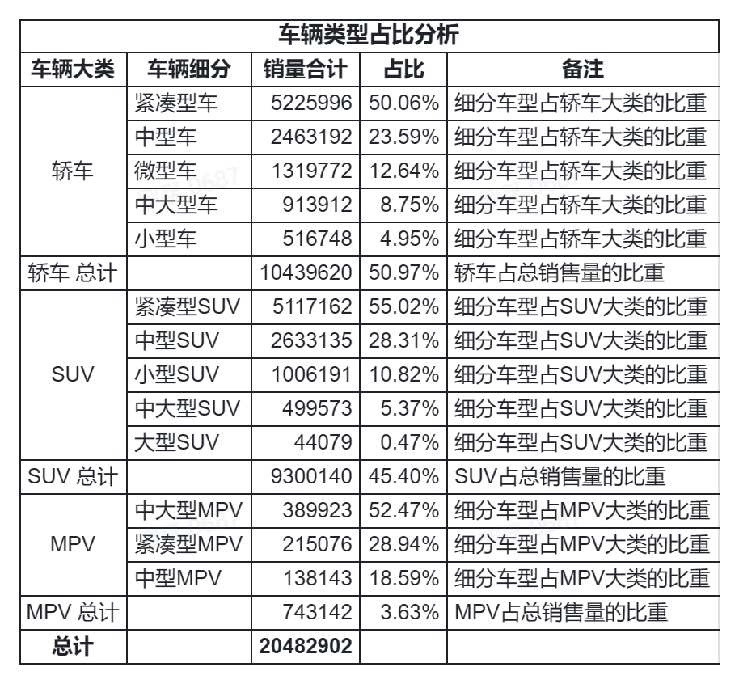

按月度销量统计后的图：

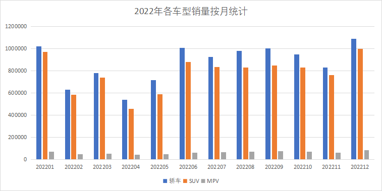

MPV 的柱子高度基本看不见，毕竟买 MPV 的确实是少数。轿车比 SUV 略多，国内喜欢 SUV 的确实非常的多，特别是特斯拉，model Y 的价格和 model 3 相当，自然很多人去买 model Y 了。

## 基于品牌、车厂、车系的销量数据分析

### 品牌销量数据

总体份额饼图如下：

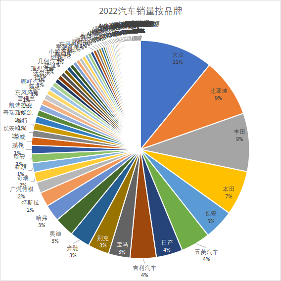

大众是将上汽大众和一汽大众的销量合并了，所以排名第一，丰田、本田也都有合并。但不得不说，比亚迪确实迅猛。

年销量超过 5 万辆的品牌共 53 个，具体(含月度)如下：

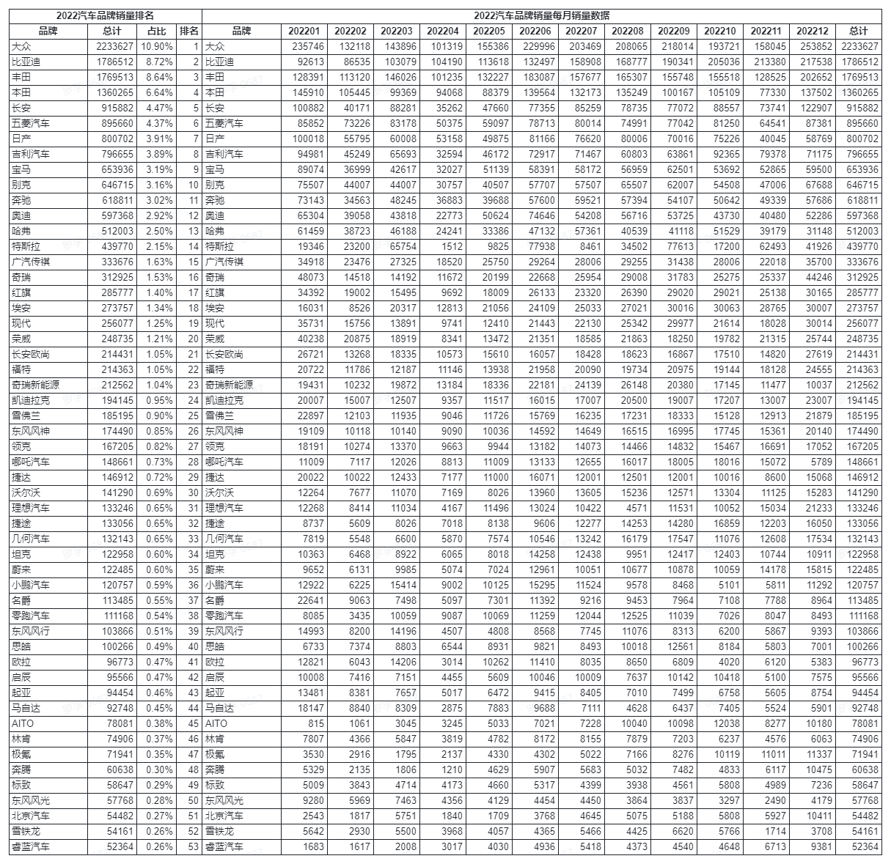

这 53 名的销量总和占比 96.05%，看来 5 万年的年目标实在是太小了。年销量 10 万辆以上品牌的销量总和占比 91.45%。

而年销量 20 万辆以上品牌，数量共 23 个，数量占比 20.72%，而其销量总和占比 79.97%。行业中的二八法则无处不在，去年也提到了二八法则，看来很灵验，也许以后会往一九方向靠拢。

最后比拼销量 50 万辆以上，品牌共 13 个，销量占比 66.34%，而 100 万辆以上是 4 个，销量占比 34.91%。

### 车厂销量数据

上一品牌销量数据是按品牌维度来分析的，对于合资车来说，存在数据合并，比如大众、丰田、本田等，毕竟该品牌不止一个合资公司嘛，而对于国产车又由于多品牌经营，实际上会存在拆分，比如长城的哈弗、欧拉等，吉利的几何、领克等，奇瑞还拆分成了奇瑞和奇瑞新能源，这种拆分导致不太能看清具体的车厂，所以我们从车厂维度再看一遍数据。

总体份额饼图：

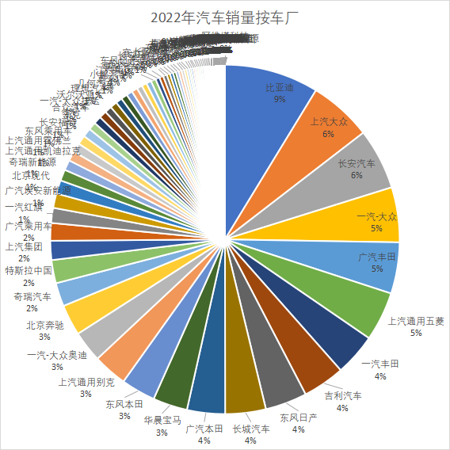

年销量超过 5 万辆的车厂共 51 家，具体(含月度)如下：

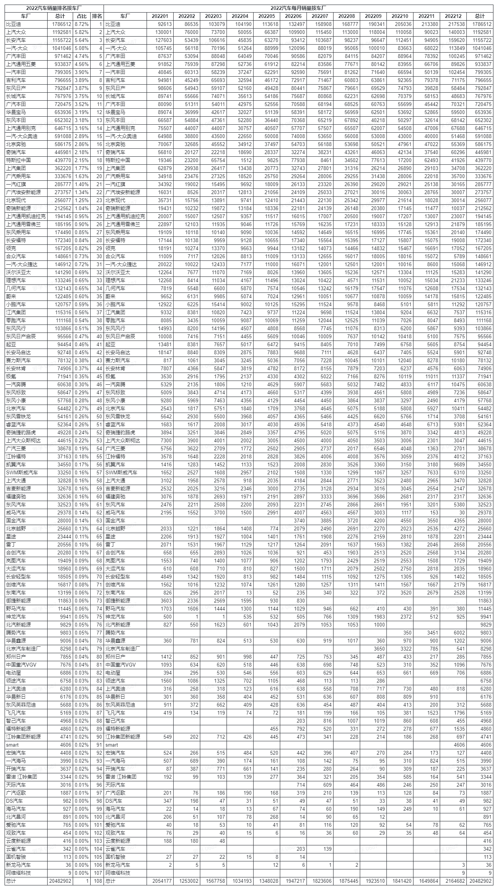

上面的数据似乎看的稀里糊涂，不是很过瘾，好吧，罗孚搬出 2021 年的数据来做一下比较吧：

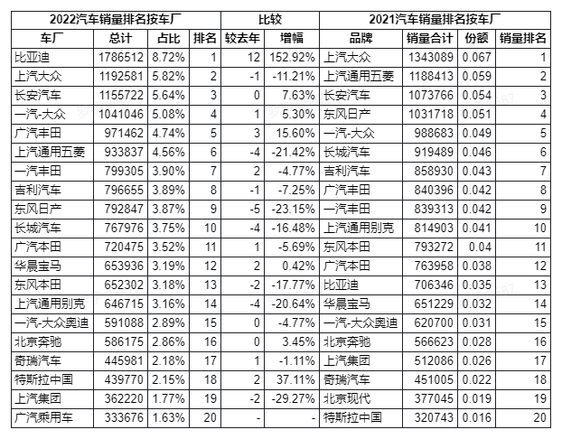

这样看确实清晰明了许多。

不得不说，比亚迪简直就是一匹黑马，上升 12 名直接冲进第一，出乎意料，销量增幅 152.92% 没有第二个对手了吧(太小体量的不算)，这一下子要蚕食多少车厂的份额，要让多少车厂增幅为负呢？所以，比亚迪如此迅猛之下，加上 2022 环境如此之差，能够正增长的车企都是非常优秀的企业。

跌幅比较大的有东风日产、上汽通用五菱、长城汽车、上汽通用别克、上汽集团、东风本田等，这些车企销量下跌是有感觉的，走在大街上就能感受到。东风日产的轩逸虽然仍然销量第一，42 万销量同去年下降近 10 万，其余车系下降 10 万多，总体跌幅超过两成，排名下跌也比较正常了。而通用五菱的 MINIEV，虽然销量同去年持平，但今年有些政策卡了 MINIEV 的脖子，加上其他车系没有起来，排名下跌也较大。长城的车自从欧拉新闻后，基本没什么声音了，而找了一下长城汽车如何挺过明年的新闻，发现已经是 2020 年的新闻了，下跌幅度较大也算能理解了。

涨幅方面比较有意思，广汽丰田和一汽丰田拉开了差距，广汽丰田销量提升 10 万多，增幅 15%&#43;，销量排名提升 3，而一汽丰田销量同比下降了近 5%，结果排名还提升了 2。同时，华晨宝马销量同去年持平，结果排名也提升了 2 个名次。而特斯拉虽然增幅达 37%&#43;，销量也增加了近 12 万辆，结果排名也就增加个 2，加上据说 2022 年没有完成目标，2023 年开启大降价也就可以理解了。这个涨幅说明，比亚迪对销量蚕食显著，下跌的车企跌的也比较惨，越是底部的车厂想排名上升，销量要有较大比例的提升才行，2023 看起来腥风血雨难免。

### 各品牌下的车系销量分析

先看一下销量能够达到 20 万辆/年的车系：

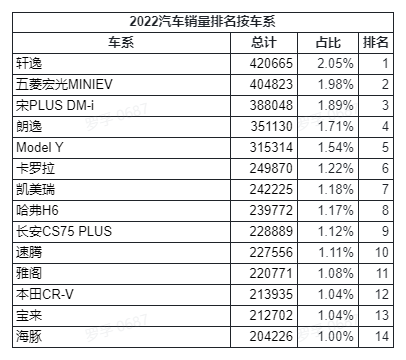

其每月销量趋势如下图：

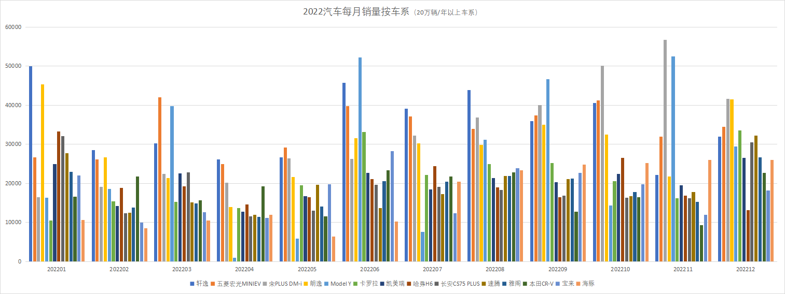

本想再做一下各车系图表的，但由于品牌够多车系更多，每一个品牌列举一下车系，这活很累很没效果，罗孚前年做过一次，仅仅是做图表就做了大半夜，今年大家自己按需自己做吧，但给个示例。

比如比亚迪，在车系分析表中，找到这个品牌，就可以看到各个车系的每月具体销量数据了：

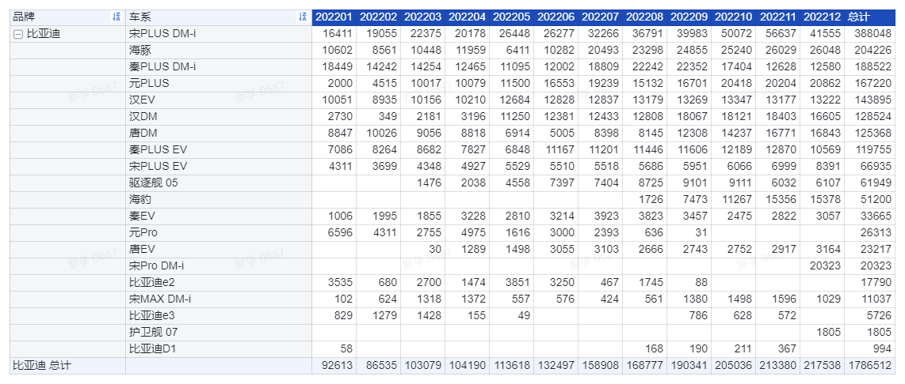

根据这个表，又可以每月销量柱状图，可以了解该车系的每月销量起伏，如下图：

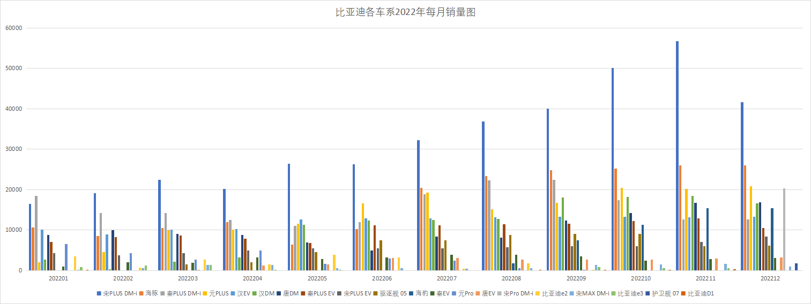

## 新能源汽车销量分析

### 新能源品牌销量数据

先把销量大于 10 万的，以及即便不到 10 万但知名度比较高的新能源品牌给列出来，销量和排名如下：

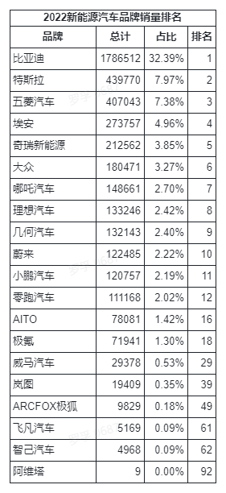

具体的每月数据如下：

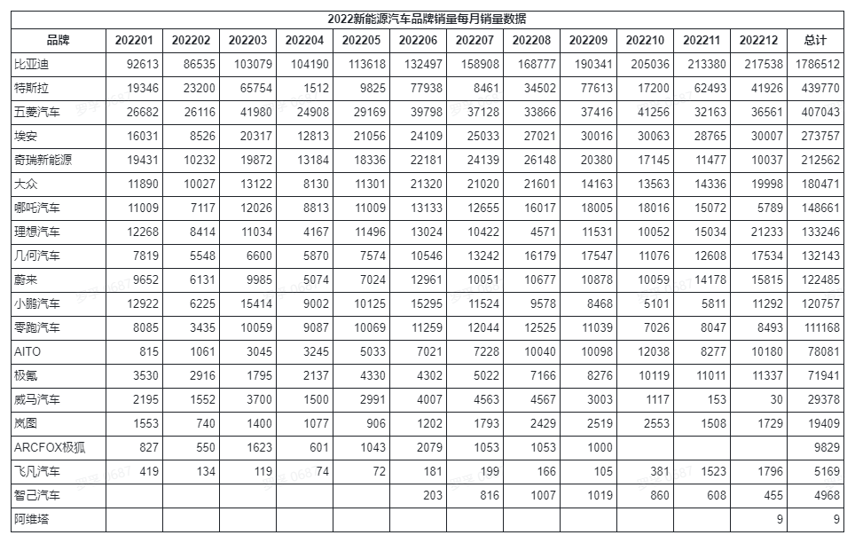

我们再看一下每月的销量数据趋势：

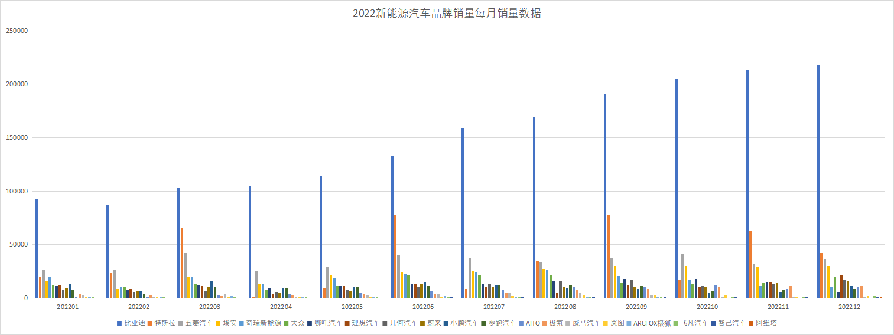

这个数据好像没法看，因为比亚迪的数据，简直太高了，而且一直在向上突破，从年初不到 10 万辆，到第四季度全面超越 20 万辆，确实太厉害了。旁边的特斯拉可以看到明显的起落，比如 4 月 5 月基本没有销量，说明上海对特斯拉的销量影响太大了。对比两者的曲线，说明特斯拉的销量对超大城市的依赖还是非常高的，而比亚迪反而没有这个局限性。

去掉比亚迪、特斯拉、五菱后，我们看一下我们大众认知的新能源品牌趋势图：

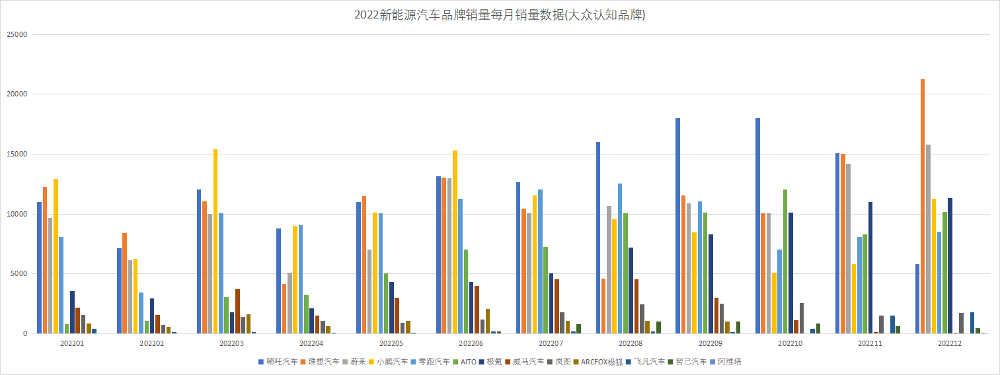

这个图比上图看起来没那么突兀了。哪吒第四季度不是很给力，不知道出了什么问题，理想汽车第四季度销量很漂亮，整年数据都不错，难怪能拿下魏晓丽的头牌。蔚来的曲线曲率接近理想，而小鹏的曲线就没那么漂亮了，看上去第四季度表现不佳，零跑也有类似的情况。问界和极氪也基本都是向上的曲线，趋势较佳。威马汽车和 ARCFOX 就比较尴尬了，第四季度基本没有销量，一个是因为自身经营问题，另一个不知道什么问题。飞凡和智己有点难兄难弟的味道，2023 年再看看吧。阿维塔刚刚起步，静待 2023 吧。

### 新能源车系销量数据

品牌比较完了，车厂就不用比较了，因为新能源车里的合资车厂基本不用看，排名第 6 的大众，我们也知道是 ID 系列，但反响似乎一般般，不值得再做拆分。

但车系还是要看看，通过销量的好坏分析，也应该可以给我们日常生活中购买新能源车提供一定的参考。

我们取 5 万以上销量的车系吧：

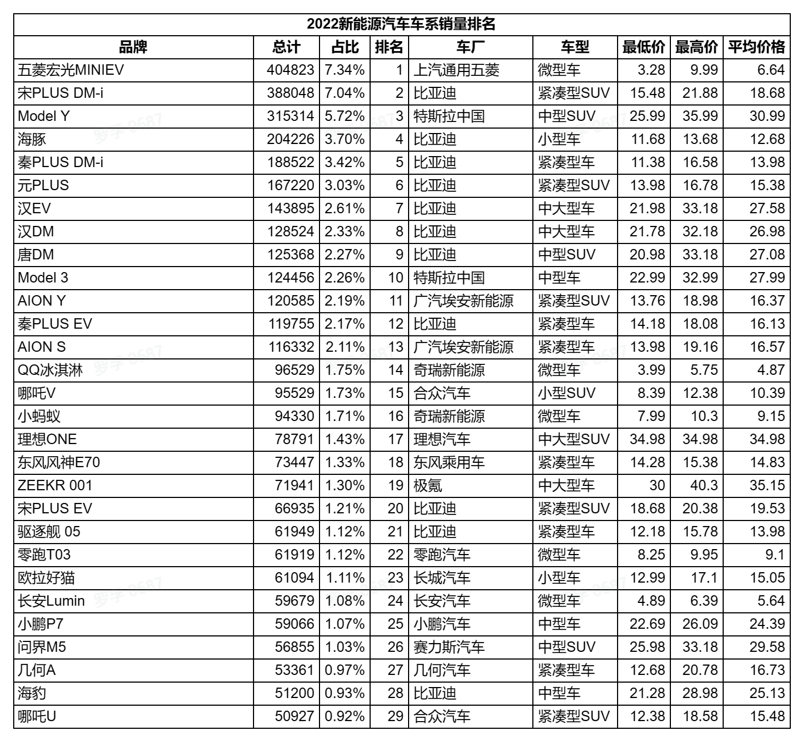

前 10 名被五菱、比亚迪、特斯拉承包了，而销量过 10 万的也就 13 个车系，多了一个广汽埃安，而比亚迪则占了 8 个名次，比亚迪直接承包了 6 成以上的名次。

这个表中的销量，即年销量大于 5 万销量的车系，合计拿走了 66% 的新能源汽车销售份额。而 10 万辆以上销量品牌，销量占比 46%，这里比亚迪占了这部分销量的 57.54%，即 10 万辆以上销量的车系，比亚迪拿走了近 6 成。

很难想象，比亚迪是如何做到的，2021 年都没有这样的爆发，2022 年直接不声不响的干到了第一，而且不像五菱那样靠 MINIEV 撑起独角戏，直接全车系爆发，这是一件完全无法想象的事情，这背后一定值得深思和学习。

我们熟知的造车新势力魏晓丽，有理想 ONE 和小鹏 P7 上榜，不过两者销量差近 2 万，差距不小，而蔚来，销量最好的是 ES6，但仅为 4.2 万辆，比小鹏 P7 少 1 万 7，似乎又掉了一个档次，而紧随蔚来 ES6 之后的，就是理想的 L9 和小鹏的 P5，都是差不多 3.9 万辆左右，追上蔚来 ES6 看上去指日可待。多说一句，魏晓丽的车系数量是：蔚来 6 款，小鹏 4 款，理想 3 款。有能力就学比亚迪，全车系爆发，没能力就学理想，少而精。

另外，本表格还附上了车辆分类以及最低价最高价，供各位参考。

## 最后

2022 年，在疫情比较严重的年份，汽车整体销量仍然有微弱的同比增长，实属不易。

在传统汽车领域，虽然大众、丰田、本田等合资车企仍然是头部玩家，但国产的比亚迪无疑是一批黑马，不仅仅是新能源车的领跑者，更是销量领跑的车厂(按车企)，其 150%&#43; 的增长速度着实让人大跌眼镜更让人眼红。

新能源汽车领域，比亚迪无需多言，特斯拉销量也有不小的增长，去年销量第一的五菱没能保住名次，直接跌到了第三。而魏晓丽，去年排名是小鹏、蔚来、理想，今年已经是理想、蔚来、小鹏了，不过都轻松跨过了 10 万销量的大关。

看着这些数据，很是让人感慨。由于个人仅从事于汽车零部件行业，所以对此销量数据的感觉和分析还是不足的，希望这份数据能给行业中的更多同学带来益处。

最后说一下本文数据：直接访问飞书表格([汽车销量 2022-RoverTang 整理](https://rovertang.feishu.cn/sheets/shtcnlSIsstDUCHwZozrQYUkt4e))，即可进行浏览。公众号文章则点击阅读原文即可直达。

但由于飞书对外文档的统一设置，该文档无法直接下载，所以罗孚整理了一份离线 Excel，存放于腾讯文档供大家下载，不过，需要 10 微信豆哦，也算是测试大家对原始数据的需求了，更算是支持罗孚辛苦的手工活吧，当然，如果打赏杯咖啡，那就更有爱啦。

对于 2022 年全年汽车销量数据，你有什么样的看法？欢迎一起交流。

本文飞书文档：[[20230118]2022 年汽车销量数据及分析](https://rovertang.feishu.cn/docx/JuiKdjbAso3E3ZxLP31ciOX6nOd)

---

> 作者: [RoverTang](https://rovertang.com)  
> URL: http://localhost:1313/posts/car/20230120-2022-automobile-sales-data-and-analysis/  

