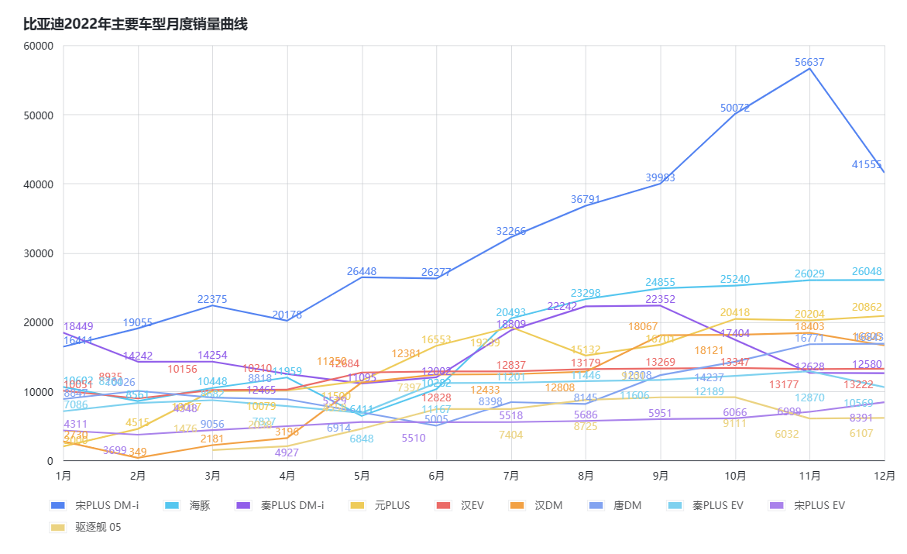
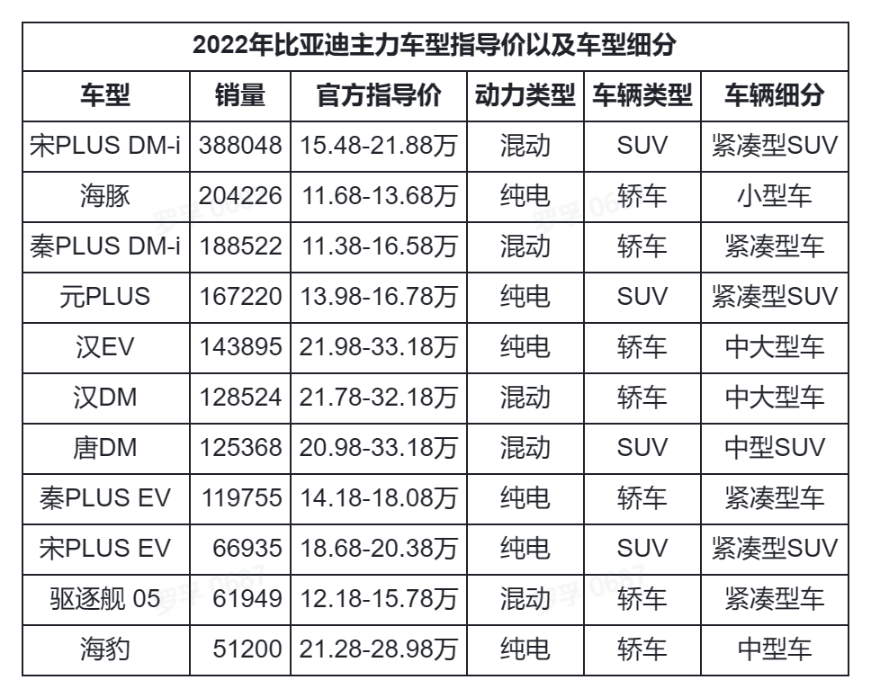

# 对2022年销冠比亚迪的销量增长思考

不知道什么原因，罗孚每次写销量数据的文字，总不是很受欢迎。这次 2022 年的销量数据，也不例外，原文：[2022 年汽车销量数据及分析](https://mp.weixin.qq.com/s/htIL68WUfpdH11iQ_m1Ehw)。说明大家对冰冷的销售数据不感兴趣，毕竟常人都不是专家，包括罗孚在内，实际也仅仅整理数据，整理完后的价值并不大。

但今天，罗孚就想以比亚迪作为标的，思考一下比亚迪的销量增长原因，通过销量数据也许能给我们一些启发。

## 比亚迪总体销量分析

罗孚翻看了历史数据，找了比亚迪近 3 年的销量和市场占有率情况，如下图：

2022 年销量增长了 151.03%，这个增长率，按复利思维反推 12 个月的复合增长率，就是每月增长近 8%，这是一个非常高的数字了，并且需要连续 12 个月。

另外，从市占率上也可以看出，2020 年仅 2.1% 的市占率，2022 年就 8.72% 的市占率了，增长幅度是非常大的。

看完整体数据，再来看看月度数据吧：

2022 年除了 1 月和 2 月外，月销量均高于 10 万，并且一直增长未再下滑过，而且同比增长均超过 100%，2022 年的柱状图也是远高于 2021 年的柱状图的。

## 比亚迪在新能源领域分析

根据罗孚在 [2022 年汽车销量数据及分析](https://mp.weixin.qq.com/s/htIL68WUfpdH11iQ_m1Ehw)一文中的数据，销量超过 10 万的新能源品牌如下：

比亚迪独占鳌头，在新能源车的占有率为 32.39%，是第二名到第八名的总和。

当然，这么比较有点欺负人，毕竟比亚迪的一半销量不是纯电车型，加上 2023 年开始在上海地区无法为混动和增程上绿牌，所以我们仅对比一下纯电新能源。

筛选纯电品牌后的数据如下：

比亚迪的纯电车型销售总量为 86 万，占自身所有车型销量的 48%。

比亚迪新能源销量占比总销量为 32.39%，纯电销量占比为 21.06%，剔除一半多的混动后占比下降 11% 多，但仍然排名第一。

## 比亚迪车型销量分析

看完比亚迪的总体销量和新能源销量情况后，我们再看看比亚迪的车型销量情况。

比亚迪总体销量，同 2021 年的对比数据如下：

从数据来看，海豚和宋 PLUS DM-i 无疑是销量增长冠军，在销量基数不小的情况下，能有数倍的增长，可以说是非常优秀。从月度销量曲线也能发现这两款车型的厉害之处。

除了上述的海豚和宋 PLUS DM-i，从销量曲线看增长趋势较明显的还有元 PLUS 和汉 DM，而驱逐舰 05 的表现也比较不错。另外海豹下半年上市所以未放到上图中，但其表现比去年海豚上市更出色，相同月份上市，但销量同比已远超，也许 2023 年的销量会进一步引爆。

上面图表中的秦 PLUS DM-i、汉 EV、秦 PLUS EV、宋 PLUS EV，包括唐 DM，销量曲线都比较平稳，特别是汉 EV，上半年略有起伏，下半年基本稳定在 1 万 3，这些车型的销量也是不错的。

## 对销冠密码的探究

上述从总销量、新能源销量、车型销量三个维度列出了数据和图表，但仅仅让我们了解了比亚迪的销量情况，那比亚迪从去年销量排名 14 到今年销量冲顶，其中的奥秘又是什么呢？

罗孚虽然混迹于汽车零部件企业，但实际对车并不了解，并且兴趣也不大，所以没法说清楚怎么看车的好坏。这里插播一个笑话，罗孚第一次进比亚迪汽车官网，看到左边王朝右边海洋，一度认为这比亚迪官网竟然不需要展示他们的秦宋元汉等车型，甚是诧异，但最后发现，原来是自己搞错了，人家直接定义成了两个系列，也许以后可能会独立成王朝汽车、海洋汽车，有点类似于埃安、哪吒。

新能源车在 2022 年确实属于爆发态势，但一个品牌旗下几乎所有车型均全面爆发，这是不可思议的，难怪特斯拉都要认为比亚迪是对手了。

2022 年，比亚迪全面抛弃了燃油车，全面转向新能源车，从其自愿公布的产销快报中，可以看到燃油车基本降低到了 0。新能源车分为纯电和混动，其中混动的增长率还要高于纯电。

比亚迪 2022 年纯电车型销量占比 49%(同上述新能源分析中的 48% 相当)，而 2022 年的纯电增长率要低于混动增长率，这两个数据说明，混动仍然有不小的市场，这可能和大家不太愿意入坑纯电心理有关。但也要注意，2022 年同 2021 年相比，比亚迪的纯电增长率同混动增长率的差距在缩小，也是纯电车型受到市场认可的一种间接体现，用户也在慢慢接受纯电车型。

我们再来细看一下具体车型：

从这个销售主力车型表中，最直观的可以了解到，比亚迪售价 20 万以上的仅为 3 款：汉 EV、汉 DM 和海豹，其余车型均为 10 到 20 万区间，并且没有 10 万以下的车型。这 3 款车型的销量占此表格中 11 款车型的 18.5%，不到两成，说明比亚迪的车型主力还是在 10 到 20 万区间，高于 20 万的车型也处于弱势。

比亚迪主力销售车型的价格在 10 到 20 万区间，从这数据来说，特斯拉实际是没必要把比亚迪作为对手的，除非等特斯拉出 20 万以下的车型。而一个汽车品牌能在此区间获得销冠，并且不是依靠几款爆款车型，而差不多是多车型战术，其在此区间内的销量应该还能维持较长一段时间。

罗孚又对比亚迪的车辆类型(轿车、SUV)和动力类型(纯电、混动)做了一张更细化的表：

表中可以看到比亚迪的轿车销量是要高于 SUV 的，虽然高出的比例不算多，7.61%。但是，轿车中，买纯电的多，而 SUV 中，买混动的更多。轿车中纯电混动比为 3 比 2，而 SUV 中的纯电混动比是 1 比 2，买 SUV 的更喜欢混动。

最后，罗孚将车型做进一步细分，并将各车型放到矩阵中，获得下图：

此销售矩阵基本可以清晰比亚迪的车型布局。

对于紧凑型 SUV，主打宋 PLUS，但对于纯电紧凑型 SUV，又让元 PLUS 加入了进来，进一步巩固在紧凑型 SUV 的销量。比亚迪在此的表现，不得不说超级亮眼，因为紧凑型 SUV 有哈弗 H6 和长安 CS75 这两款老将，这是燃油车领域 SUV 的扛把子，这次被宋 PLUS DM-i 打趴，超出了罗孚的想象。而元 PLUS 的表现也呈现上升趋势，以后紧凑型 SUV 领域可能是比亚迪的天下了。

对于紧凑型轿车，主要依靠秦扛住销量，不管是混动还是纯电。而 2022 年又让护卫舰加入了进来，只是定价于 20 万以上，销量应该还无法有较好的提升，也算是比亚迪往高端一点走的一种尝试。

对于小型车，主要让海豚扛销量了。海豚 2021 年上市，当时总销量不到 3 万，2022 年直接提升到了 20 万辆以上，说明市场对海豚还是比较认可的。

对于中大型车，让汉来扛销量，纯电是汉 EV，混动是汉 DM。汉作为老将，加上价格区间较高，能有如此销量已经不错了。

对于中型车，比亚迪此次又派出了海豹，也就是说在原来秦和汉的市场中间，加入了海豹来瓜分中型车的销量，当然，价格也是相对较高的，比汉略低，用于满足对秦和汉不满的客户，从这半年的销量数据来看，仅上市 5 个月销量就过了 5 万，市场还是认可海豹这款车型的，具体的表现要等看 2023 年的销量了。多说一句，特斯拉 model 3 就是中型车，这样感觉比亚迪是将特斯拉作为对手了。

对于中型 SUV，让唐作为主力，似乎表现并不是很好，这次加入了护卫舰 07，价格也比较高。中型 SUV 领域确实实力派较多，特斯拉 model Y、奔驰 GLC、奥迪 Q5、宝马 X3 等都是中型 SUV，表现不算给力也算能理解。

## 个人总结

通过上述的分析，比亚迪 2022 年能够成为销冠一定是有道理的，罗孚根据上述的分析，简单总结几条：

1. **(战略上)优秀的车型布局**

上述最后一个表已经比较清晰的列出了各车型，在各个车型赛道上均有主力布局，说明对于市场是有精准的分析的，基于这样的分析推出合适的产品，并且在持续推出产品，原来仅仅靠王朝系列打天下，现在加入海洋系列后，竟然也打的不错，这离不开内部有一支强悍的市场分析和产品设计团队，这一点虽然只是罗孚通过数据的猜测，但一定是这样的。在战略上有了良好的布局，比上来打乱拳的车企，表现会优秀的多。

2. **(技术上)混动和纯电两手抓**

就纯电来说，比亚迪的电池技术，大家应该有目共睹，下图是比亚迪 2022 年全球和 2020 年国内电池装机量数据，排名第二，但增速非常快。

而 DM-i 超级混动技术更是比亚迪对外宣称的重要技术，其低油耗的特性受到了市场的认可。

自家电池有优势，而超级混动技术又帮着侵蚀燃油车的市场，新老市场齐发力，销量自然给力。

3. **(市场策略)性价比是王道**

罗孚已经好几年没有车了，也没怎么关注车，所以这一小节就不发表意见了，但据说宋的性价比不错，而家庭用户也比较喜欢海豚。

上述就是罗孚对比亚迪 2022 年销量增长的分析，希望从总体层面了解销冠销量增长的密码，您是否有不一样的见解，欢迎沟通探讨。

本文公众号地址：[对 2022 年销冠比亚迪的销量增长思考](https://mp.weixin.qq.com/s/kqpcAXyLZX_feWJK9KO7sQ)

本文飞书文档地址：[[20230211]对 2022 年销冠比亚迪的销量增长思考](https://rovertang.feishu.cn/docx/E8Fhdzm1qo3BdMx7Wu4cY75Jnbg)

---

> 作者: [RoverTang](https://rovertang.com)  
> URL: http://localhost:1313/posts/car/20230211-thinking-about-the-sales-growth-of-byd-in-2022/  

