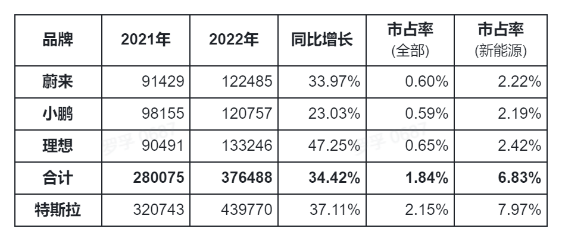
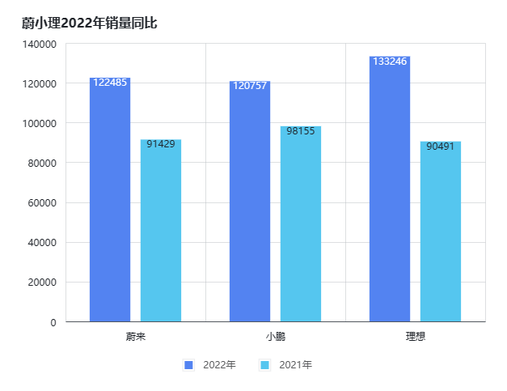
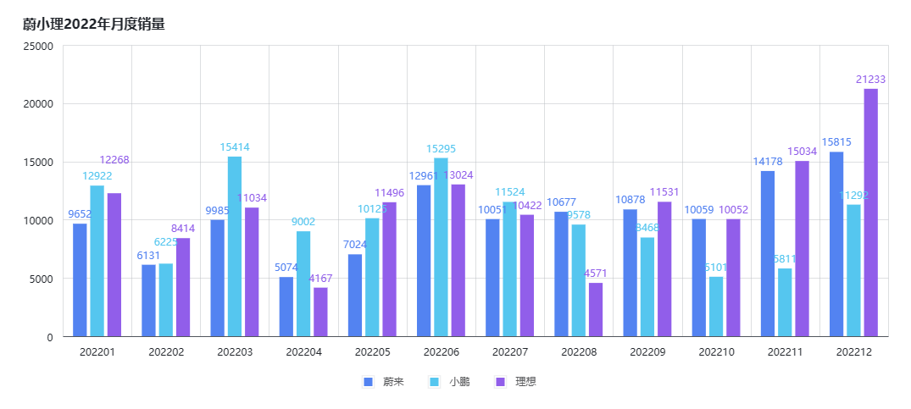
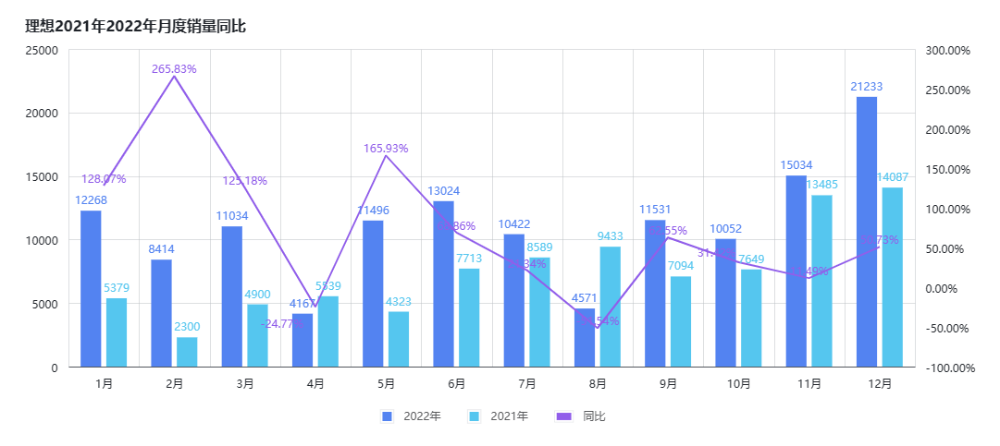
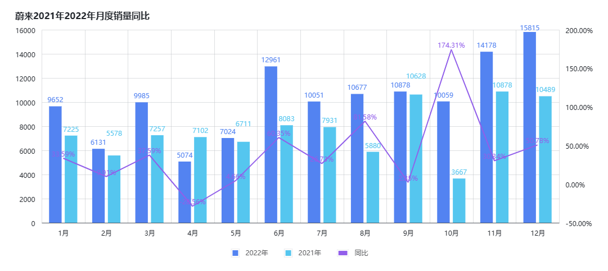
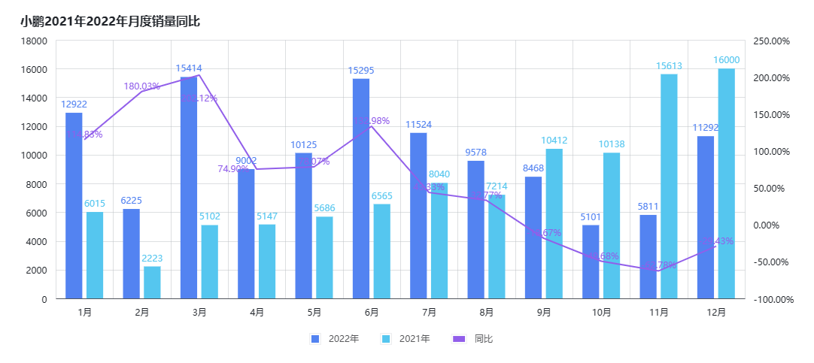
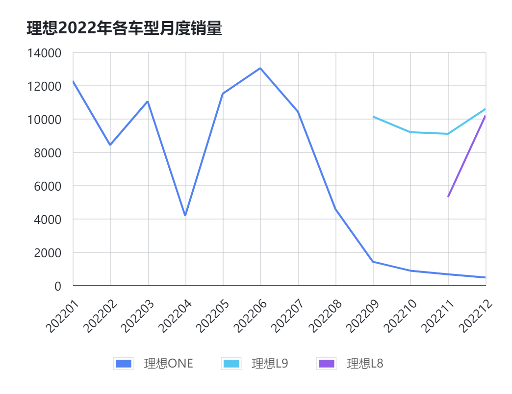
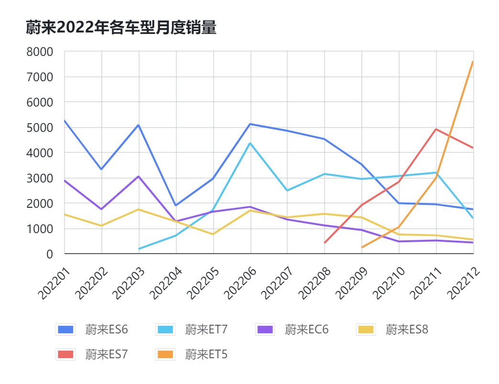
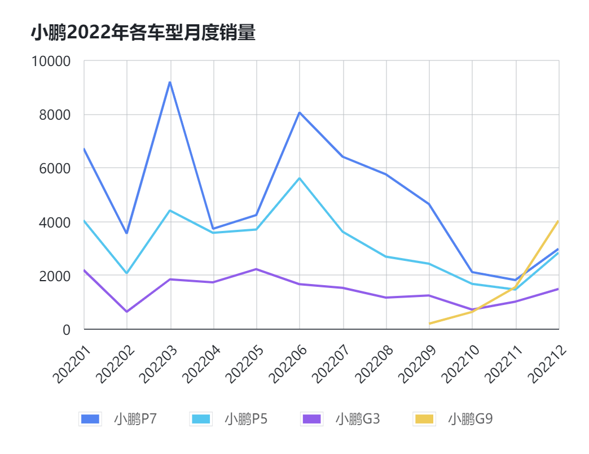
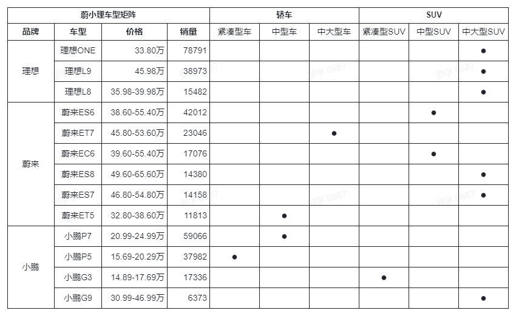

# 蔚小理2022年销量回顾和分析

罗孚写了一篇比亚迪的文章([对2022年销冠比亚迪的销量增长思考](https://mp.weixin.qq.com/s/kqpcAXyLZX_feWJK9KO7sQ))，对比亚迪的销量增长进行思考后，发现车型布局很重要，于是想看看蔚小理的情况，本文就是想对蔚小理的销量和车型做一些比对，看看能否找到他们的销量增长密码。

## 蔚小理总体销量分析

按去年销量，蔚小理(魏晓丽)的名字应该是小蔚理(肖威力)，而今年名字就改叫理蔚小(李微笑)了。

具体销量如下：

做成图表如下：

从增长来看，理想增长近 50%，非常厉害，不愧第一，而小鹏垫底，不到 25% 的增长，蔚来也有 33% 左右的增长。虽然他们的增长率没有必然规律，但数字挺有规律的：1/2、1/3、1/4，做的好有 1/2 增长，做的不好，只能有 1/4 增长。这个说法只是罗孚的一个玩笑了。

表格中顺便放入了特斯拉，不得不说，蔚小理的合力都打不过特斯拉，同特斯拉还有 6.3 万两的差距，差距不小，希望 2023 年三兄弟能合起来打败特斯拉。

具体看看月度的表现：

按月度来看，非常的有意思。2 月春节，销量不高。4 月和 5 月，上海疫情，影响整体销量。7 月、8 月、9 月、10 月可能是缺芯影响导致销量平平，当然应该也有天气因素。12 月的蔚来销量冲高，不排除同上海 2023 年新能源政策有一定的关系。而下半年小鹏的销量明显下滑，不确定是否真的疲软。

## 蔚小理月度销量分析

### 理想月度销量分析

理想的销量总体平稳，基本可以维持在 1 万 &#43; 的水平，而最后两个月进行了冲高。当然，也有不少缺口，2 月春节，4 月疫情(但 5 月很高，有所不解)，8 月可能归为缺芯，可能受这些因素的影响让这些月份形成了销量缺口吧。至于增长率曲线，由于各种因素的影响，销量差距较大，增长率高低落差比较大，基本没法看的状态。

### 蔚来月度销量分析

相对来说，蔚来今年总体比较稳定的，上述的 2 月春节、4 月 5 月疫情都能较好的在数据上体现。销量中规中矩，最后两个月也有冲高的情况。

### 小鹏月度销量分析

小鹏的销量就不容乐观了，下半年出现了明显的销量下滑。春节、疫情的影响可以理解，但近乎半年的下滑着实不能让人理解，亦或过于智能化，但这一年又比较缺芯，所以车辆没法交付？

不过，罗孚在这里有两个猜测：

1. 低价格市场被其他品牌侵蚀：蔚小理中就小鹏有 20 万以下的车型，新能源车也是在2022年真正爆发，所以小鹏在 2021 年吃到了低价新能源车的红利(2021Q4 冲高厉害)，但2022年已有较多的低价新能源车杀入市场(哪吒、比亚迪等)，销量被侵蚀就比较正常了。
2. 用户并不买智能化的账：小鹏在智能化上是选配策略，我们看到 20 万以下的车，是没有高阶智能化的，如果主要销量是高阶版车，那销量不应该出现大面积下滑，只能说用户不买价格贵的智能车，而低价车又发现了更具性价比的标的，自然就下滑明显了。(我们有租小鹏车，结果很多车主都不知道自己是否带有 XPILOT3.0 软件及升级服务。)

## 蔚小理车型分析

### 理想各车型月度销量

理想下半年推出了两款新车，基本替代了 ONE，从数据来看，应该说非常成功，最后一个月双双破万，而 ONE 也顺势而为平滑过渡基本退出了舞台。加上 2023 年即将推出的 L7，多车型战略似乎有利于理想，这让我不明白当时为什么理想仅推出只有一款配置的车。而多车型后，用户是否产生了选择困难症？这也是值得思考的一个问题。

总体来说理想的车型销量曲线很漂亮。

### 蔚来各车型月度销量

蔚来的车型一直是比较多的，不过也随着新车的推出，老车都呈现疲软趋势，新车 ES7 和 ET5 表现都还不错，特别是 ET5 呈现了陡升的曲线。

### 小鹏各车型月度销量

前面说小鹏的销量下半年呈现下滑态势，从各车型来看也确实如此。不过，新车型 G9 挺给力，销量也迅速的得到了拉升。去静态体验过 G9，确实非常棒的车，对标的也是隔壁家的尾 9 字车，但战场真正的 PK，应该要看 2023 年的数据了，2022 年的销量算是新车的爬坡试探期吧。

### 蔚小理各车型分布

罗孚整理完这个车型表，感觉除了理想主打中大型 SUV 外，蔚来和小鹏都乱乱的。

蔚来的 ES7 和 ES8 布局中大型 SUV，价格虽然有差异，但感觉自己和自己干架。而蔚来的 ES6 和 EC6 都是中型 SUV，价格还差不多，又是自己干架的典范。关键是中型 SUV 车型中，特斯拉 model Y、奔驰 GLC、奥迪 Q5、宝马 X3 等都是中型 SUV，分散自己的力量去和他们干架让罗孚有点不理解。也许都是新车出来淘汰老车的节奏。

小鹏车型，在价格上是非常有优势的，除了 G9 超 30 万外，P7 在 20 万出头，而 P5 和 G3 只是 10 到 20 万区间车型，不过都是紧凑型。根据价格和车型矩阵，就能明白小鹏销量下滑的主要原因了，因为不到 20 万价格区间，小鹏的车不具备性价比，而且紧凑型，大家就不乐意了。而小鹏 G9 销量的突飞猛进，说明高端中大型 SUV 自有高端的用户存在，也许在高端领域去拼杀也许能杀出一条血路来。顺便看了 2023 年 1 月的数据，小鹏 G9 的数据都快要接近其他车型销量的总和了。

理想很专注，其销量增长密码可能也可以归结于专注，专注于中大型 SUV，专注于家庭用车，确实，国内用户可能更偏爱 SUV 一些，而如果能花差不多的钱可以买更大一些的 SUV，应该更好。L9、L8，包括新上市的 L7，都是中大型 SUV。以前理想的策略是只有一款 ONE，并且只有一款配置，当时的说法是让用户没有选择恐惧症，而现在，策略完全相反，实际上还是只有一款中大型 SUV 的车，只是把价格和配置拆分成了不同的车型让用户选择，是否成功？拭目以待。感觉应该会成功，原来用户只能看一款车，不满意就走人了，而现在，不满意可以继续看其他款车，7、8、9 三种车型的定位，包括价格上的一些差异，人群还是有所区别的。顺便看了一下 2023 年 1 月的销量数据，价格贵的 L9 反而销量第一名，高出 L8 三成以上销量，也许对家庭用车来说，可能不差那点钱吧，更大、更舒适、更智能也许高端家庭用户也更愿意买单吧。

## 个人总结

罗孚简单总结一下个人的观点：

1. **产品定位对销量影响很大**

上一文章中说了比亚迪，主要定位 10 到 20 万之间的车，然后用各车型去攻占各车系，比如紧凑型 SUV 是宋、紧凑型轿车是秦、中大型轿车是汉、中型 SUV 是唐，这些都是很好的定位。

而本文中的蔚来，中型 SUV 和中大型 SUV 均有两款车，不知道为什么自家车型竞争这么厉害，难道是替代？

小鹏定位智能化非常好，但不是全系标配，而价格定位较低，结果直接同比亚迪进入了同一片竞争领域，罗孚认为2022年下半年的销量下滑同比亚迪的增长有脱不开的干系，另外也侧面说明智能化至少现阶段不是用户买车的刚需。

2. **专注是新势力突破的优选策略**

理想虽然把原来的唯一一款车 ONE 拆分成了 9、8、7 三种车型，但都还是中大型 SUV，说明理想专注于中大型 SUV，并且，主打家庭用车，销量从 2021 年三家中垫底直接跃升到三家之首，并且还同其他两家都拉开了 1 万多辆的销量差距。

实际上特斯拉也类似，就两款产品，以前没有 model Y 的时候，就只有毛豆 3，现在 model Y 的价格同 3 的价格相当，加上国人比较喜欢 SUV，model Y 的销量确实很出色。

反观蔚来和小鹏，车型多，覆盖面泛，反而无法形成竞争优势。

3. **好产品就应该在高端上竞争**

理想 L9 虽然贵，但销量很不错，2023 年 1 月销量也是比 L8 要高，说明高端家庭用户对产品很认可。

小鹏 G9 是唯一一款不低于 30 万的车，也是中大型 SUV，结果销量也很好，销量同时呈现增长态势，而 2023 年 1 月销量也都快是他家其他车销量的总和了，大、虽贵、但好，用户其实也愿意买单。

蔚来 ES7 和 ES8 的销量就比较惨淡了，发了两款车，但加起来销量都比较惨淡，定价一定是个问题，用户不认可其性价比。反观 ET5，定位为 30 到 40 万的中型轿车，销量还不错，销量远超 20 万出头的小鹏 P7，也值得深思。

好了，这就是罗孚对蔚小理2022年销量的回顾和分析，你有什么不一样的看法？欢迎交流。

本文公众号地址：

本文飞书文档地址：[[20230219]蔚小理2022年销量回顾和分析](https://rovertang.feishu.cn/docx/EJnidS6lmogUdmxUGTOcZ54fnoe)

---

> 作者: [RoverTang](https://rovertang.com)  
> URL: http://localhost:1313/posts/car/20230219-review-and-analysis-of-sales-volume-of-neo-xpeng-li-in-2022/  

