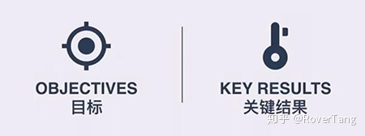
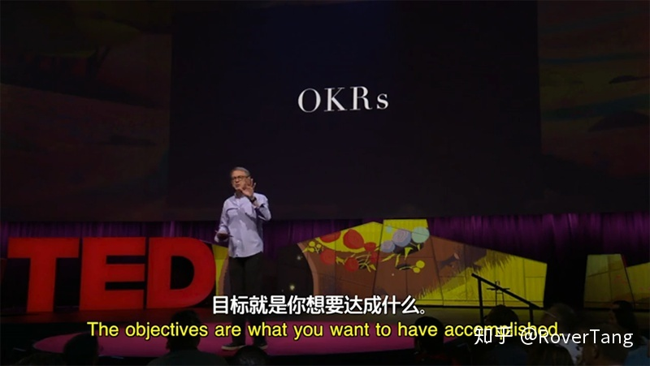
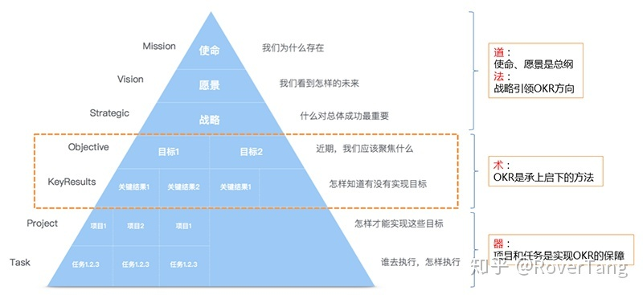
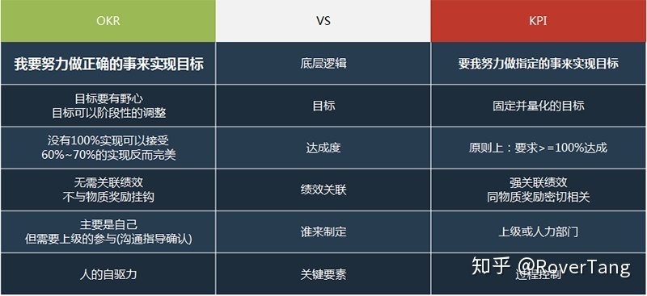
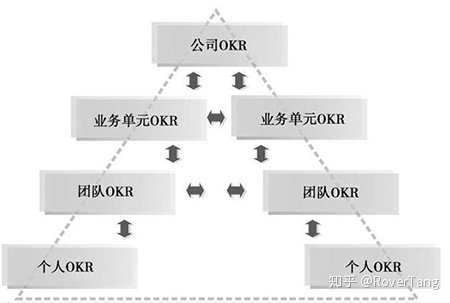
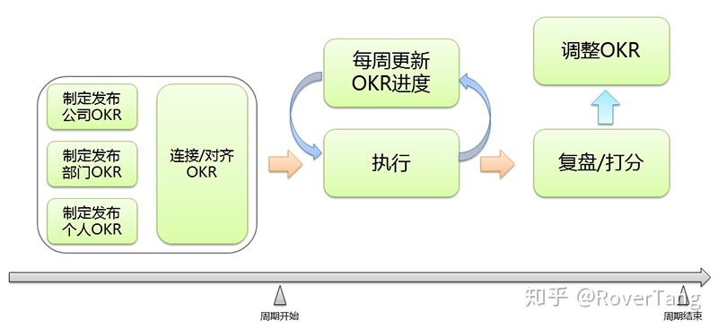
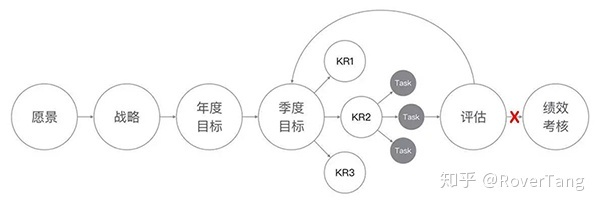
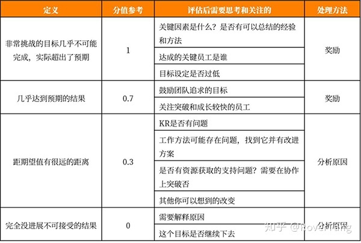

# OKR实施方法——关于思路和流程的思考

## 关于本文

* 本文是个人对OKR的思考，重点关注实施方法。
* 本文参考了明道云、飞书OKR、嗨马OKR、辉哥奇谭等。
* 其实没有标准的OKR，重点是思想的升华和合适的方法。
* 个人理解一定存在差异，欢迎同我沟通探讨。
* 本文的当前版本：v1.0 (发表于20200301)
* 本文的部分内容存在引用，如有侵犯请联系我删除。

## 了解OKR

### 听说OKR

听说OKR时，罗孚只知道OKR ≠ KPI，不需要KPI的考核就能把事情做好，看上去比KPI更厉害似的。

翻了翻《OKR：源于英特尔和谷歌的目标管理利器》，知道OKR是Intel发明的，在Google发扬光大，然后被Facebook、LinkedIn等各大互联网公司广泛使用。

更多零碎的认识：

* OKR = O(Objective) &#43; KR(KeyResults)
* O要有野心
* KR需要提出可量化的指标，不能泛泛而谈

any more？罗孚自此就没有更多的认识了，后来通过明道、飞书OKR等渠道才了解了更多的内容。

### “OKR播种机”——John Doerr (约翰·杜尔)

John Doerr是一位投资家，是Google的早期投资人，是他把Intel的OKR工作方法带到了Google，是他将OKR传遍了硅谷影响了全球，甚至被称之为OKR之父。

John Doerr出版了《Measure What Matters》一书，中文版是《这就是OKR：让谷歌、亚马逊实现爆炸性增长的工作方法》(书名的翻译确实有点让人看不懂)，是市面上最畅销的三本OKR书籍之一，然后他在TED做了《何以设立正确的目标是成功的秘密》的演讲，据说可以从中了解OKR的精髓所在。

英文原版视频：[https://www.ted.com/talks/john_doerr_why_the_secret_to_success_is_setting_the_right_goals](https://www.ted.com/talks/john_doerr_why_the_secret_to_success_is_setting_the_right_goals)

中英文字幕版视频：

只是罗孚没怎么看懂视频，感触是：

* 目标O要制定的足够远大
* 要“不择手段”的实现KR
* 要用强大的内心和意志力去实现目标
* OKR最终落地的方法，没有讲到

### 明道的3分钟了解OKR

明道是国内最早推行和使用OKR的公司之一，其官网也有较多的OKR方法介绍和分享，并且其开发的明道云产品也包含了OKR功能。下面是明道提供的《3分钟了解OKR》视频，比较言简意赅的讲述了OKR理论以及实现方法。

视频地址：[3分钟了解OKR](https://dn-mdmedia.qbox.me/a020cd58-b50b-4fa2-b33c-7dd877c805bd/2017/1/20/252af4bf-84fa-5eed-6ca7-f1291edfd3ae.mp4)

### 通过理念理解OKR

OKR可以认为是一种思想一种方法，其处于企业结构的中部，起到“承上启下”的作用。

使命、愿景是企业的总纲，算是企业之道；

战略是企业的方向，是企业的法，引领了OKR的方向；

而OKR是承上启下的方法，称之为术；

项目和任务则是实现OKR的保障，属于器层面；

### OKR同KPI

罗孚总结了一下OKR同KPI的区别，自身理解如下图所示：

上图中，OKR同KPI具有强烈的对比，但并不是说KPI不好，实际上罗孚认为两者完全不冲突，甚至可以相辅相成，原因在于：OKR同KPI处于不同的层级，OKR位于企业结构的中间层，而KPI则用于项目、任务的考核也许是不错的方法。

罗孚甚至认为，在OKR的某些局部同KPI相通的，比如KR的制定和打分就和KPI比较相同，但这一点不是OKR的全部，更不是OKR的核心思想。

所以，推行OKR或者KPI，主要看是否适合自己的企业，以及是否能够取得好的效果。罗孚甚至认为：OKR&#43;KPI并行，也许是更佳的实践方案。(下文实施方案说明中会讲述)

### OKR同项目、任务

从企业结构中可以看出OKR处于中间层，而项目和任务处于底层，那么OKR同项目、任务之间，罗孚认为是如下的关系：

* 目标和关键结果可以拆解成具体的项目和任务；
* 项目和任务是实现目标和关键结果的具体动作；

实际上，在OKR的执行过程中，OKR也是需要不断分解的。如下图是某互联网公司OKR的实施流程。

将大O(年度目标)拆解成小O(阶段性目标)，给每一个O制定KR，然后再根据每一个KR做行动计划，OKR同项目、任务的关系很简单明了了。

### OKR的价值

对团队：

1. 推动进步：驱动管理层和员工主动规划业务，找到业务增长点并转化成具体的目标。
1. 对齐方向：目标O是公开透明的，公司、部门、个人的目标需要保持一致，持续的产出对公司有益的贡献价值。
1. 部门协作：部门之间对齐的过程，就是互相协调配合的过程，通过对齐，将进度不一致、方向不一致的问题暴露并解决。
1. 数据驱动：由于KR往往要包含基于数据的评估指标，评估指标对总体指标又要有促进作用，对驱动团队持续进步有很大帮助。

对员工：

1. 业务理解：KR本身包含了业务理解和工作方法，当预期与现实不符的时候，要找出原因，让以后预期更加准确。
1. 沟通工具：目标制定与执行进展是部门和个人对自己目标和完成程度的一个展现，公开透明有助于提升工作效率、沟通效率。
1. 保持专注：缺少明确的方向，会导致人被事驱动，从而忽略长远目标。持续的Review OKR进度，可以帮助提升专注程度，有所坚持。
1. 自我驱动：OKR 在制定的时候，目标是要有野心、有挑战、有使命感的。OKR执行时，就能驱动自己达成期望，实现持续进步。

## OKR实施思路

### 实施方案

罗孚认为，OKR的实施方案，只有3中：

* 全面OKR：拥有十足的信心，形成可落地的闭环，自驱的个人和凝聚的团队，全面拥抱OKR。
* OKR&#43;KPI：OKR负责精神激励(明线)，KPI 负责物质奖励(暗线)，双线并行。
* 放弃OKR：没有环境，没有原则，没有工具，无法落地实施，尽早放弃，避免浪费时间。

罗孚在此推荐的是第二种方案。

也许马上有人提出了质疑：OKR和KPI是无法共存的，你若并行就一定落实不好OKR，也就失去了OKR的意义。

话不能如此绝对，罗孚说了，OKR和KPI的层次不同，KPI重在考核，而OKR则是站在了中间层，上有战略指引下有项目、任务保障。

OKR是一种方法和思想，虽然同物质奖励无关，但更是团队和个人的精神指引，有点像日本动画片中的意念。

### 实施基础

由于OKR的核心是人以及人的自驱力，那么实施的基础可以认为是：

* 一群可以把信带给加西亚的人
* 一个深信并深度参与OKR的领导
* 凝聚并向上的团队

或者更直白的说，就是企业文化，这才是OKR运行的土壤，如果没有这样的氛围，那确实很难实施。

如果没有积极上进的个人，如果没有积极参与推动的领导，那么OKR的落地很难，很有可能最后不了了之。

### 执行原则

OKR的执行有较多的原则，罗孚从OKR制定和执行过程两个方面来说说个人理解的原则。

在OKR制定上，可能需要遵循如下原则：

* 目标O要有野心：能送信给加西亚的人，一定可以给出超预期的结果，那就把目标定的高一些吧。
* 符合SMART原则的关键结果KR：此为对自己的KPI考核，必须是具体的、可衡量的、可实现的、与目标关联的并在限定时限内达成的结果。
* 聚焦：控制好O和KR的数量，关注关键内容。过多的O和KR，只会让目标无法实现，或者仅仅实现了一个泛泛的目标。
* 需要连接/对齐：OKR由战略指引，而个人OKR更需要对齐到部门OKR和公司OKR，已保持目标的一致性。
* 大部分(超过60%)的KR是自下而上的：如果KR全部是上级给下级制定好的，那和KPI有何异？又如何才能发挥下级的自驱力？
* OKR是公开的：全员公开，才能让OKR之间连接/对齐，也正是因为公开透明，更能促进自驱，因为OKR是一种承诺。(PS：罗孚认为部分情况下出于保密性考虑，OKR可以不公开，比如市场部和研发部之间，两部门的员工OKR不需要互相公开，而用部门OKR来连接/对齐即可。)

说完OKR的制定，执行过程也非常重要，如果不注重过程，最终可能也是虎头蛇尾，不能形成OKR循环。执行过程中的两大原则：

* 定期跟踪：跟踪是目标实现的关键手段，建议每周跟踪，而跟踪方法就是周报和周例会。(罗孚不是很建议日报和站立会，如果个人能做到，更佳)
* 复盘打分：OKR是有阶段性的，当一个阶段即将结束，就需要对此进行复盘，通过打分，可以了解此阶段执行效果。

讲完原则，顺便提一个建议：使用工具来管理OKR。对于工具的选择和使用，罗孚下一篇再讲。

### OKR的层级和周期

罗孚认为，OKR是有层级和周期的。

OKR的层级可以分为：

* 公司OKR
* 部门OKR
* 个人OKR

因为有层级，所以OKR也会呈金字塔结构，公司OKR是顶层指引，部门OKR是承上启下的桥梁，个人OKR是最底层的OKR，上一层级的OKR为下一层级的OKR做指引，没有上一层级的OKR那么下一层级的OKR就很难制定。

下图讲述的是OKR连接/对齐时需要从横、纵两个方向进行对齐，也表明了不同层级间、相同层级间连接/对齐的重要性。

OKR也是有周期的，一般用6周、双月或季度作为周期，这是最小阶段OKR，在此之上，也建议设置一个年度OKR，年度OKR是大目标，阶段OKR是年度目标的分解，是一个个小目标，这样才有利于OKR的实现和循环。

另外，不建议用单月作为周期，时间有点短。如果一定要拆分，那就是拆解为周目标周计划即可。实际上，罗孚认为，周报、周计划、周例会都可以称之为OKR，计划是目标，例会是总结复盘，下一周的计划以本周的复盘为基础的。当然，如果将日报也作为OKR的话，建议个人执行即可，毕竟颗粒度太细的时候，也不适合在部门内部讨论，仅仅作为自己的每日精进吧。

### 实施关键

OKR的方案、基础、原则都很重要，但什么才是OKR实施的关键呢？罗孚认为主要是两点：

1、共同参与以及上级指导O和KR的制定

OKR是很讲究氛围的，没有氛围的时候，每一个人往往会妥协，因为OKR不是自身工作的指导思想，那么对OKR一定会懈怠，最终就不了了之了。

所以上级在OKR的整个过程中，起到了很关键的角色，一方面要带领大家一起讨论和参与OKR，让OKR不仅仅获得自身认可，还获得大家的认可，另一方面要给下级的OKR做指导，以让OKR不过于偏离部门OKR或公司OKR，这样整个团队就会形成OKR氛围，大家才不会懈怠。

2、OKR执行过程中需要不断review

假设大家在每个阶段的开始前制定了OKR，然后在每个阶段即将结束的时候给OKR进行了打分，制定和打分是OKR执行的标准动作，看上去执行没有问题，但目标结果是否出了问题呢？

对于个人，没有鞭策，可能就不会有进步或进步缓慢，对于OKR的实施也如此，仅仅关注开始的制定和结果的打分，往往会将OKR流于形式，起不到好的效果，最后不了了之，反而浪费了大家宝贵的时间。

周报、周计划、周例会是很好的review手段，每周都要想一下，我的周计划是否同我的阶段目标关联？我的周计划能否完成我的阶段OKR？每周思考这样的问题，才能保证目标不产生偏差，最终结果才能有所保障。

## OKR实施流程

### 实施流程概览

上一节是方法论，这一节是具体的实战。罗孚认为，一个基本的OKR实施流程，大概是这样的：

实施流程并不复杂，罗孚绘制的是基础流程图，如果需要更大框架的流程图，可以参考下图：

了解了实施流程，那么对于OKR制定、跟踪执行、复盘打分的具体方法又是什么呢？且听罗孚慢慢道来。

### 制定OKR之设定目标O

正如上文所述，OKR是具有层级的，并且OKR是受公司战略指引的，所以设定目标O时，可以采取两种方法：

1、分解上一层级的O

公司OKR为公司战略服务，部门OKR为公司OKR服务，而个人OKR则为部门OKR服务，有了部门的OKR，那对于个人的OKR，就是将部门的O分解成同个人岗位所匹配的O。分解不是照搬，而是相应职责的承担。

2、转化上一层级的KR

如果上一层级的KR明确并有职责导向性，那么对于个人则可以分担上级的KR，将其KR作为个人的O。

如果还是不会设定自己的O，那就多思考如下问题吧：

* 公司期望我做出什么贡献？
* 上司期待我取得什么成果？
* 我怎么才能助攻上司/同事的OKR？
* 当做一个商业计划书，提出什么样的有挑战有吸引力的目标，老板才会给我更多投资？
* 如果公司聘请到一位大牛担任我目前的职位，他会在这个阶段设定什么目标？
* 有什么是这个周期我需要改善的？
* 本季度重点工作的目的和目标是？

### 制定OKR之确定关键结果KR

KR体现了对O的实现思路，不同的O有不同的拆解KR思路，即便相同的O，也因思路不同而会拆解成不同的KR。

由于KR需要符合SMART原则，特别是可量化，所以拆解思路如下：

* 制定基准：建立XX标准、实现XX方法，均属于基准型KR。
* 正向增长：用户增加x%、业绩提升x%，属于正向增长，并带有具体数字。
* 反向控制：流失率控制在x%以内，属于反向控制，同样需要带有具体的数字。
* 数量区间：自由支配时间60~90分钟，属于数量区间，具有明确的上下限。
* 过程策略：完成X个客户调研，对X个新用户进行验证，属于过程策略，也有具体数字。
* 确定里程碑：X月底前，提交设计稿，属于阶段性里程碑。
* 使命激励：让公司80%以上的员工实现买房，属于使命激励型。

如果还是确定不了KR，那就思考思考如下问题吧：

* KR不是做什么事情，而是做出什么结果，作出什么影响。
* KR像一条“合同协议”，可以衡量、仲裁，要有数字来定义。
* “为过程鼓掌，为结果买单”，想想什么是公司和上司买单的。
* 如果一个结果本身确实没有数字，那可以请用户、评委为KR“投票打分”，将投票打分结果做衡量数字。
* KR是2个月、1个季度的周期内所要取得的成果。
* KR是关键结果，不是所有结果。
* KR不是项目里有顺序的多个里程碑。
* KR不是岗位职责列表。
* KR不是任务列表。

### 定期review的方法

OKR执行过程中的定期review，是OKR实施的关键，影响OKR落地的成败。

在上面OKR实施关键章节已讲述了定期review的方法，即周报、周计划、周例会，在此不再赘述。

就工具来说，大部分的OKR工具专注于OKR的制定和打分，过程控制相对较弱，大部分不会同周报、日报进行关联，所以更多的需要个人和团队人为参与，比如在周例会中增加对O和KR的review环节。

在一些OKR方法中，有将周例会称之为啤酒会议，意思是通过周计划、周报已经体现了本周的落地实施情况，而开会更多的是总结、分享、庆祝，想想也有道理。

### 复盘和打分

复盘的主要形式是开会，OKR阶段即将结束时的会议，一般是部门内部或组内，当然对于公司也可以做公司级别的复盘。这里的复盘开会，是不是同KPI的阶段考核会议比较类似？都是一个阶段的总结。

由于总结会议的形式和内容各不相同，罗孚也无法详细展开，在此细讲一下打分方法吧。

OKR中的打分，是针对KR进行的打分，KR的分值在0到1之间。

KR是有重要度的，可以为每一个KR设定一个百分比，越重要的KR占比越高，各KR占比总和为100%。

KR的打分需要从完成度、困难度、努力程度等几个方面综合考量后给出一个合理的分值。

每一项KR打分完成后，再根据占比，自动生成这一目标O的分数，对此分数我们可能需要做如下评估：

请忽略上图中的奖励，我们将此理解成精神鼓励吧:)

### OKR实施常见问题

1、不知道如何设定目标O

此问题的可能原因：

* 没有上一层的O或KR做指导
* 上级没有参与指导O的设定
* 自己没有目标

建议多读几遍上述设定O这一章节。

2、确定了关键结果KR后没有进一步的方法

此问题体现了分解问题和解决问题的能力，对个人来说，是OKR执行过程中的重要能力，需要慢慢培养。

如果要讲方法，那就是确定KR后，拆解成具体的执行任务吧，然后将任务分解到周计划中，再通过每周的进度更新和复盘，慢慢就可以找到适合自己的方法了。

在OKR实施过程中，上述仅仅列举了两个较为常见的问题，欢迎大家同罗孚探讨，以便后续完善此文时进行补充。

## 结语

当我们比较深入的理解OKR以后，其实OKR并没有那么神奇和神秘，也并不复杂。试想，贵部门是否有周例会？贵司是否有季度总结会议？是否每年都需要制定年度目标？公司是否也有使命、愿景和战略？

所以罗孚认为，OKR的重点：

1、制定目标、量化指标、对齐目标、(凝聚并有野心)

2、立即执行、不断跟踪、定期复盘、(自驱)

3、形成循环。(习惯)

这么一分解，是否感觉OKR同PDCA(或者OODA)比较类似了？

只是OKR不是一个简单的工具，而是一种系统方法，一种思想的提升，通过自驱，不断在正确的事情上努力，产出更优结果，最终达成目标，一个超出预期的目标。

不得不说，OKR是违背人性的，是让人不舒服的，而成功的人，往往总是做着违背人性的事，而那些追随人性的人，往往比较平庸。

OKR不仅仅可以用于工作，更可以用于生活，OKR的范围可以是公司全员，也可以是独立的个人，如果你想成功，想更优秀一点点，不妨尝试一下OKR吧。

最后，在“罗孚传说”后台回复“OKR”，提供罗孚收集的所有OKR资料，希望对屏幕前的你有所帮助。

本文飞书文档：[OKR实施方法——关于思路和流程的思考](https://rovertang.feishu.cn/docx/doxcnXxQUJtxK49f1B6YKAzOp4f)

---

> 作者: [RoverTang](https://rovertang.com)  
> URL: https://blog.rovertang.com/posts/eoffice/20200301-okr-implementation-method-thoughts-on-ideas-and-processes/  

