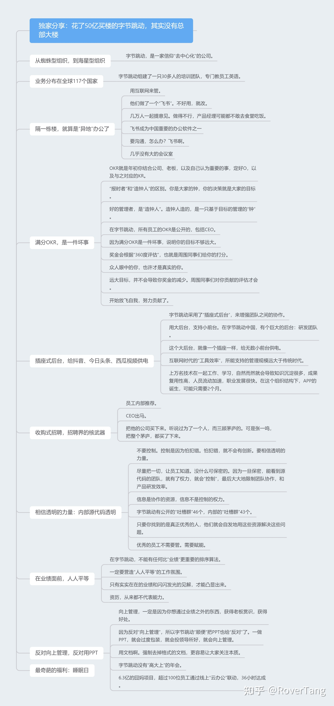

# 没有总部大楼的公司给我们的启发

本文是《[独家分享：花了50亿买楼的字节跳动，其实没有总部大楼](https://mp.weixin.qq.com/s/B-y8-cnxlUdkLd3IXRS-3w)》一文的读后感，原文写的非常清晰明了，个人只是基于优秀文章做的些许思考。

## 关于办公距离

现在北上深的上班距离非常让人忧伤，上下班单程耗时1小时起步属于正常现象，我们也有同事天天坐高铁来上班。实际上，上班的距离已是公司招聘的障碍，甚至可能造成人才流失，距离虹桥商务区近的可能就无法考虑张江科技园，反之亦然。

那如何解决上班距离导致的招聘难题？方法有二，一是因人因地设立办公楼地点，另一是高效在线办公。文中50亿买楼，其实就是因人因地设立办公地点。但有人会说，哪有那么多钱买楼？好吧，想想办法，设立一个办公地点，应该是没问题的吧。当然，跨地区的协作沟通将会带来巨大的管理成本，确实如此，但不是无解，现在在线的高效办公实际上解决此问题的必要且唯一选择。

实际上，那些拥有总部大楼的公司，沟通交流也是比较低效的，比如隔一栋楼甚至隔楼层的沟通，见面所花费的时间不少，比如每天上下班以及中饭时段在电梯上花费的时间累计超过30分钟，比如因为没有预定到会议室而上下楼去寻找空会议室的时间很是浪费。文中提到隔一栋楼就算异地办公，确实是非常明智的做法。而没有总部大楼，以后应该会成为更多公司的选择，因为拥有高效的在线办公时，用一栋办公大楼把大家圈在一起是没有必要的。

## 关于蜘蛛型和海星型组织

上图是介绍区块链技术时的技术演绎图，分别代表了中心化、分布式、去中心化三种技术示意图，现在拿来描述企业组织架构也没有任何不妥，其实字节跳动就是一家去中心化的公司，而现阶段大部分的公司仍然是中心化或分布式组织架构公司。

文中使用了蜘蛛型和海星型来说明，其实道理相同但更形象。蜘蛛型让我想到了战场上不能没有司令以及擒贼先擒王的道理，而海星是具有迅速再生能力的动物之一。这我联想到一个问题：为什么字节跳动拥有这么多成功的产品，并且面向不同的领域。除了技术等因素外，去中心化的组织架构实际是自发创造好产品的前提，至少对字节是如此，比如飞书产品中的OKR产品就是典型的通过自发产生的产品。

大部分中心化或分布式组织架构的公司，大多会采用事业部制，事业部制的弊端典型的就是沟通、共享障碍，可能会不可避免的产生部门墙。而去中心化网状结构中，每一个节点就是每一个个体，每个节点在组织中发挥着各自独立的作用，而节点和节点间的线，就是协同。去中心化的组织也许意味着“群龙无首”，但其行动是由OKR牵引的，而OKR工具也促进了去中心化组织中的信息传递效率。

## 关于OKR

罗孚写过《[OKR实施方法——关于思路和流程的思考](/posts/digitaloffice/20200301-okr-implementation-method-thoughts-on-ideas-and-processes/)》一文，关于OKR就不再赘述。

补充一点：字节跳动内部，实际是OKR和360评估并行的。而360评估更是以同事之间打分为主。这是非常“尊重人性”的设计。OKR工具负责积极内驱，360评估负责外部督促。

## 关于技术成果复用

“插座式后台，给抖音、今日头条、西瓜视频供电”章节是原文中介绍技术的唯一内容，通过这一章节我们无法窥探其核心技术，但至少“技术成果复用”的理念是值得我们学习的。

文中采用的是“插座式后台”概念，让我联想到了中台和微服务，虽然中台现在被诟病的一比，但不要纠结于概念，都统称为后台好了。只有后台强大，才能前台开花，前台就是这些前端业务，我们看到的明星APP只是几个耀眼的前端业务而已，不起眼的前端业务还有很多。

“技术成果复用”在很多公司很难做到，因为业务做大了以后就要成立事业部，而事业部制产生部门墙，每个部门可能都会开发重复的基础技术，此举也就是所谓的“重复造轮子”。此点似乎再次印证了我们组织架构理念的重要性。

不确定字节跳动内部是如何做到技术成果复用的，但我们以翻译业务为例，也许能管窥一豹。据说字节跳动内部也是有多国语言翻译的技术，类似谷歌翻译技术，所有公司产品如有翻译需求，则统统使用内部的语言翻译技术。在常规公司的做法，可能就是买一套翻译系统完事，省时省力，即便公司有统一的翻译技术，也因为部门墙、鄙视链而弃用，所以很多公司很难做到真正的“技术成果复用”。

## 关于招聘

收购式招聘是让我们amazing的招聘方式，说白了就是买初创公司或团队，因为买的速度绝对快于造的速度，并且这样的买卖绝对划算。收购式招聘的前提是你的平台要足够大，不然买来的顶尖人才因憋屈于一隅，而忧伤地选择离开。顶尖人才在足够大的平台上，一定会发挥耀眼的光芒。

关于员工推荐这一招聘方式，请相信，员工推荐绝对是比猎头招聘便宜的多的多的招聘方式，并且可靠程度高的多的多。因为员工是有自己人品招牌的，所以不会推荐不靠谱的人入伙，可靠程度自然高很多。反观猎头招聘，30%年薪的服务费令人咋舌，而一个不专业的猎头，即便推荐了很多人选，但太差质量的履历反倒浪费了人力部门和用人部门的大量时间，成本相当之高。激励不足、宣传不足是很多公司没有用好员工推荐招聘的主要问题。

关于CEO出马招聘，实际是必须的，因为聚人才是CEO的第一重任，而对于顶尖人才或优秀团队，CEO出马效果会截然不同，不是重视度和感受的问题，而是不同层级的人聊的内容是完全不同的，“为梦想窒息”的人有，“不想一辈子卖糖水”的人也不少。但CEO的时间是宝贵的，是否有人为CEO筛选甄别优秀人才，是否有人为CEO搭桥牵线优秀人才，是一个值得思考的问题。

另外，文末有说“优秀的人才，需要的是赋能，而不一定是给予高工资、高待遇。”，实际上当一个人达到一定高度的时候，考虑的不仅仅是工资、待遇问题，对公司发展、团队氛围、个人成长空间等都有所考虑，CEO出马和员工推荐招聘其实是公司发展、团队氛围的表现，而赋能更是让员工放飞自我、努力贡献的加速剂。和优秀的人才一起工作，才能让大家更优秀。

## 关于透明

对于研发型公司，代码是研发部门的基石，也是对外的护城河，但字节跳动能透明到开放代码，只要申请就能查看，这是我所不敢相信的。因为对于事业部制来说，事业部的源代码就是自己的命根子，是立足的根本，别的部门是不能触碰的，是底线。文中所述的控制权，也就是因为事业部对源代码的封闭，所以产生了控制，自然而然，做的是好是坏，都是事业部自己的控制。

代码开放让我想到了全球开放社区GitHub，程序员的天堂，对于公司来说，源代码确实是不能共享到GitHub的，但假设在公司内部设立一个公司级的GitHub呢，每个事业部或项目的代码都是自建的一个仓库，在公司内部，只要申请就能查看。看上去就是文中所说字节跳动的做法，实际上每家公司都能做到源代码的统一管理，因为有Git。如果内部足够开放，外部又足够激情，那对代码的改进可能是不可估量的。对于程序员来说，信奉的是“Talk is cheap. Show me the code.”，当下游程序员遇到上游程序员挖的坑时，也许申请一下查看代码然后就给修复了。

关于吐槽，让我震撼到了，这么多的吐槽群，群里又有研发、产品、运营人员维护跟进，这在一般公司是不可能的，因为没有那么多的精力进行维护，亦或上层领导不愿看到吐槽，实际的根因是我们的胆怯或懒惰。受此启发，我也甚至和同事说，我要成立公司的“产品吐槽俱乐部”，我要成为这个俱乐部的部长，最后不了了之，可能也是自身的胆怯或懒惰。

其实，吐槽和抱怨，是用户最真挚的心声，正是因为用户对你有爱，才会有吐槽和抱怨，而我们不断的改进提升才是对用户最诚意的回馈，最终形成一个良性的循环。而若吐槽和抱怨不断累积，却未能得到很好的解决，最终用户会选择放弃，而产品也将会走向没落。吐槽的声音少了，赞美的声音就会变多，用户爱上你的产品，也就形成了无形的竞争力。

如果代码是资源、吐槽是问题，那用资源解决问题，应该是最好的解决方案。

## 关于向上管理和PPT

个人不是很懂向上管理，向上管理可能有投上司其所好、达到自身之目的的意思，这个过程是相互影响的过程，需要较长时间的跨度，但结果又无法用数字结果衡量，所以个人感觉此做法难度极大。如果足够开放，足够平等，实际是不需要向上管理的，因为指标是明确的，结果是通过数字衡量的，而不是通过文字表达的。不管是现在的年轻人，还是现在的社会大环境，都是越发的注重平等，注重规则，优秀的产品、骄人的业绩才是立足不败之地的核心。

不得不说，做PPT确实是一种能力，做出漂亮的PPT更是一种能力，并且经过主讲人一讲，我们都会有太牛的感觉，而且似乎也都是很有逻辑的。是啊，我见过PPT中介绍产品，引用了宇宙的星辰大海，非常让我震撼，感觉这公司的产品是宇宙最佳产品。但PPT的弊端也是显而易见的，PPT的内容过于精简，精华内容虽然做成了关键字，但还是需要讲解人细讲，否则看的稀里糊涂，另外制作漂亮的PPT也是需要时间的，当时间更多用于漂亮，那你就少了思考时间。所以漂亮的PPT更有浮躁之嫌，反对PPT真应该双手赞同。

那文档能解决PPT的问题？我在《[如何选择合适的企业办公套件](/posts/digitaloffice/20210221-how-to-choose-the-right-business-office-suite/)》一文中强烈表扬了飞书文档，不得不说，飞书文档确实做的非常棒。飞书文档不是石墨、腾讯文档等照搬Word的方式，其更像是Markdown文档，非常简洁，但简洁不代表功能弱。首先，利用好文档的H1到H6的标题，形成你的章节，让人看到你文档的骨架，拥有骨架能够看到整体，通过骨架能够迅速找到需要的内容。其次，功能实用而强大，比如一行可以直接成为一个todo，可以at人可以设置deadline提醒，也可以插入表格、地图、JIRA等。再次，协作功能强大，直接分享链接，不需要发送文件，直接多人修改文档，而不需要文件来回修改后合并，直接选中内容发表评论，不需要把聊天当成评论。我所说的，仅仅是飞书文档的冰山一角。

在该文点赞第一的评论，说字节跳动不用PPT而用文档，是受贝佐斯的备忘录启发，并说备忘录需要从四个维度来阐述自己的想法。让我想到了5W1H理论，主要集中在What、Why、How上，写一份文档一定要写清楚存在的问题或目的，对此问题或目的进行原因分析，最终给出如何解决或达成上，文档也就非常清晰明了了。另外，关于讨论是线性的还是并行的，让人有所启发。召开会议进行讨论，是线性讨论，都是根据一个主题沿着思路一直往下讨论直到确认结果输出。而发送一个在线文档同大家讨论，是并行讨论，成员可以在空闲时间通读文档，了解文档框架，看完文档可以评论，也可以对某些文字进行评论，甚至可以直接修改文档，最后在有需要的情况下，再组织语音在线会议，沟通分歧点形成最终确认的结论。并行讨论不一定能在很短时间内完成，但一定比线性讨论节省(大家的)时间，讨论也更透彻。

## 结语

写完本文，回看原文，发现这么多文字仅仅是自己絮絮叨叨的口水，但自己的想法就是如此，发表出来也是对自我思考的表达，也希望能同大家探讨。

很多公司都会谈到公司文化，公司文化是无法用言语描述的，也许是隐藏在每一位员工心理的感觉，而该文中的因人设办公地、OKR和360评估并行、代码透明、可以吐槽、平等并只看能力、不花哨不向上管理、绝对务实等，都是企业文化的体现。原文讲述这些内容时，也让我们窥探到了一些方法，对于贴合自身的方法我们进行学习和模仿，相信慢慢的改变也就形成了自己公司的文化。

原文评论说“组织保障永远是干成事的前提”，非常认同。组织保障，实际依靠的是公司内部的职能部门，主要是人力、行政、财务、IT等部门，这些部门搭建了公司的基础。若要公司不断向外、向上探索，离不开基础部门的保障。拥有强大的基础部门的公司，不一定优秀，但优秀的公司一定拥有强大的基础部门。

最后，附上罗孚对原文摘录的思维导图，希望大家喜欢。

本文飞书文档：[没有总部大楼的公司给我们的启发](https://rovertang.feishu.cn/docx/doxcnDxIeJLznjCTRj8OzE3P0NH)

---

> 作者: [RoverTang](https://rovertang.com)  
> URL: https://blog.rovertang.com/posts/eoffice/20210306-inspiration-from-companies-without-headquarters/  

