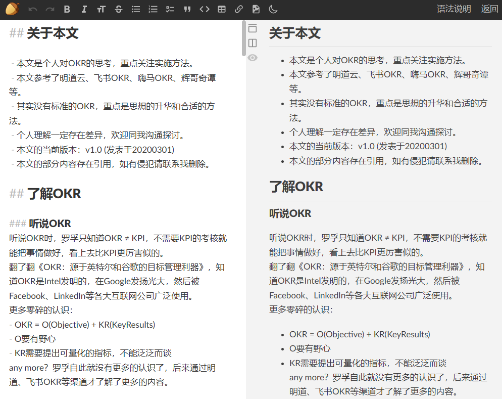

# 飞书好用：飞书文档——自媒体写作流最佳实践

本文系《飞书好用》系列之第一篇：飞书文档——自媒体写作流最佳实践。

最近看了一篇《[留给飞书的时间不多了](https://mp.weixin.qq.com/s/zpy5GusNzE4fw3emkhrC1w)》，万字长文，写了很多，不过讲的都是江湖故事，而文末留言区很多留言飞书好用。好吧，罗孚也是飞书的死忠，还写过一篇《[如何选择合适的企业办公套件](https://mp.weixin.qq.com/s/2cXewZxKh1RC3FaTNHErLQ)》文字，文章中充满了对飞书的推荐，今天，罗孚就想写写飞书好用，希望能够成为一个系列，本文系第一篇，讲讲罗孚如何码字出稿的。

## 写作中对工具使用的痛点

罗孚以前也写过一些文字，比如《[OKR 实施方法——关于思路和流程的思考](https://mp.weixin.qq.com/s/8D4xXNtaUjQvdJ46fVIlKA)》、《[没有总部大楼的公司给我们的启发](https://mp.weixin.qq.com/s/L6urtG6A0EVsBkiDx_D3Kw)》等，写的断断续续，原因在于：成文太难。除了写好一篇文字需要写作能力、深度思考等核心外，其实写作工具也很关键，一个复杂的写作流程，容易让人放弃。

### 尽情写作的干扰

大家都认为 Markdown 是最佳的码字工具，没错，确实如此，罗孚也找了一些 Markdown 的工具，Ulysses、Cmd Markdown 等等都是不错的工具，最终罗孚选择了坚果云 Markdown，确实挺好用的，如下图所示：

左边专心写作，右边预览，写作时可以只展示左侧区域，以达到无干扰写作的目的。

而且，坚果云 Markdown 确实有非常多的好处，官网的部分优势对比如下：

但 Markdown 也有烦恼，比如语法虽然够简单了吧，但还是要记一些语法，比如因为自己写语法，所以甚至产生分心，比如也因为语法，写作过程中会有无用的字干扰，写完的文字还需要单独预览，比如插入图片还需要使用链接。当然，这些似乎有点吹毛求疵，在使用飞书文档前，我一直用的坚果云 Markdown，相比其他产品，这算是唯一的小小瑕疵了吧，当然，这不是产品本身，而是选择 Markdown 语法本身引起的。

### 低效的图片处理

上述写作的干扰如果说是吹毛求疵，那么图片处理真的是低效到令人发指，这也是我无法坚持下去的一个最为重要的原因。

首先图片需要保存到本地，这是必须的，使用坚果云后可以保存到文档对应的目录下，但这个过程，是费劲的，比如就一个截图，需要保存到本地，然后给命名，最好不要带有中文命名，这个过程就挺烦人的。

其次 Markdown 中显示图片的问题，原则上必须先上传到网络上，然后插入 Markdown 的图片语法，这个过程挺复杂的，需要一个好的图传，或者通过 FTP 上传到自己的网站目录，但不管怎么处理，这个链路过程，导致处理低效，而牵扯到图床等内容，就不是普通人方便解决的问题。

在此顺便吐槽一下七牛云，宣称每月 10GB 免费流量，最近收到了欠费七牛 2.07 元的通知，但要知道，我只是在一篇《[樊登读书图书编目和思维导图整理](https://mp.weixin.qq.com/s/wrC_Wd0fWj4wBIjfXmwmEw)》文章中用到了七牛，虽然图片繁多，但几乎没人会访问的，每月 10G 不可能花得完，除非被人批量下载，反正现在停掉了，不用就不用了吧，本身可能也仅仅想方便访问和趁那每月 10G 的流量而已。

### 版本同步问题

之所以选择坚果云，很重要的一点就是解决了同步的痛点。

现在大家设备都很多，虽然罗孚主要在电脑前码字，但有时候送小孩弹钢琴写字的时候，偶尔用 surface 改改稿，或者晚上不想开电脑，就在 iPad 上看看，不得不说，坚果云的云同步能力确实很赞，随时登录到后台，都可以获得最新的文件。

但在坚果云之前，如果都是本地写作的话，就比较惨了，无法同步，同步的版本不对等，都会引发较多的麻烦。

### 格式排版的烦恼

虽然坚果云 Markdown 提供了文本预览，甚至可以直接粘贴到微信公众号，但排版布局总有点别扭，当然，基于 Markdown 的微信公众号排版工具有很多，罗孚甚至自建了一个自用，基于这些工具，也算是较好的解决了排版问题吧，但还是增加了繁琐的步骤。

### 发布流程问题

由于罗孚也算有小站的人，所以发布也会成为问题，以前用 WordPress，登录后台发布 Markdown，也有一定的麻烦。后来受《[使用 Markdown 自由地写博客](https://soulteary.com/2020/11/15/use-markdown-to-blog-freely.html)》启发，转到 hugo。不过，罗孚没有该博主厉害，加上觉得简化到这样的步骤，即便有一点点的手工，也是完全可以接受的了。

该文中也讲了很多的写作工具，也都是挺好的 Markdown 的写作工具，只是罗孚早期选择了坚果云 Markdown 而已，而现在，改用飞书后，自认为整个流程更顺畅，进一步减少繁琐的事情，也让罗孚增加了一点点写作的动力。

好了，吐槽完了这些，介绍一下罗孚以前的写作流吧：

1. **坚果云 Markdown 写作，图片存放于本地，成文。**
2. **将md文件和图片搬到hugo的写作目录，编辑Markdown头部内容，通过hugo生成静态网页。**
3. **通过FTP发布到服务器上，自有小站可以访问。**
4. **复制小站内容到微信公众号和知乎，简单调整后发布即可。**

这就是罗孚写作流的完整闭环，使用飞书文档改进的是上述流程 1 以及流程 2 的部分内容。

总的来说：**图片下载和发布是 Markdown 写作的重要痛点**，不然罗孚可能仍然会坚持使用坚果云 Markdown 写作。

接下来就听听罗孚如何使用飞书文档解决上述痛点的。

## 飞书文档写作的亮点

飞书文档的亮点，非常的多，写几篇文字都不为过，待罗孚后续慢慢道来，今天主要讲的是同写作流相关的亮点。

### 插入图片超简单

这个亮点表面看起来有点弱智，一般的编辑器对插入图片都比较简单，包括微信公众号后台编辑器、知乎发文编辑器等，是的，复制后直接粘贴，自动会将图片插入到文档中，并且是将图片下载到该平台服务器，避免了图片源 URL 后续不可访问的问题。

但不是所有的编辑器都是智能的，比如雪球的发文编辑器就非常的传统，粘贴过去以后，是没有图片的，需要自己重新插入。当然，本身编辑也比较弱啦。

以前使用纯文本 Markdown 写作，图片需要先下载到本地，然后再写 Markdown 语法，即便直接使用源 URL 贴图，确实也存在源 URL 无法访问的问题。如果写一篇使用说明文，会有大量截图的那种，这种写法就会让人崩溃，因为每一个图片都需要下载整理然后插入。

现在，飞书文档不用，直接复制粘贴，就能将图片插入到文档中，不管你是截图，还是网页中的图片，只需要复制，就可以粘贴到文档中来。

罗孚现在一般不将图片保存到本地，一般直接粘贴到飞书文档，不保存的好处在于：存在哪里、怎么命名、后续怎么找到等问题不存在了。

那大部分人会疑问：那我有保存图片的习惯，如何解决呢？这个会在后续工具中讲到。

本小节有点啰嗦，就是想吐槽写作过程中图片处理的复杂性。

### 简单好用的排版布局

对于 Markdown 写作，实际上只需要处理好层级标题、突出字体、有序无序列表等，对特殊用户可能需要插入代码等。飞书文档完美支持这么小的功能，比如本文写到此，在左侧已经直接提供了清晰的树状结构，类似于大纲，有助于查看本文全貌。而无序列表、加粗、应用等也都是基础功能而已，并且都有快捷键，比如三级标题 H3 就是 Ctrl&#43;alt&#43;3 就可以，而有序列表是 Ctrl&#43;shift&#43;7，无序列表是 Ctrl&#43;shift&#43;8，加粗是 Ctrl&#43;B，嗯，都是非常基础但非常方便的功能。

### 方便的导出功能

这个不是官方的功能，但也是非常关键的功能，是罗孚能够顺利完成写作流的关键。

飞书文档官方导出功能仅支持导出 Word 或 PDF：

也就意味着导出成为 Markdown 成为了不可能，好在有万能的攻城狮，GitHub 上本身有好几个开源的飞书文档转 Markdown 的工具：

1. **Feishu2Md**：一键命令下载飞书文档为 Markdown，使用 Go 语言实现。
2. **feishu-backup**：飞书云文档备份。可以下载飞书文档为 Markdown。前端实现。

上面两个就是罗孚使用的飞书文档转为 Markdown 的工具，罗孚现在使用的是前者，后者需要建个站，略有麻烦。

feishu2md 使用非常简单，直接在 cmd 里输入&#34;feishu2md 飞书文档的 URL&#34;，就可以下载飞书文档为 Markdown 到本地：

当然，还包括了图片文件，同 md 文件在同一个目录下有一个 static 目录，就是存放了所有的文件，虽然图片文件的命名看不懂，但能保存所有原汁原味的图片文件，不需要自己手工下载和整理，这已经是超级方便啦。

呃，多说一句：上面说的工具，说起来其实挺容易得，但你要自建一个机器人，不然你没有 token 也没法下载文件那，还有安全设置里要添加本地 IP 到白名单中。不再说多，似乎又是一篇文字内容了，有需要的话罗孚下次再唠。但说一千道一万，有一个核心就是你要有管理员权限，至少要让管理员给你开通权限:)

### 直接全网共享

一直以来，自己做一个网站，挺不容易得，比如必须要有服务器和域名，虽然花钱不多，但自己维护也麻烦，再加上程序，上面说的 WordPress、hugo 等都算，似乎又增加了难度，罗孚实际也不太喜欢这些琐碎的事情。

而飞书文档，就有一个直接共享功能：

比如这篇文字的 URL：[https:rovertang.feishu.cn/docx/JS4odeFRKoYCe2x0n3dcslTCnng](https://rovertang.feishu.cn/docx/JS4odeFRKoYCe2x0n3dcslTCnng)，设置成互联网共享后，所有人都能直接访问。

如果做个索引页，也就是所有文字的分类列表，不就类似于自己的一个官网了吗？比如罗孚自己整理的两个索引页：

1. 罗孚传说的飞书主页：[https://rovertang.feishu.cn/docx/doxcn56nMrmyWZLYnmGAULeaWJe](https://rovertang.feishu.cn/docx/doxcn56nMrmyWZLYnmGAULeaWJe)
2. 罗孚在上海的飞书主页：[https://rovertang.feishu.cn/docx/doxcncCgue9zVldjYjRyqkxisKh](https://rovertang.feishu.cn/docx/doxcncCgue9zVldjYjRyqkxisKh)

至此，就不用再考虑自建网站这么复杂的事情了，与其烦恼于那些琐事，还不如使用飞书文档专心于写作。

### 强大的协作功能

罗孚是个人协作，所以不涉及协作，但对于团队协作，其协作功能不得不提，真的是太太太方便了。

最简单的协作，就是组织内的同事，查看你的文档，并对你的文档做出修改或评语。复杂的协作甚至可以整出一套流程。

比如少数派，现在就是全面转向了飞书，应该也是看到的，不仅仅是工具好用，更看到的是强大协作吧。见《[内容团队协作的最佳形式：少数派编辑部如何用飞书](https://sspai.com/post/58509)》一文。

实际上，罗孚也是受少数派的《[一日一技 | 我开发的这款小工具，轻松助你将飞书文档转为 Markdown](https://sspai.com/post/73386)》一文而转战 hugo 的，这也是上面说到的 feishu2md 的作者。

另外，少数派都可以直接通过飞书文档发布文章，是不是特别的方便？见《[如何使用「少数派助手」从飞书文档发布文章](https://sspai.com/post/68135)》一文。

最后总结一下：**罗孚现在的写作流，使用飞书文档直接成文，不再借助其他Markdown写作工具，然后通过feishu2md工具下载 md 文件和图片文件，再将这些内容发布到网站、公众号、知乎等平台。**

本次通过飞书文档获得的自媒体写作流最佳实践，你是否 get 到？如果你也有飞书好用的方法，欢迎和罗孚分享哦。

本文公众号地址：[https://mp.weixin.qq.com/s/hQTZLd760GszK0CrNIzvCw](https://mp.weixin.qq.com/s/hQTZLd760GszK0CrNIzvCw)

本文飞书文档地址：[飞书好用：飞书文档——自媒体写作流最佳实践](https://rovertang.feishu.cn/docx/JS4odeFRKoYCe2x0n3dcslTCnng)

---

> 作者: [RoverTang](https://rovertang.com)  
> URL: https://blog.rovertang.com/posts/eoffice/20230212-feishu-document-is-the-best-practice-of-we-media-writing-stream/  

