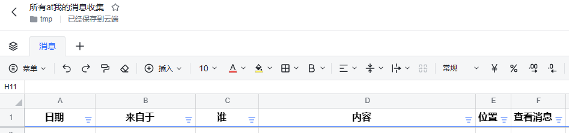

# 飞书技巧：用飞书捷径收集at你的消息

飞书已经飞进千万家，在一家超过千人的公司里使用飞书，一定存在非常忙碌的景象，今天，罗孚就讲讲如何收集飞书中 at 你的消息。

## 为什么要收集消息？

信息存在一个较大的问题，就是碎片化。实际在工作过程中，消息也是碎片化的。除非你的工作本身不需要沟通交流，不然，一定就淹没在了各种消息中。

因为需要对各种事情各种问题多个团队等进行交流，所以注定会被拉进各个群聊，最后不断被 at。但事实上，和你相关的消息，又有多少呢？

当你被 at 后，也许没有及时查看，当再打开群聊，数百条消息未读，你苦苦寻找，好累啊。

所以，&lt;strong&gt;我们的目标就是：收集这些信息，一方面不会被淹没和忘记，另一方面也就可以在统一的时间集中处理了。&lt;/strong&gt;

## 收集原理

说完收集的原因，我们讲一下收集的原理。

收集一定离不开的，就是：机器人。

不过，这个机器人不用自己创建，飞书官方提供，名字就叫：飞书捷径。

[https://app.feishu.cn/app/cli_9c2e4621576f1101](https://app.feishu.cn/app/cli_9c2e4621576f1101)

当然，飞书捷径本身有非常多的功能，因为它仅仅是一个工具机器人，能做的工作主要看你的流程设计。

不过，这个工具，需要管理员开通后才能使用。如果还没安装的团队，可以找自家管理员开通一下。

我们今天要设计的，就是收集 at 自己的信息，并自动保存到在线表格中。

## 流程设计

打开工作台中的飞书捷径，点击右上角创建飞书捷径

当然，你也可以直接使用模板，上图中的推荐模板第一个就是。

只是，我们还是尽量自己动手完成，以了解飞书捷径的流程，可以帮助我们后续做更多的流程化工作。

点击创建飞书捷径后，就可以看到一个空白的流程图了。

首先，我们选择触发器：

可以看到很多的功能，不过此次主要讲消息，所以选择飞书消息即可。

而触发器的选择共四个，第一个 at 我的群聊消息，就是我们要的功能。

其他的单聊或者红包消息等，也可以试试看，比如有些重要的人和你对话，你要把和他的单聊消息保存起来，这个功能就比较好用。

接下来的设置，也比较清晰，比如可以选择加入的所有群组，或者选择指定的群组，都可以，包括发送人也是可以选择的，甚至可以筛选具体的关键字。但这些不重要，一次性把所有的内容都收集了再说。

设置完这些，就点确定完成。第一步的触发器选择就处理好了。

接下来，就是选择具体的操作了。

可操作的选项也比较多，比如根据消息创建文档，比如可以将消息再次发送给自己，等等。不过这里选择表格，因为我们要把消息存储到表格这一个数据库里。

选择表格后，选择新增一行。要是选择创建表格的话，就会在某一个文件夹中不断创建文件，这就又成了很碎片化的内容了。

进入具体的设置项后，可以设置具体的内容了。

上图中的表格、工作表、插入位置都是必须的，也是前提，先要选择一个在线表格，然后选择 sheet，再选择位置。而这三个选项下面的内容，都是自己创建的，对应了你自己表格中的设计，比如罗孚就预先创建了一个所有 at 我的消息收集的在线表格。

根据字段，做一下对应关系，就好了。

飞书可以提供的字段如下：

有这么几项：

1. 群名称
2. 发送人
3. 源内容：就是消息的所有内容了
4. 消息内容：已经去除掉 at 的内容
5. 消息类型：一般都是文本类型，图片类应该是没有办法处理的。
6. 发送时间
7. 被回复的消息内容：(这个罗孚也不懂，觉得不好用，有懂的欢迎留言回复)
8. 消息位置：这是一个 lark 地址，类似于网址的 URL，通过这个地址，可以打开飞书并定位到该消息，你可以从飞书捷径的消息中或者自己 HYPERLINK 一下。

完成这一步操作后，点确定，就可以保存飞书捷径了。

至此，收集 at 自己的消息就搭建完成了。

**效果展示**

当有人发消息 at 自己的时候，就可以把消息保存到在线表格中。

同时查看刚刚的飞书捷径，就可以看到具体的运行情况。

## 流程改进

上面这个简单的流程，大家可以入门飞书捷径了，我们改善一下这个流程，让这个流程更好用一些。

改善主要两个方面：

1. 除了收集外，同时发消息提醒自己
2. 对于不同的群做不同的操作，比如转发出去

于是，我们在插入表格后面增加了分支：

同时，每个分支都有机器人进行发送，比如默认使用飞书捷径机器人给自己发消息：

发送的消息可以按具体的模板选择相应的字段。

这里需要注意：如果使用自定义机器人的话，会多出自定义机器人和发送至两个选项，可以发送到指定的群，而不仅仅发送给自己。当然，前提应该是要把机器人拉进群。不过，自定义机器人现在有点复杂，一方面是建立自定义机器人存在难度，除非公司自己建一个，另一方面飞书捷径配置自定义机器人也存在一定的问题，对于自定义机器人，有能力的同学可以考虑一下。

&lt;strong&gt;效果展示&lt;/strong&gt;

首先，当群里有 at 你的消息的时候，飞书捷径除了收集进入表格进行存档外，会自动发送一条消息给你，这条消息的发送者是飞书捷径机器人，并且根据你刚刚设置的模板，将群、消息内容等发送给你。

点击去看看，就跳转到了群的具体消息，通过这个按钮，可以非常快捷的定位到具体的消息，而不需要在群里查找 at 你的消息。

另外，通过自定义机器人发送的消息，形式同飞书捷径发的消息类似，只是发到群里后，大家都可以看了。当然，大家发送的时候要小心，注意一下是不是有些群里 at 你的消息不适合发送到另一个群:)

最后晒一下个人这一年来飞书捷径运行的次数吧，也就是被 at 了多少次[笑哭脸]

## 小小的总结

通过飞书捷径机器人收集 at 你的消息，确实可以摆脱繁琐工作，好处也是显而易见，罗孚简单说几条：

1. 避免错过消息，因为 at 你的消息单独通过飞书捷径再发给自己一次以后，只需去飞书捷径看就可以了。
2. 统一处理更高效，因为很多消息不一定着急或有价值，每天下班前回看一下飞书捷径中的消息，不重要的消息直接不看了，重要的点击查看跳转到具体群中继续回复一下即可，效率大大提高。
3. 消息备份到在线表格中，后续如需搜索，只需检索该表格中内容即可。

除了这些，实际飞书捷径可以做更多工作，本文仅从收集 at 你的消息这一功能说明其用法，更多玩法可以自行解锁。比如通过飞书捷径打造私人 flomo，这个话题大家有兴趣的话，罗孚下次再写一篇吧。

好了，以上就是罗孚给大家介绍的飞书小技巧了，你学废了吗？希望你在工作中能够用上，助你提升工作效率。如有飞书技巧相关的心得，也欢迎和罗孚分享哦。

本文公众号地址：[https://mp.weixin.qq.com/s/0dy2BcLV7i5IvjrU584b2A](https://mp.weixin.qq.com/s/0dy2BcLV7i5IvjrU584b2A)

本文飞书文档地址：[飞书技巧：用飞书捷径收集 at 你的消息](https://rovertang.feishu.cn/docx/PAbVdziDEoADmzx1Y03cbCvpnUe)

---

> 作者: [RoverTang](https://rovertang.com)  
> URL: http://localhost:1313/posts/eoffice/20230311-collect-information-about-at-you-by-feishu/  

