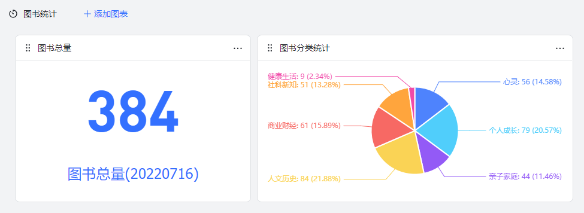
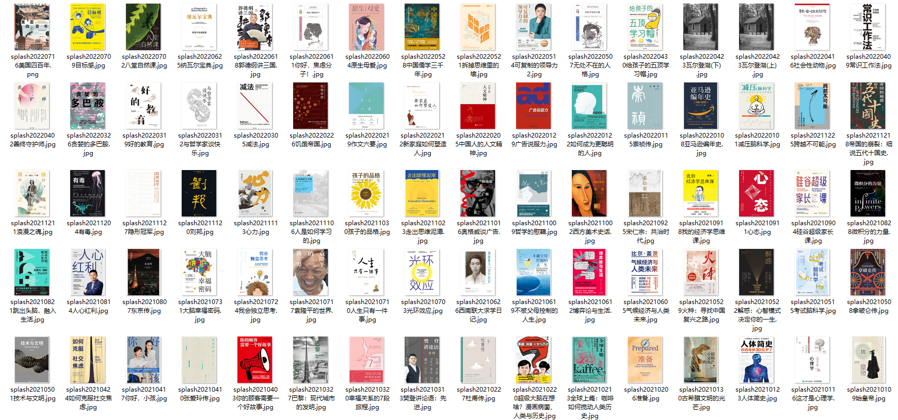
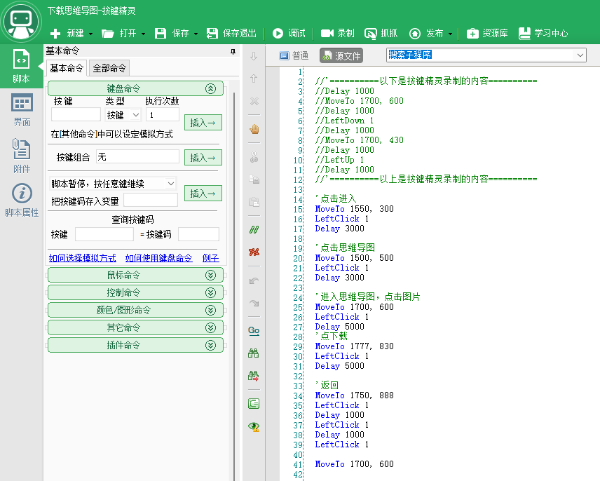

# 樊登读书图书编目和思维导图整理

先贴地址：[樊登读书BookList20220716](https://rovertang.feishu.cn/base/bascnPjU1ONeSIcAb0macA4VcNe) 

## 缘起

我的樊登读书会员即将到期，听书两年，收货颇多。

鉴于可能不再续费的情况，萌发了一个念头：整理一份樊登读书APP的思维导图。

从学习方式的效果来说，听书的效果最多20%，也许只能有5%，类似于听讲座，而且一般情况下你可能是并行情况下听书，比如我会在跑步时或者上班路上听书，其效果也是可想而知。

所以，我在想，在不读原著的情况下，如何更好的吸收这些书中的知识呢？看思维导图，自己尝试思考每一个大纲，也许是一种不错的方式。当然，个人还没正式开始，也确实不能确认最终效果。

这就是我去编目樊登读书中的图书，以及整理思维导图的初衷。

## 使用方法

打开[樊登读书BookList20220716](https://rovertang.feishu.cn/base/bascnPjU1ONeSIcAb0macA4VcNe) 

默认就是图书浏览视图了，是带图浏览模式。

提供了图书封面、书名、概要、推荐语、分类、阅读数、日期、思维导图地址等内容。

**点击思维导图的URL，即可打开思维导图的图片链接，查看思维导图详细大图。**

另外，还提供了分类视图，即按照分类进行浏览：

同前面的带图浏览模式差异的地方，每一本图书还是瀑布流式展示，但进能在分类中滚动，即每一列就是一个分类，单独向下滚动，对哪个分类有兴趣就滚动浏览哪个分类即可。

最后，还提供了一个图书统计：

当前共384本图书，根据分类统计，可以了解到分类下的图书数量以及分类占比。

似乎这简短的几句话就已经讲完了我整理的飞书多维表格的所有功能内容，总的来说，目标两点：

1. 通过浏览，找到自己感兴趣的书
1. 对于感兴趣的书，可以直接查看思维导图，希望思维导图能给你带来帮助。

虽然用途仅仅是这么简单的两点，而且甚至会说，不就是一个表格嘛，但我的心路历程是不寻常的，讲讲其中的辛苦以及一些技术手段吧。

## 心路历程

### 完成了一个工程，内心喜悦

图书编目和思维导图的整理，大概花了一天半，全身心投入的状态，晚上干到两点，早上起来继续干，最终仅仅是产出了一个多维表格，说白了也就是一个Excel表格啦。

但从想法到实现，从无到有，对于现在很少产出的我来说，也算是完成了一个小工程，内心是真的喜悦，而且这个成品还不错，至少不是一个简单的Excel表展示，而是带有图文效果的报表展示，阅览过程应该是可以接受的，而不是瞄一眼就要关掉的那种。

有结果，有过程，很开心。

### 体力活也是一种心智的考验

整个过程中，很多次想放弃，因为我不是一个喜欢重复劳动的人，特别是处理表格的这种复制粘贴，既没有技术含量，又还挺费劲的。

所以在下载导图的过程中，以及图书封面上传的过程中，全都是手工体力活，一度想放弃，但想着再坚持一下，总共也就三百多不到四百，已经完成了一半多了，不断给自己加油鼓劲，总算是坚持了下来。

体力活真的很无聊，说白了就是不断重复点鼠标，拖动，点击，点击，再点击，不断重复，甚至自己做的很机械，半夜做这种机械活很容易睡着。不过，偶尔做一下这样的体力活，又何妨呢，想想对于生活，不也是不断的重复嘛，每天做饭、吃法、睡觉，还要去工作，是不是也很单调无聊。一想到此，就不再抗拒，愉悦的接受这一点点无聊的体力活吧。

### 慢就是快，笨办法也许比技术手段更有效

在整理的过程中，我用了很多的技术手段，当然，个人技艺不高，所以实际上不能达到大师的程度，所以才会有上一节的体力活的感叹。

但到最后发现：实际上，不要盲目迷信技术手段，反而用笨办法先做起来，也许就豁然开朗了。

这部分我想在技术实现章节会做更详细的阐述，但这部分也让我明白了一个理：慢就是快。

由于本工程的整理，不是一种标准化的流程，并且也许若干年就整理一次，鉴于数据量不至于大到恐怖的情况下，用笨办法是完全可以接受的，而想要使用技术手段图省事，那么调试的过程就是一个痛苦的过程，耗费很多的时间精力，即便真做出了方法，但也因为数据源的一点点变动，而要做调试和调整，最终，技术手段的速度反而比手工速度还慢。

## 技术实现

本文归类于生活分类，所以我就简单说说技术实现吧，要是真归类于杂技分类，那甚至可以写上三篇。

### 通过fiddler抓取图书列表JSON

图书的列表，肯定是不能手工一个字段一个字段输入的，这种原始纯手工的方式肯定是不能接受的。

由于是手机APP，不是WEB网页，所以抓取难度更大，这次用了fiddler抓取列表。

至于如何通过fiddler抓取手机APP的JSON，这是一篇专题，暂且bing搜索一下吧，不展开了。

遇到的问题：由于是post方式，而不是get方式，所以无法直接通过访问URL的方式获取列表。

最终，我还是用了笨办法，就是自己手动下拉列表，等待刷新后，获得了新的返回的JSON，将这些JSON合并到了一个文件中。

本想用postman，将header、cookie等内容输入进postman了，但就是无法正确返回，无奈，技艺不行，只能手工了。

补充一句：在做分类的时候，发现返回的JSON中竟然不带分类字段，导致的结果可想而知，就是我又重新按照这个流程，每个分类又重复做了一次，总共有七八次，真浪费体力。

### 通过json-csv.com网站将JSON转换为漂亮的Excel。

从fiddler拿到数据后，都粘贴到一个文件中，这些所谓的JSON，还无法直接使用，因为抓的时候是一段一段的，需要处理成没有错误的JSON。

这部分没有写代码截取，只是通过文本工具emeditor使用正则进行了部分关键字的替换，结合一点Excel，最终手工处理出了一份JSON。

最后，把这个JSON文件送进：json-csv.com，就可以得到完美的表格啦。

顺便批评一下bejson.com，只能转换一个层级，无法转换多层级，转换出来的Excel字段内容竟然显示object，而不是看的懂得内容。

所以，我基本都是通过这个json-csv.com网站来转JSON为Excel的，支持多层级是我需要的关键功能。

### 通过curl批量获取图书封面

拿到了图书列表的Excel，里面也是有封面URL的，那我总不能直接贴一个封面URL地址就结束了吧，毕竟，如果，能有封面图在多维表格中，那使用画册视图显示，效果就非常的好了。

所有的URL可以直接从Excel复制出来，但总不能一个一个打开再右键另存吧，这么原始的做法肯定不可取。

本想用wget的，因为在Linux下这是比较常用的命令，当做下载工具还是非常方便的，但在Windows下，虽然也行，只是我想试试新的。

于是，决定用万能的curl，毕竟是很NB的开源库，用curl代替Python做一些简单的爬虫还是可以的，而我又仅仅是一个下载图片的简单需求。

于是bing搜了一下，有Windows版本，并且只需curl -o就可以。整理好语句，送进命令提示符窗口，等待，不一会就把所有的封面都抓取完了，而且名字是你想要的命名方式。

### 思维导图获取的波折：电脑反控手机和自动化脚本

思维导图如果仅仅按手工的方式，是比较容易获取的，点几下进行跳转，然后下载即可。

通过fiddler查看了一下数据，还是POST的方式，由于我不会组织POST的request，所以没法response回来我要的东西，而且查看了一下思维导图的显示方式，竟然只是body显示中的一小段HTML，而不是有一个专门的字段作为思维导图URL，同封面图还不同，这就比较郁闷了。

实在不行，只能手工。但用电脑操作应该简单一些，于是准备将安卓手机投屏到电脑。

手机投屏到电脑，方法有很多种：

1. 华为多屏协同

虽然原来有安装过多屏协同，但升级到WIN11后没有再装，要是安装的话，应该也要折腾好久，于是放弃。

需要说明，个人不是华为笔记本，所以一个组装台式机能用上华为的多屏协同本身不是一个容易的事，应该可以继续折腾出来，但应该要废点时间，本次先忽略。

1. 手机助手协同

本以为连上华为手机助手，就可以反控手机，结果，华为手机助手不支持此功能。

那我原来用的是什么助手？哦，好像是360手机助手，好像是有反控手机的功能，应该可以支持电脑操作手机的方法。但考虑到我对360的抗拒，于是放弃了使用360手机助手的想法。

1. 其他投屏协同工具

最后确实用了其他投屏协同工具，这个工具叫虫洞，前一阵子想反控iPhone，也了解到这个工具，这次看了网站，据说对于安卓是免费支持，于是试试看。

通过实际测试使用，效果类似于华为的多屏协同功能，效果还不错。

解决了电脑反控手机的问题，那我想是不是可以更简单一些：毕竟，每次大概要经过8到10次，才能完成一次思维导图的下载，那我大概需要点击鼠标的总次数会超过3000次，目测也要两三个小时的事情吧。

于是又想取个巧偷个懒，这机械活能不能让电脑去搞？于是，搬出了20年前用过的按键精灵，呃，是的，据说是游戏挂机挖矿打僵尸的好助手。

按键精灵的脚本很简单，很快就写好了：

but，鼠标的拖动功能竟然不能用，按住，往上拖动，再释放，按理是支持的，但死活没有得到好的效果。最终只能放弃。

不过虽然不能全自动，那就半手工也行啊，比如我帮它拖动好，然后按F10执行，等待数十秒，它就自动把思维导图保存了。在这个间隙，顺便吃了包小饼干垫垫肚子。

不过，看上去好用，实际也挺不好用，因为思维导图的位置偶尔会变、点击一次有时候还加载不出来、有时候展现方式还不一样，当奇奇怪怪的问题出来的时候，自动化脚本就不再自动化了。

一气之下，弃用，就让我用手工吧，就累死我吧。实际上，最后也没累死，也没多久，就全部保存下来了。

把手机里的图片拷贝到电脑上进行重命名整理，基本就完成了思维导图的收集。

### 图床和图片上传

思维导图同书目对应，也总共有近400张图，文件大小合计超过600M，最大单个文件超过5M，最小不到100K，总体来说，文件是挺多挺大的。

那这些思维导图总不能直接传到多维表格吧，虽然我已经建立了字段可以上传，但一方面上传这个体力活太累，另一方面也不想让这个多维表格占用太大的空间。

于是乎，这600M近400张图片就要放到互联网上了，放哪里好呢？放图床吧。

自己原来用ImgURL搭过一个图床，上去一看，发现没有启用过，好吧，算了。

了解到有一个良心的sm.ms图床，注册了个号，上传时发现有限制，一天最多200个，于是放弃。

最后回到若干年不用的七牛云，登录账号发现空间还在，于是重新绑定了一下域名后就又可以启用了，直接把所有文件上传，还能得到绝对地址，把URL和文件一对应，重新粘贴到表上，就解决了思维导图如何查看的问题，点URL跳转到这个图片的链接就可以了。

### 使用多维表格输出最终效果

飞书真的方便而强大，比如发明的多维表格，以前用简道云也有类似的效果，但没多维表格来的好用清爽，最终也没成气候。

所以我要用飞书多维表格给大家做最终的展现，谁让我是飞书官方认证的一表人才呢。

至于如何用飞书多维表格做出这个效果，等我的图书馆系统上线后再详细说说，此处在使用方法中已经说明，基本就是一个简单的Excel表而已。

本想给添加评论和打分功能的，但考虑到仅做展示，不做交互，而且主要给自己用，所以这些复杂的功能就暂不考虑了。不过如果需要评论，实际点开后，在最底下是可以进行评论的哦，还是非常好用的。

## 最后

花了一天半整理，又花了一个半小时打字，不易，很累，有点头昏眼胀，不过很开心，一个小小的工程，鼓励自己继续前行。

希望[樊登读书BookList20220716](https://rovertang.feishu.cn/base/bascnPjU1ONeSIcAb0macA4VcNe) 能给你带来帮助，希望你能喜欢，愿你有收获。欢迎随时和我交流哦。

本文飞书文档：[樊登读书图书编目和思维导图整理](https://rovertang.feishu.cn/docx/doxcnafYzrREyuYmf7xgrFqyvSK) 

---

> 作者: [RoverTang](https://rovertang.com)  
> URL: http://localhost:1313/posts/grow/20220716-fan-dengs-book-cataloguing-and-mind-mapping/  

