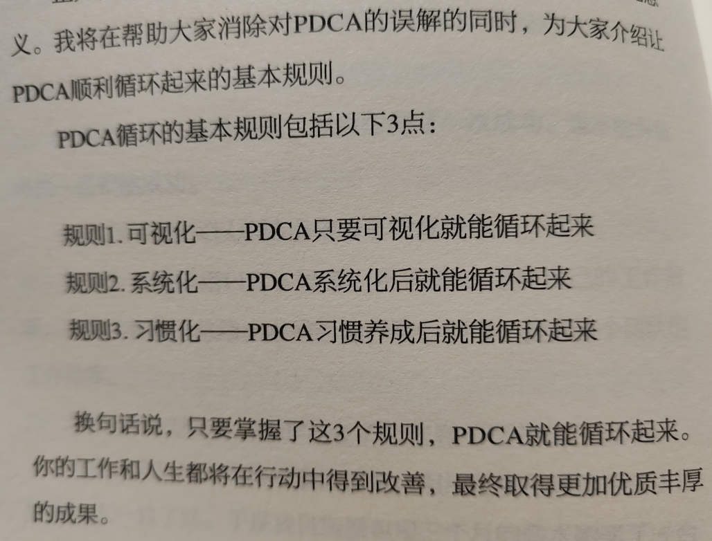
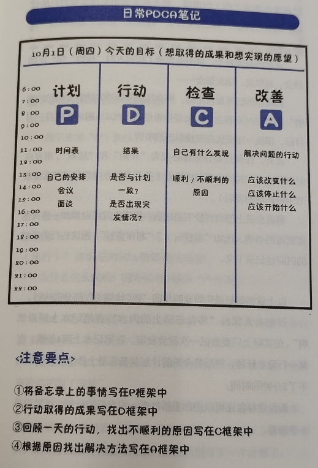
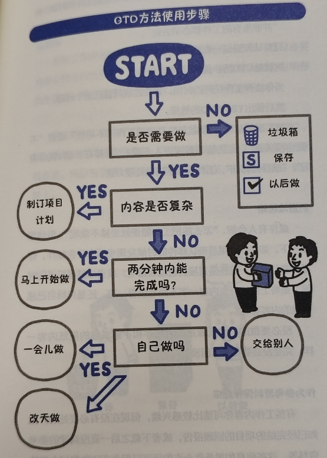
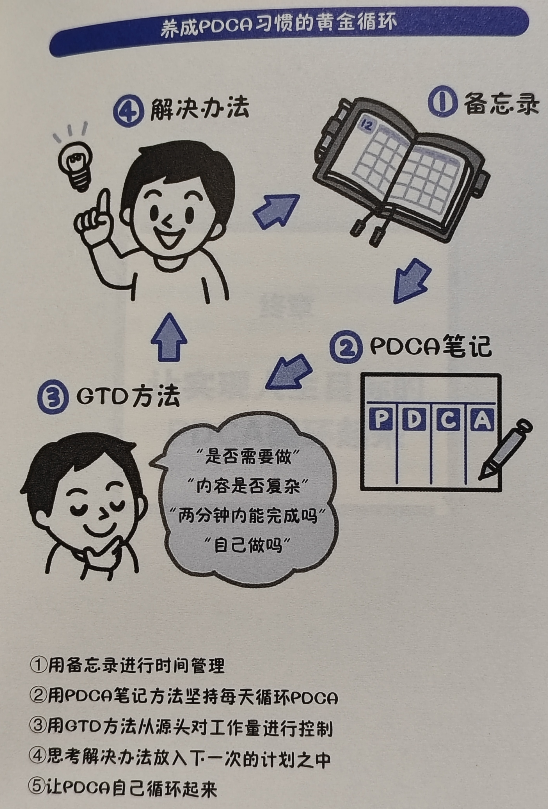
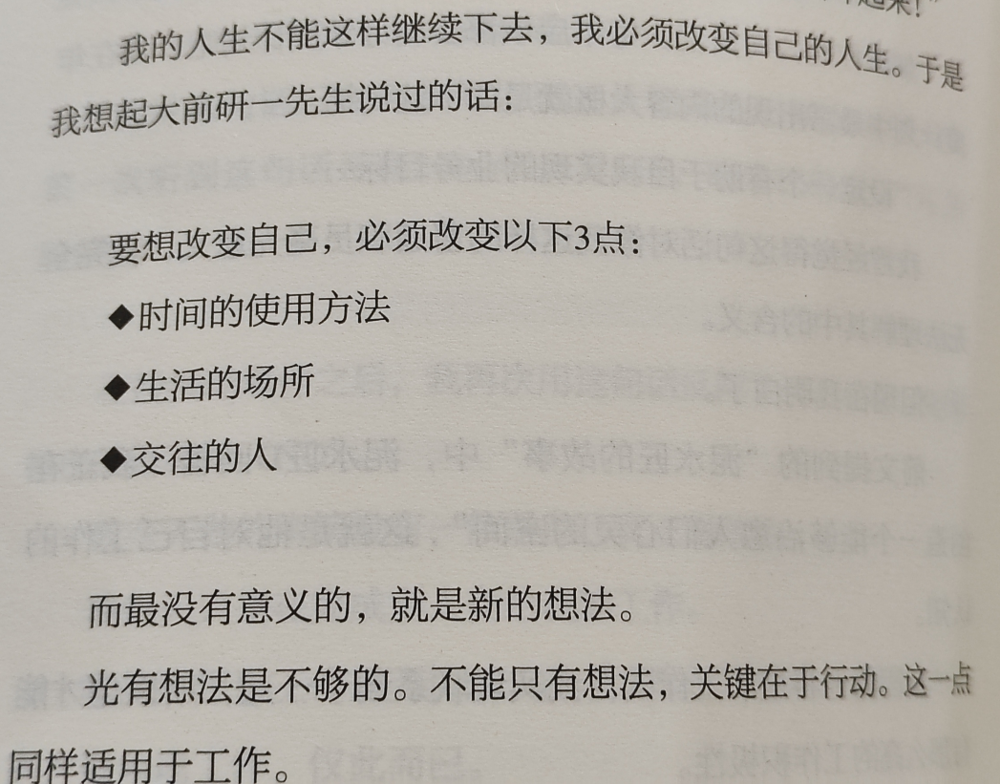

# 《PDCA循环工作法》读书笔记

PDCA 循环工作法，一本不是很厚的书，在豆瓣评分也不高。

我在一周内读完了这本书，用日常碎片化的时间读完的，比较快速的翻完每一页，这是一次很难得的经历，因为很久没能读完一本书了。

整本书的内容，应该可以用三篇五篇公众号文章就能写完，非要写成一本书，确实内容有点冗长拖沓，很多翻阅完就没了印象，不过，我也做了一些笔记，还是有一些内容，有所启发，这也就是读书的意义所在了。

首先作者讲述了 PDCA 循环不起来的原因：没有建立循环系统。PDCA 顺利循环起来的 3 个规则：可视化、系统化、习惯化。可视化的方式：整体可视化、数值可视化、写写画画。

也就是说要整体的来看，并且可以量化，一定要写下来，最终要养成习惯。

然后讲了 PDCA 思考方法和 PDCA 笔记制作方法，这两章我没能记下什么内容，思考方法也是要有目标，要坚持等等，而笔记制作方法就是四条竖线，根据不同的类型做了一定的差异化，比如目标达成型、项目型、商谈型，个人感觉方法太过于浅显，没能很好的深入浅出。

在第四章让 PDCA 高效的方法中，反而有不少感悟。

明确指标：量化是明确指标检验结果的关键。(实际上 OKR 也类似。)

&#34;A 改善&#34;方案的制作方法：口号、标语、形容词需要细化成具体的行动项。

不要增加太多的行动：高效是时间不够的解决方法。少即是多，如若增加行动项，就需要减少当前项。(实际上理财也类似，如若认为有好股票，就要放弃手中坏股票，保持精力仅专注固定数量的股票。)

第五章养成 PDCA 笔记方法中，介绍了 GTD 方法，GTD 方法的四个步骤很有启发，我们不应该立即开始做，而更应该先思考，如果按照这样的方法步骤来实施，那我们的日常生活和工作也会高效。

GTD 方法的 4 个步骤：是否需要做？内容是否复杂？两分钟内能否完成？自己做吗？

在养成 PDCA 习惯的黄金循环中，也教了我们不断循环的方法，这个图反而让我认为这才是 PDCA 循环方法啊，至少是同 PDCA 循环类似，计划、执行、检查、回顾并改善然后不断循环。

养成 PDCA 习惯的黄金循环：1、用备忘录进行时间管理；2、用 PDCA 笔记方法坚持每天循环 PDCA；3、用 GTD 方法从源头对工作量进行控制；4、思考解决办法放入下一次的计划之中；5、让 PDCA 自己循环起来。

有一节讲到了“能简化吗”思考框架：1、为谁？为什么？2、商业活动效率第一；3、是否具有行动计划。这个框架让我们明确目标，提高效率，将事情分解落实到具体的行动上。

还有一节讲到了委托的技巧：如果不解雇自己就无法前往下一个舞台；这是必须自己完成的工作吗？思考自己想成为什么样的人；能不能悄悄的放在别人的工作里？

其中第一条如何理解“如果不解雇自己就无法前往下一个舞台”？也和朋友做了探讨。

书中的大意：把自己会的，都交出去，让别人会，只有别人能接你的班，你才能走向更远的地方。把自己当前擅长的工作，交给接班人，然后自己才能继续向前做更重要更长远的事情。

对于我的感悟：最近忙于很多琐事，这对于管理者来说，没有意义。管理者需要把方法交出来，把事情安排好并跟踪好，让自己轻松了，才能做更重要的事，比如方向思考、执行落地流程、产品细节改善等。管理者不能成为救火队长，而应该成为防范员，做好全局和方向的把控，方能把团队带向更远的地方。

最后一个终章，讲了很多作者的经历和感悟，也有关于生活的，其中有一页很感慨。

总的来说，这是一本有想法的书，但内容比较浅显，读的不算过瘾，但也能给我们带来启发，这应该也就够了吧。有兴趣的朋友可以拿来随手翻一翻。

---

> 作者: [RoverTang](https://rovertang.com)  
> URL: https://blog.rovertang.com/posts/grow/20230919-pdca-circular-work-method/  

