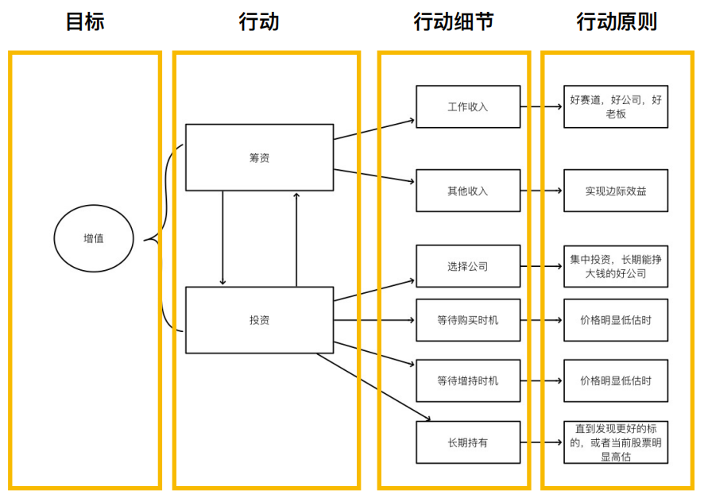
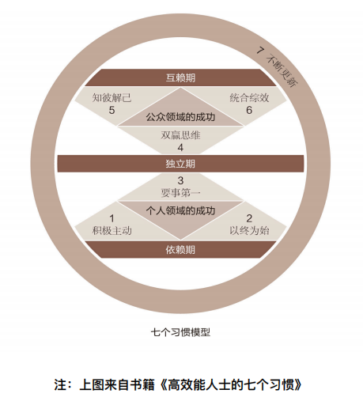
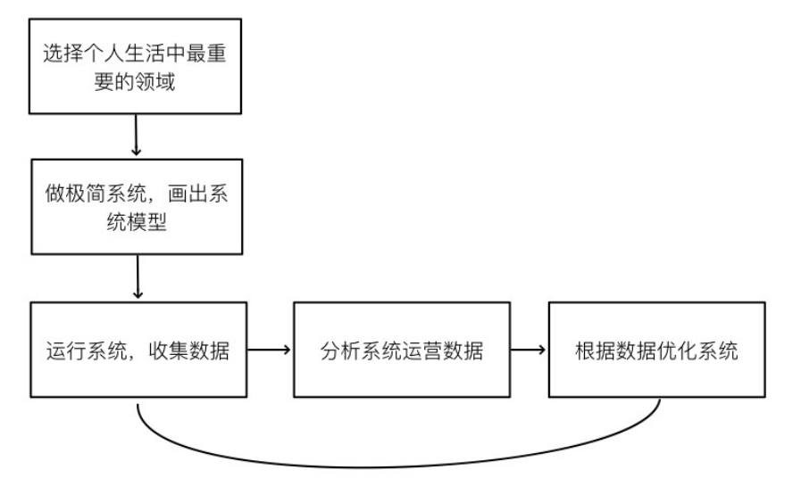

# 听“借助系统，获得确定性的成功”有感

这是辉哥知识星球中“系统驱动人生”系列的第一篇，听了几遍，有一些感触。

系统很重要，音频中虽然列举了很多重要性，但一言以蔽之就是标题：可以获得确定性成功。

对于系统最简单的定义：**系统是结构化的问题解决方案** 。系统是一个方案，是结构化的，是解决问题的。

系统的关键列举：

- **明确的目标** ：没有目标也就谈不上解决问题。
- **是一个闭环** ：需要能形成一个环，不然实际也无法称之为系统。
- **各部分的执行原则是关键** ：执行是由原则指导的。
- **各部分皆可被量化** ：数字化才能够让结果清晰。
- **系统可以升级** ：比如辉哥投资系统由原来的投资获利倍数转变为投资规模的扩大。
- ……

还有一些其他的关键指标。

一个最小系统由三个部分组成：**目标--&gt; 行动--&gt; 检查，然后不断循环** 。感觉有点像 PDCA。

举例了减肥系统：

目标：一个确定的体脂率数字。

行动项：每周锻炼内容和次数、每日饮食内容记录等。

检查：使用体脂秤记录每周数字变化。

然后辉哥又给我们举例了一个较为复杂的系统，他个人的投资系统：

这个系统在后面也有讲到，以及还有专题讲到，有机会后续再分享。在后面的音频中，辉哥讲到了这个系统的优化，在行动细节和执行原则上有所不同，罗孚入市一年，对投资也有一定的概念，也认同此系统，但还是有一些不同的想法：

**1、投资系统中有筹资项** 

筹资项确实是没有想到的，因为大部分情况大家仅仅是把积蓄投资出去，但带上筹资两字以后，就有一定的主动色彩，并且需要把绝大部分的收入作为筹资进来。

**2、其他收入也是重要的筹资渠道** 

大部分人是没有其他收入的，很羡慕有其他收入的人。个人收入主要来自三个方面，一般都是工资收入，常规的，另一是兴趣爱好等业余赚的钱，还有一个就是钱生钱，就是投资理财。现在是工资收入和其他收入放入投资系统让钱生钱，这雪球滚的真漂亮。

**3、选择公司、等待买入机会、长期持有，说起来简单做起来难。** 

投资其实就是选择标的然后进行买卖交易，如何选择公司实际是一门大学问，而买入时机又非常考验思维和人性，长期持有更考验心态。罗孚原来也坚定长期持有的，只是最近觉得利用网格交易进行高抛低吸也许也是一个不错的方式。当然，当我计算了苹果股票以后，发现这个思维在美股上不适用。

下面是罗孚刚刚对于美股苹果核算后的感慨：

&gt; 由于辉哥、大道爱买苹果股票，个人粗略估算了一下：&lt;br/&gt;假设以 2018 年 11 月左右买入苹果，当时价格假设为 200 美元。&lt;br/&gt;当前 2023 年国庆，苹果价格假定在 170 美元。&lt;br/&gt;由于在 2020 年 7 月底，苹果股票进行了分拆，1 拆 4，所以：当时的 200 美元成本实际是 50 美元。&lt;br/&gt;而这不到 5 年的时间，分红约为 4 美元 &#43;，分红确实不算多。&lt;br/&gt;基于此计算，价格涨至 3.4 倍，股息约为 8%&#43;，累计约 3.5 倍 &#43;。&lt;br/&gt;5 年 3.5 倍，意味着年化(注意是复利)：约 29%。单利是 50%。&lt;br/&gt;如果按 2019 年元旦后的最低点单价 142 美元计算，那么：&lt;br/&gt;5 年约 4.8 倍，意味着年化(注意是复利)：约 37%。单利是 76%。&lt;br/&gt;假设 2018 年底左右买入 100 万元的苹果股票，那么：当前约为 350 万到 480 万。&lt;br/&gt;在赤裸裸的数字面前，不得不叹服：苹果确实是好股票，太能赚了。&lt;br/&gt;呃，这么一算，个人都感觉这不是真的，有点太梦幻了。感慨感叹。

继续说回系统，辉哥有很多系统，给我们做了列举：

- 投资系统
- 工作系统
- 阅读系统
- 写作系统
- 运营系统
- 个人成长系统

系统很多，看来需要学习的还有很多，后续学习了慢慢分享了。

辉哥也给我们举例了经典的系统：高效能人士的七个习惯和 PDCA。

罗孚最近在看 PDCA 系列的书，A3 思维、PDCA 循环工作法、丰田 PDCA&#43;F 管理法、软银孙正义的高速 PDCA 工作法等等，第一本粗略的翻了一下，第二本看完了，读书笔记在此：《[PDCA 循环工作法 》读书笔记](https://mp.weixin.qq.com/s/BWpi6WURCW2HsrkL5wpaOw)，第三本感觉看目录就行，就没有做笔记，最后一本正在读，感觉不错，做了一些笔记，待后续分享。

罗孚感觉 OKR 系统和 PDCA 也是类似的异曲同工之效，以前写过一篇：[OKR 实施方法——关于思路和流程的思考](https://mp.weixin.qq.com/s/8D4xXNtaUjQvdJ46fVIlKA)，在文末写道：

&gt; 罗孚认为，OKR 的重点：&lt;br/&gt;1、制定目标、量化指标、对齐目标、(凝聚并有野心)&lt;br/&gt;2、立即执行、不断跟踪、定期复盘、(自驱)&lt;br/&gt;3、形成循环。(习惯)&lt;br/&gt;这么一分解，是否感觉 OKR 同 PDCA(或者 OODA)比较类似了？

另外辉哥提到的高效能人士的七个习惯是一个系统，罗孚以前不觉得，但看到辉哥提供的图以后，相信这确实是一个系统，看起来以后需要精读一下七个习惯一书。

讲完这么多系统，辉哥教我们打造自己的系统，如何操作？

转换成文字版大概是这样：

**1、先要选择自己最重要的领域。** 

**2、做一个极简系统，画出闭环的模型。** 

**3、运行系统并收集数据。收集数据很关键。** 

**4、分析运行系统数据。** 

**5、根据数据优化系统。** 

**6、再循环 3~5 步骤。** 

即便这样的系统看似简单，实际上充满了智慧。

什么是自己最重要的领域？大部分人都不知道，罗孚也不是很清晰，这就是一个目标选择的问题，而没有目标实际是最致命的问题。

画出闭环模型，进行数据分析，这些都需要进行深度思考。

而即便是简单的收集数据，实际上坚持也一样困难，比如每天收集自己做的重要事情，比如每天发三条感悟，这些看似简单的事情，实际形成习惯是不容易的。

罗孚不一定能够自己打造系统(虽然也一直在准备打造一个普适并可公开的理财系统)，但相信站在巨人的肩膀上，不重复造轮子，先把轮子给用起来，所以可以先学习一些系统，比如辉哥的这些系统，学会了也许就已经有不小的成就了，更不用说以后自己打造系统了。

结语：

音频链接见上图，有兴趣的小伙伴可以扫码加入收听。

总的来说：没有系统，难保成功，借助系统，可以获得确定性的成功，每个人都应该加强对系统的学习和实践，只有在系统框架下，才能有稳定的发挥，才能保证目标的达成，让我们一起来学习系统，获取系统的力量。

---

> 作者: [RoverTang](https://rovertang.com)  
> URL: http://localhost:1313/posts/grow/20231004-using-the-system-to-achieve-deterministic-success/  

