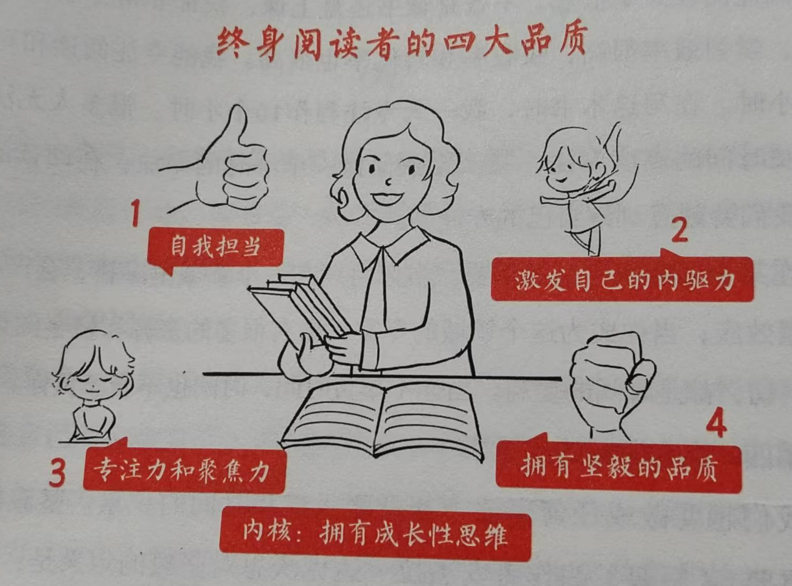

# 《读书变现》自序：读书改变命运

自序标题是：**读书改变命运，读书成为事业。** 是的，读书改变了作者的命运，也成为了作者的事业。对于普通人来说，先不说读书能否成为事业，但读书改变命运确实也能适用普通人。

**读书是普通人逆袭、突破阶层固化最低成本的一条路。** 个人比较赞同此观点，原因在于：通过区区几十元，就能获得作者几年甚至几十年的经验积累，这确实是非常低成本，也是最具性价比的。当然，不是所有书都称得上好书，我们诚然需要读好书，但如果能在读的书中获得一点点启发，不也很值得嘛，不也很对得起书价嘛。

**你热爱啊的事情里，蕴含着无数的机会。当你持续做你热爱的事情时，会有意想不到的收获。** 这是同爱好驱动我们持续行动是相通的，实际上当在一件有意义的事情上产生了热爱，在持续的过程中，就会有持续的发现和收获。在这一大段篇幅中，作者的经历就是如此，最开始也没有特别读书，说是每年读书不到 10 本，但后来和写作结缘，通过读书扩大了自己的知识面，拓宽了写作的素材、内容、方向，也正是因为这样的正向循环，才产生了热爱并成为了事业。读书如此，其他事情亦如此。

**你读过的书，会改变你的思维，会重塑你的生命。** 至于是否能重塑生命，普通人可能没有那么长远和巨大的感知，但改变思维是比较认同的，多读书的人，其思维是不一样的。与此鲜明对比的，就是看多了短视频的人，其思维是缓慢的，甚至说短视频反而让自己丧失了思维。正巧，我一起借的书还有《制造白痴》，讲的就是手机对我们人的思维的影响，后续开始读的时候再做分享吧。

作者认为要成为终身阅读者，四种品质发日常重要：

**第一，自我担当**

**第二，激发自己的内驱力**

**第三，专注力和聚焦力**

**第四，拥有坚毅的品质**

**最后，我们要拥有成长性思维。**

这几点都比较字面，书中虽然也讲了较多，但个人狭隘的解释一下：自我担当是知道读书为自己好，而内驱力是可以通过读书来激发的，读书让自己变好，形成正向循环，自然也就促进了内驱，而专注和聚焦实际是现在比较缺的东西，因为我们已经被手机吸引了注意力，而读书正好可以锻炼专注力和聚焦力，至于坚毅，你能坚持读书就属于有坚毅的行为了。

最后的成长性思维，实际是每个人都需要的。看多了视频的，实际是没有成长性思维可言的，因为他们被困在了视频里，不需要思考，只需要接受视频中的信息，这种懒惰导致失去成长性思维，这个危害是巨大的。而读书，实际是痛苦的，特别是一些读的不太懂的书，就需要去思考去理解，这个过程实际是成长，而当吸收了书中的内容，变成了生活工作中的行动，此时就有了成长性思维，因为你通过读书做出了改变。

其他一些好句：

**当你不辜负时间，时间也不会辜负你。**

**我们天生就是要做最好的自己。**

自序总共六七页，上述是我的摘录，读完感觉有收获，所以分享在这里。继续阅读下一章《升级读书思维：如何通过读书让自己变得更好》，下次继续分享。

---

> 作者: [RoverTang](https://rovertang.com)  
> URL: https://blog.rovertang.com/posts/grow/20250104-preface-to-reading-monetization-reading-changes-destiny/  

