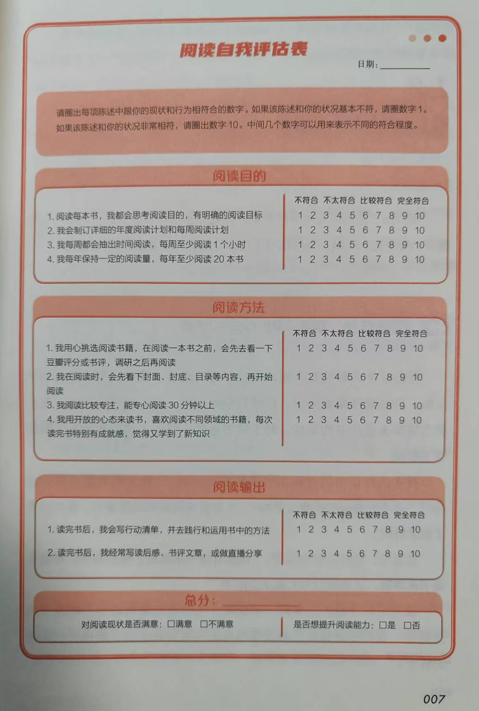
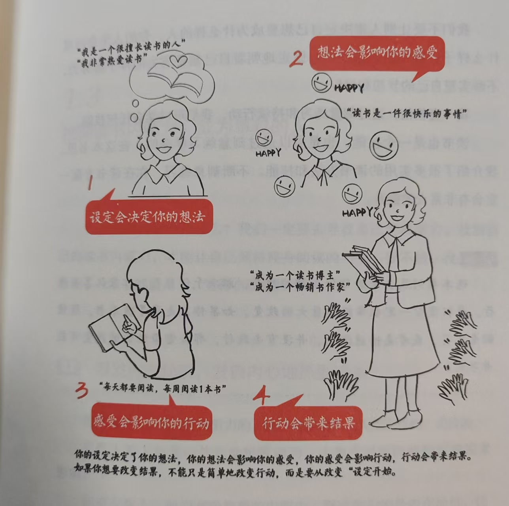
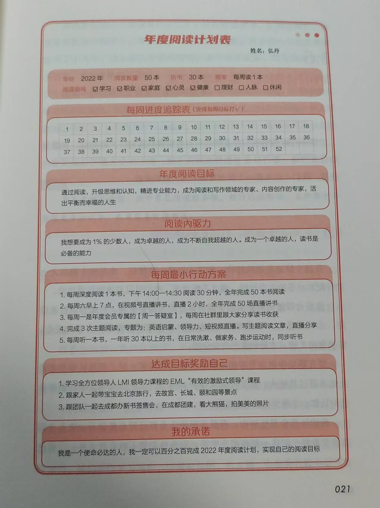

# 如何通过读书让自己变得更好？读《读书变现》第一章 升级读书思维

升级读书思维非常重要，所以作者放在了第一章节。如果没有底层思维上的转变，很难激发行动上的动力，也很难坚持下去。那么，如何通过读书让我们变得更好呢？当我们明白了这些道理，也许就能激发读书的兴趣，进而持续不断地读书。

## 读书是为了改变自己，使自己活得精彩

**读书带来快速改变**，讲了世界上有三种人：

1. 快速改变的人
2. 缓慢改变的人
3. 从不改变的人

我们要成为那种快速改变的人。

在前面读自序中所说：读书的投资回报率很高。作者在这一章节提供了一些具体的数据：

- 博客文章 3 分钟可以获得作者 3 天的工作成果
- 杂志长文 20 分钟获得作者 4 个月的工作成果
- 5 小时阅读一本书，可以获得作者 15 年的工作成果

从数字上来看，这些数据是有道理的。尤其是一本好书，确实可能浓缩了作者 15 年的工作经验。至于博客文章，3 分钟换来 3 天的工作成果也比较符合实际，但还是推荐阅读书籍，因为书籍的系统性和完整性更强。

然而，即使这些理由很吸引人，如果不知道如何读书，或者不知道如何开始，那一切也无从谈起。为此，作者提供了具体的方法：**阅读评估表，衡量阅读情况。**

看到这个表后，我想我大概只能拿个 10 分、20 分吧，毕竟，还没开始读书，怎么可能拿到高分呢？

这个评估表的设计是层层递进的，从阅读目标到阅读方法，再到阅读输出，难度逐渐增加。特别是阅读输出，确实是最难的一部分，一般人应该很难做到。但即便如此，光是看一看这个表，也给了我们不少启发。比如，阅读输出虽难，但如果按这个标准行动，相信肯定能获得更好的读书效果。

## 每个人都拥有读书潜能，只是没有去挖掘

“**相信自己拥有无限的读书潜力**”——这个标题让我产生了思维上的转变，至少不再像以前那样想：“我怎么可能读得进去书呢？”

但如何挖掘自己的读书潜力？如何做出改变呢？

**真正的改变，要从“设定”开始**。作者分享了一个思维模式：设定--&gt; 想法--&gt; 感受--&gt; 行动--&gt; 结果。

这个思维模式非常棒，是一个良性的正向循环。但问题是，如何将它落地实施呢？书中的后续章节为我们提供了一些答案。

## 挖掘读书内驱力，成为卓越的人

**激发内在动机，发自内心地热爱读书。**

原本以为这一章会讲如何管理内驱力，结果更强调了目标的重要性。因为只有明确目标，内驱力才会长期存在，否则驱动力很难维持。

**内驱力的背后，是你想要成为什么样的人。** 这句话一语中的。当我们知道为什么要读书、想成为什么样的人时，目标导向自然会产生更强的驱动。

## 读书行动，制定年度阅读计划

开篇引用了一句名言：**一个人心中如果没有目标，那他就像一艘没有舵的船。**

没错，这句话是对上一小节内驱力的总结，也是本小结的承上启下，接下来开始讲述如何开展读书行动。

**制定年度阅读目标，追踪读书进度**。作者讲**没能坚持阅读的问题不是出在行动力上，而是出在目标上。当你制定了明确的目标，还要去规划达成目标的路径。**

在讲解具体步骤之前，书中提到人生的八大领域：学习成长、职业发展、家庭育儿、身体健康、心灵修养、投资理财、社交人脉、休闲娱乐。

这让我想起了粥老师在《成事的时间管理》中提到的五大领域：工作事业、婚姻家庭、个人财富、生活健康、学习成长。这五大领域被称之为幸福人生的五大支柱，与书中的八大领域相似，但可能五大领域更合适一些，毕竟“休闲娱乐”可能并非每个人生活中的核心部分。

制定年度阅读计划表达具体步骤：

1. 填写年度阅读量
2. 填写年度重点阅读领域
3. 填写年度阅读目标
4. 填写阅读内驱力
5. 规划每周最小行动方案
6. 写下自己的承诺
7. 每周进度追踪

最后，作者也给了一张阅读计划表供参考，简单实用：

这张表格设计得不错，贴在书桌上，能时刻提醒自己。52 个小格子等着我去填写，经常查看进度，真的能督促自己保持行动。

## 读书打造硬技能，实现读书变现

这一部分介绍了不同场景下读书的目的：

1. 职场人士读书，打造职场硬技能
2. 宝妈读书，做孩子的榜样，实现自我价值
3. 内容创人读书，，提升创作能力
4. 读书作为副业，实现读书变现

不同的人群有不同的读书目标，但无一例外，都是在提升自己，让自己更好。想到这些好处，难道我们还有什么理由不读书吗？

以上就是第一章《升级读书思维》的内容，给我带来了思想上的启发，也提供了很多实用的方法。接下来，我们将继续阅读下一节《突破读书误区：如何告别低效率阅读》，敬请期待。

---

> 作者: [RoverTang](https://rovertang.com)  
> URL: https://blog.rovertang.com/posts/grow/20250111-how-to-improve-oneself-through-reading-chapter-1-upgrade-reading-thinking/  

