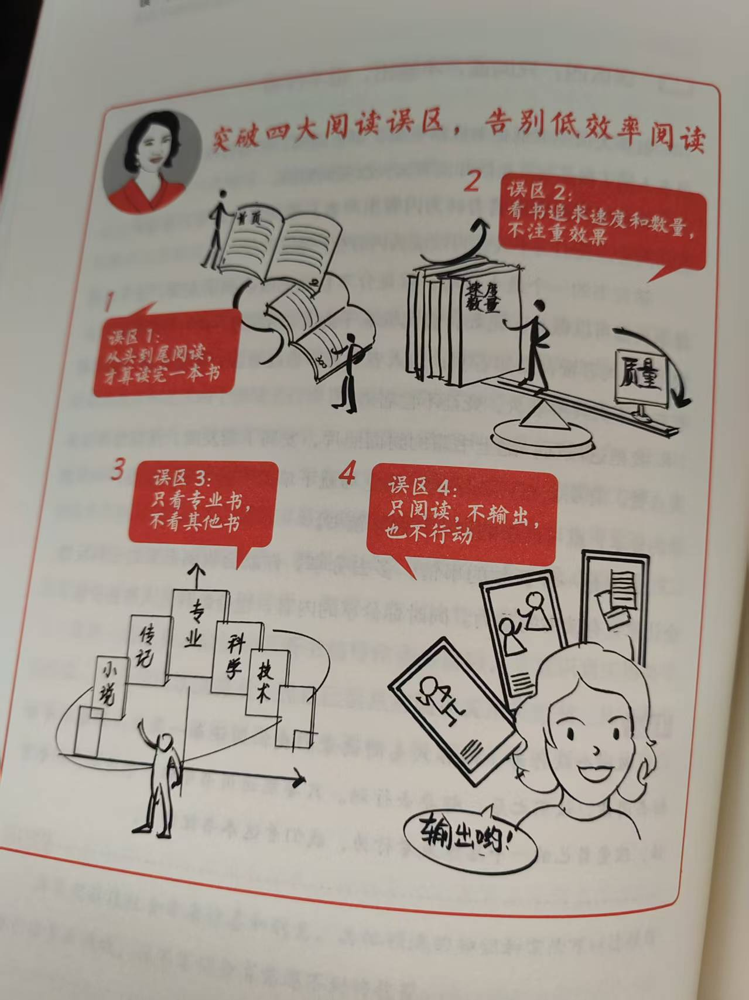
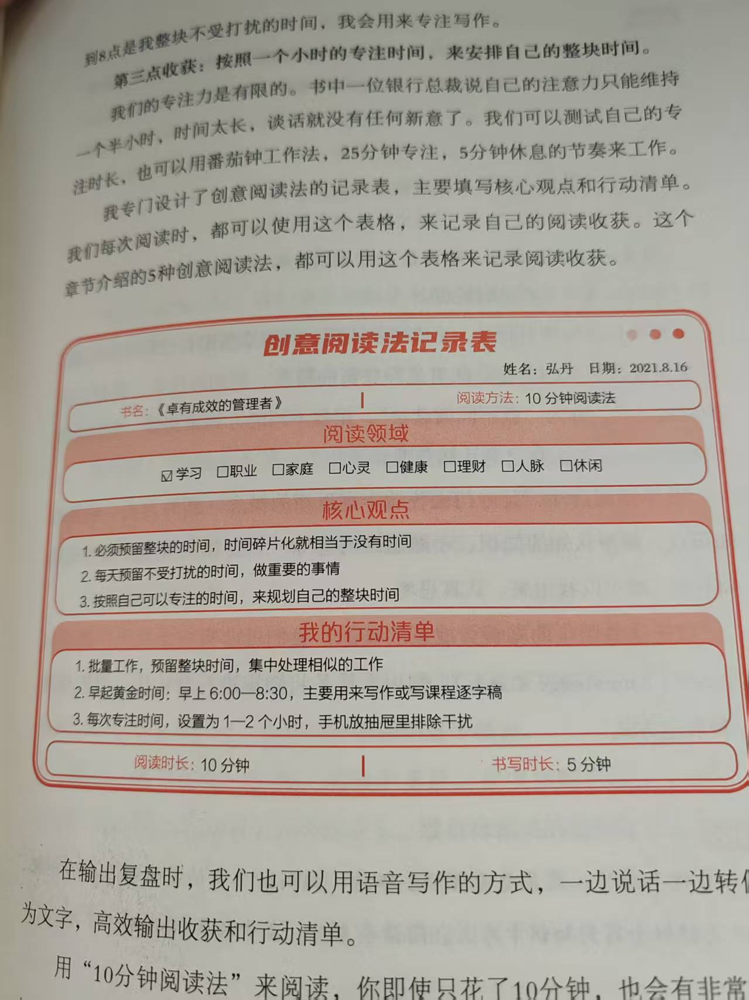
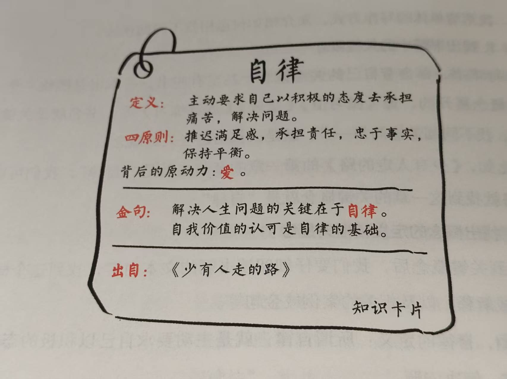
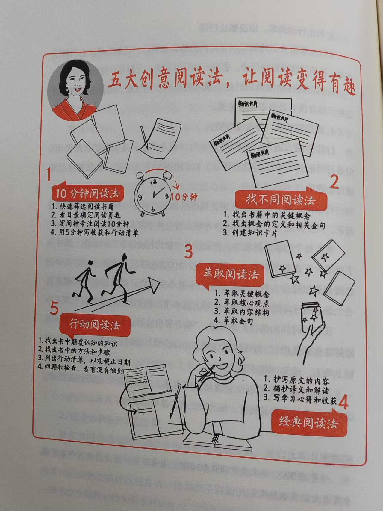
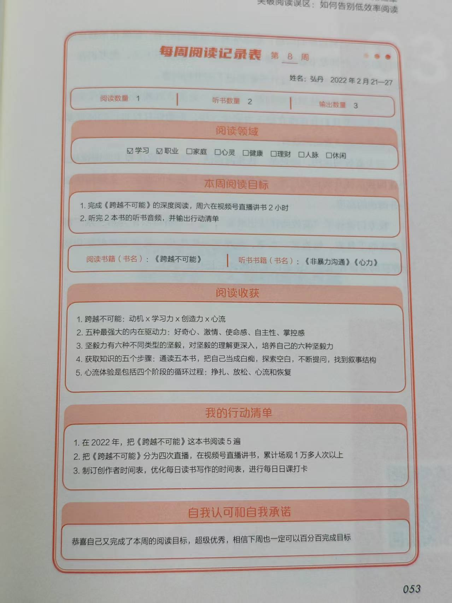

# 《读书变现》第二章：突破阅读误区告别低效阅读

今天我们读《读书变现》的第二章：突破阅读误区，如何告别低效率阅读。

这一章节总共讲了三个部分：阅读误区、创意阅读法、阅读时间。

## 阅读误区：突破四大误区，成为读书达人。

**误区一：从头到尾阅读，才算读完一本书。**

不能仅仅表象的“读”，更需要“用”。不是读完的心态，而是有用的心态，才是真正的阅读。

**误区二：看书追求速度和数量，不注重效果。**

读书不一定要快，读书慢没有关系，重要的是理解，理解后改变自己的思维和行动。

**误区三：只看专业书，不看其他书。**

阅读不仅需要高度和深度，也需要广度。跨界阅读可以提高多维思考能力。

**误区四：只阅读，不输出，也不行动。**

需要从内容消费者转为内容生产者，真正的将书中学到的知识用起来，才能有真正的效果。

## 创意阅读法：五个创意方法，让阅读变得有趣。

### 10 分钟阅读法，轻松开启阅读

10 分钟阅读法的步骤：

1. 快速筛选阅读书籍
2. 看目录确定阅读页数
3. 定闹钟专注阅读 10 分钟
4. 用 5 分钟写收获和行动清单

作者还提供了创意阅读法记录表：

罗孚看完 10 分钟阅读法，挺受启发，特别是 5 分钟的行动，这是我没有想到的，常规的步骤里仅仅是 10 分钟看完书，但如果有 5 分钟的行动，再加上记录表，这样的收获绝对比只读 10 分钟有效的多。

另外，实际生活中，确实浪费了不知道多少个 10 分钟，比如地铁上下班时间、中午休息时刷视频刷新闻的时间、晚上回家后不自觉的拿起手机刷刷公众号甚至知乎的时间等等，这么多不起眼的 10 分钟，真正利用起来，真的有很吓人的效果。比如罗孚有次借了公司的《上瘾式存钱》这书，然后那个礼拜因为天气原因几乎天天坐地铁，也就在这一周内，竟然把这本书看完了，就仅仅利用了上下班坐地铁的时间，这样的体验震撼到了我。

### 找不同阅读法，不断积累知识卡片

用找不同阅读法找书里的新概念、新方法、陌生的知识点、颠覆认知的知识、不熟悉的内容等。

作者给出的具体方法：

1. 找出书籍中的关键概念
2. 找出概念的定义和相关金句
3. 创建知识卡片

还给了一个具体的卡片案例：

知识卡片的方式很有新意，罗孚准备利用起来，准备使用 flomo 而不是纸质的内容，另外格式上也尽量注意，形成一定的规范。知识卡片可以解决我看书过程中忍不住分享的问题，是很不错的方式，是值得尝试并持续输出的方式，拭目以待。

### 萃取阅读法，快速提炼书籍精华内容

萃取核心内容，找到关键概念、核心观点、内容结构、金句等关键信息。

具体的方式：

1. 萃取关键概念
2. 萃取核心观点
3. 萃取内容结构
4. 萃取金句

### 经典阅读法，阅读和背诵经典的作品

经典数据，可以穿越时空，带给我们启迪和智慧。

### 行动阅读法，读完书就去行动和践行。

行动阅读法的运用：

1. 找出书中颠覆认知的知识
2. 找出书中的方法和步骤
3. 列出行动清单，以及截止日期
4. 回顾和检查，看有没有做到

讲完这五大创意方法，很受启发，我现在所整理的文字，应该基本都是萃取阅读法的运用，因为基本都是全书各章节结构性内容的摘录，带有自己思考的输出相对较少。不过这五大方法很实用，10 分钟阅读法有点不一样，知识卡片是很好的方式，萃取阅读也算是精华内容的整理了，而行动阅读法应该最难，读完后能有行动比较难做到。

## 阅读时间：从忙碌生活中，抽出时间阅读

作者提供了几种阅读方式，都是很不错的解决方案。

### 沉浸式阅读，抽出整块时间，专注阅读

书中引用的金句：**如果你觉得学习的成本太高，请试试看无知的代价。** 

沉浸式阅读的整块时间一般可以来自：

1. 早起阅读 30~60 分钟
2. 下班后阅读 30~60 分钟
3. 周末时间，沉浸式阅读 1 个小时以上

同时，也需要为自己创造沉浸式阅读的环境。

有一个公式：**专注力 &gt; 时间 &gt; 金钱** 。对于这个公式，你是否有所启发呢？

### 碎片化时间阅读，随时随地阅读

基本就是和芒格一样抽出各种时间来阅读。常见的碎片时间有：

1. 通勤时间，比如在地铁公交上
2. 等人的时间
3. 睡觉前的时间

### 随时听书，吸收一本书的精华内容

听书可以是看书的前置。一般来说，听书频道的书都是经过精心挑选的好书，听到有兴趣的或者觉得值得深入的，可以再找书来读，为选书环节节省了不少时间。

### 每周阅读记录表，追踪阅读情况

每周阅读记录表一般是这样的：

1. 填写本周阅读数量和书名
2. 填写本周阅读目标
3. 填写阅读收获和输出内容
4. 填写行动清单

提供的样表：

这个表很不错，如果能按此表进行每周记录和复盘，那进步一定是巨大的。

读完第二章，收获不少，阅读方法很实用，而阅读时间的分析和选择也给了我们不少启发，愿把这些内容运用到我们的实践中。

好了，我们继续阅读第三章：打好阅读基础，如何掌握三大高效阅读方法。我们下回见。

---

> 作者: [RoverTang](https://rovertang.com)  
> URL: https://blog.rovertang.com/posts/grow/20250118-breaking-through-reading-misconceptions-and-saying-goodbye-to-inefficient-reading/  

