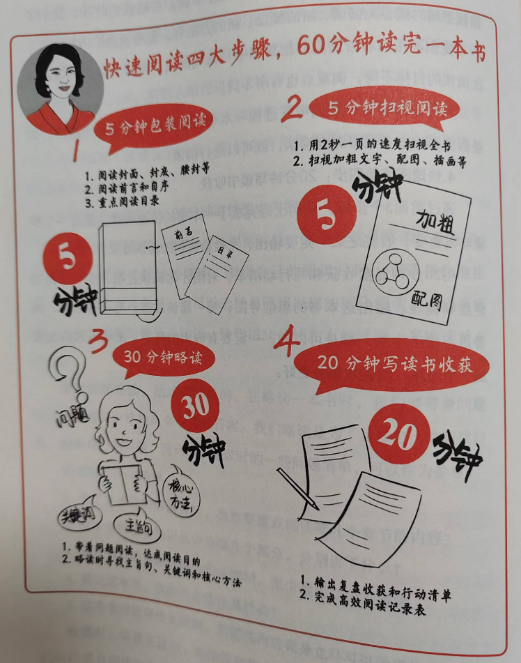
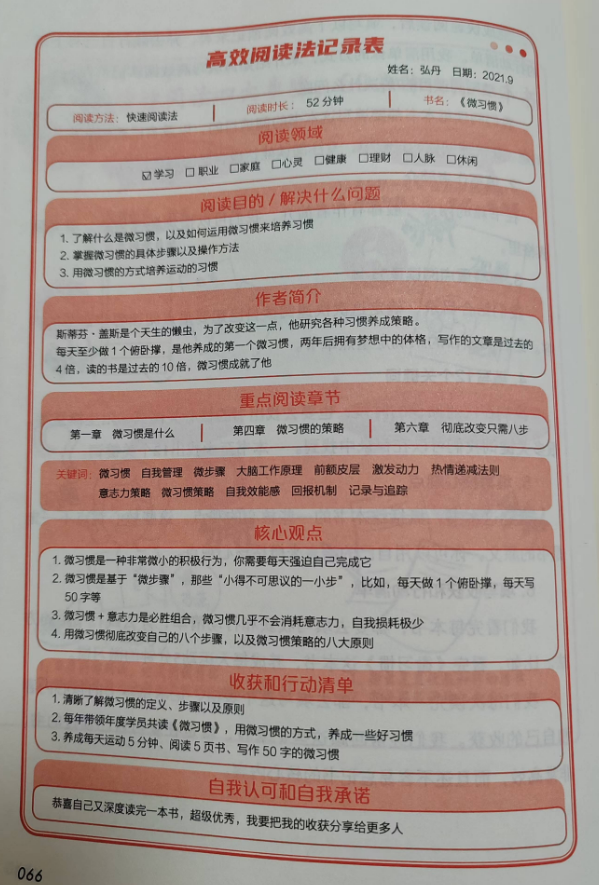
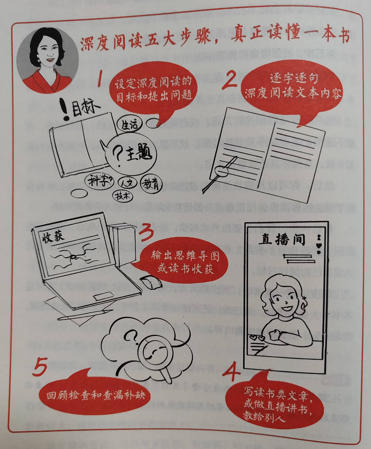
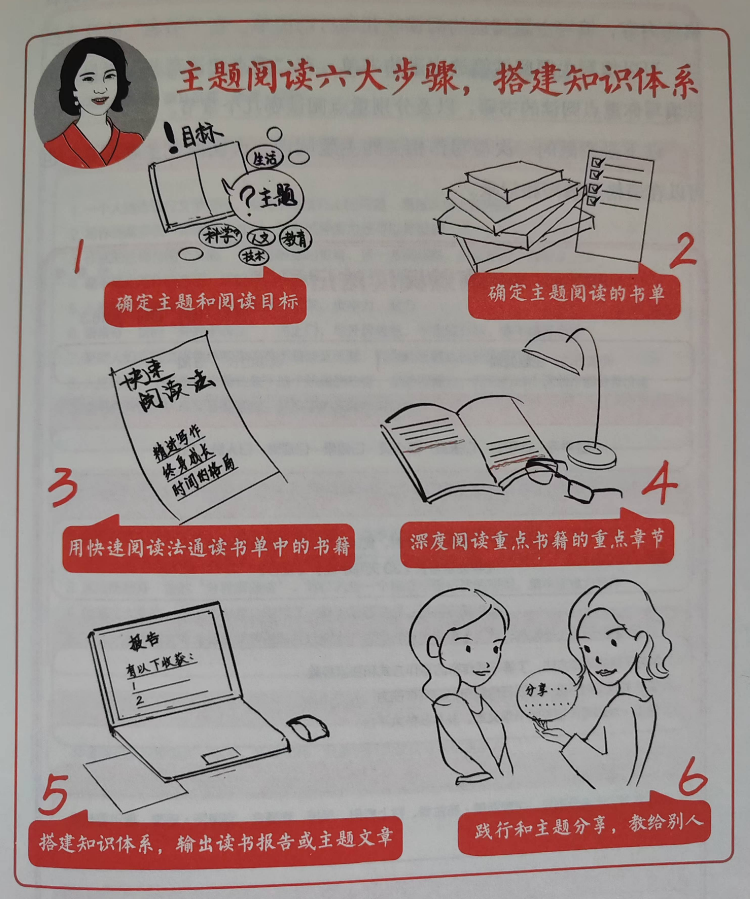

# 《读书变现》第三章：三大高效阅读方法

上一章介绍了误区，这一章开始介绍高效阅读方法，这也是本书中最为重要的环节，也是我阅读本书的最重要目的——如何才能真正的读懂一本书，读完后觉得收效不错，关键看后续实践。

## 快速阅读法：60 分钟读完一本书

快速阅读的目的，是概览全书，快速了解一本书的核心内容，抽离出一本书的骨架，对整本书有宏观上的了解和把握。

### 快速阅读三大优势，快速了解一本书的全貌

快速阅读的三大优势：

1. 通过快速阅读，了解一本书的全貌
2. 通过快速阅读，判断这本书是否值得精读
3. 通过快速阅读，提高阅读速度和效率

快速阅读的四大使用场景：

1. 选书时快速阅读概览全书
2. 快速阅读一些简单和熟悉的书籍
3. 搭配深度阅读和主题阅读
4. 回顾或复习时快速阅读

### 快速阅读四大步骤，用 60 分钟读完一本书

快速阅读的四大步骤：

1. 5 分钟包装阅读法

这一步中重点阅读封面和封底、前言和自序以及目录，重点阅读目录。实际上通过目录可以了解全书的框架。

2. 5 分钟扫视阅读法

快速的翻翻书，但比点钞式翻书要慢，基本每页都要翻过，那两三百页的书基本就要花 5 分钟以上了，这个过程中作者建议我们重点看加粗文字、配图插画等。实际上比如这本书中的很多插画，全部看完的话，基本就能理解整本书的脉络了，比目录框架更详细，比较实用。

3. 30 分钟略读重点内容法

略读是快速的读，但不一定全部都读，可以选择一部分自己有兴趣或有目的的内容读。关键是寻找主旨句、关键词和核心方法等。

4. 20 分钟写读书收获

作者建议复盘和写行动清单，这部分的输出很好的形成了闭环，这也是快速阅读中比较难的部分，预计我是很难做到了。

完成这些以后，作者让我们填写高效阅读记录表：

1. 填写阅读目的和解决的问题
2. 写作者简介
3. 重点阅读章节
4. 12 个关键词
5. 核心观点
6. 收获和行动清单

高效阅读记录表样例：

### 提升阅读速度和理解力，读得又快又好

这一小节主要介绍了三个提升阅读速度的方法：

1. 大量阅读，增加知识储备
2. 刻意练习，提升阅读速度
3. 提升自己的理解力，不同的内容用不同的速度阅读

## 深度阅读法：以教为学，真正读懂一本书

深度阅读是对书籍的细读，真正读懂和读透一本书，把书籍的知识内化为自己的知识。

### 费曼学习法，以教为学，输出倒逼输入

费曼学习法大家都有听过，具体的步骤：

1. 确定学习目标
2. 教学，将一个概念讲给一个完全不懂的人听。
3. 当你遇到疑惑或者问题，查询相关资料，直到真正弄懂。
4. 简化描述，用直白的语言解释概念，让别人更容易理解。

### 深度阅读有五大步骤，让你真正读懂一本书

深度阅读的五个具体步骤：

1. 设定阅读目标和提出问题
2. 逐字逐句深度阅读内容
3. 输出思维导图或读书收获
4. 写读书类文章或者直播讲书、教会他人
5. 回顾检查和查漏补缺

作者让我们读一本书至少要阅读三遍，第一遍快速阅读，第二遍逐字阅读，也就是深度阅读，第三遍快速翻阅，也就是最后一步的查漏补缺。如果按此方式读三遍，真能吃透一本书。

另外作者提到需要批判式阅读，是否赞同作者观点，是否达成阅读目标，都可以回顾思考一下。

### 文本细读五步法，10 倍提升阅读效果

这一部分个人认为同上述深度阅读有一定的冲突，或者说取的标题并不一定正确，实际更多是对阅读后的整理和思考。具体的五步如下：

1. 用思维导图的方式，来梳理文本的逻辑框架
2. 找出这段内容的主旨句
3. 找出新的概念，并且解释这些概念
4. 作者用什么样的案例或者论据来证明观点
5. 作者介绍了一种新的方法，这个方法的详细步骤是什么

## 主题阅读法：按主题阅读，搭建知识体系

主题阅读法，指的是在某一段时间，集中大量阅读某一个领域或主题的书籍，进行深度阅读和比较阅读。

主题阅读分为两类，一类是针对某个主题的阅读，比如 AI 入门，另一类是针对作者的，比如德鲁克的书籍。

### 主题阅读的三大优势，从小白到专家

主题阅读的三大优势：

1. 快速入门某个领域
2. 搭建知识体系
3. 自学，从小白进化到专家

### 主题阅读六大步骤，搭建知识体系

具体的六大步骤：

1. 确定主题和阅读目标
2. 确定主题阅读的书单
3. 用快速阅读法，通读书单中的书籍
4. 深度阅读重点书籍的重点章节
5. 搭建知识体系，输出读书报告或主题文章
6. 践行和主题分享，教会别人

在主题阅读书单选择方面，作者也给出了一些建议，挑选 5 本书籍进行通读。

第一本是最流行的最畅销的书。第二本是最受欢迎，但更专业，相关性更强的书。第三本是半技术性的读物。第四本是真正深奥的专业书。第五本是关于未来发展方向的书。

### 如何筛选好书，以及选书标准

这里作者给了三个原则：

1. 豆瓣评分 7 分以上的书
2. 经典的、多次再版、名著等有影响力的书籍
3. 畅销书榜单的书籍

上述原则至少是很好的借鉴。

另外作者也引用了樊登老师《读懂一本书》中的 TIPS 选择标准原则：

T=Tool 是工具，I=Ideas 是新的理念，P=Practicability 是实用性，S=Scientificity 是科学性。

好了，第三章节已经读完，也提供了非常好的方法，重点就是真正的实践了。

后面 4、5、6、7 四个章节都是讲真正读书变现的，分别是写读书文章、写听书稿、直播、做读书社群，我们继续阅读，下回见。

---

> 作者: [RoverTang](https://rovertang.com)  
> URL: https://blog.rovertang.com/posts/grow/20250125-chapter-3-three-efficient-reading-methods/  

