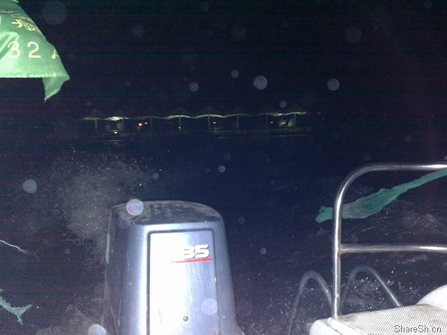
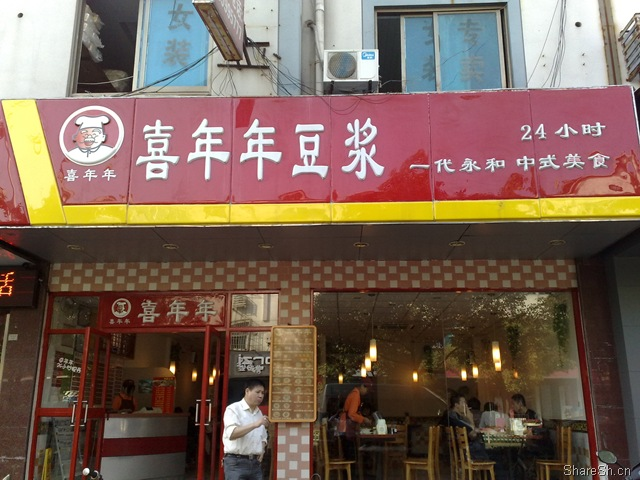
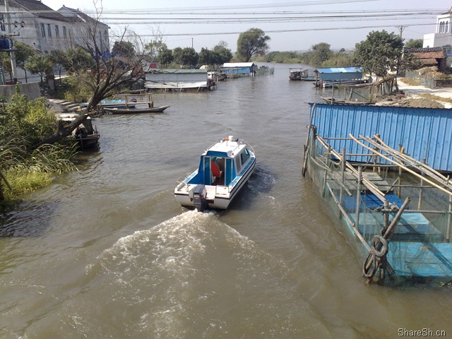
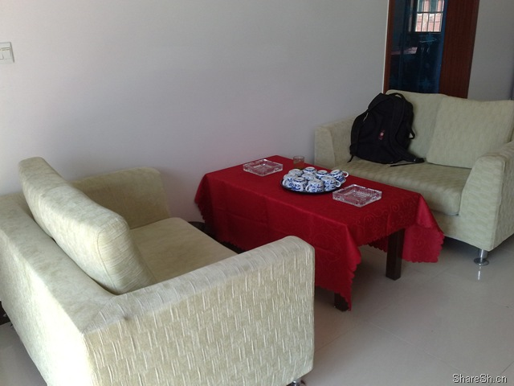

# 阳澄湖吃蟹一日游攻略

又到了一年一度的吃蟹季节，虽然说在上海也能买到所谓的阳澄湖大闸蟹，不过去阳澄湖吃蟹应该是另一番风味。根据我们一伙人一天一夜的经历，特分享这一路阳澄湖吃蟹经历，总结出一份吃蟹攻略，希望对大家有所帮助。

## 岛上蟹庄晚宴

在去之前我们就在网上联系了一家叫岛上蟹庄的饭店，下午我们就直奔阳澄湖去啦，虽然说阳澄湖离上海很近，但还是需要考虑到堵车因素，所以我们到那的时候天已经全黑了，月牙也已经出来了。

去岛上蟹庄的饭店吃饭，停车是在莲花岛码头，在莲花岛码头会有饭店的游艇载我们过去。

经验分享：在任我游GPS中通过经纬度功能输入经纬度坐标N31.44989 E120.77565导航，即可直达莲花岛码头停车场。

到了莲花岛码头都已经是乌漆麻黑了，本来还想远眺一下阳澄湖，看来只能看看这夜色下的湖面以及对岸的灯光了。

岛上吃蟹的饭店基本上每家每户都有游艇，甚至有两三艘也不为奇，这就是载我们过去的游艇。

我们一行十人，加上老板一人，这个艇上就载了11人，挺恐怖的吧，人坐两侧重量不均匀的话还会让艇倾斜。不过这个并不算太恐怖，恐怖的是接下来，我们就坐这个游艇横渡阳澄湖去饭店吃饭啦，在这黑咕隆咚的夜里，水面上不远处还有好多游艇飞驰，游艇上最多开个大灯或者闪灯，甚至也有不开灯的艇，心想妈妈呀这黑乎乎的夜里都没有一个交警叔叔来管管这些来来往往的船只的呢。第一次坐这样的小艇，又是夜色之下，后面是轰隆隆的马达，船速虽然30公里都不到，但看到船尾飞溅的浪花，水平面就离我们那么近，只能说刺激啊，而小艇在拐弯的时候或者遇到浪头跳跃的时候，我们大家就一起哇哇哇的叫，那个真叫刺激那。

很快，我们就到了这个叫岛上蟹庄的饭店，这里的饭店很多，如果白天来的话应该在停车场有好几家可选，而这里的饭店特色就是，吃饭都在水面上，因为房子就是建在了水里，下面是用打桩的方式建起来的，同事还说已经感觉到房子在晃荡了，不过我的小脑没那么灵敏没有那种感觉。房子基本上都是用木头做的，地板还是墙都是，同事说要是是铁做的话不早就锈掉了吗，OK算你能想象。饭店能够摆下好几桌，不过许多都在里面，外面基本上没有，我觉得蛮可惜的，试想要是在一个月圆的夜里，一桌人围在一起，吃着蟹喝着黄酒吹着阳澄湖的凉风赏着湖面上的圆月，谈笑风生，那应该是一件多么惬意的事情那。

由于大家都饿了，所以上来就是狼吞虎咽，都说好吃啊好吃，而黄酒正好开胃，一起来看看饭菜吧。

一眨眼的功夫凉菜基本上都上了

咸鸭蛋

河里的虾就是河虾啦

家鸭，美味啊

饿死了，这么大一碗面条竟然还不够，我们总共叫了两碗。

这个我叫不上来，反正不是扁豆

半尾鱼

芹菜肉丝香干

鱼，感觉好大

鸡汤，自家老母鸡制作，味道肯定不错

黄鳝，也算是很不错的水产了吧

我们的主角来了，每人一对，雌雄配，看上去好大好大啊，大概也就是三四两的标准。第一圈的时候，大家都抢了一只蟹，好吃啊，到第一个解决完，结果说有点撑了，有些甚至第二个都没有吃下，看来不要太贪哦，一个尝鲜两个足够，如果你有大肚皮好胃口那就三个四个的上吧。

顺便说一下，雌雄的区分就是看蟹的肚皮，如果是圆的就是雌的，三角的就是雄的，一般公的肯定比母的分量足。

经验分享：这顿饭是150的套餐，按照人头来计算的，岛上的价格基本上都是如此，老板还说这对蟹就要90块，总的看下来有几个菜确实不错，难得一吃的家鸡家鸭黄鳝等都有了，而且享受了夜游阳澄湖，老板说如果人少的话来回的船费还要收80块呢。不过最后要了我们200块的黄酒钱觉得不爽，不过也忘了要了几瓶石库门了，看来还是自己带黄酒比较划算。

酒足饭饱后一行人准备撤离，还是老板用小艇送我们回去，再次夜渡阳澄湖。

## 永乐大酒店住宿

酒店我们没有定，直接让老板帮忙找了一个，130的标间，觉得价格可以就去了。用导航仪一查好近，就在停车场附近，结果进去一问，原来这家有三个连锁店，停车场这一家叫永乐度假酒店，而我们定的那一家是在渭塘镇上的，看了一下，直线距离就12公里多，中间又是阳澄西湖隔断，所以开车的路远远不止12公里。建议先找好一家离岛比较近的酒店，住宿比较方便。

永乐大酒店看上去还是可以的，可惜大概不怎么懂经营，进入房间后我们就不是很满意，因为桌子上灰层很多，至少是看上去就有许多灰层，苏州这个地方不至于有沙尘暴那，打扫也不是很好，而设备也有不好的，比如右床灯坏了，也没有一个大的吊顶的亮灯，不过就这个价格过个夜，还是能够接受的，毕竟吧台上显示的价格是188呢。

小插曲：喜年年豆浆

大家都听说过喜年来豆浆，没有听说过喜年年豆浆吧，不过我们在这个镇上还真的吃上了喜年年的豆浆，简直和喜年来完全一样啊，这应该是侵权的吧。我们的早饭就在这里解决的。

天豆浆两块

油条两块，好大，一个人一根足以饱了

要了个煎蛋补充补充，一块五

## 莲花岛上漫步

由于昨夜横渡阳澄湖吃饭，所以今天准备从地面登录莲花岛吃中饭。但莲花岛上是没有路的，从南到北大概至少五公里以上，昨天从水路登录的是莲花岛的南侧靠阳澄湖中心的一段，今天看来只能从莲花岛北和陆地接壤的地方登录了，如果走绕城高速，那么从阳澄湖北收费站出来右拐就可以。导航仪上已经是没有这个路的名字了，从路基上的标牌来看是X301，而进莲花岛的一段小路地图上也是没有的。

经验分享： 在任我游GPS中通过经纬度功能输入经纬度坐标N31.49229 E120.81662导航，即可到达进莲花岛的路口，由于是双黄线的缘故，如果从阳澄湖北收费站出来后可能会让你需要往前走很远进行掉头，但其实直行到第一个路口的时候就可以拐弯了，这个坐标位置就是进莲花岛的路口，沿着这条新的细小的马路开车到底，也就是864公交车的终点站，这边停车后就只能徒步进村了。

免费的停车场，还能看到864公交站的站牌，还有治安警亭。

这个就是进村的入口了，看看吧，肯定开车开不进吧，除非你开电瓶车。

没走几步我们就碰到一个卖家鸡的，大家都凑过去问了，不过最后老板娘问我们定了吃饭的地了没有，我们说没有，她就直接领我们去她家吃饭了。

接下来就是在岛上惬意的漫步了，就是在乡下的水泥路上走走，路的一侧是房屋，基本上家家都是农家乐了，而另一侧就是小河，有点水乡的感觉，挺不错，难得到乡下来呼吸一下新鲜空气嘛，感受一下原生态。

## 博物馆一小时游

由于离吃饭尚早，我们虽然岛上漫步了一圈，体验了水乡的乐趣，但还是不过瘾，一定要再次去阳澄湖游玩，最后就让老板娘叫了一个游艇，拉着老板娘做我们的向导带我们去所谓的博物馆游玩了。

我们乘坐的游艇，和昨天的不太一样，后半仓都是外露的，这个的好处就是更多的人能够亲近水面，看到的更多的风景。

出发罗，这里家家户户都靠小河，基本上都有船。

对岸

穿过一个桥

碰到一个手划船，大爷大妈在划船，我们放慢了速度，以免水的波澜太大而让人家翻船。

水面的感觉真好

从小河道穿出来到阳澄湖水面后，我们就可以开始飙船了，开足马力30公里/小时，虽然没有汽车的速度快，但在水面上这样的速度体验完全是另一种感受，能够和水面亲近，能够看飙船的浪花飞溅，更能享受船拐弯时失重感觉像要侧翻了的激动，完全是地面所无法获得的感受啊。

路过我们昨天晚上吃蟹的地方，许多岛上饭店吧。

上岸了，回看阳澄湖，好宽广的湖面。

一艘好大好大的游艇竟然也能在这里上岸，挺让人诧异啊。我们看了一下从这船里乌央央的出来一批人，大概要有好几十号人，这样的大船在阳澄湖上总共三艘，看来难得一见啊。

好大一片荷花塘啊，可惜没有荷花

水乡情

去踏水车罗。这个踏水车可不是一个简单的体力活，更是一个复杂的技术活，因为大家上去踏没有几个能够踏的好的，步伐都不协调，没有一两下就倒下了，而等你找到感觉可以多踏几下的时候，发现已经累的半死了，看来以前的农民伯伯们真是辛苦啊。踏水车要讲究规律和协调，首先人需要趴在杠子上面，不要用手扶，我第一次用手扶不仅仅踏的不容易，更是样子难看，因为你用手扶着然后屁股撅着，样子实在不敢恭维。而趴着呢就就比较的省力了，因为重心都趴在那了，而脚只要踩踩而不需要太多考虑重心问题，当然踏的时候速度也要慢一点，因为太快不仅仅累而且很容易协调不过来而踩空。OK我的技术讲解就到这里吧。

从小桥过去，竟然看到羊养在了本该人乘凉的亭子里，羊妈妈你的福气可算是不小啊。而另一侧是近水楼台先养鹅，鹅鹅鹅曲向向天歌，我还是不打搅你们了。然后我们就踩着这一粒粒的羊粪过去了。

还有一个小船，这可确实算是古迹了，不知道是三十年代还是四十年代遗留下来的，如果今天让我开这个小船去阳澄湖捉鱼抓蟹，我还真不敢那。

终于到博物馆了，看了招牌可真雷人，就博物馆三个字，也不说啥主题，叫农家乐博物馆也好嘛。博物馆非常小，就是一间小屋子，展示了些啥，大家一起来看看吧。虽然有些东西我小的时候也用过，但还是有不少我所没有碰到过的，像草鞋我就没有穿过，而门口的磨我也是没有用过的。

经验分享：博物馆游玩的时间其实比较短，一个小时左右。许多农家乐都是自有游艇的，可以要求出去玩，不过我们这一家比较特殊，没有船，我们也比较特殊，因为只散着点了一些饭菜，所以游艇是另让老板娘找的，一去一回总共200元，十人分摊也就二十元，从整个过程来看，这200元花的值。博物馆一段虽然还没有完全开发好，也没有很好玩的内容，但在这小水乡聊聊天散散步也是一种惬意的享受了。

## 莲花阁蟹府中餐

虽然名片上写的是蟹府不过门头上写的是蟹庄，不过没有关系，总的来说取的名字还是挺不错的。这家店其实进去后也没有多远，走个十分钟就到了，而这周围也是非常多的农家乐，我们算是碰巧在路口被老板娘守株待兔了，不过对这个农家院的感觉还是挺不错的，甚至比昨天的晚宴那家要好。

岛上虽然说是农家院，但其实就是自己家的房子拿出来做餐馆，村子里基本上每家每户都是楼房，而且苏州是个发达城市，这边又靠阳澄湖赚大钱，所以每家的房子都比较好，而我们这一家感觉特别干净，可能也是和南方这样的城市有关吧，算是主妇居家打理的好吧。这一家大概是两层楼，据说忙活的时候楼上楼下都摆上饭桌了，我们去的时候人不多，楼下大厅有两桌，而另外的两个屋子各一桌，我们就算是进了包间了。进门后坐着沙发，也挺舒服，总体来说就是干净清爽，而农家风味也比较足，呆惯了大城市的人肯定觉得这样的地方生活也许也很不错嘛。

我们还去他们的屋子里看蟹去了，那个多和大啊，看的不留口水的话也有想去抓一把的冲动了吧，不过我还是怕被蟹的大钳子抓住，所以我还是忍住了。

OK又到了丰富的中饭的时候了，看在昨天一人两个蟹又没过24小时的份上，我们最终决定一人一个蟹就足够了，昨天实在是还没有消化完，所以我们单点了一些菜，而蟹呢老板娘是说80块钱一对，觉得比昨天的便宜了一些，所以我们就要了五对，而菜价总共在600元左右，细算下来要比昨天更值，好了一起来看看我们的美食吧。

红烧肉，他说他们家做的红烧肉不错的。

河虾的量实在是有点太少了，给我们38的价有点不值，而且味道也没有做好。

鱼是给我们的特价30，这是非常值的，比昨天的鱼要大多了，而且做的味道也是非常不错。一圈下来我就只能拍一个碎了的鱼了。

而鸡汤更是鲜美啊，不愧为农家老母鸡啊，就是烧的有点咸了，不过味道确实鲜，忘了拍所以就只能拍个残羹了，一只整鸡放了一大碗，我们要求余下的汤放另一大碗，最有营养价值的还是在汤里嘛。鸡汤是60块，不过看了我们买的鸡也要50块，觉得还是值的，毕竟还要帮我们加工的嘛。

又轮到我们的主角上场了，这一次我拍了个全的，还来了两张特写。看了以后是不是也想咬一口啊。

经验分享：经过两顿的比较，单点其实比套餐划算，一是自己可以找一些想吃的，另外呢也可以自己算一下，当然甚至还能和老板砍价，比如蟹其实可以和老板谈价嘛，80我不满意可以要求50嘛，至于是否能砍下来还是看各自的本事了。这顿饭630块比起昨天的确实物有所值，就是量少了一些，而味道也确实不错。

完事后基本上是一点多了，再去买点蟹基本上是可以回上海了。

小插曲：我们还在这个农家乐帮忙买了六只鸡，五十块钱一只，现杀了四只，另外两只活的带回来了，分量大概是在三斤多一只吧。

## 在路上买蟹

既然来了阳澄湖，总归要带一些阳澄湖的大闸蟹回去吧，不过谁知道到底是不是阳澄湖的大闸蟹呢。买蟹的途径有很多，比如你可以在饭店或者农家院直接购买，当然你也可以在马路边购买，在阳澄湖北收费站下来一路上有很多卖蟹的小商贩。而蟹更是分成三两的四两的甚至半斤的好几种。在农家院和饭店购买蟹还是比较贵的，价格不愿意降下来，不知道为什么。最后我们决定还是在路边买蟹好了，因为十块钱一只三四两左右，至于真假阳澄湖大闸蟹谁说的清楚的，味道差不多就行。饭店或者农家院的蟹在那吃就要卖到八九十一对，那么即使买的话也至少要五十一对吧，而在路边买就比较好玩了，十块钱左右一只，如果量大的话应该还能便宜，我们一行人买了86只，疯狂吧，而最终的价格也就是七块五一只，够便宜吧，还三四两呢，所以我们很知足了。

从路基上来看，这是在X301道路上。

马路两侧都是车，当然小商贩也很多，可以见得这是多么繁荣的一块经济那。

路边都是卖蟹的，随便看看吧，感觉也挺大的蟹嘛。

最终买回来的蟹，还顺便买了一块钱的萝卜。

经验分享：如果需要送礼需要买半斤的蟹，那可以在农家院或者饭店看，当然价钱也非常贵，半斤的基本上要在50以上一只，而饭店和农家院吃饭其实只是一部分的收益，另外的收益当然是卖蟹啦，也是相当的可观那。如果只是自家随便吃吃，那就路边随便买一点吧，价格便宜，分量也不会太少，反正在阳澄湖卖蟹都是按只而不是按斤来的，这是一个不小的差异。推荐在经纬度为N31.49330 E120.81536的一带买蟹，这边有一个桥，下面就是小商贩自家的船，一般大一点的商贩应该都有吧，这边都差不多成了卖蟹聚集地了，买的多的话都可以到他船上去捆蟹。另外关于蟹的包装盒，不管在饭店农家院还是在路边摊买，都可以问他们要的。

下午的阳光照在阳澄湖上，泛起一串串金色的光，不远处还有汽艇开来，激起一轮波澜，看着这宽广的阳澄湖，心情无比舒畅，不过，我们现在就要回家了，好吧，我们回家吧。

## 经验总结

纵观整个游玩经历，我们得出两条吃蟹路线，线路一：从莲花岛码头横渡阳澄湖，去水上饭庄吃蟹，另一条路线：从地面进村找个农家乐吃蟹，然后从村里的河沟沟乘汽艇游玩阳澄湖并参观博物馆。两条线路各有情趣，看你选择，个人认为线路二更加有意思一些，经济成本也低一些，而至于吃饭，各有优势，水上饭庄能够嘹望宽广的阳澄湖，而农家乐的饭菜也很不错。具体路线图和重要点位如下：

文末，感谢任我游GPS的一路支持，同时也希望这篇游记攻略能够给你带来帮助。谢谢

本文飞书文档：[阳澄湖吃蟹一日游攻略](https://rovertang.feishu.cn/docs/doccnBYnzsYD33A2mUhwhNiMSle) 

---

> 作者: [RoverTang](https://rovertang.com)  
> URL: http://localhost:1313/posts/life/20091026-yangcheng-lake-crab-eating-one-day-tour-introduction/  

