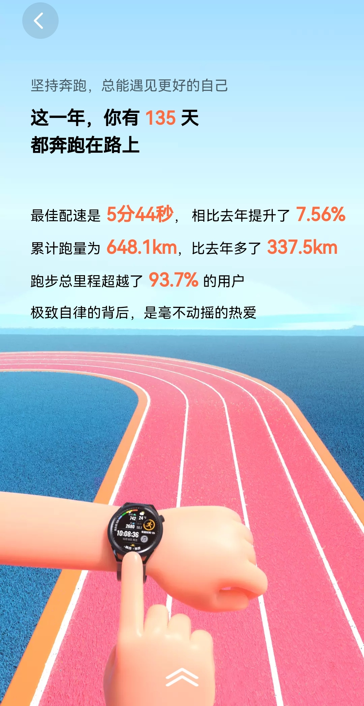
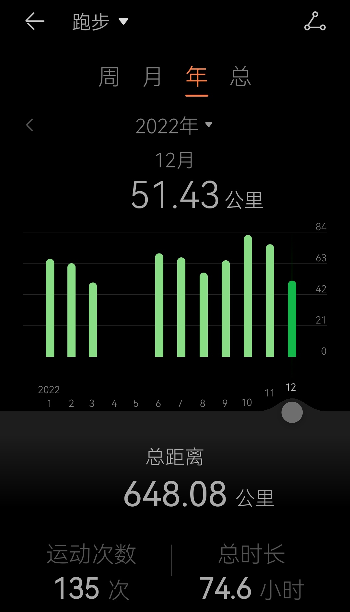
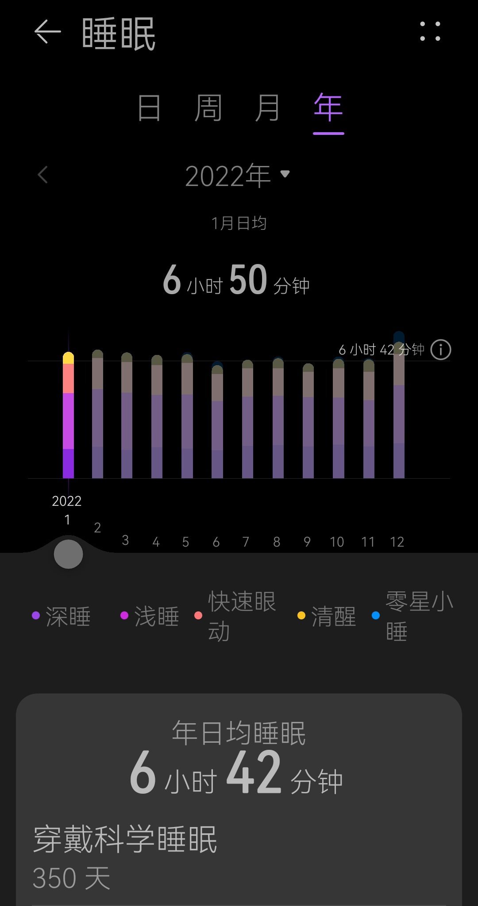

# 2022年跑了650公里有感

2022 年的最后一天，运动健康 APP 的 2022 年度报告也已经出炉，我最关注的跑步里程数据，也已正式收官，还不错，跑了近 650 公里，也顺利达成了目标，有点没有想到，在此借机会，想发表一些感想。

## 坚持实际也没有那么难

说实话，我不是一个能坚持的人，对自己没有毅力这件事情耿耿于怀几十年未解。

三年多前开始尝试跑步，都没有跑到 500 米，就大口喘气，根本没法跑下去，跑步几百米感觉要了自己老命了。当然，那时候，应该还有一个怀孕 6 个月的肚子。

真正开始跑步，是 2021 年，而养成规律跑步，是 2022 年，也就是这 650 公里算是规律跑步的元年，希望以后能够常年规律跑步。

2021 年的跑步，虽然也有 310 公里，但应该比较拉胯，跑的很不规律，甚至刚开始还受伤了几个月，或者说一度不想再跑步了，在 2021 年的 11 月和 12 月，差不多才开始有点规律跑步，然后就坚持到了现在。

这一年的跑步量，总体来说比较平稳，除了上海四月、五月疫情，以及 12 月底众所周知的原因，确实没法跑外，其他时间都比较规律，特别是越往后，每次基本都跑 5 公里，一天隔一天的跑，间隔再长也不会超过 3 天。

当回看这些柱状条，才感慨：原来，坚持实际也没那么难。

我也很难说为什么就能坚持下来了，就这么不知不觉，甚至说不出理由，不是热爱，仅仅是自己的规律罢了。亦或：认识到了健康的身体才是革命的本钱。

## 关键需要找到自己可掌控的时间点

虽然说不明白为什么能坚持，但能做到坚持，是有关键因素的，这个原因就是：找到自己可掌控的时间点。

是的，跑步需要时间，5 公里跑完是半个多小时，加上前面热身后面拉伸，以及准备、回家后洗澡等，甚至有些时候不是下楼就跑，而是骑车到黄浦江边跑，跑一次的花费不小于 1 小时，甚至近 1.5 小时。

所以，如果自己认为拿不出这一到一个半小时，那真的没法坚持跑步，因为我们的基础就不存在了。

实际上，我也没有那么多的时间，甚至没有大块完整的时间，但只要你想，实际上总会有办法的。

我一般是工作日早上跑，周末傍晚或晚上跑。早上只要做到六点前起床，就能完成一次跑步。而周五的晚上或者周日的傍晚，也是跑步的好时机。平时的晚上是因为吃饭晚，确实是没有办法跑步的。

如果你想开始跑步了，那么，你有为跑步准备好了大块可掌控的时间吗？这一点很关键哦。

## 规律生活让生活更规律

正是因为上面说的，需要有自己可掌控的时间，所以，我们不得不规律生活，比如早晨 5 点半起床，那前一天晚上就必须 10 点睡觉，不然第二天早上早起就只是一个梦想。

然后，看了一下睡眠统计，我竟然戴手环睡了 350 天，没觉得戴了一年，但统计数据没有骗我。

年度的睡眠分是 78 分，平均睡眠时长 6 小时 42 分，呼吸质量 93 分。2022 年总共有 264 天是 12 点前入睡的，而 9 月 27 日只睡了 3.5 小时。

78 分的睡眠分不算高，平均睡眠时长都没到 7 小时，而且还有 1/4 的日子竟然没有 12 点睡觉，虽然数据上来看，我也没有特别规律的生活，但应该比 2021 年要强的，2023 年继续提高呗。

这一年大部分情况下早睡并且早起，这个挺满意的，由于跑步也不是每天都跑，所以间隔的那一天就可以用来做点别的事情，比如最近半年学习理财，也基本是在早上完成的吧。

规律生活让生活更规律，这是一件挺美好的事情。

## 结语

2022 已去，2023 已来，这里的感悟仅仅是罗孚的絮叨，也没准备在此立什么 flag，只是相信 2023 应该会继续跑下去，并且跑的比 2022 更远，因为我喜欢上了健康而有规律的生活。

2023，继续加油了！

本文飞书文档：[2022 年跑了 650 公里有感](https://rovertang.feishu.cn/docx/ULqGd2HEWoL0rtx7fNgcnwDdnHc) 

---

> 作者: [RoverTang](https://rovertang.com)  
> URL: https://blog.rovertang.com/posts/life/20221231-running-650km-in-2022/  

