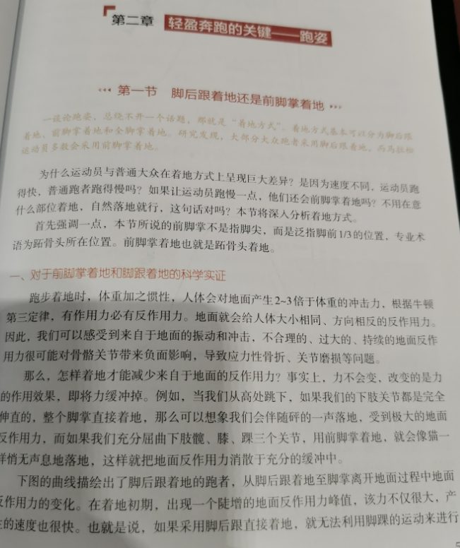
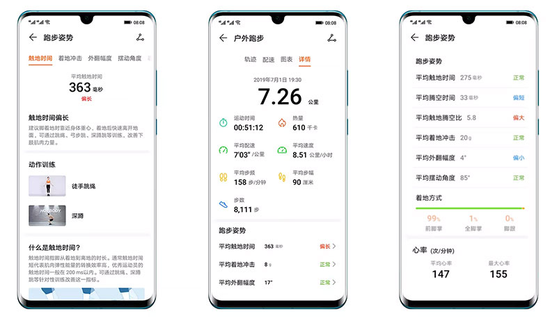
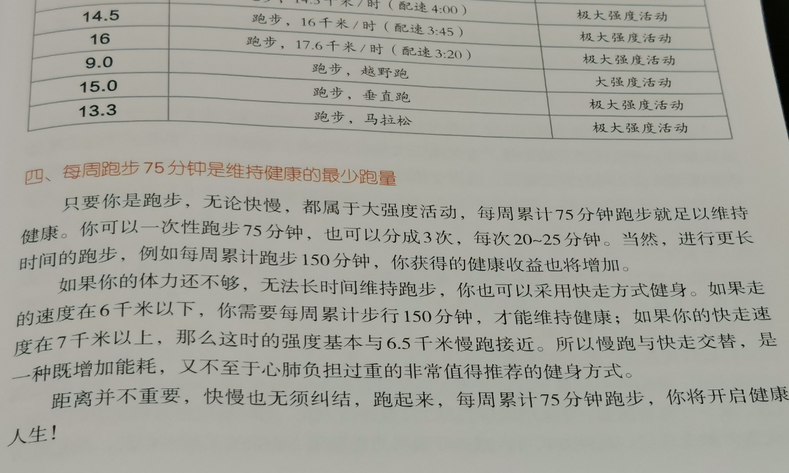

# 小白坚持跑步不受伤的三个关键要素

我是理财小白、跑步小白罗孚，今天谈谈个人认为能够坚持跑并且不受伤的三个关键要素，这三个关键要素不是高大上的装备选择，也不是难以坚持的技术方法，而是最基本也是小白跑友最容易忽视的重要因素，虽然简单，但确实是罗孚[[20221231]2022 年跑了 650 公里有感](https://rovertang.feishu.cn/docx/ULqGd2HEWoL0rtx7fNgcnwDdnHc) 后获得的真实感悟吧。

## 坚持用前脚掌跑步

2021 年刚开始跑步的时候，没有什么方法的乱跑，就是想跑。结果，没过一两个月，就受伤了，去中山医院一看，诊断为鹅足肌腱炎，疼痛会由膝盖传导到大腿小腿甚至到了屁股，据说牵扯了好几根经络。医生给开了两三百块的膏贴，回家贴了一个月，差不多好了，但吓得不敢再跑步了，后面好几个月没怎么跑步。

后来也尝试了一些方法，比如买了护膝，甚至还买了髌骨带，心想，保护一下膝盖总该可以了吧。虽然保护确实有作用，保护后也没再受伤，但直到读到一篇知乎文字，大意就是，膝盖实际上没那么脆弱，如果你过分的保护，可能反而害了它，一旦不再保护，可能就很容易受伤。好吧，我信了，我也不愿意一直用麻烦的护膝，再后来就没再用过护膝。

后来也有跑步大神甩给我一份 47 页的 Word 文档《膝盖常见问题汇总及解决方法》，不过看完后感觉没啥用，膝盖好了没再出问题，自然觉得这指导意见没实质性用途。

直到有一天搜索了一个问题“跑步到底是前脚掌落地好，还是后脚跟落地好？”，虽然问题本身没有说前脚掌跑步一定好，但自我感觉会比较好，因为我的脑袋瓜比较简单，就是认为：脚后跟着地，直接冲击了小腿骨，然后整根骨头冲击了膝盖，膝盖不舒服就很自然了。但若前脚掌跑步，那我前脚掌落地为全脚掌甚至脚后跟的时候，是有一个过程的，这个过程就是很好的缓冲，就降低了小腿骨直接受力冲击膝盖的概率，而且如果步频够快，甚至脚后跟没落地，就因为身体的重心发生了变化，脚就已经再次离地开跑了。这么一思索，个人觉得前脚掌着地是科学的。

使用前脚掌着地的跑步方法已有一年多，当初的问题也已经忘了搜索的结果，但昨天在图书馆简单翻阅了一本名为《无伤跑法》的书，这本书给了我前脚掌跑步的答案。书中使用运动相机，对专业运动员，在 6 分配速、5 分配速、4 分配速、3 分 30 秒配速情况下脚着地情况进行分析，大意结论是在 6 分配速、5 分配速下，基本是全脚掌着地的，而在 4 分配速、3 分 30 秒配速情况下，基本是前脚掌着地的，而且着地基本都以脚的外侧着地为优先。各位有兴趣的朋友可以翻看一下这本书，书中还有很多有用的结论值得学习。

虽然用前脚掌跑步的结论有了，但做出改变，是艰难的，毕竟大家习惯了自己的跑步姿势，一下子改变是不易的，甚至据说专业的运动员改变跑姿也用了一年半。

不过，使用专业的跑姿监测设备可以方便地帮助我们做出改变，一年多前，买了华为手环 4e，当然，现在有更先进的 HUAWEI S-TAG 设备。这些设备就是绑在鞋带上，然后就出去跑吧，跑完以后就可以看到你的数据了。

首先可以看到着地方式的比例，前脚掌、全脚掌、脚跟三个部位，每次可以检查前脚掌着地的占比，能达到 90% 以上就不错。其次其他数据也可以看看，比如触地时间、腾空时间、触地腾空比等，感觉这些数据的改变更难一些，不仅仅是姿势，更是需要改变步频步幅等。总的来说，有了这些数据的支撑，就容易掌握自身是否切换到前脚掌着地跑步的模式了。

改变是比较困难的，刚开始的时候会非常的不适应，但坚持一下，多跑几次，慢慢就习惯了，习惯了也就好了。而我现在跑多了，也不觉得不习惯了，刚开始因不习惯的酸痛感也已经没有了，重点是这一年多下来没再出现鹅足肌腱炎这样的病症，虽然不一定完全是前脚掌跑步的功劳，但至少是一个不小的因素。

## 隔天跑 5 公里或 30 分钟

坚持和不受伤，是大部分人跑步都希望能做到如此吧，而上面说的前脚掌跑步算不受伤的一部分，但个人认为固定的频度、距离、时间也是坚持和不受伤的关键。

刚开始跑步的时候，罗孚就是脑子发热的跑，今天高兴，跑 5 公里，今天气喘吁吁那就 2 公里，非常的不规律，而且也没有形成规律跑步，想起来了或者看天气去跑，这种不规律的跑步实际是很难坚持的，也是容易受伤的。

这里首先建议一天隔一天跑步，不建议每天都跑，以前查的资料是说不建议跑步间隔超过 3 天，个人觉得隔天跑也是能坚持下来的一个因素，类似于跑一休一，既有锻炼也有休息。只是一周 7 天是个单数，工作日的晨跑基本能做到隔天跑，但周末傍晚跑的话就比较难以做到，不用太纠结，晚上跑了以后后天早上再跑，以及早上跑了以后第二天晚上跑，也都是不错的时间间隔，也正好作为我们跑步的适当调节。

其次建议跑步的距离或时间上要做一下固定，比如 30 分钟或者 5 公里。罗孚选的实际就是这两个指标，只是当前的配速没有达到 6 分，所以距离和时间不会完全吻合，但这不重要，重要的是跑步要有量。

选择 30 分钟，是因为据说最大摄氧量的检测需要跑 30 分钟才能检测，时间太短可能无法检测最大摄氧量。而 5 公里也是一个常规距离，即便 7 分配速的情况下，5 公里也就是 35 分钟，比 30 分钟略长而已。

关于跑步时间的问题，我在《无伤跑法》也找到了一点答案：每周跑步 75 分钟是维持健康的最少跑量。

75 分钟跑 3 次，每次就是 25 分钟，即便每周跑 150 分钟分 4 次，也就是每次 37.5 分钟，所以每次限定在 30 分钟或者 5 公里其实是一个比较合理的时间或距离长度，这也能促使我们更规律的跑。

## 跑前热身和跑后拉伸

最后一项说的有点废话了，似乎每个人都应该知道跑前热身和跑后拉伸的重要性。但作为小白的我，刚开始的时候是不知道的，而且有时候觉得时间紧，就省去了跑前热身和跑后拉伸，甚至在脑海中对这两项不屑一顾。不得不说，当初的鹅足肌腱炎也和这淡薄的意识有关。

现在，我强烈建议大家跑前一定要热身，跑后一定要拉伸，如果没有这些，那就宁愿不要跑了，毕竟，不受伤我们才能跑的更长久嘛。

那如何做跑前热身和跑后拉伸呢？以前的时候，罗孚也苦苦的寻找方法，甚至打印了动作，要背诵下来，但实际上没有意义，因为没有节拍的运动，自己很容易走神而忘了做到哪了，甚至因为没有规范指导，所以也就无所谓次数或时间长短。现在，罗孚很没追求的只用华为运动健康 APP 自带的跑前热身和跑后拉伸两个项目。

原因很简单，在开始跑步的下面，就有这两项，点开来非常方便，其次时间不会很长，6 分钟和 4 分钟，总共也就 10 分钟，但效果还是很不错的，热身真的可以把身子热起来，拉伸也能把经络给拉一拉，恰到好处吧，最后就是有节奏和提示，所以基本不用自己记录做了几个回合，跟着做就是了。

上述就是作为理财小白、跑步小白的罗孚同学总结的三条能够坚持跑步并且不受伤的关键要素，这也仅仅是个人的建议，看完本文的你，是否也有一些想法或建议呢？欢迎交流。

本文飞书文档：[[20230102]小白坚持跑步不受伤的三个关键要素](https://rovertang.feishu.cn/docx/PsMEdm1UBoAXCax9XDIcbCKKnud)

---

> 作者: [RoverTang](https://rovertang.com)  
> URL: https://blog.rovertang.com/posts/life/20230102-three-key-factors-for-xiaobai-to-keep-running-without-injury/  

