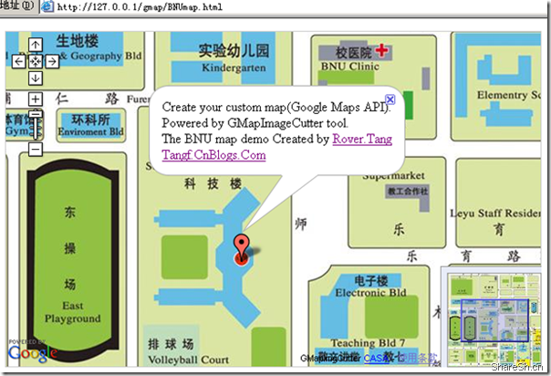
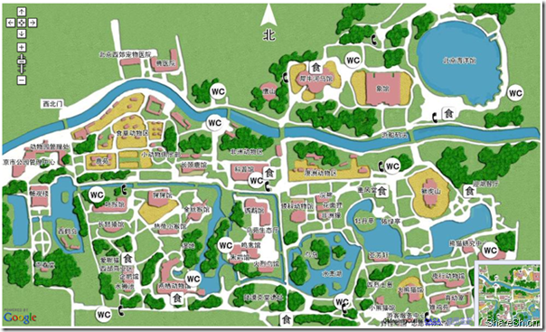
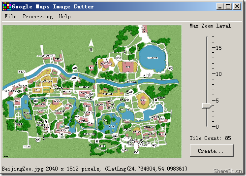

# WebMap DIY(定制你自己的网络地图，GMapImageCutter工具推荐)

自从上次发布了[Google Maps API离线开发包](https://www.cnblogs.com/Tangf/archive/2009/02/20/1394511.html)以后，就有人来问我，为什么离线状态下不能显示地图，能否显示自己的DIY地图。严格来说，这是两个问题，为什么不能显示地图是因为Google的地图图片本身就不在本地，所以离线状态下是肯定不能显示地图的，不过能够标点画线等动作下有没有地图图片并不重要，而能否显示自己的DIY地图，其实Gmaps API本身就带了，GOverlay/GTileLayer等函数就是能够添加自己的图片，只是我不喜欢只添加一张图片到Gmap上，觉得意义不大，但又没有找到好的tile的切割工具，所以这个功能我一直没有尝试。今天，我向大家推荐GMapImageCutter工具，一个能够将图片切割成tile的工具，并且还帮你生成了HTML文件，直接就能够浏览，厉害。

其实这个工具最早是在IT168上看到的，我就下载了下来，但一直没有安装java环境，所以一直没有怎么用，IT168的文章我也没有怎么看，但大致知道怎么一回事，今天安装了java环境所以就可以跑起来试试看了，用下来感觉非常的好。所以就打包上来和大家分享，除了工具，还带了我的Google Maps API的离线开发包，还带了北京师范大学和北京动物园两个地图的DEMO，这两个DEMO只要部署到IIS或者Apache上就可以使用，即使是在离线状态下。

OK，下面我们就来讲讲这个工具的使用吧。GMapImageCutter.jar这是该工具，是java的程序，通过命令行方式就能使用：javaw -Xms512M -Xmx1024M -jar gmapimagecutter.jar。当然我们只要运行GMapImageCutter.bat就可以(这里首先要保证的是你有java的环境，安装个J2SE)。运行后可以看到如下图所示的界面(这里我已经打开了北京动物园的图片了)：

该工具自动判断图片大小，然后选择一个缩放级别，当然你也可以自己调节缩放级别，只是对于图片来说，调高缩放级别，那么你的图片就被拉升了，这样就模糊了，具体看你自己的需求，你也可以把图片做的非常大然后缩放级别就可以调到非常高。按照这样的理论，你甚至可以生成Google Map的全部图片，17个层级的所有图片，呵呵，这里当然是玩笑了，虽然工具上可以调到17级别，一是你做不出这么大的图片，二是即使做出来切割也不知道要经过多少时间，三是切割出来的文件会非常的大，存放都是一个问题。OK，说多了。下面你点击create按钮，开始就可以切割了，等待完成你会看到在图片的相同目录下生成了一个html文件和一个图片目录，调整一下html中Google Map Key为你自己的key，你就可以发布你自己的地图了，简单吧，一个DIY的WEBMAP就此诞生了。

只是我调整了一下html中的代码，让其运行在我的离线开发包上，结果也能显示没有任何问题，这样的话你甚至可以脱离在线的Gmaps API，使用我的离线开发包发布你自己的地图在你自己的服务器上，所有的一切都是你自己的，并且重要的是还能够用Gmaps API来开发，比如我在BNE demo map中加入了一个marker点，后面你想做什么就完全由你自己去想了，画线画面添加点位等等等，你都可以自己完成，俨然就是一个自己的比较强大的WEBGIS(强大之处就是支持Gmaps API开发，呵呵)。

压缩包内文件说明：
GMapImageCutter1.4：GMapImageCutter工具
DemoPicture：样例图片，北京师范大学平面图和北京动物园平面图
gmap：Google Maps API离线开发包，内附北京师范大学和北京动物园地图demo

预览效果：
将gmap目录拷贝到IIS的主目录下，在IE或者FireFox浏览器地址栏输入：
[http://127.0.0.1/gmap/BNUmap.html](http://127.0.0.1/gmap/BNUmap.html)
[http://127.0.0.1/gmap/BeijingZoo.html](http://127.0.0.1/gmap/BeijingZoo.html)
即可浏览北京师范大学和北京动物园的demo地图效果
其中北京师范大学demo地图进行了简单的修改，取消了地图自适应长宽的内容，并增加了一个marker
如果你不想使用Google Maps API离线开发包，只需要将html文件中调用的maps_my.js替换成你申请的Google Maps API的地址即可

你也可以使用GMapImageCutter切割一下两张样例图片试试看效果。

当然，该工具也是有些弊端的，或者说是需要考虑改进的地方的。

首先，有一个层级是图片的原始大小，而小于该层级则是对图片的缩小，大于该层级是对图片的放大，这样的情况下除了图片原始大小状态下保证图片质量最好外，其余层级都可能对图片造成模糊甚至看不清，如何保证每一层级下都是清晰的图片，这一点需要进一步的考虑，不会做一些不同比例尺的图片然后再进行切割吧，也许这也算是一种方法吧。

其次，图片都是从Google Map的最小层级开始的，也就是说这个图片的坐标范围是纬度方面是南极到北极，经度方面是东经到西经，那如果该图片本身就是某一经纬度的范围，比如是30-31/120-121，那么如果将该图片贴图到该经纬度范围这才是最完美的也是大部分人所需要的，这个问题该如何解决，可能需要进一步的思考。

总的来说GMapImageCutter确实是非常不错的tile生成工具。

下载地址：[https://files.cnblogs.com/Tangf/GMapImageCutter_WebMapDemo.rar](https://files.cnblogs.com/Tangf/GMapImageCutter_WebMapDemo.rar)  (GMapImageCutter工具&#43;样例图片&#43;DEMO地图&#43;Google maps API离线开发包)

本文飞书文档：[WebMapDIY定制你自己的网络地图，GMapImageCutter工具推荐](https://rovertang.feishu.cn/docx/doxcn2I5Tvgidy4SbjftNb5KFAf)

---

> 作者: [RoverTang](https://rovertang.com)  
> URL: http://localhost:1313/posts/map/20090405-webmap-diy-customizes-your-own-web-map-recommended-by-gmapimagecutter-tool/  

