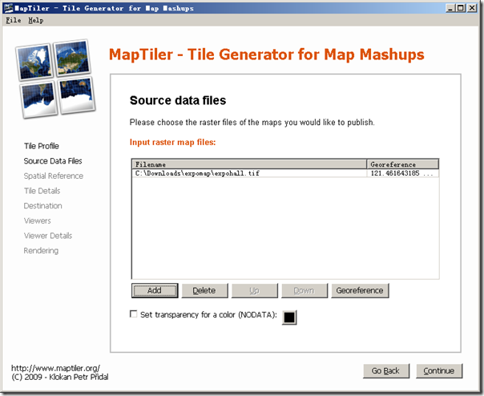

# 制作一份简单的网络地图(世博地图的配准和切割)

其实我很早的时候就写过一篇“[我的 2010世博地图1.0版发布](http://www.cnblogs.com/Tangf/archive/2009/07/30/1534674.html)”，但没有和大家做明确的说明和制作方法，今天就和大家一起来分享地图配准和地图切割并进行网络发布的问题，其实就是以世博为例制作一份简单的网络地图。网络地图是以Google Maps API为基础，在Google Maps上面叠加一份自制的世博地图，但有一点，这里的地图配准和切割很重要，不过使用本文介绍的工具后一切都将变的不困难了。

我们先去世博的网站找一点素材，在[世博规划](http://www.expo2010.cn/ghjs/ghjs_sbgh/index.htm)中可以下载到规划总平面图，如有兴趣也可以下载一份场馆规划图。不过你所下载的文件是PDF文件，需要导出成为JPG图片，方法是使用PDF编辑软件或者PDFtoJPG软件来完成，这里就不做介绍了，最终得到的就是一个世博规划的平面图。为了不让大家难做，我就直接提供我导出后的世博规划图，点击[这里](http://docs.google.com/leaf?id=0B3cnzdvFbRK_M2ExYWJiZjUtZGNhMi00ODhkLTljNWEtMGUxZjJmNGE5YWMy&amp;sort=name&amp;layout=list&amp;num=50)可以下载。(BTW：如果觉得世博规划图不够清晰，那我也没有办法，PDF中的图片本身就不清晰)

接下来配准地图，配准有很多的方法，比如用MapInfo来配准甚至ArcInfo来配准等，不过这些太复杂了，我们今天介绍一个简单的软件来进行配准，这就是[GlobalMapper](http://www.globalmapper.com/)，一个非常牛的GIS软件，可以打开超级多的地图格式，并且可以另存为超级多的地图格式，我们就用它来进行简单的配准吧。不过万变不离其中，配准重要的就是根据点位来进行配准，就是找到一些关键点标定上坐标。我们使用GlobalMapper打开这个bmp的图片，然后就提示是否配准，我们当然需要配准啦，就点是，这个时候就进入配准界面了。配准所需的关键点就是图片中非常清晰可辨并且容易标定上坐标的位置，看了这份地图我们只能使用路口的方式进行配准了，因为其他信息都没有参考价值，我们选择了三个点位，并且找到了坐标，分别是：打浦路瞿溪路(N31.19832 E121.47227)、历城路昌里路(N31.17383 E121.49261)、临沂路南码头路(N31.19375 E121.51033)，有了这三个位置信息后就可以配置了，如下图所示：

赶紧点击OK吧，你的地图就配准完成啦。其实MapInfo里的配准也是同样的一个道理。

好了，接下来我们需要切割地图了，由于希望在切割地图的软件里变得更加简单一些，所以我们将刚刚在GlobalMapper中配准完成的地图另存为GeoTIFF格式，就是一个带有坐标信息的TIF图片。我们现在需要介绍一个杀手级的软件，让你的这个平面图直接输出到Google Maps里面，自动帮助你切割完成，真的是超牛，这个软件是什么呢，就是[MapTiler](http://www.maptiler.org/)，一个Map Tile Cutter软件，可以制作overlay到Google Maps或者Google Earth，不再多介绍这个超级牛的软件，需要了解到用户自行到网站上了解，我们只用简单的切割功能，以前介绍的[GMapImageCutter](/posts/mapnavi/20090405-webmap-diy-customizes-your-own-web-map-recommended-by-gmapimagecutter-tool/)工具和它相比真是小巫见大巫了。BTW，GlobalMapper软件其实也有输出Google maps tile的功能，但是不算太好，所以才用到这个专业的地图切割软件。打开软件，选择第一个Google Maps兼容格式：

下一步当然是添加我们刚刚的tif文件，如下图所示：

可以看到这个图片的坐标信息就自动进入了，而不需要你手动输入地理信息，如果你使用JPG或者BMP图片那当然是需要手动输入的，这也算是一个小小的技巧吧。然后就是选择坐标系啊、地图缩放的级别啊、版权信息啊、Google Maps API key啊什么的，然后就开始真的切割了，等待一会你就可以得到切割好了的地图了。

完成后大家赶紧来看看效果吧：

要知道这不是简单的仅仅是一个图片叠加在Google地图上面，你放大缩小加载的是不同的tile，而且和原有地图的叠加非常的好，因为我们配准了的嘛，但也必须要说MapTile这个软件的功能不可忽视。不过Google地图叠加tile的overlay的速度还是很慢的，除了本身图片加载速度可能有点慢以外，有可能GoogleMapsAPI就是如此，所以我们疯狂的延伸一下想法：将我的[Google Maps API离线开发包](http://www.cnblogs.com/tangf/archive/2009/02/20/1394511.html)中的Google地图替换成自己的地图，那么就真正的完全的离线并且是定制的地图了，期待看过此文的朋友能够完成这一壮举。

本文飞书文档：[制作一份简单的网络地图世博地图的配准和切割](https://rovertang.feishu.cn/docx/doxcn0jrn5c5oELbffUwzwweaqb)

---

> 作者: [RoverTang](https://rovertang.com)  
> URL: https://blog.rovertang.com/posts/map/20100328-make-a-simple-online-map-registration-and-cutting-of-expo-map/  

