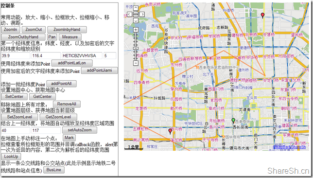
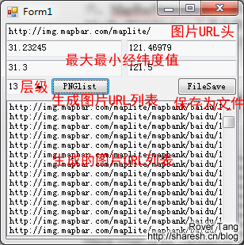

# 分享一个WebMap引擎(MapBar)


这个WebMap的引擎实则我早就(2006年初)[分享](http://www.cnblogs.com/Tangf/archive/2006/01/22/321756.html)过了，只是当时也没有人注意。08年的时候，我还用这个引擎为别人做过项目，只是当时付了我八成的费用后一拖再拖就不了了之了，后来再回头找到我的时候我也不搭理他们了。时过境迁，又是三个年头(11年都快结束了)过去了，今天在移动硬盘里竟然无意看到了这个当年的项目，简单的看了一下代码，竟然还能用，加上文档比较健全，所以简单整理一下后打包分享给大家。

这个WebMap引擎实际上是MapBar早年的引擎，当年写出这样的引擎来应该说是非常牛的，现在看来也许已经不怎么先进了，而且现在MapBar的技术也应该进步了不少，Baidu的地图应该有MapBar不小的功劳。这个引擎基本上能够满足我们基本的需求，更高级的能够实现像Google的或者Baidu式的开放API引擎差距不小，性能和规范性不佳，但作为项目作为简单的研究和应用应该是足够的。具体的来看，有以下几大功能：

常用功能：放大、缩小、拉框放大、拉框缩小、移动、测距
通过经纬度添加Point
设置地图中心、获取地图中心
移除地图上所有对象
设置地图层级、获得地图当前层级
地图自动缩放至经纬度区域范围
在地图上手动标注一个Point
拉框查看所拉框矩形的范围并回调callback函数
显示line

看我提供的截图：



基于以上的功能，结合起来使用则可以实现更多的应用(文档中有具体实例分析)。

文件我已经全部打包，下载地址：[http://sharesh.googlecode.com/files/WebMapEngine_MapBar.zip](http://sharesh.googlecode.com/files/WebMapEngine_MapBar.zip)，欢迎大家下载使用，欢迎分享交流并改进。

详细说明如下(以下内容已经保存到压缩包的word文档中)：

WEBMAP引擎使用说明

一，文件列表

Images目录：需要用到的图片文件

Js目录：主要的JS和CSS文件，核心内容

config.js：引擎参数设置

css.css：引擎调用部分的CSS文件，控制外观

graphics.js：FireFox兼容文件

include.js：主JS文件

map.htm：地图页面，直接地图内容页面或者作为iframe框架调用页面

Index.html：Demo页面，列举了绝大部分功能的实现

MapPicURLlist.exe：获取地图图片路径的辅助工具

二，开始使用WEBMAP引擎

如果直接使用地图内容页面，即将地图直接嵌入到网页中，说明如下：

新建一个html页面或者动态页面，HTML代码需要注意的地方有：

1，` &lt;!DOCTYPE html PUBLIC &#34;-//W3C//DTD XHTML 1.0 Transitional//EN&#34; &#34;http://www.w3.org/TR/xhtml1/DTD/xhtml1-transitional.dtd&#34;&gt; ` 此内容不需要，否则会造成地图引擎的失败；

2，` &lt;html xmlns=&#34;http://www.w3.org/1999/xhtml&#34;&gt; ` 此内容需要更改为： ` &lt;html xmlns:v=&#34;urn:schemas-microsoft-com:vml&#34;&gt; ` 

3，在`&lt;html&gt;`下需要增加

```html {linenos=table}
&lt;style&gt;
v\:* { behavior: url(#default#VML); }
&lt;/style&gt;
```

此部分为VML支持

题外话：由于CSS和JS文件均采用UTF-8编码，所以建议将页面语言也设置为UTF-8编码，否则会造成显示不正常。如果改用GB2312等编码，则需要打开所有CSS和JS文件并另存为相应编码格式的文件才能调用。相关网页语言定义如下：

```html {linenos=table}
&lt;meta http-equiv=&#34;Content-Type&#34; content=&#34;text/html; charset=UTF-8&#34; /&gt;
&lt;meta http-equiv=&#34;Content-Language&#34; content=&#34;UTF-8&#34; /&gt;
```

4，插入CSS和JS

```html {linenos=table}
&lt;link href=&#34;js/css.css&#34; rel=&#34;stylesheet&#34; type=&#34;text/css&#34;&gt;
&lt;script language=&#34;javascript&#34; src=&#34;js/config.js&#34;&gt;&lt;/script&gt;
&lt;script language=&#34;javascript&#34; src=&#34;js/include.js&#34;&gt;&lt;/script&gt;
```

graphics.js文件由于在include.js文件中嵌入，所以不需要在此处插入。

！！！5.显示地图(调用地图引擎显示地图)

在body的任意处加入如下JS代码

```html {linenos=table}
&lt;script language=javascript&gt;
var maplet = new AVMaplet(39.90894606, 116.368281, 4, 600, 480,0,0,&#34;/images/marker.gif&#34;,&#34;baidu&#34;);
maplet.showMap();
&lt;/script&gt;
```

释义：script中共两行代码，意义如下：

第一行定义maplet为一个新的对象AVMaplet；

第二行为地图显示，即初始化地图；

`AVMaplet(lat, lon, zoomLevel, width, height, top, left, defaultMarkImage, style);`

其中

Lat：纬度，数字

Lon：经度，数字

ZoomLevel：缩放级别，数字。(注意：此处初始化缩放级别如果超过最大缩放级别，则地图引擎无法显示。此处最大缩放级别为7，总共为8级，包括0级)

Width：地图宽度，数字，单位为像素

Height：地图高度，数字，单位为像素

Top：相对于body上层的宽度，数字，单位为像素，建议数字为0

Left：相对于body左侧的宽度，数字，单位为像素，建议数字为0

说明：由于地图DIV框架的position设置为absolute，所以整个地图DIV游离于body之中，需要使用Top和Left定位。而正由于此原因，建议数字为0，并使用iframe框架设计，而非页面直接调用地图引擎。

DefaultMarkImage：默认地图标注图片，文字，此处意义不大，建议设置为一个存在的默认标注图片即可。

Style：地图样式，文字，此处必须设置为baidu。此样式的本意是对于不同的合作伙伴提供不同的地图画面样式，但MapBar和百度合作后就再也没有变动过地图样式，可能是百度作为大客户的原因吧。此处样式必须设置为baidu，不然无法调用远程MapBar服务器上的图片。

至此，一个显示地图的页面就完成了，将文件保存为html文件即可。

由于上述原因的限制，强烈建议使用iframe嵌套以上的html文件来调用地图引擎，而不采用单独页面直接调用的模式。

以上内容的相应代码请参考map.htm文件。

Iframe框架调用说明：如果使用iframe框架调用，则首先需要为iframe定义一个id，建议增加定义一个name，border建议设置为0，scrollbar等建议设置为无，width和height设置为地图对象的width和height，这样就可以无缝显示在网页中。建议在iframe外在包一个div，并将div的width和height设置同上，此处有利于定位。

三，WEBMAP引擎函数列表

根据上述即可开始使用地图引擎，那么如何对地图进行操作呢，请见函数列表：

(根据第二部分的假定，我们已经在body中创建了一个AVMaplet，那么下面的函数涉及到的是对该object的操作)

1，`object. showMap()`

功能：初始化地图

说明：此函数需要紧跟object定义后立即执行，整个地图引擎中只调用一次。

2，`object. addPoint(strIcon, dLat, dLon, strLabel, strInfo, bLabelOn)`

功能：增加一个Point。该point带有标题和文字的气泡框。

说明：

strIcon：point显示的图片，string

dLat：纬度，double

dLon：经度，double

strLabel：标题，string

strInfo：内容，string。支持HTML语法

bLabelOn：是否显示标题。1为显示，其余为不显示。在没有特殊情况下，建议不显示标题。对于大量的point建议不显示标题。

3，`object. addPoint2(strIcon, strLatLon, strLabel, strInfo, bLabelOn)`

功能：增加一个point，同上。

说明：

strLatLon：加密后的经纬度坐标值。

此函数同addPoint函数的差别在于坐标的使用，此函数使用加密后的文字坐标，其余无任何差异。

4，`object. setCenter(dLat,dLon)`

功能：将地图中心设置为指定坐标位置。

说明：

dLat：纬度，double

dLon：经度，double

5，`object.clean()`

功能：清除地图中的所有对象，即所有的point、line和polygon。

说明：此函数主要用于一批新的对象建立前。比如新建一次查询，一般则需要清除地图中所有对象后再将结果对象显示到地图中。

6，`strZoomLevel = object. getZoomLevel()`

功能：获取当前地图的缩放级别

说明：此函数返回缩放级别的字符，比如4级则返回4。

7，`object. setZoomLevel(zm)`

功能：设置地图缩放级别

说明：

zm：缩放级别，int。

注意，地图中的缩放级别是从0级开始的，在使用过程中注意不要超过最大缩放级别数。

8，`object. zoomIn()`

功能：放大，将当前地图缩放级别增加一级。

说明：此功能和缩放控制条中的&#43;按钮功能完全一致。

9，`object. zoomOut()`

功能：缩小，将当前地图缩放级别缩小一级。

说明：此功能和缩放控制条中的-按钮功能完全一致。

10，`object. setAutoZoom(minLat, minLon, maxLat, maxLon)`

功能：根据最小和最大经纬度坐标值自动设置缩放级别

说明：

minLat：最小纬度

minLon：最小经度

maxLat：最大纬度

maxLon：最大经度

11，`object. addPolylineString(strStyle,strLine)`

功能：增加一条线段

说明：

strStyle：线条样式，string。样式共有三部分组成，由逗号隔开，比如“4,0,#0000FF”

，其中，4表示线条宽度，0为外包边，#0000FF表示线条颜色。

12，`object. refresh ()`

功能：刷新地图页面

说明：此处在对地图进行某些操作后，刷新地图让效果立即显示。比如添加线条后不能立即显示线条，则需要本函数，但在很多情况下此函数自动包含，比如设置缩放级别的函数中就自带了刷新功能。

！！！13，`object. setMode(toolnum)`

功能：设置地图中的鼠标功能，比如放大、缩小、漫游(平移)、拉框查询、标注等。鼠标一般默认状态为漫游状态。

说明：

toolnum：模式参数，int，参数为1/2/3/5/6/11共6种模式。其中：

1：拉框放大

2：拉框缩小

3：漫游(平移)，鼠标默认状态

5：拉框查询

6：标注点，Mark

11：测距。同控制条上的测距功能完全一致。

注意，拉框放大和拉框缩小如果需要使用则必须将漫游功能显示，不然将无法返回到漫游状态。拉框查询和标注点功能完成后建议设置返回漫游状态。测距功能完成后自动返回到漫游状态。

拉框查询和标注点功能需要结合callback函数一起使用，默认状态下拉框查询和标注点只返回一段字符串，字符串格式如下：

拉框查询返回字符串：`&amp;act=lookup&amp;ctr=strLatLon&amp;size=Width,Height&amp;range=Left1,Top1,Left2,Top2&amp;zm=ZoomLevel`

标注点返回字符串：`&amp;act=add&amp;latlon=strLatLon&amp;zm=ZoomLevel`

字符串中使用&amp;将各个参数串联起来，并且每个参数所对应的值使用=隔开。需要对此字符串自行解析。参数说明如下

act：动作，固定值，用于区分动作，lookup表示拉框查找，add表示标注点

ctr：地图中心坐标，加密后坐标值

size：地图大小，返回宽和高，使用逗号分隔开

range：拉框大小，返回起点定位和终点定位，即矩形的两个对角，共返回四个值，使用逗号隔开，分别为起点相对于地图的左边距和上边距、终点相对于地图的左边距和上边距。特别说明，左边距和上边距需要比对后才能确定起点还是终点的边距大，并以此推算出拉框的最小和最大经纬度。

zm：缩放级别，返回缩放级别数值

latlon：标注点的坐标位置，加密后坐标值

特别注意，此callback函数仅仅返回地图中的信息，不做任何其他处理，建议结合Form或者外部页面共同使用来完成信息提交、查询等功能。比如将callback函数返回的参数值传递给Form中的hideInput。

14，`dLatLon = b.p(strLatLon)`

功能：解密函数，将文字坐标解密成经纬度坐标

说明：

strLatLon：文字坐标

解密后得到的结果为数组，dLatLon[1]为纬度，dLatLon[0]为经度

15，`strLatLon = jiami(dLat,dLon)`

功能：将数字经纬度坐标加密成文字坐标，即b.p函数的反函数。

说明：

dLat：纬度，double

dLon：经度，double

加密后得到的结果为字符串

注意，本函数为了方便使用特意提取成单独的函数。

四，WEBMAP引擎使用实例(以房源地图为例)

首先我们假定地图引擎已经成功嵌入并成功显示

1，价格查询

功能描述：在地图上划取一个矩形，计算该矩形内房源的平均价格

解决方法：

页面中一个Form用于提交数据，四个textInput(建议hiden)用于获取最小和最大经纬度，一个Button用于设置地图鼠标状态并在callback函数中返回最小和最大经纬度。甚至可以一步到位在callback函数中直接提交给动态页面进行查询，并最终由动态页面生成结果。

地图引擎的关键在于提供拉框返回的最小和最大经纬度，功能集中于Button，设置button的onclick事件为：`object. setMode(5)`，当button被按下后改变地图引擎中的鼠标状态为拉框查询，在地图中进行拉框查询后返回callback函数，callback函数解析后返回最小和最大经纬度。

2，房源标注

功能描述：在地图上显示某个房源的位置

解决方法：

页面中一个Form用于提交数据，两个textInput用于获取标注点的经纬度，一个button用于设置鼠标状态并在callback函数中返回经纬度。

地图引擎的关键在于提供标注点的经纬度，功能集中于button，设置button的onclick时间为：object. setMode(6)，当button被按下后改变地图引擎中的鼠标状态为标注点，在地图中单击后返回callback函数，callback函数解析出坐标后返回经纬度。

3，划图找房

功能描述：在地图上划取一个矩形，选择查询条件，查询矩形内满足查询条件的房源以列表形式显示。在地图上标注房屋位置。

解决方法：同第一条，涉及属性条件查询请使用动态语言解决。

4，公交线路找房

功能描述：查询某一条公交、地铁线路站点周边1Km内满足查询条件的租赁房源以列表形势显示。在地图上标注房屋位置，当鼠标移动到房屋位置时显示乘车线路。

解决方法：

共分为两步，第一步查找公交线路并显示公交站点，第二步在公交站点附近查找房源。

查找公交线路并显示公交站点：使用一个input和一个button，input中为公交线路查询关键字，button为Form的提交查询功能。查询完成显示线路结果，在点击线路的时候动态语言触发再次查询，即查询该线路的公交站点和公交线路的坐标，查询完成显示结果的时候，需要加入javascript来操作地图，主要的函数有addPoint函数和addPolylineString函数，用于显示公交站点和公交线路，由于addPoint中有标题和内容之分，内容支持HTML，所以建议站名作为标题，在内容中加入查询附近房源功能按钮以备第二步使用。同时建议动态语言计算出公交线路的最小和最大经纬度，使用setAutoZoom函数将地图缩放至合适的缩放比例。

查找公交站点附近房源：在气泡框中放入距离下拉框和button，和两个隐性input，两个隐性input为第一步中传递的该站点的经纬度，距离下拉框为一公里、两公里等的距离选择，由于1经纬度等于111公里，所以一公里约为0.009度，只需要根据公交站的坐标位置减去和加上0.009度，即得到了最小和最大经纬度的方框，再根据此框使用动态语言查询，方法同一。此处重点在于根据点位置设计出一个矩形框再进行查询。

5，目的地找房

功能描述：在地图上点取一个点，查询该点周围500M内所有经过的公交、地铁线路，并查询这些线路站点周边1Km内满足查询条件的租赁房源以列表形势显示。在地图上标注房屋位置，当鼠标移动到房屋位置时显示乘车线路。

解决方法：

同第4条中的第二步，差别在于此处的点位置由标注点功能产生。

6，公交线路添加、修改、删除

解决方法：

由于公交线路数据为外部抓取，建议使用数据库导入。

7，地点经纬度添加、修改、删除

解决方法：

添加同第2条。修改和删除为动态语言操作数据库。

五，MapPicURLlist工具的使用

MapPicURLlist工具主要功能为在固定经纬度范围内的图片URL list出来，并保存成文件。旨在解决离线或者局域网内使用WEBmap引擎问题。



如上图所示，图片URL地址建议保持不变，此为瓦片的默认原始路径，输入最大最小经纬度值，选择好层级，点击PNGlist，则自动list出所有该层级、经纬度范围下的图片URL列表，然后点击FileSave则自动生成PNGFileList13.txt文件，其中数字13为你设置的层级。

本工具仅为辅助工具，仅list出图片的URL，若需要本地离线使用地图，则需要将保存后的URL列表通过其他下载工具(如迅雷)下载下来，并按照原有路径保存。

六， FAQ

1，如何修改右下角文字和链接

Include.js文件中查找关键字“MapBar&amp;ShareSh”和“http://www.ShareSh.cn”即可

文字内容为：`var WY9Xv=&#39;&lt;u&gt;©MapBar&amp;ShareSh&lt;/u&gt; &#39;;`，将蓝色内容改成自己的内容即可。

链接内容为：`window.open(&#34;http://www.ShareSh.cn&#34;);`，将蓝色内容改成自己的链接即可。

2，控制条、比例尺、版权链接的隐藏

Include.js文件中查找以下关键字

隐藏左上角控制条：`this.lC8O6=true;`  将true设置为false即可；

隐藏左下角比例尺：`this.Q1E=true; ` 将true设置为false即可；

隐藏右下角版权链接：`this.v2a2=true; ` 将true设置为false即可；

3，如何实现地图的本地访问

如上所述，MapPicURLlist工具为地图瓦片URL的辅助工具，将所有需要用到的地图瓦片全部下载下来并在本地按照原有路径组织好后，修改地图引用路径即可。

地图默认引用路径在include.js文件的第一行：`var strImgsvrUrl = &#34;http://img.mapbar.com/maplite/&#34;;`，将蓝色内容替换成自己已经下载好的本地可访问路径即可。

4，如何改回13级放大缩小控制条

由于个人觉得没有必要显示13级，加上只在北京地区使用，所以撤掉13级，直接更改为7级，需要改回的话，需要修改的参数较多，主要是一些数字的微调，除了`var R$1=7;`中的7改为13，以及

`var Y8802、var Ud0、var e3I、var e7DU4、var uGE$`等参数需要设置外，还有许多地方需要调整，主要是图片原有高度较高，修改后高度较低，建议使用文件比较器将include.js文件同我原来分享的[MapBar研究(百度地图中的JS部分)](http://www.cnblogs.com/Tangf/archive/2006/01/22/321756.html)一文中的avinclude.js进行对比，就可以看到好几处数字的修改，修改回去即可还原13层级的控制条。

5，如何撤销或扩大地图范围区域

由于仅需要显示北京范围的地图，所以个人对地图范围做了一定的限制，导致地图平移到地图边界的时候无法再拖动，会弹回到地图区域范围内。

此部分的设置在：`var ph90=new Array(38,42);var o8$=new Array(114,118);`，将这里的经纬度值改为自己需要的经纬度值即可。原有默认的中国地图范围区域为：`var ph90=new Array(0,55);var o8$=new Array(-75,135);`，这个范围可以显示全国甚至整个亚洲地区。

本文飞书文档：[分享一个WebMap引擎MapBar](https://rovertang.feishu.cn/docx/doxcnUZ7PW97AO2msAp5uyeKDwf)


---

> 作者: [RoverTang](https://rovertang.com)  
> URL: http://localhost:1313/posts/map/20111102-share-a-webmap-engine-mapbar/  

